<!-- Generated by documentation.js. Update this documentation by updating the source code. -->

### Table of Contents

*   [][1]
    *   [Examples][2]
*   [Terminal3DPage][3]
*   [handleFocusAndSelectSystem][4]
    *   [Parameters][5]
*   [][6]
*   [AnnotationDialogProps][7]
    *   [Properties][8]
*   [AnnotationDialog][9]
    *   [Parameters][10]
*   [useEffect][11]
*   [handleConfirm][12]
*   [][13]
*   [CameraControlsPanelProps][14]
    *   [Properties][15]
*   [CameraControlsPanel][16]
    *   [Parameters][17]
*   [][18]
*   [ColorModeSelectorProps][19]
    *   [Properties][20]
*   [ColorModeSelector][21]
    *   [Parameters][22]
*   [][23]
*   [CommandHistoryPanelProps][24]
    *   [Properties][25]
*   [CommandHistoryPanel][26]
    *   [Parameters][27]
*   [][28]
*   [InfoPanelProps][29]
    *   [equipment][30]
    *   [annotation][31]
    *   [onClose][32]
    *   [onOpenAnnotationDialog][33]
    *   [onDeleteAnnotation][34]
    *   [onOperationalStateChange][35]
    *   [availableOperationalStatesList][36]
    *   [onProductChange][37]
    *   [availableProductsList][38]
*   [InfoPanel][39]
    *   [Parameters][40]
*   [handleDeleteClick][41]
*   [formattedDate][42]
*   [][43]
*   [LayerManagerProps][44]
    *   [Properties][45]
*   [LayerManager][46]
    *   [Parameters][47]
*   [][48]
*   [MainSceneAreaProps][49]
    *   [Properties][50]
*   [MainSceneArea][51]
    *   [Parameters][52]
*   [][53]
*   [SidebarContentLayoutProps][54]
    *   [Properties][55]
*   [SidebarContentLayout][56]
    *   [Parameters][57]
*   [Terminal][58]
*   [SiteHeader][59]
*   [][60]
    *   [Examples][61]
*   [ThreeSceneProps][62]
    *   [Properties][63]
*   [ThreeScene][64]
    *   [Parameters][65]
*   [THEMES][66]
*   [ChartConfig][67]
    *   [Examples][68]
*   [Form][69]
    *   [Parameters][70]
    *   [Examples][71]
*   [][72]
*   [useSidebar][73]
*   [SidebarProvider][74]
    *   [defaultOpen][75]
    *   [open][76]
    *   [onOpenChange][77]
*   [Sidebar][78]
    *   [side][79]
    *   [variant][80]
    *   [collapsible][81]
*   [SidebarTrigger][82]
*   [SidebarRail][83]
*   [SidebarInset][84]
*   [SidebarInput][85]
*   [SidebarHeader][86]
*   [SidebarFooter][87]
*   [SidebarSeparator][88]
*   [SidebarContent][89]
*   [SidebarGroup][90]
*   [SidebarGroupLabel][91]
*   [SidebarGroupAction][92]
*   [SidebarGroupContent][93]
*   [SidebarMenu][94]
*   [SidebarMenuItem][95]
*   [SidebarMenuButton][96]
    *   [isActive][97]
    *   [tooltip][98]
*   [SidebarMenuAction][99]
    *   [showOnHover][100]
*   [SidebarMenuBadge][101]
*   [SidebarMenuSkeleton][102]
    *   [showIcon][103]
*   [SidebarMenuSub][104]
*   [SidebarMenuSubItem][105]
*   [SidebarMenuSubButton][106]
    *   [size][107]
    *   [isActive][108]
*   [Equipment][109]
*   [Equipment][110]
*   [Equipment][111]
    *   [Examples][112]
*   [Equipment][113]
*   [Equipment][114]
    *   [Properties][115]
*   [initialEquipment][116]
*   [initialLayers][117]
*   [initialAnnotations][118]
*   [THREE][119]
*   [THREE][120]
*   [THREE][121]
*   [THREE][122]
*   [THREE][123]
*   [THREE][124]
*   [THREE][125]
    *   [Examples][126]
*   [getCharNumericValue][127]
    *   [Parameters][128]
*   [getEquipmentColor][129]
    *   [Parameters][130]
*   [EquipmentFilterCriteria][131]
    *   [Properties][132]
*   [getFilteredEquipment][133]
    *   [Parameters][134]
*   [equipmentRepository][135]
    *   [getEquipmentByTag][136]
        *   [Parameters][137]
    *   [getAllEquipment][138]
    *   [addEquipment][139]
        *   [Parameters][140]
    *   [updateEquipment][141]
        *   [Parameters][142]
    *   [deleteEquipment][143]
        *   [Parameters][144]
*   [annotationRepository][145]
    *   [getAnnotationByEquipmentTag][146]
        *   [Parameters][147]
    *   [getAllAnnotations][148]
    *   [addOrUpdateAnnotation][149]
        *   [Parameters][150]
    *   [deleteAnnotation][151]
        *   [Parameters][152]
    *   [initializeAnnotations][153]
        *   [Parameters][154]
*   [calculateViewForMeshes][155]
    *   [Parameters][156]
*   [createGeometryForItem][157]
    *   [Parameters][158]
*   [updateLabelRendererSize][159]
    *   [Parameters][160]
*   [UpdateAnnotationPinsParams][161]
    *   [Properties][162]
*   [updateAnnotationPins][163]
    *   [Parameters][164]
*   [][165]
*   [setOutlinePassObjects][166]
    *   [Parameters][167]
*   [applyOutlinePassStyle][168]
    *   [Parameters][169]
*   [setupPostProcessing][170]
    *   [Parameters][171]
*   [updatePostProcessingSize][172]
    *   [Parameters][173]
*   [updateOutlineEffect][174]
    *   [Parameters][175]
*   [setupLighting][176]
    *   [Parameters][177]
*   [setupGroundPlane][178]
    *   [Parameters][179]
*   [setupRenderPipeline][180]
    *   [Parameters][181]
*   [UpdateEquipmentMeshesParams][182]
*   [updateEquipmentMeshesInScene][183]
    *   [Parameters][184]
*   [hooks/useAnimationLoop][185]
    *   [Parameters][186]
    *   [Examples][187]
*   [UseAnimationLoopProps][188]
    *   [Properties][189]
*   [useAnimationLoop][190]
    *   [Parameters][191]
*   [hooks/useAnnotationManager][192]
    *   [Parameters][193]
    *   [Examples][194]
*   [UseAnnotationManagerProps][195]
    *   [Properties][196]
*   [UseAnnotationManagerProps][197]
    *   [Properties][198]
*   [UseAnnotationManagerReturn][199]
    *   [Properties][200]
*   [UseAnnotationManagerReturn][201]
    *   [Properties][202]
*   [useAnnotationManager][203]
    *   [Parameters][204]
*   [useAnnotationManager][205]
    *   [Parameters][206]
*   [refreshAnnotationsFromRepo][207]
*   [refreshAnnotationsFromRepo][208]
*   [handleOpenAnnotationDialog][209]
    *   [Parameters][210]
*   [handleOpenAnnotationDialog][211]
    *   [Parameters][212]
*   [handleSaveAnnotation][213]
    *   [Parameters][214]
*   [handleSaveAnnotation][215]
    *   [Parameters][216]
*   [handleDeleteAnnotation][217]
    *   [Parameters][218]
*   [handleDeleteAnnotation][219]
    *   [Parameters][220]
*   [getAnnotationForEquipment][221]
    *   [Parameters][222]
*   [getAnnotationForEquipment][223]
    *   [Parameters][224]
*   [UseAnnotationPinRendererProps][225]
*   [useAnnotationPinRenderer][226]
    *   [Parameters][227]
*   [hooks/useCameraManager][228]
    *   [Parameters][229]
    *   [Examples][230]
*   [defaultInitialCameraPosition][231]
*   [defaultInitialCameraPosition][232]
*   [defaultInitialCameraLookAt][233]
*   [defaultInitialCameraLookAt][234]
*   [UseCameraManagerProps][235]
*   [UseCameraManagerProps][236]
*   [UseCameraManagerReturn][237]
    *   [Properties][238]
*   [UseCameraManagerReturn][239]
    *   [Properties][240]
*   [useCameraManager][241]
    *   [Parameters][242]
*   [useCameraManager][243]
    *   [Parameters][244]
*   [handleSetCameraViewForSystem][245]
    *   [Parameters][246]
*   [handleSetCameraViewForSystem][247]
    *   [Parameters][248]
*   [handleCameraChangeFromScene][249]
    *   [Parameters][250]
*   [handleCameraChangeFromScene][251]
    *   [Parameters][252]
*   [onSystemFramed][253]
*   [onSystemFramed][254]
*   [Command][255]
*   [Command][256]
    *   [Properties][257]
*   [CommandHistoryState][258]
    *   [Properties][259]
*   [UseCommandHistoryReturn][260]
    *   [Properties][261]
*   [useCommandHistory][262]
    *   [Parameters][263]
*   [executeCommand][264]
    *   [Parameters][265]
*   [undo][266]
*   [redo][267]
*   [hooks/useEquipmentDataManager][268]
    *   [Examples][269]
*   [UseEquipmentDataManagerReturn][270]
    *   [Properties][271]
*   [UseEquipmentDataManagerReturn][272]
    *   [Properties][273]
*   [useEquipmentDataManager][274]
*   [useEquipmentDataManager][275]
*   [refreshEquipmentData][276]
*   [refreshEquipmentData][277]
*   [handleOperationalStateChange][278]
    *   [Parameters][279]
*   [handleOperationalStateChange][280]
    *   [Parameters][281]
*   [handleProductChange][282]
    *   [Parameters][283]
*   [handleProductChange][284]
    *   [Parameters][285]
*   [UseEquipmentRendererProps][286]
*   [useEquipmentRenderer][287]
    *   [Parameters][288]
*   [][289]
*   [UseEquipmentSelectionManagerProps][290]
    *   [Properties][291]
*   [UseEquipmentSelectionManagerReturn][292]
    *   [Properties][293]
*   [useEquipmentSelectionManager][294]
    *   [Parameters][295]
*   [handleEquipmentClick][296]
    *   [Parameters][297]
*   [handleSetHoveredEquipmentTag][298]
    *   [Parameters][299]
*   [selectTagsBatch][300]
    *   [Parameters][301]
*   [][302]
*   [UseFilterManagerProps][303]
    *   [Properties][304]
*   [UseFilterManagerReturn][305]
    *   [Properties][306]
*   [useFilterManager][307]
    *   [Parameters][308]
*   [availableSistemas][309]
*   [availableAreas][310]
*   [filteredEquipment][311]
*   [][312]
*   [UseLayerManagerProps][313]
*   [UseLayerManagerReturn][314]
    *   [Properties][315]
*   [useLayerManager][316]
    *   [Parameters][317]
*   [handleToggleLayer][318]
    *   [Parameters][319]
*   [raycaster][320]
*   [useMouseInteractionManager][321]
    *   [Parameters][322]
*   [processSceneClickInternal][323]
*   [processSceneMouseMoveInternal][324]
*   [][325]
*   [UseSceneOutlineProps][326]
    *   [Properties][327]
*   [useSceneOutline][328]
    *   [Parameters][329]
*   [UseSceneSetupProps][330]
    *   [Properties][331]
*   [UseSceneSetupReturn][332]
    *   [Properties][333]
*   [useSceneSetup][334]
    *   [Parameters][335]
*   [][336]
    *   [Parameters][337]
    *   [Examples][338]
*   [][339]
    *   [Parameters][340]
    *   [Examples][341]
*   [][342]
    *   [Examples][343]
*   [hooks/useThreeCore][344]
    *   [Examples][345]
*   [UseThreeCoreProps][346]
    *   [Properties][347]
*   [UseThreeCoreReturn][348]
    *   [Properties][349]
*   [useThreeCore][350]
    *   [Parameters][351]
*   [hooks/useThreeOrbitControls][352]
    *   [Examples][353]
*   [UseThreeOrbitControlsProps][354]
    *   [Properties][355]
*   [UseThreeOrbitControlsReturn][356]
    *   [Properties][357]
*   [useThreeOrbitControls][358]
    *   [Parameters][359]
*   [hooks/useThreeRenderers][360]
    *   [Examples][361]
*   [UseThreeRenderersProps][362]
    *   [Properties][363]
*   [UseThreeRenderersReturn][364]
    *   [Properties][365]
*   [useThreeRenderers][366]
    *   [Parameters][367]
*   [hooks/useThreeResize][368]
    *   [Parameters][369]
    *   [Examples][370]
*   [UseThreeResizeProps][371]
    *   [Properties][372]
*   [useThreeResize][373]
    *   [Parameters][374]
*   [useRef][375]
    *   [Examples][376]
*   [UseThreeSceneElementsProps][377]
    *   [Properties][378]
*   [UseThreeSceneElementsReturn][379]
    *   [Properties][380]
*   [useThreeSceneElements][381]
    *   [Parameters][382]
*   [Layer][383]
    *   [Properties][384]
*   [CameraState][385]
*   [SystemView][386]
*   [SystemViewOptions][387]
    *   [Properties][388]
*   [TargetSystemInfo][389]
    *   [Properties][390]
*   [Annotation][391]
    *   [Properties][392]
*   [ColorMode][393]

##

*   **See**: [../../components/main-scene-area/README.md][394] Para a área principal da cena.
*   **See**: [../../components/ui/sidebar/README.md][395] Para a barra lateral de controles.
*   **See**: [../../components/annotation-dialog/README.md][396] Para o diálogo de anotações.
*   **See**: [../../hooks/use-command-history/README.md][397] Para o gerenciamento de histórico de comandos.
*   **See**: [../../hooks/use-equipment-data-manager/README.md][398] Para o gerenciamento de dados de equipamentos.
*   **See**: [../../hooks/use-camera-manager/README.md][399] Para o gerenciamento da câmera.
*   **See**: [../../hooks/use-filter-manager/README.md][400] Para o gerenciamento de filtros.
*   **See**: [../../hooks/use-annotation-manager/README.md][401] Para o gerenciamento de anotações.
*   **See**: [../../hooks/use-equipment-selection-manager/README.md][402] Para o gerenciamento de seleção de equipamentos.
*   **See**: [../../hooks/use-layer-manager/README.md][403] Para o gerenciamento de camadas.

### Examples

```javascript
// Diagrama de Interação de Alto Nível da Terminal3DPage
// mermaid
// graph LR
//     Terminal3DPage["Terminal3DPage (Página Principal)"] --> H_CmdHistory["useCommandHistory (Hook Histórico)"];
//     Terminal3DPage --> H_EquipData["useEquipmentDataManager (Hook Dados Equip.)"];
//     Terminal3DPage --> H_CameraMgr["useCameraManager (Hook Câmera)"];
//     Terminal3DPage --> H_FilterMgr["useFilterManager (Hook Filtros)"];
//     Terminal3DPage --> H_AnnotMgr["useAnnotationManager (Hook Anotações)"];
//     Terminal3DPage --> H_EquipSelectMgr["useEquipmentSelectionManager (Hook Seleção)"];
//     Terminal3DPage --> H_LayerMgr["useLayerManager (Hook Camadas)"];
//
//     Terminal3DPage --> MainSceneArea_Comp["MainSceneArea (Comp. Área da Cena)"];
//     Terminal3DPage --> Sidebar_Comp["Sidebar (Comp. Barra Lateral)"];
//     Terminal3DPage --> AnnotationDialog_Comp["AnnotationDialog (Comp. Diálogo Anotação)"];
//
//     MainSceneArea_Comp --> ThreeScene_Comp["ThreeScene (Comp. Cena 3D)"];
//     MainSceneArea_Comp --> InfoPanel_Comp["InfoPanel (Comp. Painel Info)"];
//     Sidebar_Comp --> SidebarContentLayout_Comp["SidebarContentLayout (Comp. Conteúdo Sidebar)"];
//
//     subgraph "Hooks de Gerenciamento de Estado da Aplicação"
//       H_CmdHistory;
//       H_EquipData;
//       H_CameraMgr;
//       H_FilterMgr;
//       H_AnnotMgr;
//       H_EquipSelectMgr;
//       H_LayerMgr;
//     end
//
//     subgraph "Componentes de UI Principais"
//       MainSceneArea_Comp;
//       Sidebar_Comp;
//       AnnotationDialog_Comp;
//       InfoPanel_Comp;
//       ThreeScene_Comp;
//       SidebarContentLayout_Comp;
//     end
//
```

## Terminal3DPage

Componente principal da página Terminal 3D (Terminal3DPage).
Orquestra os diversos hooks de gerenciamento de estado da aplicação e renderiza a UI principal.

Returns **JSX.Element** O componente da página Terminal 3D.

## handleFocusAndSelectSystem

Manipula a ação de focar a câmera em um sistema e selecionar todos os equipamentos desse sistema.

### Parameters

*   `systemName` **[string][404]** O nome do sistema para focar e selecionar.

##

Componente de diálogo modal para adicionar ou editar anotações textuais
associadas a um equipamento. Utiliza um Textarea para permitir anotações de texto longo.

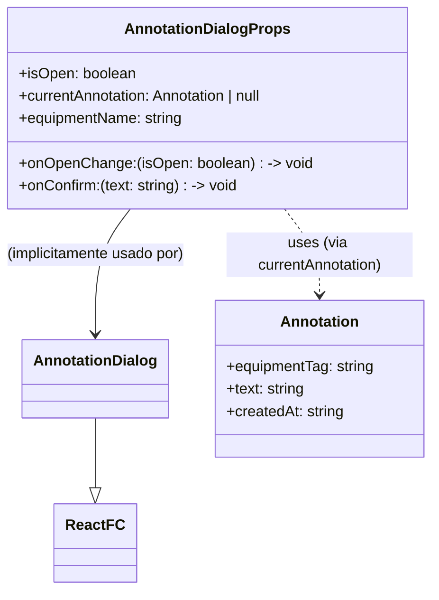

## AnnotationDialogProps

Props para o componente AnnotationDialog.

### Properties

*   `isOpen` **[boolean][405]** Controla se o diálogo está aberto ou fechado.
*   `currentAnnotation` **([Annotation][31] | null)** A anotação atual sendo editada, ou null se for uma nova anotação.
*   `equipmentName` **[string][404]** O nome do equipamento ao qual a anotação se refere, para exibição no diálogo.

## AnnotationDialog

Renderiza um diálogo modal para o usuário inserir ou editar o texto de uma anotação.
Exibe o nome do equipamento associado e um Textarea para o texto da anotação.
A data de criação/modificação é registrada automaticamente pelo hook `useAnnotationManager`.

### Parameters

*   `props` **[AnnotationDialogProps][7]** As props do componente.

    *   `props.isOpen` &#x20;
    *   `props.onOpenChange` &#x20;
    *   `props.onConfirm` &#x20;
    *   `props.currentAnnotation` &#x20;
    *   `props.equipmentName` &#x20;

Returns **JSX.Element** O componente AnnotationDialog.

## useEffect

Efeito para popular o campo de texto quando o diálogo é aberto ou a anotação atual muda.

## handleConfirm

Manipula a confirmação do diálogo, chamando o callback `onConfirm` com o texto atual
e fechando o diálogo.

##

Componente de painel para controles de câmera, especificamente para focar em sistemas.

Principal Responsabilidade:
Renderizar botões para cada sistema disponível, permitindo ao usuário focar a câmera
e selecionar todos os equipamentos pertencentes àquele sistema ao clicar em um botão.

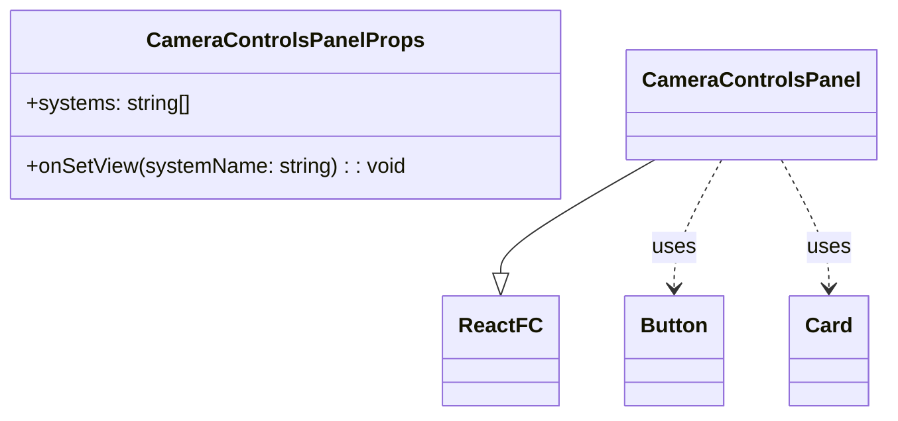

## CameraControlsPanelProps

Props para o componente CameraControlsPanel.

### Properties

*   `systems` **[Array][406]<[string][404]>** Lista de nomes dos sistemas disponíveis para foco.

## CameraControlsPanel

Renderiza um painel com botões para focar a câmera em sistemas específicos.
Cada botão representa um sistema; ao clicar, a câmera enquadra os equipamentos desse sistema.

### Parameters

*   `props` **[CameraControlsPanelProps][14]** As props do componente.

    *   `props.systems` &#x20;
    *   `props.onSetView` &#x20;

Returns **JSX.Element** O componente CameraControlsPanel.

##

Componente para selecionar o modo de colorização dos equipamentos na cena 3D.

Principal Responsabilidade:
Permitir ao usuário escolher como os equipamentos serão coloridos (por cor base,
estado operacional ou produto) através de um menu dropdown (Select).

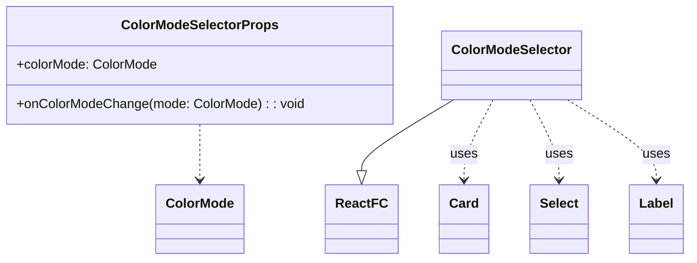

## ColorModeSelectorProps

Props para o componente ColorModeSelector.

### Properties

*   `colorMode` **[ColorMode][393]** O modo de colorização atualmente selecionado.

## ColorModeSelector

Renderiza um Card com um dropdown para selecionar o modo de colorização dos equipamentos.
As opções são "Equipamento (Cor Base)", "Estado Operacional" e "Produto".

### Parameters

*   `props` **[ColorModeSelectorProps][19]** As props do componente.

    *   `props.colorMode` &#x20;
    *   `props.onColorModeChange` &#x20;

Returns **JSX.Element** O componente do seletor de modo de coloração.

##

Componente de painel para exibir controles de histórico de comandos (Undo/Redo).

Principal Responsabilidade:
Renderizar botões que permitem ao usuário desfazer (Undo) e refazer (Redo)
ações previamente executadas na aplicação, com base no estado fornecido pelo
hook `useCommandHistory`.

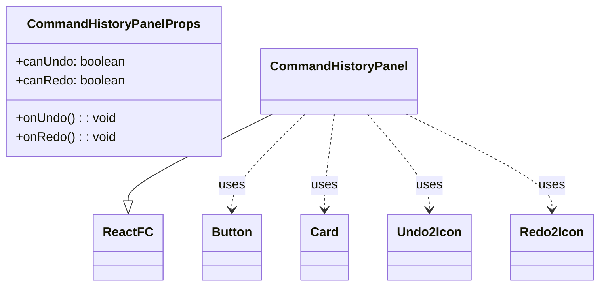

## CommandHistoryPanelProps

Props para o componente CommandHistoryPanel.

### Properties

*   `canUndo` **[boolean][405]** Indica se a ação de desfazer está disponível.
*   `canRedo` **[boolean][405]** Indica se a ação de refazer está disponível.

## CommandHistoryPanel

Renderiza um painel com botões de Undo e Redo.
A habilitação dos botões é controlada pelas props `canUndo` e `canRedo`.

### Parameters

*   `props` **[CommandHistoryPanelProps][24]** As props do componente.

    *   `props.canUndo` &#x20;
    *   `props.canRedo` &#x20;
    *   `props.onUndo` &#x20;
    *   `props.onRedo` &#x20;

Returns **JSX.Element** O componente CommandHistoryPanel.

##

Componente para exibir o painel de informações detalhadas de um equipamento selecionado.
Renderiza apenas se um único equipamento estiver selecionado na cena 3D.

Responsabilidades:

*   Exibir os atributos do equipamento (nome, TAG, tipo, sistema, área, detalhes).
*   Permitir a alteração do estado operacional do equipamento através de um dropdown.
*   Permitir a alteração do produto associado ao equipamento através de um dropdown.
*   Gerenciar a exibição e interação com anotações:
    *   Exibir o texto e a data da anotação existente.
    *   Fornecer botões para adicionar, editar ou excluir a anotação.
*   Fornecer um botão para fechar o painel de informações (desselecionando o equipamento).

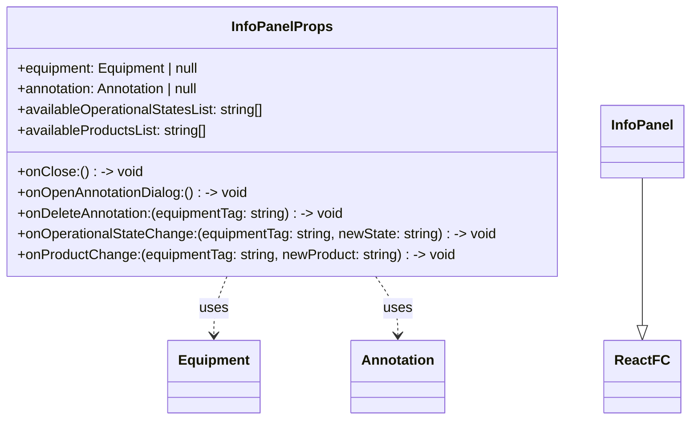

## InfoPanelProps

Props para o componente InfoPanel.

### equipment

O equipamento selecionado para exibir detalhes. Null se nenhum equipamento único estiver selecionado.

Type: ([Equipment][30] | null)

### annotation

A anotação associada ao equipamento selecionado. Null se não houver anotação.

Type: ([Annotation][31] | null)

### onClose

Callback para fechar o painel de informações (geralmente deseleciona o equipamento).

Type: function (): void

### onOpenAnnotationDialog

Callback para abrir o diálogo de adição/edição de anotação.

Type: function (): void

### onDeleteAnnotation

Callback para excluir a anotação do equipamento especificado.

Type: function (equipmentTag: [string][404]): void

### onOperationalStateChange

Callback para alterar o estado operacional de um equipamento.

Type: function (equipmentTag: [string][404], newState: [string][404]): void

### availableOperationalStatesList

Lista de estados operacionais disponíveis para seleção no dropdown.

Type: [Array][406]<[string][404]>

### onProductChange

Callback para alterar o produto de um equipamento.

Type: function (equipmentTag: [string][404], newProduct: [string][404]): void

### availableProductsList

Lista de produtos disponíveis para seleção no dropdown.

Type: [Array][406]<[string][404]>

## InfoPanel

Renderiza um painel flutuante com informações detalhadas sobre o equipamento selecionado.
Mostra detalhes apenas se um único equipamento estiver selecionado. Permite interações
como alterar estado operacional, produto e gerenciar anotações.

### Parameters

*   `props` **[InfoPanelProps][29]** As props do componente.

    *   `props.equipment` &#x20;
    *   `props.annotation` &#x20;
    *   `props.onClose` &#x20;
    *   `props.onOpenAnnotationDialog` &#x20;
    *   `props.onDeleteAnnotation` &#x20;
    *   `props.onOperationalStateChange` &#x20;
    *   `props.availableOperationalStatesList` &#x20;
    *   `props.onProductChange` &#x20;
    *   `props.availableProductsList` &#x20;

Returns **(JSX.Element | null)** O componente InfoPanel ou null se nenhum equipamento único estiver selecionado.

## handleDeleteClick

Manipula o clique no botão de excluir anotação.

## formattedDate

Formata a data de criação/modificação da anotação para exibição.

Type: ([string][404] | null)

##

Componente para gerenciar a visibilidade das camadas de equipamentos e anotações.

Principal Responsabilidade:
Renderizar um card com checkboxes para cada camada definida, permitindo ao usuário controlar
o que é exibido na cena 3D, como prédios, tanques, anotações, etc.

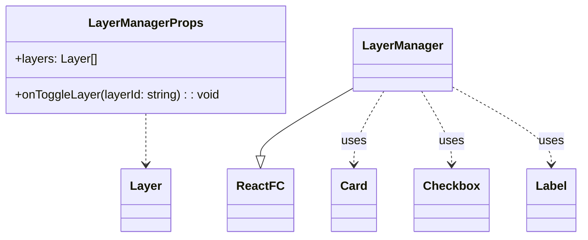

## LayerManagerProps

Props para o componente LayerManager.

### Properties

*   `layers` **[Array][406]<[Layer][383]>** A lista de camadas disponíveis e seus estados de visibilidade.

## LayerManager

Renderiza um Card com checkboxes para controlar a visibilidade de cada camada.
Cada checkbox corresponde a uma camada (e.g., Prédios, Tanques, Anotações).

### Parameters

*   `props` **[LayerManagerProps][44]** As props do componente.

    *   `props.layers` &#x20;
    *   `props.onToggleLayer` &#x20;

Returns **JSX.Element** O componente gerenciador de camadas.

##

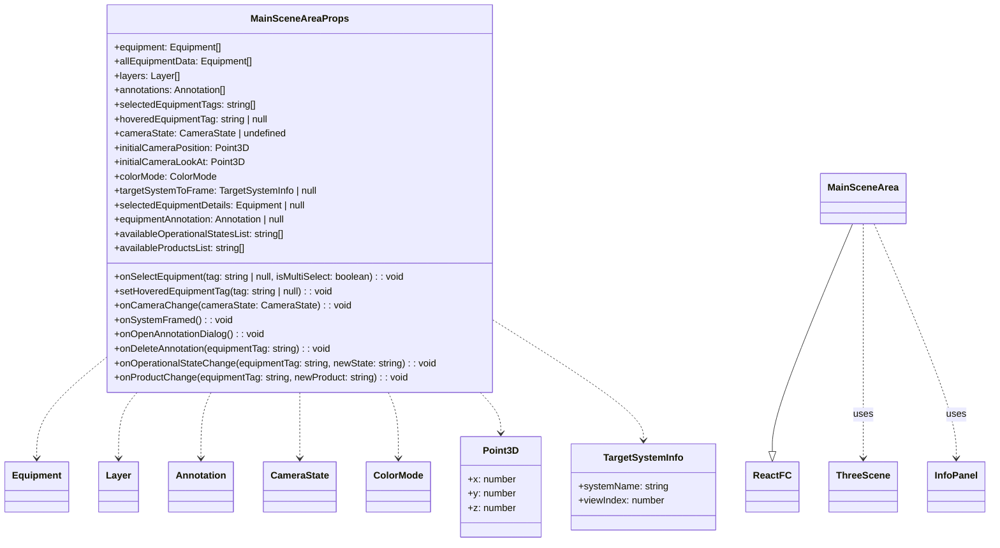

## MainSceneAreaProps

Props para o componente MainSceneArea.
Estas props são, em grande parte, repassadas para `ThreeScene` e `InfoPanel`.

### Properties

*   `equipment` **[Array][406]<[Equipment][30]>** Lista de equipamentos filtrados a serem renderizados na cena.
*   `allEquipmentData` **[Array][406]<[Equipment][30]>** Lista completa de todos os equipamentos, para contexto (e.g., anotações no `ThreeScene`).
*   `layers` **[Array][406]<[Layer][383]>** Configuração das camadas de visibilidade.
*   `annotations` **[Array][406]<[Annotation][31]>** Lista de anotações a serem exibidas.
*   `selectedEquipmentTags` **[Array][406]<[string][404]>** Tags dos equipamentos atualmente selecionados.
*   `hoveredEquipmentTag` **([string][404] | null)** Tag do equipamento atualmente sob o cursor.
*   `cameraState` **([CameraState][385] | [undefined][407])** O estado atual da câmera (posição, lookAt).
*   `colorMode` **[ColorMode][393]** O modo de colorização atual para os equipamentos.
*   `targetSystemToFrame` **([TargetSystemInfo][389] | null)** Informações sobre o sistema e visão a serem enquadrados pela câmera (se houver).
*   `selectedEquipmentDetails` **([Equipment][30] | null)** Detalhes do equipamento único selecionado (para InfoPanel).
*   `equipmentAnnotation` **([Annotation][31] | null)** Anotação do equipamento único selecionado (para InfoPanel).
*   `availableOperationalStatesList` **[Array][406]<[string][404]>** Lista de estados operacionais disponíveis.
*   `availableProductsList` **[Array][406]<[string][404]>** Lista de produtos disponíveis.

## MainSceneArea

Renderiza a área principal da cena 3D e o InfoPanel sobreposto.
Passa todas as props necessárias para os componentes filhos `ThreeScene` e `InfoPanel`.

### Parameters

*   `props` **[MainSceneAreaProps][49]** As props do componente.

    *   `props.equipment` &#x20;
    *   `props.allEquipmentData` &#x20;
    *   `props.layers` &#x20;
    *   `props.annotations` &#x20;
    *   `props.selectedEquipmentTags` &#x20;
    *   `props.onSelectEquipment` &#x20;
    *   `props.hoveredEquipmentTag` &#x20;
    *   `props.setHoveredEquipmentTag` &#x20;
    *   `props.cameraState` &#x20;
    *   `props.onCameraChange` &#x20;
    *   `props.initialCameraPosition` &#x20;
    *   `props.initialCameraLookAt` &#x20;
    *   `props.colorMode` &#x20;
    *   `props.targetSystemToFrame` &#x20;
    *   `props.onSystemFramed` &#x20;
    *   `props.selectedEquipmentDetails` &#x20;
    *   `props.equipmentAnnotation` &#x20;
    *   `props.onOpenAnnotationDialog` &#x20;
    *   `props.onDeleteAnnotation` &#x20;
    *   `props.onOperationalStateChange` &#x20;
    *   `props.availableOperationalStatesList` &#x20;
    *   `props.onProductChange` &#x20;
    *   `props.availableProductsList` &#x20;

Returns **JSX.Element** O componente MainSceneArea.

##

Componente para renderizar o conteúdo principal da sidebar.

Principal Responsabilidade:
Exibir os diversos painéis de controle e filtros dentro da área de conteúdo da sidebar.
Utiliza uma ScrollArea para permitir a rolagem do conteúdo.

Inclui:

*   Controles de câmera ("Focus on System").
*   Filtros de busca textual e seleção por Sistema/Área.
*   Seletor de modo de colorização.
*   Gerenciador de camadas de visibilidade.
*   Link para a documentação externa do projeto.


## SidebarContentLayoutProps

Props para o componente SidebarContentLayout.

### Properties

*   `searchTerm` **[string][404]** O termo de busca textual atual.
*   `selectedSistema` **[string][404]** O sistema selecionado para filtro.
*   `availableSistemas` **[Array][406]<[string][404]>** Lista de sistemas disponíveis para filtro.
*   `selectedArea` **[string][404]** A área selecionada para filtro.
*   `availableAreas` **[Array][406]<[string][404]>** Lista de áreas disponíveis para filtro.
*   `colorMode` **[ColorMode][393]** O modo de colorização atual.
*   `layers` **[Array][406]<[Layer][383]>** Lista de camadas para o LayerManager.
*   `cameraViewSystems` **[Array][406]<[string][404]>** Lista de nomes de sistemas para o CameraControlsPanel.

## SidebarContentLayout

Renderiza o layout do conteúdo da sidebar, incluindo filtros, painéis de controle e link para documentação.
Utiliza uma ScrollArea para permitir a rolagem do conteúdo se ele exceder a altura da sidebar.

### Parameters

*   `props` **[SidebarContentLayoutProps][54]** As props do componente.

    *   `props.searchTerm` &#x20;
    *   `props.setSearchTerm` &#x20;
    *   `props.selectedSistema` &#x20;
    *   `props.setSelectedSistema` &#x20;
    *   `props.availableSistemas` &#x20;
    *   `props.selectedArea` &#x20;
    *   `props.setSelectedArea` &#x20;
    *   `props.availableAreas` &#x20;
    *   `props.colorMode` &#x20;
    *   `props.onColorModeChange` &#x20;
    *   `props.layers` &#x20;
    *   `props.onToggleLayer` &#x20;
    *   `props.cameraViewSystems` &#x20;
    *   `props.onFocusAndSelectSystem` &#x20;

Returns **JSX.Element** O componente SidebarContentLayout.

## Terminal

Componente simples para renderizar o cabeçalho do site.

Principal Responsabilidade:
Exibir o título principal da aplicação ("Terminal 3D") e um ícone associado.
Atua como um elemento de branding e navegação de topo fixo.

## SiteHeader

Renderiza o cabeçalho fixo do site.
Exibe o ícone `Terminal` e o nome da aplicação.

Returns **JSX.Element** O componente SiteHeader.

##

*   **See**: [../../hooks/use-scene-setup/README.md][408] Para a orquestração da configuração da cena.
*   **See**: [../../hooks/use-equipment-renderer/README.md][409] Para a renderização de equipamentos.
*   **See**: [../../hooks/use-annotation-pin-renderer/README.md][410] Para a renderização de pins de anotação.
*   **See**: [../../hooks/use-mouse-interaction/README.md][411] Para interações do mouse.
*   **See**: [../../hooks/use-scene-outline/README.md][412] Para o efeito de contorno.
*   **See**: [../../hooks/useAnimationLoop/README.md][413] Para o loop de animação.

### Examples

```javascript
// Diagrama de Composição do ThreeScene e seus Hooks
// mermaid
// graph TD
//     ThreeScene_Comp["ThreeScene (Componente React)"]
//     MountPoint["<div ref={mountRef}> (Ponto de Montagem DOM)"]
//
//     ThreeScene_Comp -- renderiza --> MountPoint
//
//     subgraph "Hooks Utilizados por ThreeScene"
//         direction LR
//         H_SceneSetup["useSceneSetup (Orquestrador de Setup)"]
//         H_EquipRenderer["useEquipmentRenderer"]
//         H_AnnotPinRenderer["useAnnotationPinRenderer"]
//         H_MouseInt["useMouseInteractionManager"]
//         H_Outline["useSceneOutline"]
//         H_AnimLoop["useAnimationLoop"]
//     end
//
//     ThreeScene_Comp -- usa --> H_SceneSetup
//     ThreeScene_Comp -- usa --> H_EquipRenderer
//     ThreeScene_Comp -- usa --> H_AnnotPinRenderer
//     ThreeScene_Comp -- usa --> H_MouseInt
//     ThreeScene_Comp -- usa --> H_Outline
//     ThreeScene_Comp -- usa --> H_AnimLoop
//
//     H_SceneSetup --> R_Scene["sceneRef"]
//     H_SceneSetup --> R_Camera["cameraRef"]
//     H_SceneSetup --> R_Renderer["rendererRef"]
//     H_SceneSetup --> R_LabelRenderer["labelRendererRef"]
//     H_SceneSetup --> R_Controls["controlsRef"]
//     H_SceneSetup --> R_Composer["composerRef"]
//     H_SceneSetup --> R_OutlinePass["outlinePassRef"]
//     H_SceneSetup --> F_IsSceneReady["isSceneReady (flag)"]
//     H_SceneSetup --> F_IsControlsReady["isControlsReady (flag)"]
//
//     H_EquipRenderer -- usa --> R_Scene
//     H_AnnotPinRenderer -- usa --> R_Scene
//     H_AnnotPinRenderer -- usa --> R_LabelRenderer
//     H_MouseInt -- usa --> MountPoint
//     H_MouseInt -- usa --> R_Camera
//     H_Outline -- usa --> R_OutlinePass
//     H_AnimLoop -- usa --> R_Scene
//     H_AnimLoop -- usa --> R_Camera
//     H_AnimLoop -- usa --> R_Controls
//     H_AnimLoop -- usa --> R_Composer
//     H_AnimLoop -- usa --> R_LabelRenderer
//
//     classDef comp fill:#lightcoral,stroke:#333,stroke-width:2px;
//     classDef hook fill:#lightblue,stroke:#333,stroke-width:2px;
//     classDef ref fill:#lightgoldenrodyellow,stroke:#333,stroke-width:2px;
//     classDef flag fill:#lightpink,stroke:#333,stroke-width:2px;
//
//     class ThreeScene_Comp comp;
//     class MountPoint comp;
//     class H_SceneSetup,H_EquipRenderer,H_AnnotPinRenderer,H_MouseInt,H_Outline,H_AnimLoop hook;
//     class R_Scene,R_Camera,R_Renderer,R_LabelRenderer,R_Controls,R_Composer,R_OutlinePass ref;
//     class F_IsSceneReady,F_IsControlsReady flag;
```

## ThreeSceneProps

Props para o componente ThreeScene.

### Properties

*   `equipment` **[Array][406]<[Equipment][30]>** Lista de equipamentos filtrados a serem renderizados na cena.
*   `allEquipmentData` **[Array][406]<[Equipment][30]>** Lista completa de todos os equipamentos, para contexto (e.g., anotações).
*   `layers` **[Array][406]<[Layer][383]>** Configuração das camadas de visibilidade.
*   `annotations` **[Array][406]<[Annotation][31]>** Lista de anotações a serem exibidas.
*   `selectedEquipmentTags` **([Array][406]<[string][404]> | [undefined][407])** Tags dos equipamentos atualmente selecionados.
*   `hoveredEquipmentTag` **([string][404] | null | [undefined][407])** Tag do equipamento atualmente sob o cursor.
*   `cameraState` **([CameraState][385] | [undefined][407])** O estado atual da câmera (posição, lookAt) gerenciado externamente. Pode ser indefinido durante a inicialização.
*   `colorMode` **[ColorMode][393]** O modo de colorização atual para os equipamentos.
*   `targetSystemToFrame` **([TargetSystemInfo][389] | null)** O sistema que deve ser enquadrado pela câmera (se houver), incluindo o índice da visão.

## ThreeScene

Componente React principal para renderizar e interagir com a cena 3D usando Three.js.
Atua como um orquestrador de hooks especializados que gerenciam diferentes aspectos da cena.

Type: React.FC<[ThreeSceneProps][62]>

### Parameters

*   `props` **[ThreeSceneProps][62]** As props do componente.

Returns **JSX.Element** O elemento div que serve como contêiner para a cena 3D.

## THEMES

Define os seletores CSS para os temas claro e escuro.
Usado internamente pelo ChartStyle para aplicar cores específicas do tema.

## ChartConfig

Configuração para os gráficos, permitindo a definição de rótulos, ícones e cores
para cada item de dados do gráfico. As cores podem ser definidas diretamente ou
através de um objeto de tema para suportar diferentes temas (claro/escuro).

Type: any

### Examples

````javascript
```ts
const chartConfig = {
  visitors: {
    label: "Visitantes",
    color: "hsl(var(--chart-1))",
  },
  chrome: {
    label: "Chrome",
    color: "hsl(var(--chart-2))",
    icon: ChromeIcon, // Exemplo de ícone
  },
  safari: {
    label: "Safari",
    theme: { // Exemplo de cores baseadas em tema
      light: "hsl(var(--chart-3))",
      dark: "hsl(var(--chart-5))",
    }
  },
} satisfies ChartConfig;
```
````

## Form

Componente provedor que propaga os métodos `useForm` para todos os componentes filhos
através da API de Contexto do React. Para ser usado com `useFormContext`.

### Parameters

*   `props` **FormProviderProps\<TFieldValues, TContext, TTransformedValues>** Todos os métodos de `useForm`.

### Examples

````javascript
```tsx
function App() {
  const methods = useForm();
  const onSubmit = data => console.log(data);

  return (
    <FormProvider {...methods} >
      <form onSubmit={methods.handleSubmit(onSubmit)}>
        <NestedInput />
        <input type="submit" />
      </form>
    </FormProvider>
  );
}

 function NestedInput() {
  const { register } = `useFormContext`(); // retrieve all hook methods
  return <input {...register("test")} />;
}
```
````

Returns **JSX.Element**&#x20;

##

Componente de Sidebar reutilizável e altamente configurável.

Principal Responsabilidade:
Fornecer uma estrutura de sidebar flexível que pode ser usada de várias maneiras:

*   Como uma sidebar tradicional fixa ou flutuante.
*   Em modo "icon" (colapsada, mostrando apenas ícones).
*   Como um "offcanvas" (desliza para fora da tela).
*   Adaptável para dispositivos móveis (geralmente usando o modo offcanvas).

Subcomponentes:

*   `SidebarProvider`: Contexto para gerenciar o estado da sidebar (aberta/fechada, modo).
*   `Sidebar`: O contêiner principal da sidebar.
*   `SidebarTrigger`: Botão para alternar o estado da sidebar.
*   `SidebarRail`: Barra lateral fina para alternar a sidebar quando colapsada.
*   `SidebarInset`: Contêiner para o conteúdo principal da página, que se ajusta à sidebar.
*   `SidebarHeader`, `SidebarFooter`, `SidebarContent`: Seções estruturais dentro da sidebar.
*   `SidebarGroup`, `SidebarGroupLabel`, `SidebarGroupAction`, `SidebarGroupContent`: Para agrupar itens.
*   `SidebarMenu`, `SidebarMenuItem`, `SidebarMenuButton`, `SidebarMenuAction`, `SidebarMenuBadge`, `SidebarMenuSkeleton`, `SidebarMenuSub`, `SidebarMenuSubItem`, `SidebarMenuSubButton`: Para criar menus de navegação dentro da sidebar.
*   `SidebarInput`, `SidebarSeparator`: Elementos de UI utilitários para a sidebar.

Utiliza cookies para persistir o estado da sidebar entre as sessões (desktop) e atalhos de teclado.

```mermaid
graph LR
  App --> SidebarProvider_Context["SidebarProvider (Context)"]
  SidebarProvider_Context --> Sidebar_Comp["Sidebar"]
  SidebarProvider_Context --> SidebarInset_Comp["SidebarInset (Main Content Wrapper)"]
  App --> SidebarTrigger_Button["SidebarTrigger (Button)"]

  Sidebar_Comp --> SidebarHeader_Sec["SidebarHeader"]
  Sidebar_Comp --> SidebarContent_Sec["SidebarContent (Scrollable)"]
  Sidebar_Comp --> SidebarFooter_Sec["SidebarFooter"]

  SidebarContent_Sec --> SidebarGroup_Container["SidebarGroup"]
  SidebarGroup_Container --> SidebarGroupLabel_Text["SidebarGroupLabel"]
  SidebarGroup_Container --> SidebarMenu_List["SidebarMenu (ul)"]

  SidebarMenu_List --> SidebarMenuItem_Item["SidebarMenuItem (li)"]
  SidebarMenuItem_Item --> SidebarMenuButton_Action["SidebarMenuButton (Button/Link)"]
  SidebarMenuItem_Item --> SidebarMenuAction_Opt["SidebarMenuAction (Optional Button)"]
  SidebarMenuItem_Item --> SidebarMenuBadge_Info["SidebarMenuBadge (Optional Info)"]

  SidebarMenuButton_Action --> SidebarMenuSub_SubList["SidebarMenuSub (ul for dropdowns)"]
  SidebarMenuSub_SubList --> SidebarMenuSubItem_SubItem["SidebarMenuSubItem (li)"]
  SidebarMenuSubItem_SubItem --> SidebarMenuSubButton_SubAction["SidebarMenuSubButton (Button/Link)"]
```

## useSidebar

Hook para acessar o contexto da Sidebar.
Deve ser usado dentro de um `SidebarProvider`.

*   Throws **[Error][414]** Se usado fora de um `SidebarProvider`.

Returns **SidebarContext** O contexto da sidebar.

## SidebarProvider

Provedor de contexto para o estado da sidebar.
Gerencia se a sidebar está aberta/fechada, tanto no desktop quanto no mobile,
e o estado colapsado/expandido.

### defaultOpen

Estado de abertura padrão da sidebar no desktop. Padrão: `true`.

Type: [boolean][405]

### open

Controla o estado de abertura da sidebar no desktop externamente.

Type: [boolean][405]

### onOpenChange

Callback para quando o estado de abertura da sidebar no desktop muda.

Type: function (open: [boolean][405]): void

## Sidebar

Componente principal da Sidebar.
Renderiza a sidebar com base no estado do `SidebarProvider` e nas props de configuração.

### side

Lado em que a sidebar aparecerá. Padrão: `"left"`.

Type: (`"left"` | `"right"`)

### variant

Variante visual da sidebar. Padrão: `"sidebar"`.

*   `"sidebar"`: Sidebar tradicional.
*   `"floating"`: Sidebar flutuante com sombra e bordas.
*   `"inset"`: Sidebar que se encaixa dentro de um layout principal (`SidebarInset`).

Type: (`"sidebar"` | `"floating"` | `"inset"`)

### collapsible

Comportamento de colapso da sidebar. Padrão: `"offcanvas"`.

*   `"offcanvas"`: A sidebar desliza para fora da tela quando colapsada.
*   `"icon"`: A sidebar encolhe para mostrar apenas ícones quando colapsada.
*   `"none"`: A sidebar não é colapsável.

Type: (`"offcanvas"` | `"icon"` | `"none"`)

## SidebarTrigger

Botão para alternar o estado de visibilidade da sidebar.
Em modo mobile, abre/fecha a sidebar offcanvas.
Em modo desktop, colapsa/expande a sidebar.

## SidebarRail

Barra lateral fina ("rail") que aparece quando a sidebar está colapsada em modo "icon".
Permite ao usuário clicar para expandir a sidebar.

## SidebarInset

Componente para envolver o conteúdo principal da página.
Ajusta sua margem e aparência com base no estado e variante da sidebar,
especialmente útil com a variante "inset".

## SidebarInput

Componente de Input estilizado para uso dentro da Sidebar.

## SidebarHeader

Contêiner para o cabeçalho da Sidebar.

## SidebarFooter

Contêiner para o rodapé da Sidebar.

## SidebarSeparator

Componente Separator estilizado para uso dentro da Sidebar.

## SidebarContent

Contêiner para a área de conteúdo principal da Sidebar (geralmente rolável).

## SidebarGroup

Contêiner para agrupar logicamente itens dentro da Sidebar.

## SidebarGroupLabel

Rótulo para um `SidebarGroup`. Fica oculto quando a sidebar está em modo "icon".

## SidebarGroupAction

Botão de ação opcional para um `SidebarGroup` (e.g., um botão "+").
Fica oculto quando a sidebar está em modo "icon".

## SidebarGroupContent

Contêiner para o conteúdo de um `SidebarGroup`.

## SidebarMenu

Lista `<ul>` para um menu dentro da Sidebar.

## SidebarMenuItem

Item `<li>` de um `SidebarMenu`.

## SidebarMenuButton

Botão clicável dentro de um `SidebarMenuItem`.
Pode conter um ícone e texto. O texto é truncado quando a sidebar está em modo "icon".
Suporta um tooltip opcional que aparece quando a sidebar está em modo "icon".

### isActive

Indica se o item de menu está ativo.

Type: [boolean][405]

### tooltip

Conteúdo do tooltip a ser exibido no modo "icon", ou um objeto de props para `TooltipContent`.

Type: ([string][404] | React.ComponentProps\<any>)

## SidebarMenuAction

Botão de ação opcional para um `SidebarMenuItem` (e.g., um ícone de "mais opções").
Fica oculto quando a sidebar está em modo "icon".
Pode ser configurado para aparecer apenas no hover.

### showOnHover

Se true, a ação só aparece quando o mouse está sobre o item de menu.

Type: [boolean][405]

## SidebarMenuBadge

Badge opcional para um `SidebarMenuItem` (e.g., para contagens de notificações).
Fica oculto quando a sidebar está em modo "icon".

## SidebarMenuSkeleton

Componente de esqueleto de carregamento para itens de menu.
Útil para indicar que o conteúdo do menu está sendo carregado.

### showIcon

Se true, mostra um esqueleto de ícone.

Type: [boolean][405]

## SidebarMenuSub

Lista `<ul>` para um submenu dentro de um `SidebarMenuButton` (geralmente usado com dropdowns ou accordions).
Fica oculto quando a sidebar está em modo "icon".

## SidebarMenuSubItem

Item `<li>` de um `SidebarMenuSub`.

## SidebarMenuSubButton

Botão clicável (ou link) dentro de um `SidebarMenuSubItem`.

### size

Tamanho do botão do submenu.

Type: (`"sm"` | `"md"`)

### isActive

Indica se o item de submenu está ativo.

Type: [boolean][405]

## Equipment

Fornece os dados iniciais para equipamentos e camadas da aplicação.
Estes dados são usados para popular o estado inicial da aplicação quando ela é carregada.
Define a estrutura de cada equipamento e as camadas de visibilidade padrão.

Exporta:

*   `initialEquipment`: Array de objetos `Equipment` representando os itens 3D na cena.
*   `initialLayers`: Array de objetos `Layer` especificando as camadas de visibilidade.
*   `initialAnnotations`: Array inicial de `Annotation` (geralmente vazio para começar).

## Equipment

Utilitário para filtrar a lista de equipamentos com base em múltiplos critérios.

Principal Responsabilidade:
Aplicar filtros de Sistema, Área e um termo de busca textual (nome, tipo, tag)
a uma lista de equipamentos, retornando a lista filtrada.

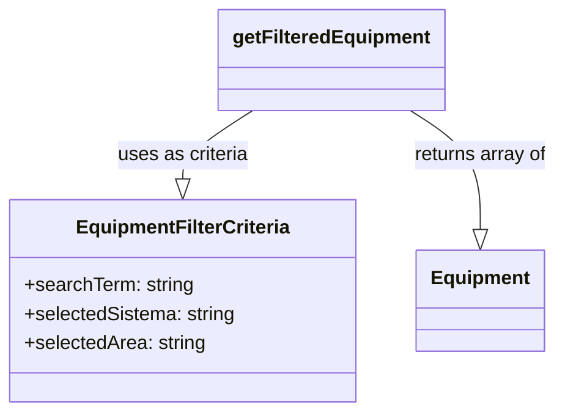

Exporta:

*   `EquipmentFilterCriteria`: Interface para os critérios de filtro.
*   `getFilteredEquipment`: Função principal para filtrar equipamentos.

## Equipment

*   **See**: [../../core/data/initial-data/README.md][415] Para os dados iniciais de equipamentos e camadas.
*   **See**: [../../lib/types/README.md#Equipment][416] Para a interface de Equipamento.
*   **See**: [../../lib/types/README.md#Annotation][417] Para a interface de Anotação.

### Examples

```javascript
// Diagrama de Estrutura do Repositório em Memória
// mermaid
// classDiagram
//     class RepositorioMemoria {
//         -equipmentStore: Map_string_Equipment_
//         -annotationStore: Map_string_Annotation_
//         -isInitialized: boolean
//         +initializeRepository() void
//     }
//     class RepositorioEquipamentos {
//         +getEquipmentByTag(tag: string): Equipment | undefined
//         +getAllEquipment(): Equipment[]
//         +addEquipment(equipment: Equipment): Equipment
//         +updateEquipment(tag: string, updates: Partial_Equipment_): Equipment | undefined
//         +deleteEquipment(tag: string): boolean
//         +_resetAndLoadInitialData(): void
//     }
//     class RepositorioAnotacoes {
//         +getAnnotationByEquipmentTag(equipmentTag: string): Annotation | undefined
//         +getAllAnnotations(): Annotation[]
//         +addOrUpdateAnnotation(annotation: Annotation): Annotation
//         +deleteAnnotation(equipmentTag: string): boolean
//         +initializeAnnotations(annotations: Annotation[]): void
//     }
//     class DadosIniciais {
//         +initialEquipment: Equipment[]
//         +initialAnnotations: Annotation[]
//     }
//
//     RepositorioMemoria --|> DadosIniciais : carrega dados de
//     RepositorioMemoria o-- RepositorioEquipamentos : expõe
//     RepositorioMemoria o-- RepositorioAnotacoes : expõe
//
//     note for RepositorioMemoria "Módulo auto-inicializável."
//     note for RepositorioEquipamentos "Gerencia o CRUD de Equipamentos."
//     note for RepositorioAnotacoes "Gerencia o CRUD de Anotações."
```

## Equipment

Define as principais interfaces de tipo usadas em toda a aplicação Terminal 3D.
Estas estruturas de dados são cruciais para a consistência e tipagem do projeto,
descrevendo entidades como Equipamentos, Camadas, Estado da Câmera, Comandos e Anotações.
A clareza e precisão destas interfaces facilitam o desenvolvimento, a manutenção e
a compreensão do fluxo de dados através dos componentes e hooks.

## Equipment

Representa um equipamento na cena 3D. Contém todas as propriedades
necessárias para sua renderização, identificação e manipulação de estado.

### Properties

*   `tag` **[string][404]** Identificador único e imutável do equipamento (e.g., "bldg-01", "tank-alpha"). Usado como chave.
*   `name` **[string][404]** Nome legível do equipamento para exibição na UI (e.g., "Main Office", "Storage Tank Alpha").
*   `type` **(`"Building"` | `"Crane"` | `"Tank"` | `"Terrain"` | `"Pipe"` | `"Valve"`)** Categoria do equipamento, influencia sua geometria e interações.
    'Terrain' é um tipo especial para o plano de chão.
*   `sistema` **[string][404]?** O sistema operacional ou funcional ao qual o equipamento pertence (e.g., "GA", "ODB"). Opcional.
*   `area` **[string][404]?** A área física ou lógica onde o equipamento está localizado (e.g., "Área 31", "Área de Processo"). Opcional.
*   `operationalState` **[string][404]?** Estado operacional atual do equipamento (e.g., 'operando', 'manutenção', 'em falha', 'não operando', 'Não aplicável').
    Usado para colorização e informação. Opcional.
*   `product` **[string][404]?** Produto atualmente associado ou processado pelo equipamento (e.g., "70H", "660", "Não aplicável").
    Usado para colorização e informação. Opcional.
*   `radius` **[number][418]?** Raio para equipamentos com geometria cilíndrica (e.g., 'Tank', 'Pipe') ou esférica (e.g., 'Valve'). Opcional se `size` for usado.
*   `height` **[number][418]?** Altura para equipamentos com geometria cilíndrica (e.g., 'Tank', 'Crane'). Para 'Pipe', representa o comprimento. Opcional se `size` for usado.
*   `color` **[string][404]** Cor base do equipamento em formato hexadecimal (e.g., '#78909C'). Usada no modo de colorização 'Equipamento'.
*   `details` **[string][404]?** Detalhes textuais adicionais sobre o equipamento. Exibido no `InfoPanel`. Opcional.

## initialEquipment

Lista inicial de equipamentos para a cena 3D.
Cada equipamento possui propriedades como tag, nome, tipo, sistema, área, estado operacional,
produto, posição, dimensões (ou raio/altura), cor, detalhes e categoria.

Type: [Array][406]<[Equipment][30]>

## initialLayers

Lista inicial de camadas para controle de visibilidade na interface.
Cada camada define um nome, o tipo de equipamento que ela controla (ou 'Annotations' para pins de anotação, 'Terrain' para o chão),
e seu estado de visibilidade inicial.

Type: [Array][406]<[Layer][383]>

## initialAnnotations

Lista inicial de anotações. Geralmente vazia para começar,
a menos que queira popular com dados de exemplo.

Type: [Array][406]<[Annotation][31]>

## THREE

Utilitários para determinar a cor dos equipamentos na cena 3D.

Principal Responsabilidade:
Fornecer a lógica para calcular a cor de um equipamento com base no modo de
colorização selecionado (Equipamento, Estado Operacional, Produto) e nos
atributos do próprio equipamento.

Exporta:

*   `getEquipmentColor`: Função principal que retorna a cor calculada como `THREE.Color`.

## THREE

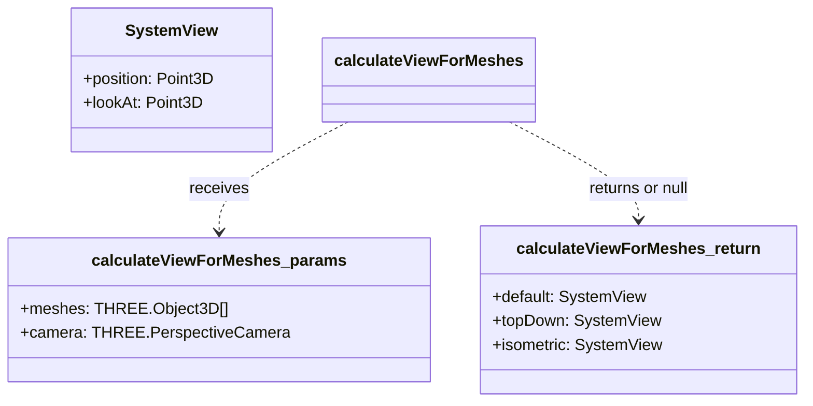

## THREE

Fábrica para criar geometrias de equipamentos para a cena Three.js.

Principal Responsabilidade:
Encapsular a lógica de criação de diferentes tipos de `THREE.BufferGeometry`
com base no tipo de equipamento (`item.type`) e suas dimensões (`item.size`, `item.radius`, `item.height`).
Isso promove o Single Responsibility Principle, isolando a lógica de criação
de geometrias do componente `ThreeScene` ou outras partes do sistema.
Fornece uma geometria padrão (BoxGeometry) caso um tipo de equipamento desconhecido seja fornecido.

Exporta:

*   `createGeometryForItem`: Função para criar a geometria apropriada para um equipamento.

## THREE

Utilitários para gerenciar a exibição de rótulos HTML (pins de anotação)
sobrepostos à cena Three.js.

Principal Responsabilidade:
Gerenciar a criação, atualização, posicionamento e remoção dos pins de anotação (`CSS2DObject`)
na cena, utilizando `CSS2DRenderer`. Isso inclui lidar com a visibilidade dos pins
com base na camada de anotações e fornecer uma função para atualizar o tamanho do
`CSS2DRenderer` em caso de redimensionamento da viewport.

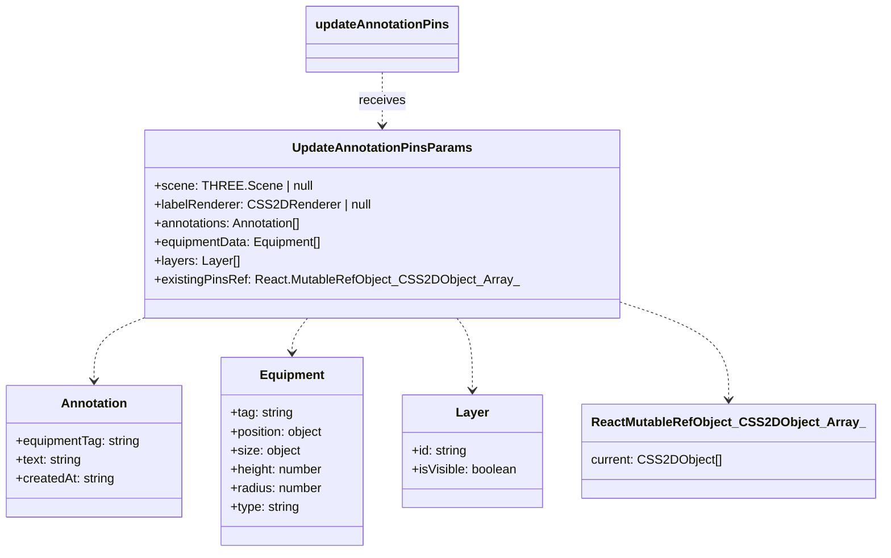

Exporta:

*   `updateLabelRendererSize`: Atualiza o tamanho do CSS2DRenderer.
*   `updateAnnotationPins`: Gerencia os pins de anotação na cena.

## THREE

Utilitários para configurar e gerenciar o pipeline de pós-processamento
para a cena Three.js.

Principal Responsabilidade:
Lidar com a configuração inicial do `EffectComposer` e `OutlinePass`, e fornecer
funções para atualizar dinamicamente o efeito de contorno (quais objetos destacar
e com qual estilo) e para redimensionar os passes de pós-processamento.

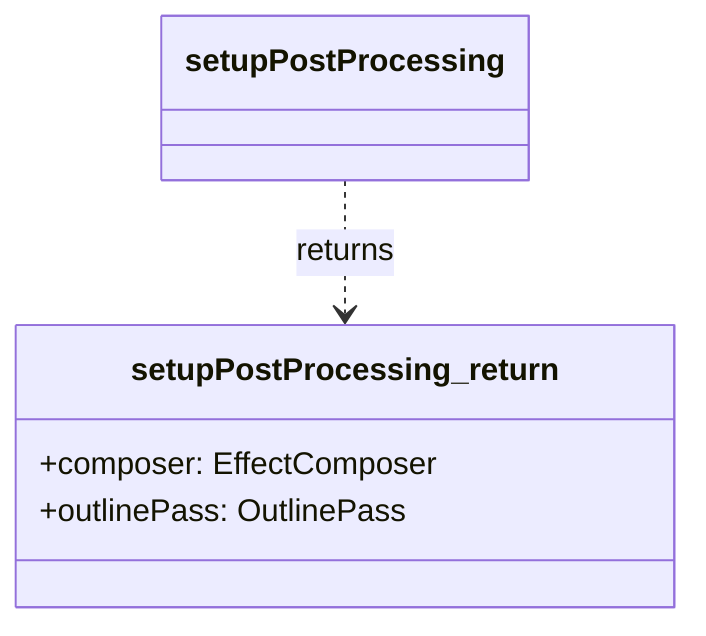

Exporta:

*   `setupPostProcessing`: Configura o pipeline inicial de pós-processamento.
*   `updatePostProcessingSize`: Atualiza o tamanho do composer e do outline pass.
*   `updateOutlineEffect`: Atualiza quais objetos são contornados e com qual estilo.

## THREE

Utilitários para configurar elementos básicos e gerenciar meshes de equipamentos em uma cena Three.js.

Principal Responsabilidade:
Encapsular a lógica de baixo nível para a criação, configuração e atualização de
componentes fundamentais da cena 3D, como iluminação, plano de chão, renderizadores
(WebGL e CSS2D), pipeline de pós-processamento (EffectComposer, OutlinePass), e a
sincronização dinâmica dos meshes de equipamentos com os dados da aplicação.

```mermaid
  graph TD;
    A[setupRenderPipeline] --> B{renderer: WebGLRenderer};
    A --> C{labelRenderer: CSS2DRenderer};
    A --> D{composer: EffectComposer};
    A --> E{outlinePass: OutlinePass};

    F[UpdateEquipmentMeshesParams] --> G[updateEquipmentMeshesInScene];
    class H[Equipment] --> F;
    class I[Layer] --> F;
    class J[ColorMode] --> F;

    classDef params fill:#DCDCDC,stroke:#333,stroke-width:2px,color:black;
    classDef func fill:#ADD8E6,stroke:#333,stroke-width:2px,color:black;
    classDef return fill:#90EE90,stroke:#333,stroke-width:2px,color:black;
    classDef type fill:#FFFFE0,stroke:#333,stroke-width:2px,color:black;

    class A func;
    class B,C,D,E return;
    class F params;
    class G func;
    class H,I,J type;
```

Exporta:

*   `setupLighting`: Configura a iluminação da cena.
*   `setupGroundPlane`: Configura o plano de chão.
*   `setupRenderPipeline`: Inicializa os renderizadores e o pipeline de pós-processamento.
*   `updateEquipmentMeshesInScene`: Atualiza dinamicamente os meshes dos equipamentos.

## THREE

*   **See**: [../../hooks/useThreeCore/README.md][419] Para inicialização da cena e câmera.
*   **See**: [../../hooks/useThreeRenderers/README.md][420] Para configuração dos renderizadores e pós-processamento.
*   **See**: [../../hooks/useThreeOrbitControls/README.md][421] Para configuração dos controles de órbita.
*   **See**: [../../hooks/useThreeSceneElements/README.md][422] Para configuração de iluminação e plano de chão.
*   **See**: [../../hooks/useThreeResize/README.md][423] Para manipulação de redimensionamento.

### Examples

```javascript
// Diagrama de Composição do useSceneSetup
// mermaid
// graph TD
//     useSceneSetup_Orchestrator["useSceneSetup (Orquestrador)"]
//
//     subgraph "Hooks Especializados de Setup"
//         direction LR
//         H_Core["useThreeCore"]
//         H_Renderers["useThreeRenderers"]
//         H_Controls["useThreeOrbitControls"]
//         H_Elements["useThreeSceneElements"]
//         H_Resize["useThreeResize"]
//     end
//
//     useSceneSetup_Orchestrator -- compõe --> H_Core
//     useSceneSetup_Orchestrator -- compõe --> H_Renderers
//     useSceneSetup_Orchestrator -- compõe --> H_Controls
//     useSceneSetup_Orchestrator -- compõe --> H_Elements
//     useSceneSetup_Orchestrator -- compõe --> H_Resize
//
//     H_Core --> R_Scene["sceneRef"]
//     H_Core --> R_Camera["cameraRef"]
//
//     H_Renderers -- usa --> R_Scene
//     H_Renderers -- usa --> R_Camera
//     H_Renderers --> R_Renderer["rendererRef"]
//     H_Renderers --> R_LabelRenderer["labelRendererRef"]
//     H_Renderers --> R_Composer["composerRef"]
//     H_Renderers --> R_OutlinePass["outlinePassRef"]
//     H_Renderers --> F_RenderersReady["areRenderersReady (flag)"]
//
//     H_Controls -- usa --> R_Camera
//     H_Controls -- usa --> R_Renderer
//     H_Controls --> R_OrbitControls["controlsRef"]
//     H_Controls --> F_ControlsReady["isControlsReady (flag)"]
//
//     H_Elements -- usa --> R_Scene
//     H_Elements --> R_GroundMesh["groundMeshRef"]
//
//     H_Resize -- usa --> R_Camera
//     H_Resize -- usa --> R_Renderer
//     H_Resize -- usa --> R_LabelRenderer
//     H_Resize -- usa --> R_Composer
//     H_Resize -- usa --> R_OutlinePass
//
//     useSceneSetup_Orchestrator -- retorna --> R_Scene
//     useSceneSetup_Orchestrator -- retorna --> R_Camera
//     useSceneSetup_Orchestrator -- retorna --> R_Renderer
//     useSceneSetup_Orchestrator -- retorna --> R_LabelRenderer
//     useSceneSetup_Orchestrator -- retorna --> R_OrbitControls
//     useSceneSetup_Orchestrator -- retorna --> R_Composer
//     useSceneSetup_Orchestrator -- retorna --> R_OutlinePass
//     useSceneSetup_Orchestrator -- retorna --> R_GroundMesh
//     useSceneSetup_Orchestrator -- retorna --> F_SceneReady["isSceneReady (flag combinada)"]
//     useSceneSetup_Orchestrator -- retorna --> F_ControlsReady
//
//     classDef hook fill:#lightblue,stroke:#333,stroke-width:2px;
//     classDef ref fill:#lightgoldenrodyellow,stroke:#333,stroke-width:2px;
//     classDef flag fill:#lightpink,stroke:#333,stroke-width:2px;
//
//     class useSceneSetup_Orchestrator hook;
//     class H_Core,H_Renderers,H_Controls,H_Elements,H_Resize hook;
//     class R_Scene,R_Camera,R_Renderer,R_LabelRenderer,R_OrbitControls,R_Composer,R_OutlinePass,R_GroundMesh ref;
//     class F_RenderersReady,F_ControlsReady,F_SceneReady flag;
```

## getCharNumericValue

Converte um caractere ('0'-'9' ou 'A'-'Z') para um valor numérico (0-35).
'0'-'9' mapeiam para 0-9.
'A'-'Z' (case-insensitive) mapeiam para 10-35.
Caracteres inválidos retornam 0.
Esta função é usada para gerar componentes de cor (R, G, B) a partir de códigos de produto.

### Parameters

*   `char` **[string][404]** O caractere a ser convertido.

Returns **[number][418]** O valor numérico correspondente (0-35), ou 0 para caracteres inválidos.

## getEquipmentColor

Determina a cor final de um equipamento com base no modo de colorização e seus atributos.

### Parameters

*   `item` **[Equipment][30]** O equipamento para o qual a cor será determinada.
*   `colorMode` **[ColorMode][393]** O modo de colorização selecionado ('Equipamento', 'Estado Operacional', 'Produto').

Returns **THREE.Color** A cor calculada para o equipamento, como uma instância de `THREE.Color`.

## EquipmentFilterCriteria

Define os critérios de filtro aplicáveis aos equipamentos.

### Properties

*   `searchTerm` **[string][404]** Termo de busca textual. Múltiplos termos separados por espaço são tratados com lógica "E".
*   `selectedSistema` **[string][404]** Sistema selecionado para filtro (ou "All" para não filtrar por sistema).
*   `selectedArea` **[string][404]** Área selecionada para filtro (ou "All" para não filtrar por área).

## getFilteredEquipment

Filtra uma lista de equipamentos com base nos critérios fornecidos.
A filtragem ocorre na seguinte ordem: Sistema, depois Área, depois Termo de Busca.
A filtragem textual por `searchTerm` considera nome, tipo e tag, com lógica "E" para múltiplos termos.
Os filtros de sistema e área são aplicados se não forem "All".

### Parameters

*   `allEquipment` **[Array][406]<[Equipment][30]>** A lista completa de equipamentos a serem filtrados.
*   `criteria` **[EquipmentFilterCriteria][131]** Os critérios de filtro a serem aplicados.

Returns **[Array][406]<[Equipment][30]>** A lista de equipamentos filtrada.

## equipmentRepository

Objeto repositório para gerenciar dados de `Equipment`.

### getEquipmentByTag

Obtém um equipamento pela sua tag.

#### Parameters

*   `tag` **[string][404]** A tag do equipamento.

Returns **([Equipment][30] | [undefined][407])** O objeto do equipamento (uma cópia), ou undefined se não encontrado.

### getAllEquipment

Obtém todos os equipamentos.

Returns **[Array][406]<[Equipment][30]>** Um array com todos os equipamentos (cópias).

### addEquipment

Adiciona um novo equipamento. Se um equipamento com a mesma tag já existir,
ele será atualizado em vez de adicionar um novo.

#### Parameters

*   `equipment` **[Equipment][30]** O objeto do equipamento a ser adicionado.

Returns **[Equipment][30]** O equipamento adicionado (ou atualizado, uma cópia).

### updateEquipment

Atualiza um equipamento existente.

#### Parameters

*   `tag` **[string][404]** A tag do equipamento a ser atualizado.
*   `updates` **Partial<[Equipment][30]>** Um objeto com as propriedades do equipamento a serem atualizadas.
    A propriedade `tag` não pode ser alterada por este método.

Returns **([Equipment][30] | [undefined][407])** O equipamento atualizado (uma cópia), ou undefined se não encontrado.

### deleteEquipment

Exclui um equipamento pela sua tag.

#### Parameters

*   `tag` **[string][404]** A tag do equipamento a ser excluído.

Returns **[boolean][405]** True se o equipamento foi excluído com sucesso, false caso contrário.

## annotationRepository

Objeto repositório para gerenciar dados de `Annotation`.

### getAnnotationByEquipmentTag

Obtém uma anotação pela tag do equipamento associado.

#### Parameters

*   `equipmentTag` **[string][404]** A tag do equipamento.

Returns **([Annotation][31] | [undefined][407])** A anotação (uma cópia), ou undefined se não encontrada.

### getAllAnnotations

Obtém todas as anotações.

Returns **[Array][406]<[Annotation][31]>** Um array com todas as anotações (cópias).

### addOrUpdateAnnotation

Adiciona uma nova anotação ou atualiza uma existente se já houver uma para a mesma `equipmentTag`.

#### Parameters

*   `annotation` **[Annotation][31]** O objeto da anotação a ser adicionado/atualizado.

Returns **[Annotation][31]** A anotação adicionada/atualizada (uma cópia).

### deleteAnnotation

Exclui uma anotação pela tag do equipamento associado.

#### Parameters

*   `equipmentTag` **[string][404]** A tag do equipamento cuja anotação será excluída.

Returns **[boolean][405]** True se a anotação foi excluída com sucesso, false caso contrário.

### initializeAnnotations

Inicializa explicitamente as anotações no repositório.
Limpa quaisquer anotações existentes e popula com as fornecidas.

#### Parameters

*   `annotations` **[Array][406]<[Annotation][31]>** Um array de anotações para inicializar o repositório.

## calculateViewForMeshes

Calcula múltiplas opções de visualização (padrão, de cima, isométrica) para a câmera
de forma a enquadrar um conjunto de meshes fornecidos.

### Parameters

*   `meshes` **[Array][406]\<THREE.Object3D>** Um array de meshes 3D a serem enquadrados.
*   `camera` **THREE.PerspectiveCamera** A câmera de perspectiva da cena.

Returns **([SystemViewOptions][387] | null)** Um objeto contendo as diferentes visualizações calculadas
ou null se não for possível calcular (e.g., nenhum mesh fornecido).

## createGeometryForItem

Cria e retorna uma `THREE.BufferGeometry` apropriada para o tipo de equipamento.
Seleciona a geometria correta (Box, Cylinder, Sphere) com base no `item.type`
e utiliza as dimensões fornecidas no objeto `item`.

### Parameters

*   `item` **[Equipment][30]** O objeto de equipamento contendo tipo e dimensões.

Returns **THREE.BufferGeometry** A geometria criada para o equipamento.
Retorna um `BoxGeometry(1,1,1)` para tipos desconhecidos.

## updateLabelRendererSize

Atualiza o tamanho do CSS2DRenderer.
Deve ser chamado quando o contêiner de renderização da cena é redimensionado
para garantir que os rótulos sejam dimensionados e posicionados corretamente.

### Parameters

*   `labelRenderer` **(CSS2DRenderer | null)** A instância do CSS2DRenderer a ser atualizada.
*   `width` **[number][418]** A nova largura para o renderizador de rótulos.
*   `height` **[number][418]** A nova altura para o renderizador de rótulos.

Returns **void**&#x20;

## UpdateAnnotationPinsParams

Parâmetros para a função `updateAnnotationPins`.

### Properties

*   `scene` **(THREE.Scene | null)** A cena Three.js onde os pins serão adicionados/removidos.
*   `labelRenderer` **(CSS2DRenderer | null)** O renderizador CSS2D responsável por exibir os pins.
*   `annotations` **[Array][406]<[Annotation][31]>** A lista atual de todas as anotações.
*   `equipmentData` **[Array][406]<[Equipment][30]>** A lista completa de equipamentos, usada para encontrar posições e dimensões dos alvos das anotações.
*   `layers` **[Array][406]<[Layer][383]>** A lista de camadas, usada para verificar a visibilidade da camada de "Annotations".
*   `existingPinsRef` **React.MutableRefObject<[Array][406]\<CSS2DObject>>** Ref para o array de objetos CSS2DObject (pins) atualmente na cena.

## updateAnnotationPins

Atualiza os pins de anotação visíveis na cena 3D.
Remove pins antigos e cria/atualiza novos com base nos dados atuais e na visibilidade da camada de anotações.
Cada pin é um ícone SVG amarelo posicionado acima do equipamento correspondente.
O `labelRenderer.domElement.style.display` é ajustado com base na visibilidade da camada de anotações.

### Parameters

*   `params` **[UpdateAnnotationPinsParams][161]** Parâmetros para atualizar os pins.

    *   `params.scene` &#x20;
    *   `params.labelRenderer` &#x20;
    *   `params.annotations` &#x20;
    *   `params.equipmentData` &#x20;
    *   `params.layers` &#x20;
    *   `params.existingPinsRef` &#x20;

Returns **void**&#x20;

##

Gerencia interações do mouse (clique e movimento) dentro da cena Three.js.

ATENÇÃO: Este arquivo foi esvaziado. A lógica de interação do mouse
foi movida para o hook customizado `src/hooks/use-mouse-interaction.ts`
(renomeado internamente para `useMouseInteractionManager` em termos de funcionalidade)
como parte de uma refatoração para melhorar a modularidade e o Princípio da Responsabilidade Única.

O hook `useMouseInteractionManager` agora encapsula:

*   A lógica de raycasting para detectar interseções.
*   A adição e remoção de ouvintes de eventos do mouse no elemento DOM da cena.
*   A invocação de callbacks para tratar seleção e hover de equipamentos.

Este arquivo é mantido para evitar quebras de importação em locais que ainda
possam referenciá-lo, mas seu conteúdo não é mais utilizado.
Considere remover as importações deste arquivo e usar o hook diretamente.

## setOutlinePassObjects

Define os objetos que devem ser contornados pelo OutlinePass.

### Parameters

*   `outlinePass` **OutlinePass** A instância do OutlinePass.
*   `objectsToOutline` **[Array][406]\<THREE.Object3D>** Um array de objetos 3D a serem contornados.

Returns **void**&#x20;

## applyOutlinePassStyle

Aplica um estilo visual específico ao OutlinePass.
Modifica parâmetros como cor da borda visível, força, espessura e brilho.

### Parameters

*   `outlinePass` **OutlinePass** A instância do OutlinePass.
*   `styleType` **(`"selected"` | `"hover"` | `"none"`)** O tipo de estilo a ser aplicado.

Returns **void**&#x20;

## setupPostProcessing

Configura o pipeline de pós-processamento, incluindo o EffectComposer e o OutlinePass.
Esta função é chamada uma vez durante o setup inicial da cena.

### Parameters

*   `renderer` **THREE.WebGLRenderer** O renderizador WebGL principal.
*   `scene` **THREE.Scene** A cena 3D.
*   `camera` **THREE.PerspectiveCamera** A câmera da cena.
*   `initialWidth` **[number][418]** A largura inicial do canvas de renderização.
*   `initialHeight` **[number][418]** A altura inicial do canvas de renderização.

Returns **{composer: EffectComposer, outlinePass: OutlinePass}** Um objeto contendo o EffectComposer e o OutlinePass configurados.

## updatePostProcessingSize

Atualiza o tamanho do EffectComposer e do OutlinePass.
Deve ser chamado quando o contêiner de renderização é redimensionado.

### Parameters

*   `composer` **(EffectComposer | null)** O EffectComposer a ser atualizado.
*   `outlinePass` **(OutlinePass | null)** O OutlinePass a ser atualizado.
*   `width` **[number][418]** A nova largura.
*   `height` **[number][418]** A nova altura.

Returns **void**&#x20;

## updateOutlineEffect

Atualiza o efeito de contorno (OutlinePass) com base nos equipamentos selecionados e em hover.
Determina quais objetos contornar e qual estilo aplicar.

### Parameters

*   `outlinePass` **(OutlinePass | null)** A instância do OutlinePass.
*   `allMeshes` **[Array][406]\<THREE.Object3D>** A lista de todos os meshes de equipamentos na cena.
*   `selectedTags` **[Array][406]<[string][404]>** As tags dos equipamentos atualmente selecionados.
*   `hoveredTag` **([string][404] | null)** A tag do equipamento atualmente sob o cursor.

Returns **void**&#x20;

## setupLighting

Configura a iluminação padrão para a cena.
Adiciona uma AmbientLight para iluminação geral, uma HemisphereLight para simular luz do céu e do chão,
e uma DirectionalLight para simular luz solar com sombras (atualmente desabilitadas por performance).

### Parameters

*   `scene` **THREE.Scene** A instância da cena Three.js onde as luzes serão adicionadas.

Returns **void**&#x20;

## setupGroundPlane

Configura o plano de chão (terreno) para a cena.
Cria um `THREE.Mesh` com `PlaneGeometry` e `MeshStandardMaterial`.
O plano é posicionado em Y=0 e rotacionado para ficar horizontal.

### Parameters

*   `scene` **THREE.Scene** A instância da cena Three.js onde o plano será adicionado.

Returns **THREE.Mesh** O mesh do plano de chão criado.

## setupRenderPipeline

Configura os renderizadores principais (WebGL, CSS2D) e o pipeline de pós-processamento.
Centraliza a criação do WebGLRenderer, CSS2DRenderer, EffectComposer e OutlinePass.

### Parameters

*   `mountElement` **[HTMLElement][424]** O elemento DOM onde o canvas WebGL e o renderer de labels serão montados.
*   `scene` **THREE.Scene** A cena Three.js.
*   `camera` **THREE.PerspectiveCamera** A câmera da cena.

Returns **({renderer: THREE.WebGLRenderer, labelRenderer: CSS2DRenderer, composer: EffectComposer, outlinePass: OutlinePass} | null)** Um objeto contendo as instâncias configuradas, ou null se mountElement não for válido.

## UpdateEquipmentMeshesParams

Interface para os parâmetros da função `updateEquipmentMeshesInScene`.

```mermaid
  classDiagram
    class UpdateEquipmentMeshesParams {
      +scene: THREE.Scene
      +equipmentMeshesRef: React.MutableRefObject_Object3D_Array_
      +newEquipmentData: Equipment[]
      +layers: Layer[]
      +colorMode: ColorMode
      +createSingleEquipmentMesh(item: Equipment): THREE.Object3D
      +groundMeshRef: React.MutableRefObject_Mesh_
    }
    class Equipment {
    }
    class Layer {
    }
    class ColorMode {
    }
    class THREE_Object3D {
    }
    class THREE_Mesh {
    }
    class THREE_Scene {
    }
    class React_MutableRefObject {
    }

    UpdateEquipmentMeshesParams --> THREE_Scene : scene
    UpdateEquipmentMeshesParams --> React_MutableRefObject : equipmentMeshesRef
    UpdateEquipmentMeshesParams --> React_MutableRefObject : groundMeshRef
    React_MutableRefObject --> THREE_Object3D : (array for equipment)
    React_MutableRefObject --> THREE_Mesh : (for ground)
    UpdateEquipmentMeshesParams --> Equipment : newEquipmentData (array)
    UpdateEquipmentMeshesParams --> Layer : layers (array)
    UpdateEquipmentMeshesParams --> ColorMode : colorMode

    style UpdateEquipmentMeshesParams fill:#DCDCDC,stroke:#333,stroke-width:2px,color:black
    style Equipment,Layer,ColorMode,THREE_Object3D,THREE_Mesh,THREE_Scene,React_MutableRefObject fill:#FFFFE0,stroke:#333,stroke-width:2px,color:black
```

## updateEquipmentMeshesInScene

Atualiza a lista de meshes de equipamentos na cena com base nos novos dados.
Remove meshes antigos, atualiza existentes (recriando-os para garantir consistência de material/cor)
e adiciona novos, considerando a visibilidade das camadas. Também gerencia a visibilidade do plano de chão.
Esta função é otimizada para recriar meshes apenas quando necessário, mas a lógica atual recria
para simplificar a atualização de cor e outras propriedades visuais baseadas em `colorMode` ou dados do equipamento.

### Parameters

*   `params` **[UpdateEquipmentMeshesParams][182]** Os parâmetros para a função.

    *   `params.scene` &#x20;
    *   `params.equipmentMeshesRef` &#x20;
    *   `params.newEquipmentData` &#x20;
    *   `params.layers` &#x20;
    *   `params.colorMode` &#x20;
    *   `params.createSingleEquipmentMesh` &#x20;
    *   `params.groundMeshRef` &#x20;

Returns **void**&#x20;

## hooks/useAnimationLoop

Hook customizado para gerenciar o loop de animação de uma cena Three.js.

Este hook é responsável por encapsular a lógica de `requestAnimationFrame`
para renderizar continuamente uma cena Three.js. Ele lida com:

*   Atualização dos controles de órbita (`OrbitControls`).
*   Renderização do `EffectComposer` (para efeitos de pós-processamento).
*   Renderização do `CSS2DRenderer` (para rótulos HTML sobrepostos à cena).
*   Execução de uma callback opcional (`onFrameUpdate`) a cada quadro de animação,
    permitindo lógicas personalizadas de atualização por frame (e.g., animações de câmera).

O loop de animação só é iniciado quando a flag `isSceneReady` (fornecida como prop)
é verdadeira, indicando que todos os componentes necessários da cena (câmera, renderizadores, controles)
foram inicializados e estão prontos.

### Parameters

*   `props`  Propriedades para configurar o loop de animação.

### Examples

```javascript
// Diagrama de Fluxo do useAnimationLoop
// mermaid
// sequenceDiagram
//     participant ComponentePai as Comp. (ex: ThreeScene)
//     participant useAnimationLoop as Hook
//     participant Navegador
//     participant OrbitControls
//     participant EffectComposer
//     participant CSS2DRenderer
//
//     ComponentePai ->>+ useAnimationLoop: Chama com refs e isSceneReady=true
//     useAnimationLoop ->> Navegador: requestAnimationFrame(animate)
//     Navegador -->> useAnimationLoop: Chama animate()
//     loop Cada Quadro
//         useAnimationLoop ->> OrbitControls: controls.update() (se habilitado)
//         useAnimationLoop ->> ComponentePai: onFrameUpdate() (callback opcional)
//         useAnimationLoop ->> EffectComposer: composer.render()
//         useAnimationLoop ->> CSS2DRenderer: labelRenderer.render()
//         useAnimationLoop ->> Navegador: requestAnimationFrame(animate)
//     end
//     Note right of ComponentePai: Quando desmontado ou isSceneReady=false
//     useAnimationLoop ->> Navegador: cancelAnimationFrame()
```

## UseAnimationLoopProps

Props para o hook `useAnimationLoop`.

### Properties

*   `isSceneReady` **[boolean][405]** Flag que indica se a cena e todos os seus componentes dependentes
    (câmera, renderizadores, controles) estão prontos para iniciar o loop de animação.
*   `sceneRef` **RefObject<(THREE.Scene | null)>** Ref para o objeto da cena Three.js.
*   `cameraRef` **RefObject<(THREE.PerspectiveCamera | null)>** Ref para o objeto da câmera perspectiva.
*   `controlsRef` **RefObject<(OrbitControls | null)>** Ref para os `OrbitControls`.
*   `composerRef` **RefObject<(EffectComposer | null)>** Ref para o `EffectComposer` (usado para pós-processamento).
*   `labelRendererRef` **RefObject<(CSS2DRenderer | null)>** Ref para o `CSS2DRenderer` (usado para rótulos HTML).

## useAnimationLoop

Hook customizado para gerenciar o loop de animação de uma cena Three.js.
Ele configura e executa o `requestAnimationFrame` para renderizar a cena
e atualizar os controles, o composer e o renderizador de rótulos.
O loop só é iniciado quando `isSceneReady` é verdadeiro e todos os refs necessários estão populados.

### Parameters

*   `props` **[UseAnimationLoopProps][188]** As props necessárias para o loop de animação.

    *   `props.isSceneReady` &#x20;
    *   `props.sceneRef` &#x20;
    *   `props.cameraRef` &#x20;
    *   `props.controlsRef` &#x20;
    *   `props.composerRef` &#x20;
    *   `props.labelRendererRef` &#x20;
    *   `props.onFrameUpdate` &#x20;

Returns **void**&#x20;

## hooks/useAnnotationManager

*   **See**: [/docs/core/repository/memory-repository.md#annotationRepository][425] Para a fonte de dados das anotações.
*   **See**: [/docs/core/repository/memory-repository.md#equipmentRepository][426] Para obter dados de equipamentos (e.g., nome para toasts).
*   **See**: [/docs/lib/types.md#Annotation][427] Para a interface de Anotação.
*   **See**: [/docs/lib/types.md#Equipment][428] Para a interface de Equipamento.

Hook customizado para gerenciar o estado e a lógica das anotações textuais dos equipamentos,
atuando como uma fachada para o `annotationRepository`.

Este hook é responsável por:

*   Obter e manter uma cópia local (estado React) das anotações a partir do `annotationRepository`.
*   Gerenciar o estado do diálogo de adição/edição de anotações (`isAnnotationDialogOpen`, `editingAnnotation`, `annotationTargetEquipment`).
*   Fornecer uma API (funções `handleOpenAnnotationDialog`, `handleSaveAnnotation`, `handleDeleteAnnotation`, `getAnnotationForEquipment`)
    para criar, ler, atualizar e excluir anotações. Estas operações persistem as mudanças no `annotationRepository`.
*   Após cada modificação no repositório, o estado local de anotações do hook é atualizado para
    refletir os dados mais recentes, garantindo a reatividade da UI.
*   Utilizar `useToast` para fornecer feedback visual ao usuário sobre as operações de anotação.

### Parameters

*   `props`  Propriedades de configuração para o hook (atualmente, `initialAnnotations` é opcional e usado para uma potencial inicialização única do repositório, embora o repositório seja auto-inicializável).

### Examples

```javascript
// Diagrama de Interação do useAnnotationManager
// mermaid
// graph TD
//     A[Componente UI (ex: InfoPanel)] -- chama --> B(handleOpenAnnotationDialog)
//     B -- define estados --> DialogState["isAnnotationDialogOpen, editingAnnotation, annotationTargetEquipment"]
//
//     C[Componente UI (ex: AnnotationDialog)] -- no submit --> D(handleSaveAnnotation)
//
//     subgraph useAnnotationManager [Hook useAnnotationManager]
//         direction LR
//         D -- chama --> E[annotationRepository.addOrUpdateAnnotation]
//         E -- retorna --> D{Anotação Salva}
//         D -- chama --> F[refreshAnnotationsFromRepo]
//         F -- chama --> G[annotationRepository.getAllAnnotations]
//         G -- retorna --> H[setAnnotationsState (Estado React)]
//         H -- atualiza --> I[annotations (Estado React)]
//         D -- chama --> J[toast]
//         DialogState
//     end
//
//     I -- usado por --> A
//     DialogState -- usado por --> C
//
//    classDef hook fill:#lightblue,stroke:#333,stroke-width:2px;
//    classDef state fill:#lightgoldenrodyellow,stroke:#333,stroke-width:2px;
//    classDef func fill:#lightgreen,stroke:#333,stroke-width:2px;
//    classDef repo fill:#lightcoral,stroke:#333,stroke-width:2px;
//    classDef ui fill:#peachpuff,stroke:#333,stroke-width:2px;
//
//    class A,C ui;
//    class B,D,F,J func;
//    class E,G repo;
//    class DialogState,H,I state;
//    class useAnnotationManager hook;
```

Returns **any** Objeto contendo o estado das anotações, o estado do diálogo e funções para manipular anotações.

## UseAnnotationManagerProps

Props para o hook `useAnnotationManager`.

### Properties

*   `initialAnnotations` **[Array][406]<[Annotation][31]>?** Lista inicial opcional de anotações. Pode ser usada para uma
    inicialização única do repositório se ele estiver vazio e este array contiver dados.
    No entanto, o `annotationRepository` é geralmente auto-inicializável.

## UseAnnotationManagerProps

Props para o hook `useAnnotationManager`.

### Properties

*   `initialAnnotations` **[Array][406]<[Annotation][31]>?** Lista inicial opcional de anotações. Pode ser usada para uma
    inicialização única do repositório se ele estiver vazio e este array contiver dados.
    No entanto, o `annotationRepository` é geralmente auto-inicializável.

## UseAnnotationManagerReturn

Retorno do hook `useAnnotationManager`.

### Properties

*   `annotations` **[Array][406]<[Annotation][31]>** A lista atual de todas as anotações (cópia local do estado do repositório).
*   `isAnnotationDialogOpen` **[boolean][405]** Indica se o diálogo de anotação está aberto.
*   `annotationTargetEquipment` **([Equipment][30] | null)** O equipamento que é o alvo atual para adicionar/editar uma anotação.
*   `editingAnnotation` **([Annotation][31] | null)** A anotação que está atualmente em edição no diálogo (null se for uma nova anotação).
*   `setIsAnnotationDialogOpen` **React.Dispatch\<React.SetStateAction<[boolean][405]>>** Função para definir o estado de abertura/fechamento do diálogo.

## UseAnnotationManagerReturn

Retorno do hook `useAnnotationManager`.

### Properties

*   `annotations` **[Array][406]<[Annotation][31]>** A lista atual de todas as anotações (cópia local do estado do repositório).
*   `isAnnotationDialogOpen` **[boolean][405]** Indica se o diálogo de anotação está aberto.
*   `annotationTargetEquipment` **([Equipment][30] | null)** O equipamento que é o alvo atual para adicionar/editar uma anotação.
*   `editingAnnotation` **([Annotation][31] | null)** A anotação que está atualmente em edição no diálogo (null se for uma nova anotação).
*   `setIsAnnotationDialogOpen` **React.Dispatch\<React.SetStateAction<[boolean][405]>>** Função para definir o estado de abertura/fechamento do diálogo.

## useAnnotationManager

Hook customizado para gerenciar anotações textuais associadas a equipamentos.
Atua como uma fachada para o `annotationRepository`, gerenciando o estado do diálogo de edição
e sincronizando o estado local de anotações com o repositório.

### Parameters

*   `props` **[UseAnnotationManagerProps][195]** Propriedades de configuração para o hook.

    *   `props.initialAnnotations`   (optional, default `[]`)

Returns **[UseAnnotationManagerReturn][199]** Um objeto contendo o estado das anotações e funções para manipulá-las.

## useAnnotationManager

Hook customizado para gerenciar anotações textuais associadas a equipamentos.
Atua como uma fachada para o `annotationRepository`, gerenciando o estado do diálogo de edição
e sincronizando o estado local de anotações com o repositório.

### Parameters

*   `props` **[UseAnnotationManagerProps][195]** Propriedades de configuração para o hook.

    *   `props.initialAnnotations`   (optional, default `[]`)

Returns **[UseAnnotationManagerReturn][199]** Um objeto contendo o estado das anotações e funções para manipulá-las.

## refreshAnnotationsFromRepo

Atualiza o estado local de anotações buscando os dados mais recentes do `annotationRepository`.

## refreshAnnotationsFromRepo

Atualiza o estado local de anotações buscando os dados mais recentes do `annotationRepository`.

## handleOpenAnnotationDialog

Abre o diálogo de anotação para um equipamento específico.
Se o equipamento já possui uma anotação, preenche o diálogo para edição.

### Parameters

*   `equipment` **([Equipment][30] | null)** O equipamento para o qual a anotação será gerenciada.

## handleOpenAnnotationDialog

Abre o diálogo de anotação para um equipamento específico.
Se o equipamento já possui uma anotação, preenche o diálogo para edição.

### Parameters

*   `equipment` **([Equipment][30] | null)** O equipamento para o qual a anotação será gerenciada.

## handleSaveAnnotation

Salva uma anotação (nova ou existente) para o `annotationTargetEquipment`.
Atualiza a data de criação/modificação, persiste no repositório e atualiza o estado local.

### Parameters

*   `text` **[string][404]** O texto da anotação a ser salvo.

## handleSaveAnnotation

Salva uma anotação (nova ou existente) para o `annotationTargetEquipment`.
Atualiza a data de criação/modificação, persiste no repositório e atualiza o estado local.

### Parameters

*   `text` **[string][404]** O texto da anotação a ser salvo.

## handleDeleteAnnotation

Exclui a anotação de um equipamento específico.
Remove do repositório e atualiza o estado local.

### Parameters

*   `equipmentTag` **[string][404]** A tag do equipamento cuja anotação será excluída.

## handleDeleteAnnotation

Exclui a anotação de um equipamento específico.
Remove do repositório e atualiza o estado local.

### Parameters

*   `equipmentTag` **[string][404]** A tag do equipamento cuja anotação será excluída.

## getAnnotationForEquipment

Obtém a anotação para um equipamento específico diretamente do repositório.

### Parameters

*   `equipmentTag` **([string][404] | null)** A tag do equipamento. Se null, retorna null.

Returns **([Annotation][31] | null)** A anotação encontrada (uma cópia), ou null se não existir.

## getAnnotationForEquipment

Obtém a anotação para um equipamento específico diretamente do repositório.

### Parameters

*   `equipmentTag` **([string][404] | null)** A tag do equipamento. Se null, retorna null.

Returns **([Annotation][31] | null)** A anotação encontrada (uma cópia), ou null se não existir.

## UseAnnotationPinRendererProps

Custom hook para gerenciar a renderização de pins de anotação na cena 3D.

Principal Responsabilidade:
Encapsular a lógica de criação, atualização e remoção dos `CSS2DObject` (pins)
que representam as anotações. Observa mudanças nas anotações, dados dos equipamentos
(para posicionamento), e camadas de visibilidade, atualizando os pins conforme necessário.
Utiliza `updateAnnotationPins` de `label-renderer-utils.ts` para a lógica de sincronização.

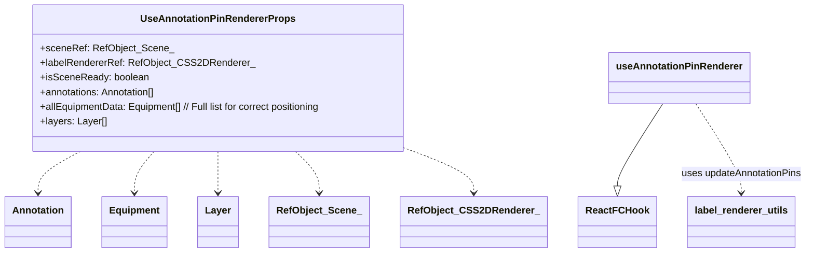

## useAnnotationPinRenderer

Hook customizado para gerenciar a renderização (criação, atualização, remoção)
dos pins de anotação (`CSS2DObject`) na cena.

### Parameters

*   `props` **[UseAnnotationPinRendererProps][225]** As props do hook.

    *   `props.sceneRef` &#x20;
    *   `props.labelRendererRef` &#x20;
    *   `props.isSceneReady` &#x20;
    *   `props.annotations` &#x20;
    *   `props.allEquipmentData` &#x20;
    *   `props.layers` &#x20;

Returns **void**&#x20;

## hooks/useCameraManager

*   **See**: [/docs/lib/types.md#CameraState][429] Para a interface do estado da câmera.
*   **See**: [/docs/lib/types.md#Command][430] Para a interface de comando (usada com `executeCommand`).
*   **See**: [/docs/lib/types.md#TargetSystemInfo][431] Para a interface de informações do sistema alvo.

Hook customizado para gerenciar o estado e as interações da câmera 3D.

Este hook é responsável por:

*   Manter o estado atual da câmera (posição e ponto de observação - `lookAt`).
*   Gerenciar a lógica para focar a câmera em sistemas específicos de equipamentos,
    incluindo a ciclagem entre diferentes visualizações (padrão, de cima, isométrica) para o mesmo sistema.
*   Integrar os movimentos de câmera (tanto os iniciados pelo usuário via `OrbitControls`
    quanto os programáticos como o foco em sistema) com o sistema de histórico de comandos,
    permitindo operações de Undo/Redo.
*   Expor o estado da câmera e funções para interagir com ela e responder a eventos.

O estado da câmera (`currentCameraState`) é um estado React, garantindo que as atualizações
sejam propagadas para os componentes que o utilizam (e.g., `ThreeScene` para aplicar
o estado à câmera Three.js).

### Parameters

*   `props`  Propriedades para o hook, incluindo `executeCommand` para integração com histórico.

### Examples

```javascript
// Diagrama de Interação e Estado do useCameraManager
// mermaid
// graph LR
//     A[Terminal3DPage] -- chama --> B(handleSetCameraViewForSystem)
//     B -- atualiza --> C{targetSystemToFrame};
//     C -- atualiza --> D{focusedSystemNameUI};
//     C -- atualiza --> E{currentViewIndexUI};
//     A -- passa targetSystemToFrame --> F[ThreeScene]
//
//     F -- anima câmera e ao final chama --> G(onSystemFramed)
//     G -- limpa --> C;
//     F -- em interações manuais, chama --> H(handleCameraChangeFromScene)
//
//     H -- cria comando --> I{Comando}
//     H -- chama --> J(executeCommand)
//     J -- executa e salva --> I
//
//     subgraph useCameraManager [Hook useCameraManager]
//         direction LR
//         B
//         G
//         H
//         C
//         D
//         E
//         K[currentCameraState (Estado React)]
//         L[lastCommittedCameraStateForUndoRef (Ref)]
//     end
//
//     I -- no execute/undo --> M{setCurrentCameraState}
//     M -- atualiza --> K
//     K -- usado por --> F
//
//    classDef hook fill:#lightblue,stroke:#333,stroke-width:2px;
//    classDef state fill:#lightgoldenrodyellow,stroke:#333,stroke-width:2px;
//    classDef func fill:#lightgreen,stroke:#333,stroke-width:2px;
//    classDef comp fill:#lightcoral,stroke:#333,stroke-width:2px;
//
//    class A,F comp;
//    class B,G,H,J,M func;
//    class C,D,E,K,L,I state;
//    class useCameraManager hook;
```

Returns **any** Objeto contendo o estado da câmera, informações de foco, e funções para interagir com a câmera.

## defaultInitialCameraPosition

Posição inicial padrão da câmera: { x: 25, y: 20, z: 25 }.

## defaultInitialCameraPosition

Posição inicial padrão da câmera: { x: 25, y: 20, z: 25 }.

## defaultInitialCameraLookAt

Ponto de observação (lookAt) inicial padrão da câmera: { x: 0, y: 2, z: 0 }.

## defaultInitialCameraLookAt

Ponto de observação (lookAt) inicial padrão da câmera: { x: 0, y: 2, z: 0 }.

## UseCameraManagerProps

Props para o hook `useCameraManager`.

## UseCameraManagerProps

Props para o hook `useCameraManager`.

## UseCameraManagerReturn

Retorno do hook `useCameraManager`.

### Properties

*   `currentCameraState` **[CameraState][385]** O estado atual da câmera (posição e ponto de observação).
*   `targetSystemToFrame` **([TargetSystemInfo][389] | null)** O sistema alvo e o índice da visão para a câmera enquadrar. Null se nenhum foco ativo.
*   `focusedSystemNameUI` **([string][404] | null)** O nome do sistema atualmente focado (para UI, pode persistir mesmo após `targetSystemToFrame` ser limpo).
*   `currentViewIndexUI` **[number][418]** O índice da visão atual para o sistema focado (para UI).

## UseCameraManagerReturn

Retorno do hook `useCameraManager`.

### Properties

*   `currentCameraState` **[CameraState][385]** O estado atual da câmera (posição e ponto de observação).
*   `targetSystemToFrame` **([TargetSystemInfo][389] | null)** O sistema alvo e o índice da visão para a câmera enquadrar. Null se nenhum foco ativo.
*   `focusedSystemNameUI` **([string][404] | null)** O nome do sistema atualmente focado (para UI, pode persistir mesmo após `targetSystemToFrame` ser limpo).
*   `currentViewIndexUI` **[number][418]** O índice da visão atual para o sistema focado (para UI).

## useCameraManager

Hook customizado para gerenciar o estado e as interações da câmera 3D.
Responsável pelo estado da câmera, foco em sistemas e integração com o histórico de comandos.

### Parameters

*   `props` **[UseCameraManagerProps][235]** As props do hook, incluindo `executeCommand` para integração com o histórico.

    *   `props.executeCommand` &#x20;

Returns **[UseCameraManagerReturn][237]** Um objeto contendo o estado da câmera e funções para interagir com ela.

## useCameraManager

Hook customizado para gerenciar o estado e as interações da câmera 3D.
Responsável pelo estado da câmera, foco em sistemas e integração com o histórico de comandos.

### Parameters

*   `props` **[UseCameraManagerProps][235]** As props do hook, incluindo `executeCommand` para integração com o histórico.

    *   `props.executeCommand` &#x20;

Returns **[UseCameraManagerReturn][237]** Um objeto contendo o estado da câmera e funções para interagir com ela.

## handleSetCameraViewForSystem

Define o sistema alvo e o índice da visão para a câmera enquadrar.
Se o mesmo sistema é clicado repetidamente, cicla entre as visualizações disponíveis.

### Parameters

*   `systemName` **[string][404]** O nome do sistema para focar.

## handleSetCameraViewForSystem

Define o sistema alvo e o índice da visão para a câmera enquadrar.
Se o mesmo sistema é clicado repetidamente, cicla entre as visualizações disponíveis.

### Parameters

*   `systemName` **[string][404]** O nome do sistema para focar.

## handleCameraChangeFromScene

Manipula mudanças de câmera provenientes da cena 3D (e.g., interações do usuário com OrbitControls)
ou de animações programáticas concluídas. Registra a mudança no histórico de comandos.

### Parameters

*   `newSceneCameraState` **[CameraState][385]** O novo estado da câmera.
*   `actionDescription` **[string][404]?** Descrição opcional da ação para o histórico (e.g., "Foco no sistema X").

## handleCameraChangeFromScene

Manipula mudanças de câmera provenientes da cena 3D (e.g., interações do usuário com OrbitControls)
ou de animações programáticas concluídas. Registra a mudança no histórico de comandos.

### Parameters

*   `newSceneCameraState` **[CameraState][385]** O novo estado da câmera.
*   `actionDescription` **[string][404]?** Descrição opcional da ação para o histórico (e.g., "Foco no sistema X").

## onSystemFramed

Callback para ser chamado pela `ThreeScene` após o enquadramento do sistema ser concluído.
Reseta `targetSystemToFrame`, indicando que o processo de foco foi finalizado.

## onSystemFramed

Callback para ser chamado pela `ThreeScene` após o enquadramento do sistema ser concluído.
Reseta `targetSystemToFrame`, indicando que o processo de foco foi finalizado.

## Command

Custom hook que fornece funcionalidade para gerenciar um histórico de comandos,
permitindo operações de desfazer (undo) e refazer (redo).

Principal Responsabilidade:
Manter uma pilha de comandos executados, permitir a execução de novos comandos,
e fornecer a capacidade de navegar para frente (redo) e para trás (undo)
nesse histórico, chamando as funções `execute()` e `undo()` dos respectivos comandos.

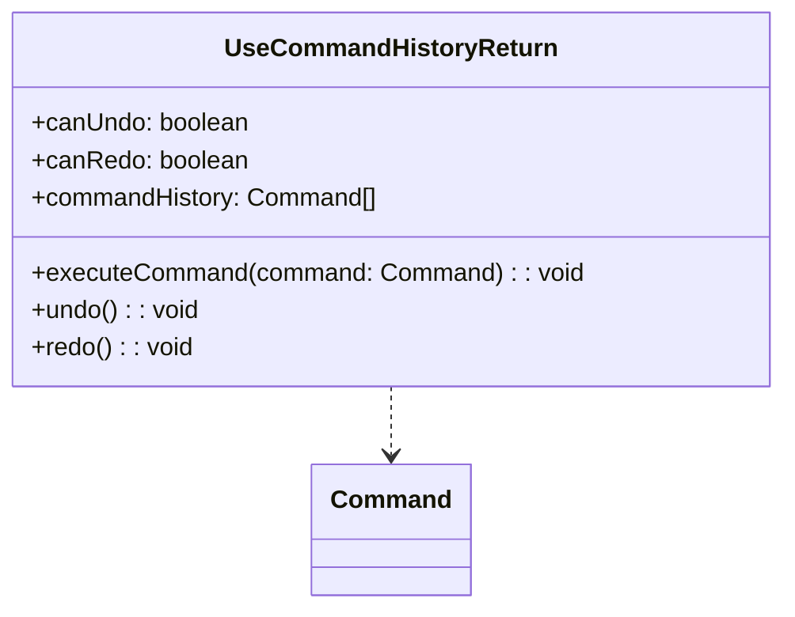

## Command

Representa um comando executável e reversível para o sistema de Undo/Redo.
Cada ação do usuário que pode ser desfeita (e.g., mover a câmera, alternar visibilidade de camada,
selecionar equipamento) deve ser encapsulada como um `Command`.

### Properties

*   `id` **[string][404]** Identificador único do comando, geralmente incluindo um timestamp para unicidade.
*   `type` **(`"CAMERA_MOVE"` | `"LAYER_VISIBILITY"` | `"EQUIPMENT_SELECT"`)** Tipo do comando, para categorização.
*   `description` **[string][404]** Descrição textual do comando, usada para logging ou exibição na UI (e.g., em toasts de undo/redo).

## CommandHistoryState

Interface para o estado interno do histórico de comandos.

### Properties

*   `history` **[Array][406]<[Command][255]>** Array de objetos de comando que foram executados.
*   `currentIndex` **[number][418]** Índice do comando atual no array `history`.
    -1 se o histórico estiver vazio ou todos os comandos foram desfeitos.

## UseCommandHistoryReturn

Retorno do hook `useCommandHistory`.

### Properties

*   `canUndo` **[boolean][405]** Verdadeiro se há comandos para desfazer, falso caso contrário.
*   `canRedo` **[boolean][405]** Verdadeiro se há comandos para refazer, falso caso contrário.
*   `commandHistory` **[Array][406]<[Command][255]>** O array completo do histórico de comandos, principalmente para depuração.

## useCommandHistory

Hook customizado para gerenciar um histórico de comandos, permitindo Undo e Redo.
Armazena uma lista de comandos e o índice atual, permitindo navegar para frente e para trás
através das ações do usuário que foram encapsuladas como comandos.

### Parameters

*   `initialState` **[CommandHistoryState][258]?** Estado inicial opcional para o histórico.
    Padrão: histórico vazio (`history: []`) e `currentIndex: -1`.

Returns **[UseCommandHistoryReturn][260]** Um objeto com funções para executar, desfazer, refazer comandos,
e flags indicando se undo/redo são possíveis, além do próprio histórico.

## executeCommand

Executa um comando e o adiciona ao histórico.
Se houver comandos "futuros" (comandos que foram desfeitos e poderiam ser refeitos),
eles são descartados, pois uma nova ação invalida essa linha do tempo de redo.

### Parameters

*   `command` **[Command][255]** O comando a ser executado. A função `command.execute()` é chamada.

## undo

Desfaz o último comando executado (o comando no `currentIndex`).
Se não houver comandos para desfazer (`currentIndex < 0`), não faz nada.
Chama a função `undo()` do comando.

## redo

Refaz o último comando desfeito (o comando após o `currentIndex`).
Se não houver comandos para refazer (`currentIndex` já é o último do histórico), não faz nada.
Chama a função `execute()` do comando a ser refeito.

## hooks/useEquipmentDataManager

*   **See**: [/docs/core/repository/memory-repository.md#equipmentRepository][426] Para a fonte de dados.
*   **See**: [/docs/lib/types.md#Equipment][428] Para a interface de Equipamento.

Hook customizado para gerenciar os dados dos equipamentos, atuando como uma fachada para o repositório em memória.

Este hook é responsável por:

*   Obter e manter uma cópia local (estado React) dos dados de todos os equipamentos
    a partir do `equipmentRepository`.
*   Fornecer funções para modificar propriedades específicas dos equipamentos, como
    estado operacional e produto. Essas modificações são persistidas no `equipmentRepository`.
*   Após cada modificação no repositório, o estado local do hook é atualizado para
    refletir os dados mais recentes, garantindo a reatividade da UI.
*   Utilizar `useToast` para fornecer feedback visual ao usuário sobre as operações.

### Examples

```javascript
// Diagrama de Interação do useEquipmentDataManager
// mermaid
// graph TD
//     A[Componente UI (ex: InfoPanel)] -- chama --> B(handleOperationalStateChange)
//
//     subgraph useEquipmentDataManager [Hook useEquipmentDataManager]
//         direction LR
//         B -- chama --> C[equipmentRepository.updateEquipment]
//         C -- retorna --> B{Equipamento Atualizado}
//         B -- chama --> D[equipmentRepository.getAllEquipment]
//         D -- retorna --> E[setEquipmentData (Estado React)]
//         E -- atualiza --> F[equipmentData (Estado React)]
//         B -- chama --> G[toast]
//     end
//
//     F -- usado por --> A
//
//    classDef hook fill:#lightblue,stroke:#333,stroke-width:2px;
//    classDef state fill:#lightgoldenrodyellow,stroke:#333,stroke-width:2px;
//    classDef func fill:#lightgreen,stroke:#333,stroke-width:2px;
//    classDef repo fill:#lightcoral,stroke:#333,stroke-width:2px;
//    classDef ui fill:#peachpuff,stroke:#333,stroke-width:2px;
//
//    class A ui;
//    class B,G func;
//    class C,D repo;
//    class E,F state;
//    class useEquipmentDataManager hook;
```

Returns **any** Objeto contendo os dados dos equipamentos e funções para modificá-los e atualizá-los.

## UseEquipmentDataManagerReturn

Retorno do hook `useEquipmentDataManager`.

### Properties

*   `equipmentData` **[Array][406]<[Equipment][30]>** A lista atual de todos os equipamentos (cópia local do estado do repositório).

## UseEquipmentDataManagerReturn

Retorno do hook `useEquipmentDataManager`.

### Properties

*   `equipmentData` **[Array][406]<[Equipment][30]>** A lista atual de todos os equipamentos (cópia local do estado do repositório).

## useEquipmentDataManager

Hook customizado para gerenciar os dados dos equipamentos, atuando como uma fachada para o `equipmentRepository`.
Inicializa os dados do repositório e fornece funções para modificar
propriedades como estado operacional e produto, com feedback via toast.

Returns **[UseEquipmentDataManagerReturn][270]** Um objeto contendo os dados dos equipamentos
e funções para modificá-los.

## useEquipmentDataManager

Hook customizado para gerenciar os dados dos equipamentos, atuando como uma fachada para o `equipmentRepository`.
Inicializa os dados do repositório e fornece funções para modificar
propriedades como estado operacional e produto, com feedback via toast.

Returns **[UseEquipmentDataManagerReturn][270]** Um objeto contendo os dados dos equipamentos
e funções para modificá-los.

## refreshEquipmentData

Recarrega os dados dos equipamentos do repositório para o estado local do hook.

## refreshEquipmentData

Recarrega os dados dos equipamentos do repositório para o estado local do hook.

## handleOperationalStateChange

Manipula a alteração do estado operacional de um equipamento.
Atualiza o repositório e, em seguida, o estado local do hook.

### Parameters

*   `equipmentTag` **[string][404]** A tag do equipamento a ser modificado.
*   `newState` **[string][404]** O novo estado operacional para o equipamento.

## handleOperationalStateChange

Manipula a alteração do estado operacional de um equipamento.
Atualiza o repositório e, em seguida, o estado local do hook.

### Parameters

*   `equipmentTag` **[string][404]** A tag do equipamento a ser modificado.
*   `newState` **[string][404]** O novo estado operacional para o equipamento.

## handleProductChange

Manipula a alteração do produto de um equipamento.
Atualiza o repositório e, em seguida, o estado local do hook.

### Parameters

*   `equipmentTag` **[string][404]** A tag do equipamento a ser modificado.
*   `newProduct` **[string][404]** O novo produto para o equipamento.

## handleProductChange

Manipula a alteração do produto de um equipamento.
Atualiza o repositório e, em seguida, o estado local do hook.

### Parameters

*   `equipmentTag` **[string][404]** A tag do equipamento a ser modificado.
*   `newProduct` **[string][404]** O novo produto para o equipamento.

## UseEquipmentRendererProps

Custom hook to manage the rendering of equipment meshes in the 3D scene.

Principal Responsabilidade:
Encapsular a lógica de criação, atualização e remoção dos meshes 3D que representam
os equipamentos. Observa mudanças nos dados dos equipamentos (filtrados), camadas de visibilidade
e modo de colorização, e atualiza a cena Three.js de acordo.
Utiliza `updateEquipmentMeshesInScene` de `scene-elements-setup.ts` para a lógica de sincronização
dos meshes e do plano de chão com base na visibilidade das camadas.

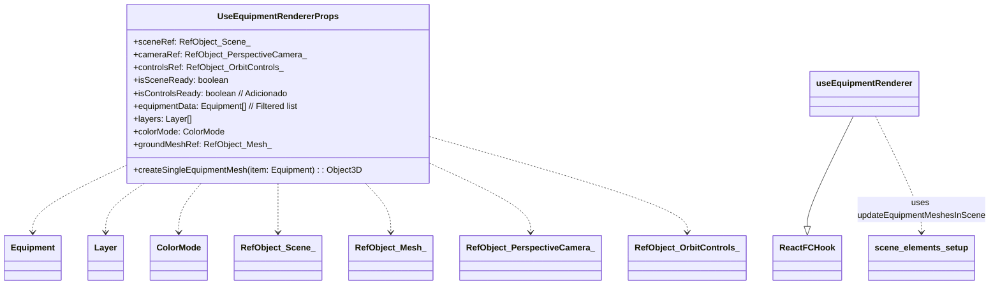

## useEquipmentRenderer

Hook customizado para gerenciar a renderização (criação, atualização, remoção)
dos meshes de equipamentos na cena Three.js.

### Parameters

*   `props` **[UseEquipmentRendererProps][286]** As props do hook.

    *   `props.sceneRef` &#x20;
    *   `props.cameraRef` &#x20;
    *   `props.controlsRef` &#x20;
    *   `props.isSceneReady` &#x20;
    *   `props.isControlsReady` &#x20;
    *   `props.equipmentData` &#x20;
    *   `props.layers` &#x20;
    *   `props.colorMode` &#x20;
    *   `props.createSingleEquipmentMesh` &#x20;
    *   `props.groundMeshRef` &#x20;

Returns **React.RefObject<[Array][406]\<THREE.Object3D>>** Ref para a lista de meshes de equipamentos atualmente na cena.
Este ref é gerenciado internamente pelo hook mas retornado para que outros hooks
(e.g., para raycasting) possam acessá-lo.

##

Custom hook para gerenciar o estado e a lógica de seleção e hover de equipamentos na cena 3D.

Principal Responsabilidade:
Manter o estado dos equipamentos selecionados e em hover, e fornecer funções para
manipular essas seleções (clique único, clique múltiplo, seleção em lote).
Integra-se com `useCommandHistory` para registrar ações de seleção e `useToast` para feedback.


## UseEquipmentSelectionManagerProps

Props para o hook `useEquipmentSelectionManager`.

### Properties

*   `equipmentData` **[Array][406]<[Equipment][30]>** Lista completa de todos os equipamentos. Usada para buscar nomes
    de equipamentos para mensagens de feedback (toasts).

## UseEquipmentSelectionManagerReturn

Retorno do hook `useEquipmentSelectionManager`.

### Properties

*   `selectedEquipmentTags` **[Array][406]<[string][404]>** Array das tags dos equipamentos atualmente selecionados.
*   `hoveredEquipmentTag` **([string][404] | null)** Tag do equipamento atualmente sob o cursor do mouse, ou null.

## useEquipmentSelectionManager

Hook customizado para gerenciar a seleção e o estado de hover dos equipamentos.
Encapsula a lógica de seleção única/múltipla, hover, seleção em lote e integração com o histórico de comandos.

### Parameters

*   `props` **[UseEquipmentSelectionManagerProps][290]** As props do hook.

    *   `props.equipmentData` &#x20;
    *   `props.executeCommand` &#x20;

Returns **[UseEquipmentSelectionManagerReturn][292]** O estado da seleção e as funções para manipulá-la.

## handleEquipmentClick

Manipula o clique em um equipamento na cena 3D para seleção.
Gerencia seleção única, múltipla (com Ctrl/Cmd) e deseleção.
Cria e executa um comando para o histórico de Undo/Redo.

### Parameters

*   `tag` **([string][404] | null)** A tag do equipamento clicado, ou null se o clique foi em espaço vazio.
*   `isMultiSelectModifierPressed` **[boolean][405]** True se Ctrl/Cmd (ou Meta) foi pressionado durante o clique.

## handleSetHoveredEquipmentTag

Define diretamente a tag do equipamento sob o cursor.
Esta função é geralmente chamada em resposta a eventos de mousemove na cena 3D.

### Parameters

*   `tag` **([string][404] | null)** A tag do equipamento, ou null se nenhum estiver sob o cursor.

## selectTagsBatch

Seleciona programaticamente um conjunto de tags de equipamento.
Usado, por exemplo, ao focar em um sistema para selecionar todos os seus equipamentos.
Cria e executa um comando para o histórico de Undo/Redo.

### Parameters

*   `tagsToSelect` **[Array][406]<[string][404]>** Array de tags de equipamento a serem selecionadas.
*   `operationDescription` **[string][404]?** Descrição opcional para o comando no histórico (e para o toast).
    Padrão: "Selecionados X equipamentos em lote."

##

Custom hook para gerenciar os estados de filtragem e a lógica de filtragem de equipamentos.

Principal Responsabilidade:
Manter os critérios de filtro (termo de busca, sistema, área), derivar listas
de opções de filtro disponíveis (sistemas, áreas) e calcular a lista de
equipamentos que correspondem aos filtros atuais, utilizando `getFilteredEquipment`.

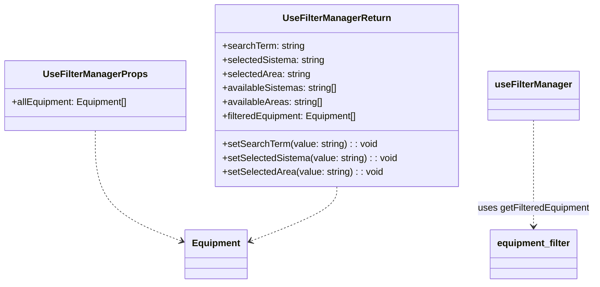

## UseFilterManagerProps

Props para o hook `useFilterManager`.

### Properties

*   `allEquipment` **[Array][406]<[Equipment][30]>** A lista completa de todos os equipamentos que podem ser filtrados.

## UseFilterManagerReturn

Retorno do hook `useFilterManager`.

### Properties

*   `searchTerm` **[string][404]** O termo de busca textual atualmente aplicado.
*   `setSearchTerm` **Dispatch\<SetStateAction<[string][404]>>** Função para atualizar o `searchTerm`.
*   `selectedSistema` **[string][404]** O sistema atualmente selecionado para filtro (e.g., "GA", "All").
*   `setSelectedSistema` **Dispatch\<SetStateAction<[string][404]>>** Função para atualizar o `selectedSistema`.
*   `selectedArea` **[string][404]** A área atualmente selecionada para filtro (e.g., "Área 31", "All").
*   `setSelectedArea` **Dispatch\<SetStateAction<[string][404]>>** Função para atualizar o `selectedArea`.
*   `availableSistemas` **[Array][406]<[string][404]>** Lista ordenada de sistemas únicos disponíveis para seleção no filtro, incluindo "All".
*   `availableAreas` **[Array][406]<[string][404]>** Lista ordenada de áreas únicas disponíveis para seleção no filtro, incluindo "All".
*   `filteredEquipment` **[Array][406]<[Equipment][30]>** A lista de equipamentos resultante após a aplicação de todos os filtros ativos.

## useFilterManager

Hook customizado para gerenciar a lógica de filtragem de equipamentos.
Encapsula os estados dos filtros (termo de busca, sistema, área),
deriva as listas de opções de filtro disponíveis a partir dos dados dos equipamentos,
e calcula a lista resultante de equipamentos filtrados.

### Parameters

*   `props` **[UseFilterManagerProps][303]** As propriedades para o hook, incluindo `allEquipment` (a lista completa de equipamentos).

    *   `props.allEquipment` &#x20;

Returns **[UseFilterManagerReturn][305]** Um objeto contendo o estado dos filtros, as funções para atualizá-los,
as listas de opções de filtro disponíveis e a lista de equipamentos filtrados.

## availableSistemas

Lista de sistemas únicos disponíveis, derivada de `allEquipment`.
Inclui "All" como a primeira opção e é ordenada alfabeticamente.
Memoizada para otimizar performance, recalculando apenas se `allEquipment` mudar.

## availableAreas

Lista de áreas únicas disponíveis, derivada de `allEquipment`.
Inclui "All" como a primeira opção e é ordenada alfabeticamente.
Memoizada para otimizar performance.

## filteredEquipment

Lista de equipamentos filtrada com base nos critérios atuais (`searchTerm`, `selectedSistema`, `selectedArea`).
Utiliza a função `getFilteredEquipment` para aplicar a lógica de filtragem combinada.
Memoizada para recalcular apenas quando os critérios de filtro ou `allEquipment` mudarem.

##

Custom hook para gerenciar o estado das camadas (layers) de visibilidade na cena 3D
e a lógica para alternar sua visibilidade.

Principal Responsabilidade:
Manter o estado da lista de camadas (com seu ID, nome, tipo de equipamento que controla e visibilidade)
e fornecer uma função para alternar a visibilidade de uma camada específica.
Esta ação de alternância é integrada com o sistema de histórico de comandos (`useCommandHistory`)
para permitir undo/redo.

```mermaid
  classDiagram
    class UseLayerManagerProps {
      +executeCommand(command: Command): void
    }
    class UseLayerManagerReturn {
      +layers: Layer[]
      +handleToggleLayer(layerId: string): void
    }
    class Command {

    }
    class Layer {

    }
    UseLayerManagerProps ..> Command
    UseLayerManagerReturn ..> Layer
    class useLayerManager {

    }
    useLayerManager ..> Command : uses (via executeCommand)
```

## UseLayerManagerProps

Props para o hook `useLayerManager`.

## UseLayerManagerReturn

Retorno do hook `useLayerManager`.

### Properties

*   `layers` **[Array][406]<[Layer][383]>** A lista atual de todas as camadas e seus respectivos estados de visibilidade.

## useLayerManager

Hook customizado para gerenciar o estado das camadas de visibilidade da cena e sua manipulação.
Inicializa as camadas com os dados de `initialLayers` e permite alternar a visibilidade
de cada camada, registrando a ação no histórico de comandos para suportar undo/redo.

### Parameters

*   `props` **[UseLayerManagerProps][313]** As props do hook, principalmente `executeCommand` para
    integração com o sistema de histórico.

    *   `props.executeCommand` &#x20;

Returns **[UseLayerManagerReturn][314]** Um objeto contendo o estado atual das camadas e a função
para alternar sua visibilidade.

## handleToggleLayer

Manipula a alternância de visibilidade de uma camada específica.
Encontra a camada pelo `layerId`, cria um novo estado de camadas com a visibilidade
da camada alvo invertida, e então cria e executa um comando para o histórico de Undo/Redo
que aplicará essa mudança (e permitirá revertê-la).

### Parameters

*   `layerId` **[string][404]** O ID da camada cuja visibilidade deve ser alternada.

## raycaster

Custom hook para gerenciar interações do mouse (clique e movimento)
com objetos 3D em uma cena Three.js, especificamente para seleção e hover de equipamentos.
Anteriormente parte de `core/three/mouse-interaction-manager.ts`, agora encapsulado como hook.

Principal Responsabilidade:
Encapsular a lógica de raycasting para detectar interseções do mouse com meshes de
equipamentos. Dispara callbacks fornecidos (`onSelectEquipment`, `setHoveredEquipmentTag`)
com base nessas interações. Adiciona e remove os ouvintes de eventos de mouse
do elemento de montagem da cena.

```mermaid
  classDiagram
    class UseMouseInteractionManagerProps {
      +mountRef: RefObject_HTMLDivElement_
      +cameraRef: RefObject_PerspectiveCamera_
      +equipmentMeshesRef: RefObject_Object3D_Array_
      +isSceneReady: boolean
      +onSelectEquipment(tag: string | null, isMultiSelect: boolean): void
      +setHoveredEquipmentTag(tag: string | null): void
    }
    class useMouseInteractionManager {

    }
    class ReactFCHook {

    }
    class RefObject_HTMLDivElement_ {

    }
    class RefObject_PerspectiveCamera_ {

    }
    class RefObject_Object3D_Array_ {

    }
    useMouseInteractionManager --|> ReactFCHook
    UseMouseInteractionManagerProps ..> RefObject_HTMLDivElement_
    UseMouseInteractionManagerProps ..> RefObject_PerspectiveCamera_
    UseMouseInteractionManagerProps ..> RefObject_Object3D_Array_
```

## useMouseInteractionManager

Hook customizado para gerenciar interações do mouse (clique e movimento)
para seleção e hover de equipamentos em uma cena Three.js.

### Parameters

*   `props` **UseMouseInteractionManagerProps** As props do hook.

    *   `props.mountRef` &#x20;
    *   `props.cameraRef` &#x20;
    *   `props.equipmentMeshesRef` &#x20;
    *   `props.isSceneReady` &#x20;
    *   `props.onSelectEquipment` &#x20;
    *   `props.setHoveredEquipmentTag` &#x20;

Returns **void**&#x20;

## processSceneClickInternal

Processa um evento de clique do mouse na cena para selecionar equipamento.

## processSceneMouseMoveInternal

Processa um evento de movimento do mouse na cena para detectar equipamento em hover.

##

Custom hook para gerenciar o efeito de contorno (OutlinePass) na cena 3D.

Principal Responsabilidade:
Observar mudanças nos equipamentos selecionados (`selectedEquipmentTags`) e no equipamento
em hover (`hoveredEquipmentTag`), e atualizar o `OutlinePass` para destacar visualmente
os objetos 3D correspondentes na cena. Utiliza `updateOutlineEffect` de
`postprocessing-utils.ts` para aplicar os estilos de contorno corretos.
O efeito só é aplicado quando a cena (`isSceneReady`) e os refs necessários estão prontos.

```mermaid
  classDiagram
    class UseSceneOutlineProps {
      +outlinePassRef: RefObject_OutlinePass_
      +equipmentMeshesRef: RefObject_Object3D_Array_
      +selectedEquipmentTags: string[] | undefined
      +hoveredEquipmentTag: string | null | undefined
      +isSceneReady: boolean
    }
    class RefObject_OutlinePass_ {
      current: OutlinePass | null
    }
    class RefObject_Object3D_Array_ {
      current: THREE.Object3D[] | null
    }
    class useSceneOutline {

    }
    class postprocessing_utils {

    }
    useSceneOutline ..> postprocessing_utils : uses updateOutlineEffect
    UseSceneOutlineProps --> RefObject_OutlinePass_
    UseSceneOutlineProps --> RefObject_Object3D_Array_
```

## UseSceneOutlineProps

Props para o hook useSceneOutline.

### Properties

*   `outlinePassRef` **React.RefObject<(OutlinePass | null)>** Ref para a instância do OutlinePass.
*   `equipmentMeshesRef` **React.RefObject<[Array][406]\<THREE.Object3D>>** Ref para o array de meshes de equipamentos na cena.
*   `selectedEquipmentTags` **([Array][406]<[string][404]> | [undefined][407])** Array de tags dos equipamentos selecionados.
*   `hoveredEquipmentTag` **([string][404] | null | [undefined][407])** Tag do equipamento atualmente em hover.
*   `isSceneReady` **[boolean][405]** Flag indicando se a cena 3D está pronta.

## useSceneOutline

Hook customizado para gerenciar e aplicar o efeito de contorno (OutlinePass)
aos equipamentos selecionados ou em hover na cena 3D.

### Parameters

*   `props` **[UseSceneOutlineProps][326]** As props para o hook.

    *   `props.outlinePassRef` &#x20;
    *   `props.equipmentMeshesRef` &#x20;
    *   `props.selectedEquipmentTags` &#x20;
    *   `props.hoveredEquipmentTag` &#x20;
    *   `props.isSceneReady` &#x20;

Returns **void**&#x20;

## UseSceneSetupProps

Props para o hook orquestrador da configuração da cena.

### Properties

*   `mountRef` **React.RefObject<[HTMLDivElement][432]>** Ref para o elemento DOM contêiner da cena.

## UseSceneSetupReturn

Valor de retorno do hook orquestrador da configuração da cena.
Agrega refs e flags de prontidão dos hooks especializados.

### Properties

*   `sceneRef` **React.RefObject<(THREE.Scene | null)>** Ref para a cena Three.js.
*   `cameraRef` **React.RefObject<(THREE.PerspectiveCamera | null)>** Ref para a câmera perspectiva.
*   `rendererRef` **React.RefObject<(THREE.WebGLRenderer | null)>** Ref para o renderizador WebGL.
*   `labelRendererRef` **React.RefObject<(CSS2DRenderer | null)>** Ref para o renderizador CSS2D (para rótulos).
*   `controlsRef` **React.RefObject<(OrbitControlsType | null)>** Ref para os OrbitControls.
*   `composerRef` **React.RefObject<(EffectComposer | null)>** Ref para o EffectComposer (pós-processamento).
*   `outlinePassRef` **React.RefObject<(OutlinePass | null)>** Ref para o OutlinePass (efeito de contorno).
*   `groundMeshRef` **React.RefObject<(THREE.Mesh | null)>** Ref para a malha do plano de chão.
*   `isSceneReady` **[boolean][405]** Flag que indica se os componentes principais da cena (núcleo, renderizadores, elementos) estão prontos.
*   `isControlsReady` **[boolean][405]** Flag que indica se os OrbitControls estão prontos (carregamento dinâmico).

## useSceneSetup

Orquestra a configuração de uma cena Three.js compondo hooks especializados.
Este hook é responsável por inicializar o núcleo da cena, renderizadores, controles,
elementos básicos da cena (iluminação, chão) e manipulação de redimensionamento.
Ele fornece refs para todos os principais componentes Three.js e flags indicando sua prontidão.

### Parameters

*   `props` **[UseSceneSetupProps][330]** Propriedades de configuração para a montagem da cena.

Returns **[UseSceneSetupReturn][332]** Refs para os componentes da cena e flags de prontidão.

##

*   **See**: [../../core/repository/memory-repository/README.md#annotationRepository][433] Para a fonte de dados das anotações.
*   **See**: [../../core/repository/memory-repository/README.md#equipmentRepository][434] Para obter dados de equipamentos (e.g., nome para toasts).
*   **See**: [../../lib/types/README.md#Annotation][417] Para a interface de Anotação.
*   **See**: [../../lib/types/README.md#Equipment][416] Para a interface de Equipamento.

### Parameters

*   `props`  Propriedades de configuração para o hook (atualmente, `initialAnnotations` é opcional e usado para uma potencial inicialização única do repositório, embora o repositório seja auto-inicializável).

### Examples

```javascript
// Diagrama de Interação do useAnnotationManager
// mermaid
// graph TD
//     A[Componente UI (ex: InfoPanel)] -- chama --> B(handleOpenAnnotationDialog)
//     B -- define estados --> DialogState["isAnnotationDialogOpen, editingAnnotation, annotationTargetEquipment"]
//
//     C[Componente UI (ex: AnnotationDialog)] -- no submit --> D(handleSaveAnnotation)
//
//     subgraph useAnnotationManager [Hook useAnnotationManager]
//         direction LR
//         D -- chama --> E[annotationRepository.addOrUpdateAnnotation]
//         E -- retorna --> D{Anotação Salva}
//         D -- chama --> F[refreshAnnotationsFromRepo]
//         F -- chama --> G[annotationRepository.getAllAnnotations]
//         G -- retorna --> H[setAnnotationsState (Estado React)]
//         H -- atualiza --> I[annotations (Estado React)]
//         D -- chama --> J[toast]
//         DialogState
//     end
//
//     I -- usado por --> A
//     DialogState -- usado por --> C
//
//    classDef hook fill:#lightblue,stroke:#333,stroke-width:2px;
//    classDef state fill:#lightgoldenrodyellow,stroke:#333,stroke-width:2px;
//    classDef func fill:#lightgreen,stroke:#333,stroke-width:2px;
//    classDef repo fill:#lightcoral,stroke:#333,stroke-width:2px;
//    classDef ui fill:#peachpuff,stroke:#333,stroke-width:2px;
//
//    class A,C ui;
//    class B,D,F,J func;
//    class E,G repo;
//    class DialogState,H,I state;
//    class useAnnotationManager hook;
```

Returns **any** Objeto contendo o estado das anotações, o estado do diálogo e funções para manipular anotações.

##

*   **See**: [../../lib/types/README.md#CameraState][435] Para a interface do estado da câmera.
*   **See**: [../../lib/types/README.md#Command][436] Para a interface de comando (usada com `executeCommand`).
*   **See**: [../../lib/types/README.md#TargetSystemInfo][437] Para a interface de informações do sistema alvo.

### Parameters

*   `props`  Propriedades para o hook, incluindo `executeCommand` para integração com histórico.

### Examples

```javascript
// Diagrama de Interação e Estado do useCameraManager
// mermaid
// graph LR
//     A[Terminal3DPage] -- chama --> B(handleSetCameraViewForSystem)
//     B -- atualiza --> C{targetSystemToFrame};
//     C -- atualiza --> D{focusedSystemNameUI};
//     C -- atualiza --> E{currentViewIndexUI};
//     A -- passa targetSystemToFrame --> F[ThreeScene]
//
//     F -- anima câmera e ao final chama --> G(onSystemFramed)
//     G -- limpa --> C;
//     F -- em interações manuais, chama --> H(handleCameraChangeFromScene)
//
//     H -- cria comando --> I{Comando}
//     H -- chama --> J(executeCommand)
//     J -- executa e salva --> I
//
//     subgraph useCameraManager [Hook useCameraManager]
//         direction LR
//         B
//         G
//         H
//         C
//         D
//         E
//         K[currentCameraState (Estado React)]
//         L[lastCommittedCameraStateForUndoRef (Ref)]
//     end
//
//     I -- no execute/undo --> M{setCurrentCameraState}
//     M -- atualiza --> K
//     K -- usado por --> F
//
//    classDef hook fill:#lightblue,stroke:#333,stroke-width:2px;
//    classDef state fill:#lightgoldenrodyellow,stroke:#333,stroke-width:2px;
//    classDef func fill:#lightgreen,stroke:#333,stroke-width:2px;
//    classDef comp fill:#lightcoral,stroke:#333,stroke-width:2px;
//
//    class A,F comp;
//    class B,G,H,J,M func;
//    class C,D,E,K,L,I state;
//    class useCameraManager hook;
```

Returns **any** Objeto contendo o estado da câmera, informações de foco, e funções para interagir com a câmera.

##

*   **See**: [../../core/repository/memory-repository/README.md#equipmentRepository][434] Para a fonte de dados.
*   **See**: [../../lib/types/README.md#Equipment][416] Para a interface de Equipamento.

### Examples

```javascript
// Diagrama de Interação do useEquipmentDataManager
// mermaid
// graph TD
//     A[Componente UI (ex: InfoPanel)] -- chama --> B(handleOperationalStateChange)
//
//     subgraph useEquipmentDataManager [Hook useEquipmentDataManager]
//         direction LR
//         B -- chama --> C[equipmentRepository.updateEquipment]
//         C -- retorna --> B{Equipamento Atualizado}
//         B -- chama --> D[equipmentRepository.getAllEquipment]
//         D -- retorna --> E[setEquipmentData (Estado React)]
//         E -- atualiza --> F[equipmentData (Estado React)]
//         B -- chama --> G[toast]
//     end
//
//     F -- usado por --> A
//
//    classDef hook fill:#lightblue,stroke:#333,stroke-width:2px;
//    classDef state fill:#lightgoldenrodyellow,stroke:#333,stroke-width:2px;
//    classDef func fill:#lightgreen,stroke:#333,stroke-width:2px;
//    classDef repo fill:#lightcoral,stroke:#333,stroke-width:2px;
//    classDef ui fill:#peachpuff,stroke:#333,stroke-width:2px;
//
//    class A ui;
//    class B,G func;
//    class C,D repo;
//    class E,F state;
//    class useEquipmentDataManager hook;
```

Returns **any** Objeto contendo os dados dos equipamentos e funções para modificá-los e atualizá-los.

## hooks/useThreeCore

Hook customizado para inicializar o núcleo de uma cena Three.js: a Cena (`THREE.Scene`) e a Câmera Perspectiva (`THREE.PerspectiveCamera`).

Este hook é responsável pela criação fundamental da cena e da câmera.
A câmera é configurada com uma posição inicial e uma razão de aspecto derivada
do elemento DOM onde a cena será montada.

### Examples

```javascript
// Diagrama de Responsabilidade do useThreeCore
// mermaid
// graph TD
//     useThreeCore["useThreeCore (Hook)"]
//     Props["UseThreeCoreProps"]
//     Return["UseThreeCoreReturn"]
//     Scene["THREE.Scene"]
//     Camera["THREE.PerspectiveCamera"]
//     MountElement["Elemento DOM (para aspect ratio)"]
//
//     Props --> useThreeCore
//     useThreeCore -- cria --> Scene
//     useThreeCore -- cria e configura com base em --> MountElement
//     useThreeCore -- cria e configura --> Camera
//     useThreeCore -- retorna refs para --> Return
//     Return -- contém ref para --> Scene
//     Return -- contém ref para --> Camera
//
//     Props -- define --> PInitialPos["initialCameraPosition"]
//     Props -- define --> PMountRef["mountRef"]
//
//     classDef hook fill:#lightblue,stroke:#333,stroke-width:2px;
//     classDef type fill:#lightgoldenrodyellow,stroke:#333,stroke-width:2px;
//     classDef obj3d fill:#lightgreen,stroke:#333,stroke-width:2px;
//     classDef dom fill:#lightcoral,stroke:#333,stroke-width:2px;
//
//     class useThreeCore hook;
//     class Props,Return,PInitialPos,PMountRef type;
//     class Scene,Camera obj3d;
//     class MountElement dom;
```

Returns **any** Refs para os objetos de cena e câmera criados.

## UseThreeCoreProps

Props para o hook `useThreeCore`.

### Properties

*   `mountRef` **React.RefObject<([HTMLDivElement][432] | null)>** Ref para o elemento DOM contêiner da cena,
    usado para calcular a razão de aspecto inicial da câmera.

## UseThreeCoreReturn

Valor de retorno do hook `useThreeCore`.

### Properties

*   `sceneRef` **React.RefObject<(THREE.Scene | null)>** Ref para o objeto `THREE.Scene` criado.
*   `cameraRef` **React.RefObject<(THREE.PerspectiveCamera | null)>** Ref para o objeto `THREE.PerspectiveCamera` criado.

## useThreeCore

Inicializa o núcleo da cena Three.js (cena e câmera perspectiva).

### Parameters

*   `props` **[UseThreeCoreProps][346]** Propriedades para a configuração do núcleo.

    *   `props.initialCameraPosition` &#x20;
    *   `props.mountRef` &#x20;

Returns **[UseThreeCoreReturn][348]** Refs para a cena e a câmera.

## hooks/useThreeOrbitControls

Hook customizado para configurar e gerenciar os `OrbitControls` do Three.js.

Este hook é responsável por:

*   Importar dinamicamente o módulo `OrbitControls` dos exemplos do Three.js.
*   Inicializar os `OrbitControls` com a câmera e o elemento DOM do renderizador fornecidos.
*   Configurar propriedades importantes dos controles, como `enableDamping` (para suavização),
    `target` (ponto inicial de observação) e o mapeamento dos botões do mouse (esquerdo/meio para rotação, direito para pan).
*   Adicionar um ouvinte de evento ao evento 'end' dos controles para disparar o callback `onCameraChange`
    quando o usuário finaliza uma interação com a câmera.
*   Gerenciar uma flag de estado `isControlsReady` que se torna `true` assim que os controles
    são carregados e inicializados com sucesso.
*   Lidar com a limpeza (dispose) dos controles e remoção do ouvinte de evento quando o componente
    é desmontado ou as dependências do hook mudam.

### Examples

```javascript
// Diagrama de Fluxo do useThreeOrbitControls
// mermaid
// sequenceDiagram
//     participant Usuário
//     participant ThreeScene as Componente React
//     participant useThreeOrbitControls as Hook
//     participant OrbitControls as Módulo Three.js
//
//     ThreeScene ->>+ useThreeOrbitControls: Chama com cameraRef, rendererRef, etc.
//     Note right of useThreeOrbitControls: renderersReady = true?
//     useThreeOrbitControls ->>+ OrbitControls: import('OrbitControls.js')
//     OrbitControls -->>- useThreeOrbitControls: Módulo carregado
//     useThreeOrbitControls -->> OrbitControls: new OrbitControls(camera, renderer.domElement)
//     useThreeOrbitControls -->> OrbitControls: Configura (enableDamping, target, mouseButtons)
//     useThreeOrbitControls -->> OrbitControls: addEventListener('end', handleEnd)
//     useThreeOrbitControls -->> ThreeScene: Retorna controlsRef, isControlsReady = true
//     activate Usuário
//     Usuário ->> OrbitControls: Interage com a câmera (arrasta mouse)
//     OrbitControls -->> OrbitControls: Atualiza posição/rotação da câmera
//     Usuário ->> OrbitControls: Solta o botão do mouse
//     deactivate Usuário
//     OrbitControls -->> useThreeOrbitControls: Dispara evento 'end'
//     useThreeOrbitControls ->> ThreeScene: Chama onCameraChange(novoEstado)
//     Note right of ThreeScene: Atualiza estado da câmera da aplicação
```

Returns **any** Ref para a instância de `OrbitControls` e uma flag indicando sua prontidão.

## UseThreeOrbitControlsProps

Props para o hook `useThreeOrbitControls`.

### Properties

*   `cameraRef` **React.RefObject<(THREE.PerspectiveCamera | null)>** Ref para a câmera perspectiva.
*   `rendererRef` **React.RefObject<(THREE.WebGLRenderer | null)>** Ref para o renderizador WebGL (necessário para o `domElement`).
*   `renderersReady` **[boolean][405]** Flag que indica se os renderizadores (especialmente o `domElement` do WebGLRenderer) estão prontos.

## UseThreeOrbitControlsReturn

Valor de retorno do hook `useThreeOrbitControls`.

### Properties

*   `controlsRef` **React.RefObject<(OrbitControlsType | null)>** Ref para a instância de `OrbitControls`.
*   `isControlsReady` **[boolean][405]** Flag que indica se os `OrbitControls` foram carregados e inicializados com sucesso.

## useThreeOrbitControls

Configura e gerencia os `OrbitControls` do Three.js.
Lida com importação dinâmica, configuração e ouvintes de eventos para mudanças na câmera.

### Parameters

*   `props` **[UseThreeOrbitControlsProps][354]** Propriedades para a configuração dos OrbitControls.

    *   `props.cameraRef` &#x20;
    *   `props.rendererRef` &#x20;
    *   `props.initialCameraLookAt` &#x20;
    *   `props.onCameraChange` &#x20;
    *   `props.renderersReady` &#x20;

Returns **[UseThreeOrbitControlsReturn][356]** Ref para os OrbitControls e flag de prontidão.

## hooks/useThreeRenderers

Hook customizado para configurar os renderizadores Three.js e o pipeline de pós-processamento.

Este hook é responsável por inicializar e configurar:

*   `THREE.WebGLRenderer`: Para a renderização principal da cena 3D.
*   `THREE.CSS2DRenderer`: Para renderizar elementos HTML (como rótulos/pins) sobrepostos à cena.
*   `THREE.EffectComposer`: Para gerenciar passes de pós-processamento.
*   `THREE.RenderPass`: O passe base que renderiza a cena.
*   `THREE.OutlinePass`: Para adicionar efeitos de contorno a objetos selecionados.

O hook também gerencia a anexação dos elementos DOM dos renderizadores ao ponto de montagem fornecido
e lida com eventos de contexto WebGL (perda e restauração).

### Examples

```javascript
// Diagrama de Componentes Criados por useThreeRenderers
// mermaid
// graph TD
//     useThreeRenderers["useThreeRenderers (Hook)"]
//     Props["UseThreeRenderersProps"]
//     Return["UseThreeRenderersReturn"]
//
//     subgraph "Objetos Three.js Gerenciados"
//         WebGLRenderer["THREE.WebGLRenderer"]
//         CSS2DRenderer["THREE.CSS2DRenderer"]
//         EffectComposer["THREE.EffectComposer"]
//         RenderPass["THREE.RenderPass"]
//         OutlinePass["THREE.OutlinePass"]
//     end
//
//     Props -- define --> PExistingSceneRef["sceneRef (existente)"]
//     Props -- define --> PExistingCameraRef["cameraRef (existente)"]
//     Props -- define --> PMountRef["mountRef (DOM)"]
//
//     useThreeRenderers -- usa --> PExistingSceneRef
//     useThreeRenderers -- usa --> PExistingCameraRef
//     useThreeRenderers -- anexa ao --> PMountRef
//
//     useThreeRenderers -- cria e configura --> WebGLRenderer
//     useThreeRenderers -- cria e configura --> CSS2DRenderer
//     useThreeRenderers -- cria e configura --> EffectComposer
//     EffectComposer -- contém --> RenderPass
//     EffectComposer -- contém --> OutlinePass
//
//     Return -- contém ref para --> WebGLRenderer
//     Return -- contém ref para --> CSS2DRenderer
//     Return -- contém ref para --> EffectComposer
//     Return -- contém ref para --> OutlinePass
//     Return -- contém --> FAreRenderersReady["areRenderersReady (flag)"]
//
//     classDef hook fill:#lightblue,stroke:#333,stroke-width:2px;
//     classDef type fill:#lightgoldenrodyellow,stroke:#333,stroke-width:2px;
//     classDef obj3d fill:#lightgreen,stroke:#333,stroke-width:2px;
//     classDef dom fill:#lightcoral,stroke:#333,stroke-width:2px;
//     classDef flag fill:#lightpink,stroke:#333,stroke-width:2px;
//
//     class useThreeRenderers hook;
//     class Props,Return,PExistingSceneRef,PExistingCameraRef,PMountRef type;
//     class WebGLRenderer,CSS2DRenderer,EffectComposer,RenderPass,OutlinePass obj3d;
//     class FAreRenderersReady flag;
```

Returns **any** Refs para os renderizadores, composer, outline pass, e uma flag indicando sua prontidão.

## UseThreeRenderersProps

Props para o hook `useThreeRenderers`.

### Properties

*   `mountRef` **React.RefObject<([HTMLDivElement][432] | null)>** Ref para o elemento DOM onde os renderizadores serão montados.
*   `sceneRef` **React.RefObject<(THREE.Scene | null)>** Ref para a cena Three.js existente.
*   `cameraRef` **React.RefObject<(THREE.PerspectiveCamera | null)>** Ref para a câmera perspectiva existente.

## UseThreeRenderersReturn

Valor de retorno do hook `useThreeRenderers`.

### Properties

*   `rendererRef` **React.RefObject<(THREE.WebGLRenderer | null)>** Ref para o `WebGLRenderer`.
*   `labelRendererRef` **React.RefObject<(CSS2DRenderer | null)>** Ref para o `CSS2DRenderer`.
*   `composerRef` **React.RefObject<(EffectComposer | null)>** Ref para o `EffectComposer`.
*   `outlinePassRef` **React.RefObject<(OutlinePass | null)>** Ref para o `OutlinePass`.
*   `areRenderersReady` **[boolean][405]** Flag que indica se todos os renderizadores e o composer foram inicializados com sucesso.

## useThreeRenderers

Configura os renderizadores Three.js (WebGL, CSS2D) e o pipeline de pós-processamento (EffectComposer, OutlinePass).
Gerencia a anexação ao DOM e eventos de contexto WebGL.

### Parameters

*   `props` **[UseThreeRenderersProps][362]** Propriedades para a configuração dos renderizadores.

    *   `props.mountRef` &#x20;
    *   `props.sceneRef` &#x20;
    *   `props.cameraRef` &#x20;

Returns **[UseThreeRenderersReturn][364]** Refs para os renderizadores, composer, outline pass, e flag de prontidão.

## hooks/useThreeResize

Hook customizado para lidar com eventos de redimensionamento para uma cena Three.js.

Este hook é responsável por:

*   Configurar um `ResizeObserver` para monitorar mudanças nas dimensões do elemento DOM de montagem da cena.
*   Quando um evento de redimensionamento ocorre (e todos os componentes necessários estão prontos),
    ele atualiza as seguintes propriedades para manter a responsividade:
    *   A razão de aspecto (`aspect`) da `THREE.PerspectiveCamera` e chama `updateProjectionMatrix()`.
    *   O tamanho (`setSize`) do `THREE.WebGLRenderer`.
    *   O tamanho (`setSize`) do `CSS2DRenderer`.
    *   O tamanho (`setSize`) do `THREE.EffectComposer`.
    *   A resolução (`resolution.set`) do `THREE.OutlinePass`.
*   Realizar uma chamada inicial de redimensionamento para garantir que as dimensões corretas
    sejam aplicadas assim que os componentes estiverem prontos.
*   Limpar (desconectar) o `ResizeObserver` quando o componente é desmontado ou as dependências mudam,
    para evitar vazamentos de memória e chamadas desnecessárias.

### Parameters

*   `props`  Objeto contendo refs para os elementos Three.js que precisam ser redimensionados e uma flag de prontidão.

### Examples

```javascript
// Diagrama de Funcionalidade do useThreeResize
// mermaid
// graph TD
//     useThreeResize["useThreeResize (Hook)"]
//     Props["UseThreeResizeProps"]
//     MountElement["Elemento DOM (mountRef)"]
//     ResizeObserver_API["ResizeObserver API"]
//     Camera["Câmera (cameraRef)"]
//     Renderer["WebGLRenderer (rendererRef)"]
//     LabelRenderer["CSS2DRenderer (labelRendererRef)"]
//     Composer["EffectComposer (composerRef)"]
//     OutlinePass["OutlinePass (outlinePassRef)"]
//     ReadyFlag["ready (flag)"]
//
//     Props -- define --> MountElement
//     Props -- define --> Camera
//     Props -- define --> Renderer
//     Props -- define --> LabelRenderer
//     Props -- define --> Composer
//     Props -- define --> OutlinePass
//     Props -- define --> ReadyFlag
//     Props --> useThreeResize
//
//     useThreeResize -- verifica --> ReadyFlag
//     useThreeResize -- observa --> MountElement
//     MountElement -- dispara evento de redimensionamento --> ResizeObserver_API
//     ResizeObserver_API -- chama callback --> useThreeResize
//
//     subgraph "Callback de Redimensionamento (handleResize)"
//         direction LR
//         Callback["handleResize"] -- atualiza --> Camera
//         Callback -- atualiza --> Renderer
//         Callback -- atualiza --> LabelRenderer
//         Callback -- atualiza --> Composer
//         Callback -- atualiza --> OutlinePass
//     end
//
//     useThreeResize -- executa na montagem e quando 'ready' muda --> Callback
//
//     classDef hook fill:#lightblue,stroke:#333,stroke-width:2px;
//     classDef type fill:#lightgoldenrodyellow,stroke:#333,stroke-width:2px;
//     classDef obj3d fill:#lightgreen,stroke:#333,stroke-width:2px;
//     classDef dom fill:#lightcoral,stroke:#333,stroke-width:2px;
//     classDef api fill:#lightsalmon,stroke:#333,stroke-width:2px;
//     classDef flag fill:#lightpink,stroke:#333,stroke-width:2px;
//
//     class useThreeResize hook;
//     class Props type;
//     class Camera,Renderer,LabelRenderer,Composer,OutlinePass obj3d;
//     class MountElement dom;
//     class ResizeObserver_API api;
//     class ReadyFlag flag;
```

## UseThreeResizeProps

Props para o hook `useThreeResize`.

### Properties

*   `mountRef` **React.RefObject<([HTMLDivElement][432] | null)>** Ref para o elemento DOM contêiner da cena.
*   `cameraRef` **React.RefObject<(THREE.PerspectiveCamera | null)>** Ref para a câmera perspectiva.
*   `rendererRef` **React.RefObject<(THREE.WebGLRenderer | null)>** Ref para o renderizador WebGL.
*   `labelRendererRef` **React.RefObject<(CSS2DRenderer | null)>** Ref para o renderizador CSS2D.
*   `composerRef` **React.RefObject<(EffectComposer | null)>** Ref para o EffectComposer.
*   `outlinePassRef` **React.RefObject<(OutlinePass | null)>** Ref para o OutlinePass.
*   `ready` **[boolean][405]** Flag que indica se todos os componentes que precisam ser redimensionados estão prontos.

## useThreeResize

Lida com eventos de redimensionamento para a cena Three.js, atualizando câmera e renderizadores.

### Parameters

*   `props` **[UseThreeResizeProps][371]** Refs para elementos que precisam ser redimensionados e uma flag de prontidão.

    *   `props.mountRef` &#x20;
    *   `props.cameraRef` &#x20;
    *   `props.rendererRef` &#x20;
    *   `props.labelRendererRef` &#x20;
    *   `props.composerRef` &#x20;
    *   `props.outlinePassRef` &#x20;
    *   `props.ready` &#x20;

Returns **void**&#x20;

## useRef

*   **See**: [../../core/three/scene-elements-setup/README.md#setupLighting][438] Para a função de configuração da iluminação.
*   **See**: [../../core/three/scene-elements-setup/README.md#setupGroundPlane][439] Para a função de configuração do plano de chão.

### Examples

```javascript
// Diagrama de Funcionalidade do useThreeSceneElements
// mermaid
// graph TD
//     useThreeSceneElements["useThreeSceneElements (Hook)"]
//     Props["UseThreeSceneElementsProps"]
//     Return["UseThreeSceneElementsReturn"]
//     SceneRef_Prop["sceneRef (da Cena Principal)"]
//     CoreReady_Flag["coreReady (flag)"]
//     Utils_Module["scene-elements-setup Utilities"]
//     Lighting_Elements["Iluminação (Ambient, Hemisphere, Directional)"]
//     GroundPlane_Mesh["Plano de Chão (THREE.Mesh)"]
//
//     Props -- define --> SceneRef_Prop
//     Props -- define --> CoreReady_Flag
//     Props --> useThreeSceneElements
//
//     useThreeSceneElements -- verifica --> CoreReady_Flag
//     useThreeSceneElements -- usa --> SceneRef_Prop
//     useThreeSceneElements -- chama --> Utils_Module
//     Utils_Module -- adiciona à cena --> Lighting_Elements
//     Utils_Module -- cria e adiciona à cena --> GroundPlane_Mesh
//
//     useThreeSceneElements -- retorna ref para --> Return
//     Return -- contém ref para --> GroundPlane_Mesh
//
//     classDef hook fill:#lightblue,stroke:#333,stroke-width:2px;
//     classDef type fill:#lightgoldenrodyellow,stroke:#333,stroke-width:2px;
//     classDef obj3d fill:#lightgreen,stroke:#333,stroke-width:2px;
//     classDef util fill:#lightcoral,stroke:#333,stroke-width:2px;
//     classDef flag fill:#lightpink,stroke:#333,stroke-width:2px;
//
//     class useThreeSceneElements hook;
//     class Props,Return,SceneRef_Prop type;
//     class CoreReady_Flag flag;
//     class Lighting_Elements,GroundPlane_Mesh obj3d;
//     class Utils_Module util;
```

Returns **any** Ref para a malha do plano de chão criada.

## UseThreeSceneElementsProps

Props para o hook `useThreeSceneElements`.

### Properties

*   `sceneRef` **React.RefObject<(THREE.Scene | null)>** Ref para o objeto `THREE.Scene` onde os elementos serão adicionados.
*   `coreReady` **[boolean][405]** Flag que indica se o núcleo da cena (incluindo `sceneRef.current`) está pronto.

## UseThreeSceneElementsReturn

Valor de retorno do hook `useThreeSceneElements`.

### Properties

*   `groundMeshRef` **React.RefObject<(THREE.Mesh | null)>** Ref para a malha (mesh) do plano de chão criada.

## useThreeSceneElements

Configura elementos básicos da cena, como iluminação e plano de chão.

### Parameters

*   `props` **[UseThreeSceneElementsProps][377]** Propriedades para a configuração dos elementos da cena.

    *   `props.sceneRef` &#x20;
    *   `props.coreReady` &#x20;

Returns **[UseThreeSceneElementsReturn][379]** Ref para a malha do plano de chão.

## Layer

Representa uma camada de visualização na interface do usuário.
Camadas permitem ao usuário controlar a visibilidade de grupos de equipamentos
ou outros elementos da cena (como anotações ou o terreno).

### Properties

*   `id` **[string][404]** Identificador único da camada (e.g., 'layer-tanks', 'layer-annotations').
*   `name` **[string][404]** Nome legível da camada para exibição na UI (e.g., "Tanques", "Anotações").
*   `isVisible` **[boolean][405]** Indica se a camada (e os elementos que ela controla) está atualmente visível.

## CameraState

Representa o estado da câmera 3D, definido por sua posição e o ponto para o qual está olhando.

## SystemView

Alias para CameraState, usado para clareza ao descrever uma visão específica do sistema.

Type: [CameraState][385]

## SystemViewOptions

Define as diferentes opções de visualização para um sistema focado.

### Properties

*   `default` **[SystemView][386]** A visão padrão calculada.
*   `topDown` **[SystemView][386]?** Uma visão de cima para baixo.
*   `isometric` **[SystemView][386]?** Uma visão isométrica simulada.

## TargetSystemInfo

Informações sobre o sistema alvo para o qual a câmera deve ser enquadrada,
incluindo o índice da visão desejada.

### Properties

*   `systemName` **[string][404]** O nome do sistema a ser focado.
*   `viewIndex` **[number][418]** O índice da visualização desejada (0 para padrão, 1 para top-down, etc.).

## Annotation

Representa uma anotação textual associada a um equipamento específico.
Cada equipamento pode ter no máximo uma anotação.

### Properties

*   `equipmentTag` **[string][404]** A tag do equipamento ao qual esta anotação está vinculada.
    Serve como chave estrangeira para o objeto `Equipment`.
*   `text` **[string][404]** O conteúdo textual da anotação.
*   `createdAt` **[string][404]** Data e hora em formato string ISO 8601 (e.g., "2023-10-27T10:30:00.000Z")
    indicando quando a anotação foi criada ou atualizada pela última vez.

## ColorMode

Define os modos de colorização disponíveis para os equipamentos na cena 3D.
O usuário pode selecionar um desses modos para alterar a forma como os equipamentos são coloridos.

*   **'Produto'**: Colore os equipamentos com base no produto que eles manipulam/contêm.
    A cor é gerada proceduralmente a partir do código do produto.
*   **'Estado Operacional'**: Colore os equipamentos com base em seu estado operacional atual
    (e.g., 'operando', 'manutenção', 'em falha').
*   **'Equipamento'**: Utiliza a cor base definida individualmente para cada equipamento
    em seus dados (`Equipment.color`).

Type: (`"Produto"` | `"Estado Operacional"` | `"Equipamento"`)

[1]: #

[2]: #examples

[3]: #terminal3dpage

[4]: #handlefocusandselectsystem

[5]: #parameters

[6]: #-1

[7]: #annotationdialogprops

[8]: #properties

[9]: #annotationdialog

[10]: #parameters-1

[11]: #useeffect

[12]: #handleconfirm

[13]: #-2

[14]: #cameracontrolspanelprops

[15]: #properties-1

[16]: #cameracontrolspanel

[17]: #parameters-2

[18]: #-3

[19]: #colormodeselectorprops

[20]: #properties-2

[21]: #colormodeselector

[22]: #parameters-3

[23]: #-4

[24]: #commandhistorypanelprops

[25]: #properties-3

[26]: #commandhistorypanel

[27]: #parameters-4

[28]: #-5

[29]: #infopanelprops

[30]: #equipment

[31]: #annotation

[32]: #onclose

[33]: #onopenannotationdialog

[34]: #ondeleteannotation

[35]: #onoperationalstatechange

[36]: #availableoperationalstateslist

[37]: #onproductchange

[38]: #availableproductslist

[39]: #infopanel

[40]: #parameters-5

[41]: #handledeleteclick

[42]: #formatteddate

[43]: #-6

[44]: #layermanagerprops

[45]: #properties-4

[46]: #layermanager

[47]: #parameters-6

[48]: #-7

[49]: #mainsceneareaprops

[50]: #properties-5

[51]: #mainscenearea

[52]: #parameters-7

[53]: #-8

[54]: #sidebarcontentlayoutprops

[55]: #properties-6

[56]: #sidebarcontentlayout

[57]: #parameters-8

[58]: #terminal

[59]: #siteheader

[60]: #-9

[61]: #examples-1

[62]: #threesceneprops

[63]: #properties-7

[64]: #threescene

[65]: #parameters-9

[66]: #themes

[67]: #chartconfig

[68]: #examples-2

[69]: #form

[70]: #parameters-10

[71]: #examples-3

[72]: #-10

[73]: #usesidebar

[74]: #sidebarprovider

[75]: #defaultopen

[76]: #open

[77]: #onopenchange

[78]: #sidebar

[79]: #side

[80]: #variant

[81]: #collapsible

[82]: #sidebartrigger

[83]: #sidebarrail

[84]: #sidebarinset

[85]: #sidebarinput

[86]: #sidebarheader

[87]: #sidebarfooter

[88]: #sidebarseparator

[89]: #sidebarcontent

[90]: #sidebargroup

[91]: #sidebargrouplabel

[92]: #sidebargroupaction

[93]: #sidebargroupcontent

[94]: #sidebarmenu

[95]: #sidebarmenuitem

[96]: #sidebarmenubutton

[97]: #isactive

[98]: #tooltip

[99]: #sidebarmenuaction

[100]: #showonhover

[101]: #sidebarmenubadge

[102]: #sidebarmenuskeleton

[103]: #showicon

[104]: #sidebarmenusub

[105]: #sidebarmenusubitem

[106]: #sidebarmenusubbutton

[107]: #size

[108]: #isactive-1

[109]: #equipment-1

[110]: #equipment-2

[111]: #equipment-3

[112]: #examples-4

[113]: #equipment-4

[114]: #equipment-5

[115]: #properties-8

[116]: #initialequipment

[117]: #initiallayers

[118]: #initialannotations

[119]: #three

[120]: #three-1

[121]: #three-2

[122]: #three-3

[123]: #three-4

[124]: #three-5

[125]: #three-6

[126]: #examples-5

[127]: #getcharnumericvalue

[128]: #parameters-11

[129]: #getequipmentcolor

[130]: #parameters-12

[131]: #equipmentfiltercriteria

[132]: #properties-9

[133]: #getfilteredequipment

[134]: #parameters-13

[135]: #equipmentrepository

[136]: #getequipmentbytag

[137]: #parameters-14

[138]: #getallequipment

[139]: #addequipment

[140]: #parameters-15

[141]: #updateequipment

[142]: #parameters-16

[143]: #deleteequipment

[144]: #parameters-17

[145]: #annotationrepository

[146]: #getannotationbyequipmenttag

[147]: #parameters-18

[148]: #getallannotations

[149]: #addorupdateannotation

[150]: #parameters-19

[151]: #deleteannotation

[152]: #parameters-20

[153]: #initializeannotations

[154]: #parameters-21

[155]: #calculateviewformeshes

[156]: #parameters-22

[157]: #creategeometryforitem

[158]: #parameters-23

[159]: #updatelabelrenderersize

[160]: #parameters-24

[161]: #updateannotationpinsparams

[162]: #properties-10

[163]: #updateannotationpins

[164]: #parameters-25

[165]: #-11

[166]: #setoutlinepassobjects

[167]: #parameters-26

[168]: #applyoutlinepassstyle

[169]: #parameters-27

[170]: #setuppostprocessing

[171]: #parameters-28

[172]: #updatepostprocessingsize

[173]: #parameters-29

[174]: #updateoutlineeffect

[175]: #parameters-30

[176]: #setuplighting

[177]: #parameters-31

[178]: #setupgroundplane

[179]: #parameters-32

[180]: #setuprenderpipeline

[181]: #parameters-33

[182]: #updateequipmentmeshesparams

[183]: #updateequipmentmeshesinscene

[184]: #parameters-34

[185]: #hooksuseanimationloop

[186]: #parameters-35

[187]: #examples-6

[188]: #useanimationloopprops

[189]: #properties-11

[190]: #useanimationloop

[191]: #parameters-36

[192]: #hooksuseannotationmanager

[193]: #parameters-37

[194]: #examples-7

[195]: #useannotationmanagerprops

[196]: #properties-12

[197]: #useannotationmanagerprops-1

[198]: #properties-13

[199]: #useannotationmanagerreturn

[200]: #properties-14

[201]: #useannotationmanagerreturn-1

[202]: #properties-15

[203]: #useannotationmanager

[204]: #parameters-38

[205]: #useannotationmanager-1

[206]: #parameters-39

[207]: #refreshannotationsfromrepo

[208]: #refreshannotationsfromrepo-1

[209]: #handleopenannotationdialog

[210]: #parameters-40

[211]: #handleopenannotationdialog-1

[212]: #parameters-41

[213]: #handlesaveannotation

[214]: #parameters-42

[215]: #handlesaveannotation-1

[216]: #parameters-43

[217]: #handledeleteannotation

[218]: #parameters-44

[219]: #handledeleteannotation-1

[220]: #parameters-45

[221]: #getannotationforequipment

[222]: #parameters-46

[223]: #getannotationforequipment-1

[224]: #parameters-47

[225]: #useannotationpinrendererprops

[226]: #useannotationpinrenderer

[227]: #parameters-48

[228]: #hooksusecameramanager

[229]: #parameters-49

[230]: #examples-8

[231]: #defaultinitialcameraposition

[232]: #defaultinitialcameraposition-1

[233]: #defaultinitialcameralookat

[234]: #defaultinitialcameralookat-1

[235]: #usecameramanagerprops

[236]: #usecameramanagerprops-1

[237]: #usecameramanagerreturn

[238]: #properties-16

[239]: #usecameramanagerreturn-1

[240]: #properties-17

[241]: #usecameramanager

[242]: #parameters-50

[243]: #usecameramanager-1

[244]: #parameters-51

[245]: #handlesetcameraviewforsystem

[246]: #parameters-52

[247]: #handlesetcameraviewforsystem-1

[248]: #parameters-53

[249]: #handlecamerachangefromscene

[250]: #parameters-54

[251]: #handlecamerachangefromscene-1

[252]: #parameters-55

[253]: #onsystemframed

[254]: #onsystemframed-1

[255]: #command

[256]: #command-1

[257]: #properties-18

[258]: #commandhistorystate

[259]: #properties-19

[260]: #usecommandhistoryreturn

[261]: #properties-20

[262]: #usecommandhistory

[263]: #parameters-56

[264]: #executecommand

[265]: #parameters-57

[266]: #undo

[267]: #redo

[268]: #hooksuseequipmentdatamanager

[269]: #examples-9

[270]: #useequipmentdatamanagerreturn

[271]: #properties-21

[272]: #useequipmentdatamanagerreturn-1

[273]: #properties-22

[274]: #useequipmentdatamanager

[275]: #useequipmentdatamanager-1

[276]: #refreshequipmentdata

[277]: #refreshequipmentdata-1

[278]: #handleoperationalstatechange

[279]: #parameters-58

[280]: #handleoperationalstatechange-1

[281]: #parameters-59

[282]: #handleproductchange

[283]: #parameters-60

[284]: #handleproductchange-1

[285]: #parameters-61

[286]: #useequipmentrendererprops

[287]: #useequipmentrenderer

[288]: #parameters-62

[289]: #-12

[290]: #useequipmentselectionmanagerprops

[291]: #properties-23

[292]: #useequipmentselectionmanagerreturn

[293]: #properties-24

[294]: #useequipmentselectionmanager

[295]: #parameters-63

[296]: #handleequipmentclick

[297]: #parameters-64

[298]: #handlesethoveredequipmenttag

[299]: #parameters-65

[300]: #selecttagsbatch

[301]: #parameters-66

[302]: #-13

[303]: #usefiltermanagerprops

[304]: #properties-25

[305]: #usefiltermanagerreturn

[306]: #properties-26

[307]: #usefiltermanager

[308]: #parameters-67

[309]: #availablesistemas

[310]: #availableareas

[311]: #filteredequipment

[312]: #-14

[313]: #uselayermanagerprops

[314]: #uselayermanagerreturn

[315]: #properties-27

[316]: #uselayermanager

[317]: #parameters-68

[318]: #handletogglelayer

[319]: #parameters-69

[320]: #raycaster

[321]: #usemouseinteractionmanager

[322]: #parameters-70

[323]: #processsceneclickinternal

[324]: #processscenemousemoveinternal

[325]: #-15

[326]: #usesceneoutlineprops

[327]: #properties-28

[328]: #usesceneoutline

[329]: #parameters-71

[330]: #usescenesetupprops

[331]: #properties-29

[332]: #usescenesetupreturn

[333]: #properties-30

[334]: #usescenesetup

[335]: #parameters-72

[336]: #-16

[337]: #parameters-73

[338]: #examples-10

[339]: #-17

[340]: #parameters-74

[341]: #examples-11

[342]: #-18

[343]: #examples-12

[344]: #hooksusethreecore

[345]: #examples-13

[346]: #usethreecoreprops

[347]: #properties-31

[348]: #usethreecorereturn

[349]: #properties-32

[350]: #usethreecore

[351]: #parameters-75

[352]: #hooksusethreeorbitcontrols

[353]: #examples-14

[354]: #usethreeorbitcontrolsprops

[355]: #properties-33

[356]: #usethreeorbitcontrolsreturn

[357]: #properties-34

[358]: #usethreeorbitcontrols

[359]: #parameters-76

[360]: #hooksusethreerenderers

[361]: #examples-15

[362]: #usethreerenderersprops

[363]: #properties-35

[364]: #usethreerenderersreturn

[365]: #properties-36

[366]: #usethreerenderers

[367]: #parameters-77

[368]: #hooksusethreeresize

[369]: #parameters-78

[370]: #examples-16

[371]: #usethreeresizeprops

[372]: #properties-37

[373]: #usethreeresize

[374]: #parameters-79

[375]: #useref

[376]: #examples-17

[377]: #usethreesceneelementsprops

[378]: #properties-38

[379]: #usethreesceneelementsreturn

[380]: #properties-39

[381]: #usethreesceneelements

[382]: #parameters-80

[383]: #layer

[384]: #properties-40

[385]: #camerastate

[386]: #systemview

[387]: #systemviewoptions

[388]: #properties-41

[389]: #targetsysteminfo

[390]: #properties-42

[391]: #annotation-1

[392]: #properties-43

[393]: #colormode

[394]: ../../components/main-scene-area/README.md

[395]: ../../components/ui/sidebar/README.md

[396]: ../../components/annotation-dialog/README.md

[397]: ../../hooks/use-command-history/README.md

[398]: ../../hooks/use-equipment-data-manager/README.md

[399]: ../../hooks/use-camera-manager/README.md

[400]: ../../hooks/use-filter-manager/README.md

[401]: ../../hooks/use-annotation-manager/README.md

[402]: ../../hooks/use-equipment-selection-manager/README.md

[403]: ../../hooks/use-layer-manager/README.md

[404]: https://developer.mozilla.org/docs/Web/JavaScript/Reference/Global_Objects/String

[405]: https://developer.mozilla.org/docs/Web/JavaScript/Reference/Global_Objects/Boolean

[406]: https://developer.mozilla.org/docs/Web/JavaScript/Reference/Global_Objects/Array

[407]: https://developer.mozilla.org/docs/Web/JavaScript/Reference/Global_Objects/undefined

[408]: ../../hooks/use-scene-setup/README.md

[409]: ../../hooks/use-equipment-renderer/README.md

[410]: ../../hooks/use-annotation-pin-renderer/README.md

[411]: ../../hooks/use-mouse-interaction/README.md

[412]: ../../hooks/use-scene-outline/README.md

[413]: ../../hooks/useAnimationLoop/README.md

[414]: https://developer.mozilla.org/docs/Web/JavaScript/Reference/Global_Objects/Error

[415]: ../../core/data/initial-data/README.md

[416]: ../../lib/types/README.md#Equipment

[417]: ../../lib/types/README.md#Annotation

[418]: https://developer.mozilla.org/docs/Web/JavaScript/Reference/Global_Objects/Number

[419]: ../../hooks/useThreeCore/README.md

[420]: ../../hooks/useThreeRenderers/README.md

[421]: ../../hooks/useThreeOrbitControls/README.md

[422]: ../../hooks/useThreeSceneElements/README.md

[423]: ../../hooks/useThreeResize/README.md

[424]: https://developer.mozilla.org/docs/Web/HTML/Element

[425]: /docs/core/repository/memory-repository.md#annotationRepository

[426]: /docs/core/repository/memory-repository.md#equipmentRepository

[427]: /docs/lib/types.md#Annotation

[428]: /docs/lib/types.md#Equipment

[429]: /docs/lib/types.md#CameraState

[430]: /docs/lib/types.md#Command

[431]: /docs/lib/types.md#TargetSystemInfo

[432]: https://developer.mozilla.org/docs/Web/API/HTMLDivElement

[433]: ../../core/repository/memory-repository/README.md#annotationRepository

[434]: ../../core/repository/memory-repository/README.md#equipmentRepository

[435]: ../../lib/types/README.md#CameraState

[436]: ../../lib/types/README.md#Command

[437]: ../../lib/types/README.md#TargetSystemInfo

[438]: ../../core/three/scene-elements-setup/README.md#setupLighting

[439]: ../../core/three/scene-elements-setup/README.md#setupGroundPlane
