<!-- Generated by documentation.js. Update this documentation by updating the source code. -->

### Table of Contents

*   [][1]
*   [Terminal3DPage][2]
*   [handleFocusAndSelectSystem][3]
    *   [Parameters][4]
*   [][5]
*   [AnnotationDialogProps][6]
    *   [Properties][7]
*   [AnnotationDialog][8]
    *   [Parameters][9]
*   [useEffect][10]
*   [useEffect][11]
    *   [Parameters][12]
    *   [Examples][13]
*   [handleConfirm][14]
*   [][15]
*   [CameraControlsPanelProps][16]
    *   [Properties][17]
*   [CameraControlsPanel][18]
    *   [Parameters][19]
*   [][20]
*   [ColorModeSelectorProps][21]
    *   [Properties][22]
*   [ColorModeSelector][23]
    *   [Parameters][24]
*   [][25]
*   [CommandHistoryPanelProps][26]
    *   [Properties][27]
*   [CommandHistoryPanel][28]
    *   [Parameters][29]
*   [][30]
*   [InfoPanelProps][31]
    *   [equipment][32]
    *   [annotation][33]
    *   [onClose][34]
    *   [onOpenAnnotationDialog][35]
    *   [onDeleteAnnotation][36]
    *   [onOperationalStateChange][37]
    *   [availableOperationalStatesList][38]
    *   [onProductChange][39]
    *   [availableProductsList][40]
*   [InfoPanel][41]
    *   [Parameters][42]
*   [handleDeleteClick][43]
*   [formattedDate][44]
*   [][45]
*   [LayerManagerProps][46]
    *   [Properties][47]
*   [LayerManager][48]
    *   [Parameters][49]
*   [][50]
*   [MainSceneAreaProps][51]
    *   [Properties][52]
*   [MainSceneArea][53]
    *   [Parameters][54]
*   [][55]
*   [SidebarContentLayoutProps][56]
    *   [Properties][57]
*   [SidebarContentLayout][58]
    *   [Parameters][59]
*   [Terminal][60]
*   [SiteHeader][61]
*   [][62]
    *   [Examples][63]
*   [ThreeSceneProps][64]
    *   [Properties][65]
*   [ThreeScene][66]
    *   [Parameters][67]
*   [THEMES][68]
*   [ChartConfig][69]
    *   [Examples][70]
*   [Form][71]
    *   [Parameters][72]
    *   [Examples][73]
*   [][74]
*   [useSidebar][75]
*   [SidebarProvider][76]
    *   [defaultOpen][77]
    *   [open][78]
    *   [onOpenChange][79]
*   [Sidebar][80]
    *   [side][81]
    *   [variant][82]
    *   [collapsible][83]
*   [SidebarTrigger][84]
*   [SidebarRail][85]
*   [SidebarInset][86]
*   [SidebarInput][87]
*   [SidebarHeader][88]
*   [SidebarFooter][89]
*   [SidebarSeparator][90]
*   [SidebarContent][91]
*   [SidebarGroup][92]
*   [SidebarGroupLabel][93]
*   [SidebarGroupAction][94]
*   [SidebarGroupContent][95]
*   [SidebarMenu][96]
*   [SidebarMenuItem][97]
*   [SidebarMenuButton][98]
    *   [isActive][99]
    *   [tooltip][100]
*   [SidebarMenuAction][101]
    *   [showOnHover][102]
*   [SidebarMenuBadge][103]
*   [SidebarMenuSkeleton][104]
    *   [showIcon][105]
*   [SidebarMenuSub][106]
*   [SidebarMenuSubItem][107]
*   [SidebarMenuSubButton][108]
    *   [size][109]
    *   [isActive][110]
*   [Equipment][111]
*   [Equipment][112]
*   [Equipment][113]
    *   [Examples][114]
*   [Equipment][115]
*   [Equipment][116]
    *   [Properties][117]
*   [initialEquipment][118]
*   [initialLayers][119]
*   [initialAnnotations][120]
*   [THREE][121]
*   [THREE][122]
    *   [Examples][123]
*   [THREE][124]
*   [THREE][125]
    *   [Examples][126]
*   [THREE][127]
    *   [Examples][128]
*   [THREE][129]
    *   [Examples][130]
*   [THREE][131]
    *   [Parameters][132]
    *   [Examples][133]
*   [THREE][134]
    *   [Examples][135]
*   [getCharNumericValue][136]
    *   [Parameters][137]
*   [getEquipmentColor][138]
    *   [Parameters][139]
*   [EquipmentFilterCriteria][140]
    *   [Properties][141]
*   [getFilteredEquipment][142]
    *   [Parameters][143]
*   [equipmentRepository][144]
    *   [getEquipmentByTag][145]
        *   [Parameters][146]
    *   [getAllEquipment][147]
    *   [addEquipment][148]
        *   [Parameters][149]
    *   [updateEquipment][150]
        *   [Parameters][151]
    *   [deleteEquipment][152]
        *   [Parameters][153]
*   [annotationRepository][154]
    *   [getAnnotationByEquipmentTag][155]
        *   [Parameters][156]
    *   [getAllAnnotations][157]
    *   [addOrUpdateAnnotation][158]
        *   [Parameters][159]
    *   [deleteAnnotation][160]
        *   [Parameters][161]
    *   [initializeAnnotations][162]
        *   [Parameters][163]
*   [calculateViewForMeshes][164]
    *   [Parameters][165]
*   [createGeometryForItem][166]
    *   [Parameters][167]
*   [updateLabelRendererSize][168]
    *   [Parameters][169]
*   [UpdateAnnotationPinsParams][170]
    *   [Properties][171]
*   [updateAnnotationPins][172]
    *   [Parameters][173]
*   [][174]
*   [setOutlinePassObjects][175]
    *   [Parameters][176]
*   [applyOutlinePassStyle][177]
    *   [Parameters][178]
*   [setupPostProcessing][179]
    *   [Parameters][180]
*   [updatePostProcessingSize][181]
    *   [Parameters][182]
*   [updateOutlineEffect][183]
    *   [Parameters][184]
*   [setupLighting][185]
    *   [Parameters][186]
*   [setupGroundPlane][187]
    *   [Parameters][188]
*   [setupRenderPipeline][189]
    *   [Parameters][190]
*   [UpdateEquipmentMeshesParams][191]
    *   [Examples][192]
*   [updateEquipmentMeshesInScene][193]
    *   [Parameters][194]
*   [UseAnimationLoopProps][195]
    *   [Properties][196]
*   [useAnimationLoop][197]
    *   [Parameters][198]
*   [][199]
    *   [Parameters][200]
    *   [Examples][201]
*   [UseAnnotationManagerProps][202]
    *   [Properties][203]
*   [UseAnnotationManagerProps][204]
    *   [Properties][205]
*   [UseAnnotationManagerReturn][206]
    *   [Properties][207]
*   [UseAnnotationManagerReturn][208]
    *   [Properties][209]
*   [useAnnotationManager][210]
    *   [Parameters][211]
*   [useAnnotationManager][212]
    *   [Parameters][213]
*   [refreshAnnotationsFromRepo][214]
*   [refreshAnnotationsFromRepo][215]
*   [handleOpenAnnotationDialog][216]
    *   [Parameters][217]
*   [handleOpenAnnotationDialog][218]
    *   [Parameters][219]
*   [handleSaveAnnotation][220]
    *   [Parameters][221]
*   [handleSaveAnnotation][222]
    *   [Parameters][223]
*   [handleDeleteAnnotation][224]
    *   [Parameters][225]
*   [handleDeleteAnnotation][226]
    *   [Parameters][227]
*   [getAnnotationForEquipment][228]
    *   [Parameters][229]
*   [getAnnotationForEquipment][230]
    *   [Parameters][231]
*   [UseAnnotationPinRendererProps][232]
*   [useAnnotationPinRenderer][233]
    *   [Parameters][234]
*   [][235]
    *   [Parameters][236]
    *   [Examples][237]
*   [defaultInitialCameraPosition][238]
*   [defaultInitialCameraPosition][239]
*   [defaultInitialCameraLookAt][240]
*   [defaultInitialCameraLookAt][241]
*   [UseCameraManagerProps][242]
*   [UseCameraManagerProps][243]
*   [UseCameraManagerReturn][244]
    *   [Properties][245]
*   [UseCameraManagerReturn][246]
    *   [Properties][247]
*   [useCameraManager][248]
    *   [Parameters][249]
*   [useCameraManager][250]
    *   [Parameters][251]
*   [handleSetCameraViewForSystem][252]
    *   [Parameters][253]
*   [handleSetCameraViewForSystem][254]
    *   [Parameters][255]
*   [handleCameraChangeFromScene][256]
    *   [Parameters][257]
*   [handleCameraChangeFromScene][258]
    *   [Parameters][259]
*   [onSystemFramed][260]
*   [onSystemFramed][261]
*   [Command][262]
    *   [Examples][263]
*   [Command][264]
    *   [Properties][265]
*   [CommandHistoryState][266]
    *   [Properties][267]
*   [UseCommandHistoryReturn][268]
    *   [Properties][269]
*   [useCommandHistory][270]
    *   [Parameters][271]
*   [executeCommand][272]
    *   [Parameters][273]
*   [undo][274]
*   [redo][275]
*   [][276]
    *   [Examples][277]
*   [UseEquipmentDataManagerReturn][278]
    *   [Properties][279]
*   [UseEquipmentDataManagerReturn][280]
    *   [Properties][281]
*   [useEquipmentDataManager][282]
*   [useEquipmentDataManager][283]
*   [refreshEquipmentData][284]
*   [refreshEquipmentData][285]
*   [handleOperationalStateChange][286]
    *   [Parameters][287]
*   [handleOperationalStateChange][288]
    *   [Parameters][289]
*   [handleProductChange][290]
    *   [Parameters][291]
*   [handleProductChange][292]
    *   [Parameters][293]
*   [UseEquipmentRendererProps][294]
    *   [Examples][295]
*   [useEquipmentRenderer][296]
    *   [Parameters][297]
*   [][298]
*   [UseEquipmentSelectionManagerProps][299]
    *   [Properties][300]
*   [UseEquipmentSelectionManagerReturn][301]
    *   [Properties][302]
*   [useEquipmentSelectionManager][303]
    *   [Parameters][304]
*   [handleEquipmentClick][305]
    *   [Parameters][306]
*   [handleSetHoveredEquipmentTag][307]
    *   [Parameters][308]
*   [selectTagsBatch][309]
    *   [Parameters][310]
*   [][311]
    *   [Examples][312]
*   [UseFilterManagerProps][313]
    *   [Properties][314]
*   [UseFilterManagerReturn][315]
    *   [Properties][316]
*   [useFilterManager][317]
    *   [Parameters][318]
*   [availableSistemas][319]
*   [availableAreas][320]
*   [filteredEquipment][321]
*   [][322]
    *   [Examples][323]
*   [UseLayerManagerProps][324]
*   [UseLayerManagerReturn][325]
    *   [Properties][326]
*   [useLayerManager][327]
    *   [Parameters][328]
*   [handleToggleLayer][329]
    *   [Parameters][330]
*   [raycaster][331]
    *   [Examples][332]
*   [useMouseInteractionManager][333]
    *   [Parameters][334]
*   [processSceneClickInternal][335]
*   [processSceneMouseMoveInternal][336]
*   [][337]
    *   [Examples][338]
*   [UseSceneOutlineProps][339]
    *   [Properties][340]
*   [useSceneOutline][341]
    *   [Parameters][342]
*   [UseSceneSetupProps][343]
    *   [Properties][344]
*   [UseSceneSetupReturn][345]
    *   [Properties][346]
*   [useSceneSetup][347]
    *   [Parameters][348]
*   [][349]
    *   [Parameters][350]
    *   [Examples][351]
*   [][352]
    *   [Parameters][353]
    *   [Examples][354]
*   [][355]
    *   [Examples][356]
*   [useRef][357]
    *   [Examples][358]
*   [useRef][359]
    *   [Examples][360]
*   [useRef][361]
    *   [Examples][362]
*   [useRef][363]
    *   [Examples][364]
*   [UseThreeCoreProps][365]
    *   [Properties][366]
*   [UseThreeCoreReturn][367]
    *   [Properties][368]
*   [useThreeCore][369]
    *   [Parameters][370]
*   [UseThreeOrbitControlsProps][371]
    *   [Properties][372]
*   [UseThreeOrbitControlsReturn][373]
    *   [Properties][374]
*   [useThreeOrbitControls][375]
    *   [Parameters][376]
*   [UseThreeRenderersProps][377]
    *   [Properties][378]
*   [UseThreeRenderersReturn][379]
    *   [Properties][380]
*   [useThreeRenderers][381]
    *   [Parameters][382]
*   [UseThreeResizeProps][383]
    *   [Properties][384]
*   [useThreeResize][385]
    *   [Parameters][386]
*   [UseThreeSceneElementsProps][387]
    *   [Properties][388]
*   [UseThreeSceneElementsReturn][389]
    *   [Properties][390]
*   [useThreeSceneElements][391]
    *   [Parameters][392]
*   [Layer][393]
    *   [Properties][394]
*   [CameraState][395]
*   [SystemView][396]
*   [SystemViewOptions][397]
    *   [Properties][398]
*   [TargetSystemInfo][399]
    *   [Properties][400]
*   [Annotation][401]
    *   [Properties][402]
*   [ColorMode][403]

##

*   **See**: [/documentation/api/components/main-scene-area/README.md][404] Para a área principal da cena.
*   **See**: [/documentation/api/components/ui/sidebar/README.md][405] Para a barra lateral de controles.
*   **See**: [/documentation/api/components/annotation-dialog/README.md][406] Para o diálogo de anotações.
*   **See**: [/documentation/api/hooks/use-command-history/README.md][407] Para o gerenciamento de histórico de comandos.
*   **See**: [/documentation/api/hooks/use-equipment-data-manager/README.md][408] Para o gerenciamento de dados de equipamentos.
*   **See**: [/documentation/api/hooks/use-camera-manager/README.md][409] Para o gerenciamento da câmera.
*   **See**: [/documentation/api/hooks/use-filter-manager/README.md][410] Para o gerenciamento de filtros.
*   **See**: [/documentation/api/hooks/use-annotation-manager/README.md][411] Para o gerenciamento de anotações.
*   **See**: [/documentation/api/hooks/use-equipment-selection-manager/README.md][412] Para o gerenciamento de seleção de equipamentos.
*   **See**: [/documentation/api/hooks/use-layer-manager/README.md][413] Para o gerenciamento de camadas.

    Diagrama de Interação de Alto Nível da Terminal3DPage:

    ```mermaid
    graph LR
        Terminal3DPage["Terminal3DPage (Página Principal)"] --> H_CmdHistory["useCommandHistory (Hook Histórico)"];
        Terminal3DPage --> H_EquipData["useEquipmentDataManager (Hook Dados Equip.)"];
        Terminal3DPage --> H_CameraMgr["useCameraManager (Hook Câmera)"];
        Terminal3DPage --> H_FilterMgr["useFilterManager (Hook Filtros)"];
        Terminal3DPage --> H_AnnotMgr["useAnnotationManager (Hook Anotações)"];
        Terminal3DPage --> H_EquipSelectMgr["useEquipmentSelectionManager (Hook Seleção)"];
        Terminal3DPage --> H_LayerMgr["useLayerManager (Hook Camadas)"];

        Terminal3DPage --> MainSceneArea_Comp["MainSceneArea (Comp. Área da Cena)"];
        Terminal3DPage --> Sidebar_Comp["Sidebar (Comp. Barra Lateral)"];
        Terminal3DPage --> AnnotationDialog_Comp["AnnotationDialog (Comp. Diálogo Anotação)"];

        MainSceneArea_Comp --> ThreeScene_Comp["ThreeScene (Comp. Cena 3D)"];
        MainSceneArea_Comp --> InfoPanel_Comp["InfoPanel (Comp. Painel Info)"];
        Sidebar_Comp --> SidebarContentLayout_Comp["SidebarContentLayout (Comp. Conteúdo Sidebar)"];

        subgraph "Hooks de Gerenciamento de Estado da Aplicação"
          H_CmdHistory;
          H_EquipData;
          H_CameraMgr;
          H_FilterMgr;
          H_AnnotMgr;
          H_EquipSelectMgr;
          H_LayerMgr;
        end

        subgraph "Componentes de UI Principais"
          MainSceneArea_Comp;
          Sidebar_Comp;
          AnnotationDialog_Comp;
          InfoPanel_Comp;
          ThreeScene_Comp;
          SidebarContentLayout_Comp;
        end
    ```

## Terminal3DPage

Componente principal da página Terminal 3D (Terminal3DPage).
Orquestra os diversos hooks de gerenciamento de estado da aplicação e renderiza a UI principal.

Returns **JSX.Element** O componente da página Terminal 3D.

## handleFocusAndSelectSystem

Manipula a ação de focar a câmera em um sistema e selecionar todos os equipamentos desse sistema.

### Parameters

*   `systemName` **[string][414]** O nome do sistema para focar e selecionar.

##

## AnnotationDialogProps

Props para o componente AnnotationDialog.

### Properties

*   `isOpen` **[boolean][415]** Controla se o diálogo está aberto ou fechado.
*   `currentAnnotation` **([Annotation][33] | null)** A anotação atual sendo editada, ou null se for uma nova anotação.
*   `equipmentName` **[string][414]** O nome do equipamento ao qual a anotação se refere, para exibição no diálogo.

## AnnotationDialog

Renderiza um diálogo modal para o usuário inserir ou editar o texto de uma anotação.
Exibe o nome do equipamento associado e um Textarea para o texto da anotação.
A data de criação/modificação é registrada automaticamente pelo hook `useAnnotationManager`.

### Parameters

*   `props` **[AnnotationDialogProps][6]** As props do componente.

    *   `props.isOpen` &#x20;
    *   `props.onOpenChange` &#x20;
    *   `props.onConfirm` &#x20;
    *   `props.currentAnnotation` &#x20;
    *   `props.equipmentName` &#x20;

Returns **JSX.Element** O componente AnnotationDialog.

## useEffect

Efeito para popular o campo de texto quando o diálogo é aberto ou a anotação atual muda.

## useEffect

### Parameters

*   `props`  Objeto contendo refs para os elementos Three.js que precisam ser redimensionados e uma flag de prontidão.

### Examples

````javascript
Diagrama de Funcionalidade do useThreeResize:
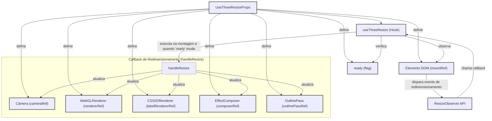
````

## handleConfirm

Manipula a confirmação do diálogo, chamando o callback `onConfirm` com o texto atual
e fechando o diálogo.

##

## CameraControlsPanelProps

Props para o componente CameraControlsPanel.

### Properties

*   `systems` **[Array][416]<[string][414]>** Lista de nomes dos sistemas disponíveis para foco.

## CameraControlsPanel

Renderiza um painel com botões para focar a câmera em sistemas específicos.
Cada botão representa um sistema; ao clicar, a câmera enquadra os equipamentos desse sistema.

### Parameters

*   `props` **[CameraControlsPanelProps][16]** As props do componente.

    *   `props.systems` &#x20;
    *   `props.onSetView` &#x20;

Returns **JSX.Element** O componente CameraControlsPanel.

##

## ColorModeSelectorProps

Props para o componente ColorModeSelector.

### Properties

*   `colorMode` **[ColorMode][403]** O modo de colorização atualmente selecionado.

## ColorModeSelector

Renderiza um Card com um dropdown para selecionar o modo de colorização dos equipamentos.
As opções são "Equipamento (Cor Base)", "Estado Operacional" e "Produto".

### Parameters

*   `props` **[ColorModeSelectorProps][21]** As props do componente.

    *   `props.colorMode` &#x20;
    *   `props.onColorModeChange` &#x20;

Returns **JSX.Element** O componente do seletor de modo de coloração.

##

## CommandHistoryPanelProps

Props para o componente CommandHistoryPanel.

### Properties

*   `canUndo` **[boolean][415]** Indica se a ação de desfazer está disponível.
*   `canRedo` **[boolean][415]** Indica se a ação de refazer está disponível.

## CommandHistoryPanel

Renderiza um painel com botões de Undo e Redo.
A habilitação dos botões é controlada pelas props `canUndo` e `canRedo`.

### Parameters

*   `props` **[CommandHistoryPanelProps][26]** As props do componente.

    *   `props.canUndo` &#x20;
    *   `props.canRedo` &#x20;
    *   `props.onUndo` &#x20;
    *   `props.onRedo` &#x20;

Returns **JSX.Element** O componente CommandHistoryPanel.

##

## InfoPanelProps

Props para o componente InfoPanel.

### equipment

O equipamento selecionado para exibir detalhes. Null se nenhum equipamento único estiver selecionado.

Type: ([Equipment][32] | null)

### annotation

A anotação associada ao equipamento selecionado. Null se não houver anotação.

Type: ([Annotation][33] | null)

### onClose

Callback para fechar o painel de informações (geralmente deseleciona o equipamento).

Type: function (): void

### onOpenAnnotationDialog

Callback para abrir o diálogo de adição/edição de anotação.

Type: function (): void

### onDeleteAnnotation

Callback para excluir a anotação do equipamento especificado.

Type: function (equipmentTag: [string][414]): void

### onOperationalStateChange

Callback para alterar o estado operacional de um equipamento.

Type: function (equipmentTag: [string][414], newState: [string][414]): void

### availableOperationalStatesList

Lista de estados operacionais disponíveis para seleção no dropdown.

Type: [Array][416]<[string][414]>

### onProductChange

Callback para alterar o produto de um equipamento.

Type: function (equipmentTag: [string][414], newProduct: [string][414]): void

### availableProductsList

Lista de produtos disponíveis para seleção no dropdown.

Type: [Array][416]<[string][414]>

## InfoPanel

Renderiza um painel flutuante com informações detalhadas sobre o equipamento selecionado.
Mostra detalhes apenas se um único equipamento estiver selecionado. Permite interações
como alterar estado operacional, produto e gerenciar anotações.

### Parameters

*   `props` **[InfoPanelProps][31]** As props do componente.

    *   `props.equipment` &#x20;
    *   `props.annotation` &#x20;
    *   `props.onClose` &#x20;
    *   `props.onOpenAnnotationDialog` &#x20;
    *   `props.onDeleteAnnotation` &#x20;
    *   `props.onOperationalStateChange` &#x20;
    *   `props.availableOperationalStatesList` &#x20;
    *   `props.onProductChange` &#x20;
    *   `props.availableProductsList` &#x20;

Returns **(JSX.Element | null)** O componente InfoPanel ou null se nenhum equipamento único estiver selecionado.

## handleDeleteClick

Manipula o clique no botão de excluir anotação.

## formattedDate

Formata a data de criação/modificação da anotação para exibição.

Type: ([string][414] | null)

##

## LayerManagerProps

Props para o componente LayerManager.

### Properties

*   `layers` **[Array][416]<[Layer][393]>** A lista de camadas disponíveis e seus estados de visibilidade.

## LayerManager

Renderiza um Card com checkboxes para controlar a visibilidade de cada camada.
Cada checkbox corresponde a uma camada (e.g., Prédios, Tanques, Anotações).

### Parameters

*   `props` **[LayerManagerProps][46]** As props do componente.

    *   `props.layers` &#x20;
    *   `props.onToggleLayer` &#x20;

Returns **JSX.Element** O componente gerenciador de camadas.

##

## MainSceneAreaProps

Props para o componente MainSceneArea.
Estas props são, em grande parte, repassadas para `ThreeScene` e `InfoPanel`.

### Properties

*   `equipment` **[Array][416]<[Equipment][32]>** Lista de equipamentos filtrados a serem renderizados na cena.
*   `allEquipmentData` **[Array][416]<[Equipment][32]>** Lista completa de todos os equipamentos, para contexto (e.g., anotações no `ThreeScene`).
*   `layers` **[Array][416]<[Layer][393]>** Configuração das camadas de visibilidade.
*   `annotations` **[Array][416]<[Annotation][33]>** Lista de anotações a serem exibidas.
*   `selectedEquipmentTags` **[Array][416]<[string][414]>** Tags dos equipamentos atualmente selecionados.
*   `hoveredEquipmentTag` **([string][414] | null)** Tag do equipamento atualmente sob o cursor.
*   `cameraState` **([CameraState][395] | [undefined][417])** O estado atual da câmera (posição, lookAt).
*   `colorMode` **[ColorMode][403]** O modo de colorização atual para os equipamentos.
*   `targetSystemToFrame` **([TargetSystemInfo][399] | null)** Informações sobre o sistema e visão a serem enquadrados pela câmera (se houver).
*   `selectedEquipmentDetails` **([Equipment][32] | null)** Detalhes do equipamento único selecionado (para InfoPanel).
*   `equipmentAnnotation` **([Annotation][33] | null)** Anotação do equipamento único selecionado (para InfoPanel).
*   `availableOperationalStatesList` **[Array][416]<[string][414]>** Lista de estados operacionais disponíveis.
*   `availableProductsList` **[Array][416]<[string][414]>** Lista de produtos disponíveis.

## MainSceneArea

Renderiza a área principal da cena 3D e o InfoPanel sobreposto.
Passa todas as props necessárias para os componentes filhos `ThreeScene` e `InfoPanel`.

### Parameters

*   `props` **[MainSceneAreaProps][51]** As props do componente.

    *   `props.equipment` &#x20;
    *   `props.allEquipmentData` &#x20;
    *   `props.layers` &#x20;
    *   `props.annotations` &#x20;
    *   `props.selectedEquipmentTags` &#x20;
    *   `props.onSelectEquipment` &#x20;
    *   `props.hoveredEquipmentTag` &#x20;
    *   `props.setHoveredEquipmentTag` &#x20;
    *   `props.cameraState` &#x20;
    *   `props.onCameraChange` &#x20;
    *   `props.initialCameraPosition` &#x20;
    *   `props.initialCameraLookAt` &#x20;
    *   `props.colorMode` &#x20;
    *   `props.targetSystemToFrame` &#x20;
    *   `props.onSystemFramed` &#x20;
    *   `props.selectedEquipmentDetails` &#x20;
    *   `props.equipmentAnnotation` &#x20;
    *   `props.onOpenAnnotationDialog` &#x20;
    *   `props.onDeleteAnnotation` &#x20;
    *   `props.onOperationalStateChange` &#x20;
    *   `props.availableOperationalStatesList` &#x20;
    *   `props.onProductChange` &#x20;
    *   `props.availableProductsList` &#x20;

Returns **JSX.Element** O componente MainSceneArea.

##

## SidebarContentLayoutProps

Props para o componente SidebarContentLayout.

### Properties

*   `searchTerm` **[string][414]** O termo de busca textual atual.
*   `selectedSistema` **[string][414]** O sistema selecionado para filtro.
*   `availableSistemas` **[Array][416]<[string][414]>** Lista de sistemas disponíveis para filtro.
*   `selectedArea` **[string][414]** A área selecionada para filtro.
*   `availableAreas` **[Array][416]<[string][414]>** Lista de áreas disponíveis para filtro.
*   `colorMode` **[ColorMode][403]** O modo de colorização atual.
*   `layers` **[Array][416]<[Layer][393]>** Lista de camadas para o LayerManager.
*   `cameraViewSystems` **[Array][416]<[string][414]>** Lista de nomes de sistemas para o CameraControlsPanel.

## SidebarContentLayout

Renderiza o layout do conteúdo da sidebar, incluindo filtros, painéis de controle e link para documentação.
Utiliza uma ScrollArea para permitir a rolagem do conteúdo se ele exceder a altura da sidebar.

### Parameters

*   `props` **[SidebarContentLayoutProps][56]** As props do componente.

    *   `props.searchTerm` &#x20;
    *   `props.setSearchTerm` &#x20;
    *   `props.selectedSistema` &#x20;
    *   `props.setSelectedSistema` &#x20;
    *   `props.availableSistemas` &#x20;
    *   `props.selectedArea` &#x20;
    *   `props.setSelectedArea` &#x20;
    *   `props.availableAreas` &#x20;
    *   `props.colorMode` &#x20;
    *   `props.onColorModeChange` &#x20;
    *   `props.layers` &#x20;
    *   `props.onToggleLayer` &#x20;
    *   `props.cameraViewSystems` &#x20;
    *   `props.onFocusAndSelectSystem` &#x20;

Returns **JSX.Element** O componente SidebarContentLayout.

## Terminal

Componente simples para renderizar o cabeçalho do site.

Principal Responsabilidade:
Exibir o título principal da aplicação ("Terminal 3D") e um ícone associado.
Atua como um elemento de branding e navegação de topo fixo.

## SiteHeader

Renderiza o cabeçalho fixo do site.
Exibe o ícone `Terminal` e o nome da aplicação.

Returns **JSX.Element** O componente SiteHeader.

##

*   **See**: [/documentation/api/hooks/use-scene-setup/README.md][418] Para a orquestração da configuração da cena.
*   **See**: [/documentation/api/hooks/use-equipment-renderer/README.md][419] Para a renderização de equipamentos.
*   **See**: [/documentation/api/hooks/use-annotation-pin-renderer/README.md][420] Para a renderização de pins de anotação.
*   **See**: [/documentation/api/hooks/use-mouse-interaction/README.md][421] Para interações do mouse.
*   **See**: [/documentation/api/hooks/use-scene-outline/README.md][422] Para o efeito de contorno.
*   **See**: [/documentation/api/hooks/useAnimationLoop/README.md][423] Para o loop de animação.

### Examples

````javascript
Diagrama de Composição do ThreeScene e seus Hooks:
```mermaid
graph TD
    ThreeScene_Comp["ThreeScene (Componente React)"]
    MountPoint["<div ref={mountRef}> (Ponto de Montagem DOM)"]

    ThreeScene_Comp -- renderiza --> MountPoint

    subgraph "Hooks Utilizados por ThreeScene"
        direction LR
        H_SceneSetup["useSceneSetup (Orquestrador de Setup)"]
        H_EquipRenderer["useEquipmentRenderer"]
        H_AnnotPinRenderer["useAnnotationPinRenderer"]
        H_MouseInt["useMouseInteractionManager"]
        H_Outline["useSceneOutline"]
        H_AnimLoop["useAnimationLoop"]
    end

    ThreeScene_Comp -- usa --> H_SceneSetup
    ThreeScene_Comp -- usa --> H_EquipRenderer
    ThreeScene_Comp -- usa --> H_AnnotPinRenderer
    ThreeScene_Comp -- usa --> H_MouseInt
    ThreeScene_Comp -- usa --> H_Outline
    ThreeScene_Comp -- usa --> H_AnimLoop

    H_SceneSetup --> R_Scene["sceneRef"]
    H_SceneSetup --> R_Camera["cameraRef"]
    H_SceneSetup --> R_Renderer["rendererRef"]
    H_SceneSetup --> R_LabelRenderer["labelRendererRef"]
    H_SceneSetup --> R_Controls["controlsRef"]
    H_SceneSetup --> R_Composer["composerRef"]
    H_SceneSetup --> R_OutlinePass["outlinePassRef"]
    H_SceneSetup --> F_IsSceneReady["isSceneReady (flag)"]
    H_SceneSetup --> F_IsControlsReady["isControlsReady (flag)"]

    H_EquipRenderer -- usa --> R_Scene
    H_AnnotPinRenderer -- usa --> R_Scene
    H_AnnotPinRenderer -- usa --> R_LabelRenderer
    H_MouseInt -- usa --> MountPoint
    H_MouseInt -- usa --> R_Camera
    H_Outline -- usa --> R_OutlinePass
    H_AnimLoop -- usa --> R_Scene
    H_AnimLoop -- usa --> R_Camera
    H_AnimLoop -- usa --> R_Controls
    H_AnimLoop -- usa --> R_Composer
    H_AnimLoop -- usa --> R_LabelRenderer

    classDef comp fill:#lightcoral,stroke:#333,stroke-width:2px;
    classDef hook fill:#lightblue,stroke:#333,stroke-width:2px;
    classDef ref fill:#lightgoldenrodyellow,stroke:#333,stroke-width:2px;
    classDef flag fill:#lightpink,stroke:#333,stroke-width:2px;

    class ThreeScene_Comp comp;
    class MountPoint comp;
    class H_SceneSetup,H_EquipRenderer,H_AnnotPinRenderer,H_MouseInt,H_Outline,H_AnimLoop hook;
    class R_Scene,R_Camera,R_Renderer,R_LabelRenderer,R_Controls,R_Composer,R_OutlinePass ref;
    class F_IsSceneReady,F_IsControlsReady flag;
```
````

## ThreeSceneProps

Props para o componente ThreeScene.

### Properties

*   `equipment` **[Array][416]<[Equipment][32]>** Lista de equipamentos filtrados a serem renderizados na cena.
*   `allEquipmentData` **[Array][416]<[Equipment][32]>** Lista completa de todos os equipamentos, para contexto (e.g., anotações).
*   `layers` **[Array][416]<[Layer][393]>** Configuração das camadas de visibilidade.
*   `annotations` **[Array][416]<[Annotation][33]>** Lista de anotações a serem exibidas.
*   `selectedEquipmentTags` **([Array][416]<[string][414]> | [undefined][417])** Tags dos equipamentos atualmente selecionados.
*   `hoveredEquipmentTag` **([string][414] | null | [undefined][417])** Tag do equipamento atualmente sob o cursor.
*   `cameraState` **([CameraState][395] | [undefined][417])** O estado atual da câmera (posição, lookAt) gerenciado externamente. Pode ser indefinido durante a inicialização.
*   `colorMode` **[ColorMode][403]** O modo de colorização atual para os equipamentos.
*   `targetSystemToFrame` **([TargetSystemInfo][399] | null)** O sistema que deve ser enquadrado pela câmera (se houver), incluindo o índice da visão.

## ThreeScene

Componente React principal para renderizar e interagir com a cena 3D usando Three.js.
Atua como um orquestrador de hooks especializados que gerenciam diferentes aspectos da cena.

Type: React.FC<[ThreeSceneProps][64]>

### Parameters

*   `props` **[ThreeSceneProps][64]** As props do componente.

Returns **JSX.Element** O elemento div que serve como contêiner para a cena 3D.

## THEMES

Define os seletores CSS para os temas claro e escuro.
Usado internamente pelo ChartStyle para aplicar cores específicas do tema.

## ChartConfig

Configuração para os gráficos, permitindo a definição de rótulos, ícones e cores
para cada item de dados do gráfico. As cores podem ser definidas diretamente ou
através de um objeto de tema para suportar diferentes temas (claro/escuro).

Type: any

### Examples

````javascript
```ts
const chartConfig = {
  visitors: {
    label: "Visitantes",
    color: "hsl(var(--chart-1))",
  },
  chrome: {
    label: "Chrome",
    color: "hsl(var(--chart-2))",
    icon: ChromeIcon, // Exemplo de ícone
  },
  safari: {
    label: "Safari",
    theme: { // Exemplo de cores baseadas em tema
      light: "hsl(var(--chart-3))",
      dark: "hsl(var(--chart-5))",
    }
  },
} satisfies ChartConfig;
```
````

## Form

Componente provedor que propaga os métodos `useForm` para todos os componentes filhos
através da API de Contexto do React. Para ser usado com `useFormContext`.

### Parameters

*   `props` **FormProviderProps\<TFieldValues, TContext, TTransformedValues>** Todos os métodos de `useForm`.

### Examples

````javascript
* ```tsx
function App() {
  const methods = useForm();
  const onSubmit = data => console.log(data);

  return (
    <FormProvider {...methods} >
      <form onSubmit={methods.handleSubmit(onSubmit)}>
        <NestedInput />
        <input type="submit" />
      </form>
    </FormProvider>
  );
}

 function NestedInput() {
  const { register } = useFormContext(); // retrieve all hook methods
  return <input {...register("test")} />;
}
* ```
````

Returns **JSX.Element**&#x20;

##

## useSidebar

Hook para acessar o contexto da Sidebar.
Deve ser usado dentro de um `SidebarProvider`.

*   Throws **[Error][424]** Se usado fora de um `SidebarProvider`.

Returns **SidebarContext** O contexto da sidebar.

## SidebarProvider

Provedor de contexto para o estado da sidebar.
Gerencia se a sidebar está aberta/fechada, tanto no desktop quanto no mobile,
e o estado colapsado/expandido.

### defaultOpen

Estado de abertura padrão da sidebar no desktop. Padrão: `true`.

Type: [boolean][415]

### open

Controla o estado de abertura da sidebar no desktop externamente.

Type: [boolean][415]

### onOpenChange

Callback para quando o estado de abertura da sidebar no desktop muda.

Type: function (open: [boolean][415]): void

## Sidebar

Componente principal da Sidebar.
Renderiza a sidebar com base no estado do `SidebarProvider` e nas props de configuração.

### side

Lado em que a sidebar aparecerá. Padrão: `"left"`.

Type: (`"left"` | `"right"`)

### variant

Variante visual da sidebar. Padrão: `"sidebar"`.

*   `"sidebar"`: Sidebar tradicional.
*   `"floating"`: Sidebar flutuante com sombra e bordas.
*   `"inset"`: Sidebar que se encaixa dentro de um layout principal (`SidebarInset`).

Type: (`"sidebar"` | `"floating"` | `"inset"`)

### collapsible

Comportamento de colapso da sidebar. Padrão: `"offcanvas"`.

*   `"offcanvas"`: A sidebar desliza para fora da tela quando colapsada.
*   `"icon"`: A sidebar encolhe para mostrar apenas ícones quando colapsada.
*   `"none"`: A sidebar não é colapsável.

Type: (`"offcanvas"` | `"icon"` | `"none"`)

## SidebarTrigger

Botão para alternar o estado de visibilidade da sidebar.
Em modo mobile, abre/fecha a sidebar offcanvas.
Em modo desktop, colapsa/expande a sidebar.

## SidebarRail

Barra lateral fina ("rail") que aparece quando a sidebar está colapsada em modo "icon".
Permite ao usuário clicar para expandir a sidebar.

## SidebarInset

Componente para envolver o conteúdo principal da página.
Ajusta sua margem e aparência com base no estado e variante da sidebar,
especialmente útil com a variante "inset".

## SidebarInput

Componente de Input estilizado para uso dentro da Sidebar.

## SidebarHeader

Contêiner para o cabeçalho da Sidebar.

## SidebarFooter

Contêiner para o rodapé da Sidebar.

## SidebarSeparator

Componente Separator estilizado para uso dentro da Sidebar.

## SidebarContent

Contêiner para a área de conteúdo principal da Sidebar (geralmente rolável).

## SidebarGroup

Contêiner para agrupar logicamente itens dentro da Sidebar.

## SidebarGroupLabel

Rótulo para um `SidebarGroup`. Fica oculto quando a sidebar está em modo "icon".

## SidebarGroupAction

Botão de ação opcional para um `SidebarGroup` (e.g., um botão "+").
Fica oculto quando a sidebar está em modo "icon".

## SidebarGroupContent

Contêiner para o conteúdo de um `SidebarGroup`.

## SidebarMenu

Lista `<ul>` para um menu dentro da Sidebar.

## SidebarMenuItem

Item `<li>` de um `SidebarMenu`.

## SidebarMenuButton

Botão clicável dentro de um `SidebarMenuItem`.
Pode conter um ícone e texto. O texto é truncado quando a sidebar está em modo "icon".
Suporta um tooltip opcional que aparece quando a sidebar está em modo "icon".

### isActive

Indica se o item de menu está ativo.

Type: [boolean][415]

### tooltip

Conteúdo do tooltip a ser exibido no modo "icon", ou um objeto de props para `TooltipContent`.

Type: ([string][414] | React.ComponentProps\<any>)

## SidebarMenuAction

Botão de ação opcional para um `SidebarMenuItem` (e.g., um ícone de "mais opções").
Fica oculto quando a sidebar está em modo "icon".
Pode ser configurado para aparecer apenas no hover.

### showOnHover

Se true, a ação só aparece quando o mouse está sobre o item de menu.

Type: [boolean][415]

## SidebarMenuBadge

Badge opcional para um `SidebarMenuItem` (e.g., para contagens de notificações).
Fica oculto quando a sidebar está em modo "icon".

## SidebarMenuSkeleton

Componente de esqueleto de carregamento para itens de menu.
Útil para indicar que o conteúdo do menu está sendo carregado.

### showIcon

Se true, mostra um esqueleto de ícone.

Type: [boolean][415]

## SidebarMenuSub

Lista `<ul>` para um submenu dentro de um `SidebarMenuButton` (geralmente usado com dropdowns ou accordions).
Fica oculto quando a sidebar está em modo "icon".

## SidebarMenuSubItem

Item `<li>` de um `SidebarMenuSub`.

## SidebarMenuSubButton

Botão clicável (ou link) dentro de um `SidebarMenuSubItem`.

### size

Tamanho do botão do submenu.

Type: (`"sm"` | `"md"`)

### isActive

Indica se o item de submenu está ativo.

Type: [boolean][415]

## Equipment

Fornece os dados iniciais para equipamentos e camadas da aplicação.
Estes dados são usados para popular o estado inicial da aplicação quando ela é carregada.
Define a estrutura de cada equipamento e as camadas de visibilidade padrão.

Exporta:

*   `initialEquipment`: Array de objetos `Equipment` representando os itens 3D na cena.
*   `initialLayers`: Array de objetos `Layer` especificando as camadas de visibilidade.
*   `initialAnnotations`: Array inicial de `Annotation` (geralmente vazio para começar).

## Equipment

Utilitário para filtrar a lista de equipamentos com base em múltiplos critérios.

Principal Responsabilidade:
Aplicar filtros de Sistema, Área e um termo de busca textual (nome, tipo, tag)
a uma lista de equipamentos, retornando a lista filtrada.

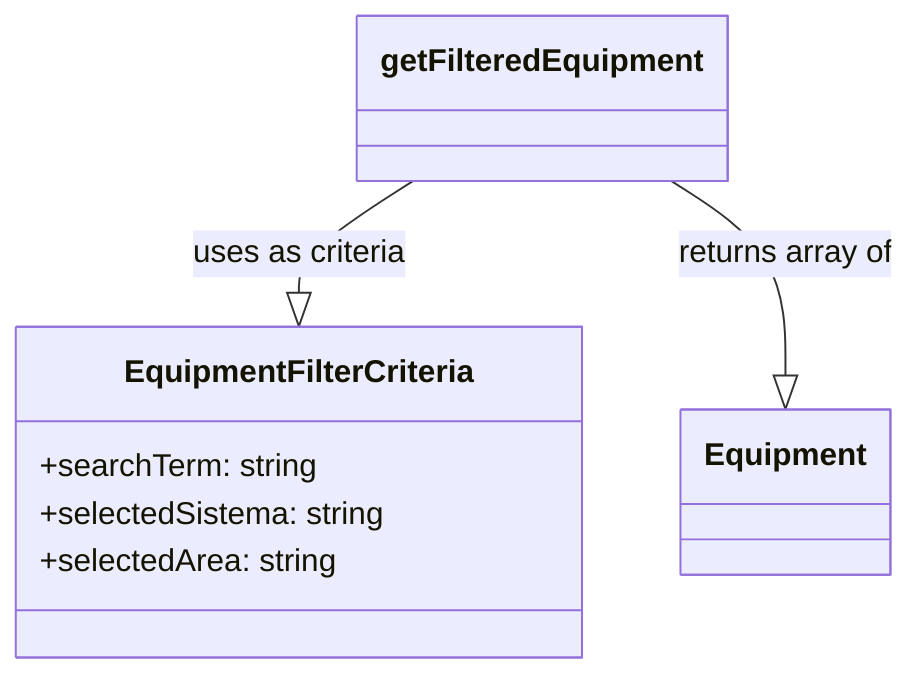

Exporta:

*   `EquipmentFilterCriteria`: Interface para os critérios de filtro.
*   `getFilteredEquipment`: Função principal para filtrar equipamentos.

## Equipment

*   **See**: [/documentation/api/core/data/initial-data/README.md][425] Para os dados iniciais de equipamentos e camadas.
*   **See**: [/documentation/api/lib/types/README.md#Equipment][426] Para a interface de Equipamento.
*   **See**: [/documentation/api/lib/types/README.md#Annotation][427] Para a interface de Anotação.

### Examples

````javascript
Diagrama de Estrutura do Repositório em Memória:
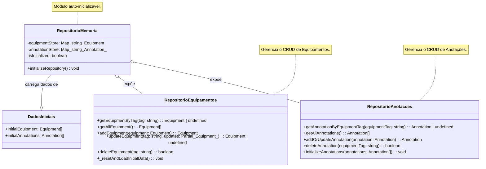
````

## Equipment

Define as principais interfaces de tipo usadas em toda a aplicação Terminal 3D.
Estas estruturas de dados são cruciais para a consistência e tipagem do projeto,
descrevendo entidades como Equipamentos, Camadas, Estado da Câmera, Comandos e Anotações.
A clareza e precisão destas interfaces facilitam o desenvolvimento, a manutenção e
a compreensão do fluxo de dados através dos componentes e hooks.

## Equipment

Representa um equipamento na cena 3D. Contém todas as propriedades
necessárias para sua renderização, identificação e manipulação de estado.

### Properties

*   `tag` **[string][414]** Identificador único e imutável do equipamento (e.g., "bldg-01", "tank-alpha"). Usado como chave.
*   `name` **[string][414]** Nome legível do equipamento para exibição na UI (e.g., "Main Office", "Storage Tank Alpha").
*   `type` **(`"Building"` | `"Crane"` | `"Tank"` | `"Terrain"` | `"Pipe"` | `"Valve"`)** Categoria do equipamento, influencia sua geometria e interações.
    'Terrain' é um tipo especial para o plano de chão.
*   `sistema` **[string][414]?** O sistema operacional ou funcional ao qual o equipamento pertence (e.g., "GA", "ODB"). Opcional.
*   `area` **[string][414]?** A área física ou lógica onde o equipamento está localizado (e.g., "Área 31", "Área de Processo"). Opcional.
*   `operationalState` **[string][414]?** Estado operacional atual do equipamento (e.g., 'operando', 'manutenção', 'em falha', 'não operando', 'Não aplicável').
    Usado para colorização e informação. Opcional.
*   `product` **[string][414]?** Produto atualmente associado ou processado pelo equipamento (e.g., "70H", "660", "Não aplicável").
    Usado para colorização e informação. Opcional.
*   `radius` **[number][428]?** Raio para equipamentos com geometria cilíndrica (e.g., 'Tank', 'Pipe') ou esférica (e.g., 'Valve'). Opcional se `size` for usado.
*   `height` **[number][428]?** Altura para equipamentos com geometria cilíndrica (e.g., 'Tank', 'Crane'). Para 'Pipe', representa o comprimento. Opcional se `size` for usado.
*   `color` **[string][414]** Cor base do equipamento em formato hexadecimal (e.g., '#78909C'). Usada no modo de colorização 'Equipamento'.
*   `details` **[string][414]?** Detalhes textuais adicionais sobre o equipamento. Exibido no `InfoPanel`. Opcional.

## initialEquipment

Lista inicial de equipamentos para a cena 3D.
Cada equipamento possui propriedades como tag, nome, tipo, sistema, área, estado operacional,
produto, posição, dimensões (ou raio/altura), cor, detalhes e categoria.

Type: [Array][416]<[Equipment][32]>

## initialLayers

Lista inicial de camadas para controle de visibilidade na interface.
Cada camada define um nome, o tipo de equipamento que ela controla (ou 'Annotations' para pins de anotação, 'Terrain' para o chão),
e seu estado de visibilidade inicial.

Type: [Array][416]<[Layer][393]>

## initialAnnotations

Lista inicial de anotações. Geralmente vazia para começar,
a menos que queira popular com dados de exemplo.

Type: [Array][416]<[Annotation][33]>

## THREE

## THREE

### Examples

````javascript
Diagrama de Funcionalidade do calculateViewForMeshes:
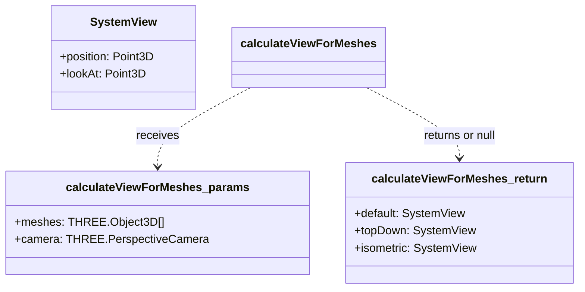
````

## THREE

Fábrica para criar geometrias de equipamentos para a cena Three.js.

Principal Responsabilidade:
Encapsular a lógica de criação de diferentes tipos de `THREE.BufferGeometry`
com base no tipo de equipamento (`item.type`) e suas dimensões (`item.size`, `item.radius`, `item.height`).
Isso promove o Single Responsibility Principle, isolando a lógica de criação
de geometrias do componente `ThreeScene` ou outras partes do sistema.
Fornece uma geometria padrão (BoxGeometry) caso um tipo de equipamento desconhecido seja fornecido.

Exporta:

*   `createGeometryForItem`: Função para criar a geometria apropriada para um equipamento.

## THREE

### Examples

````javascript
Diagrama de Interação para `updateAnnotationPins`:
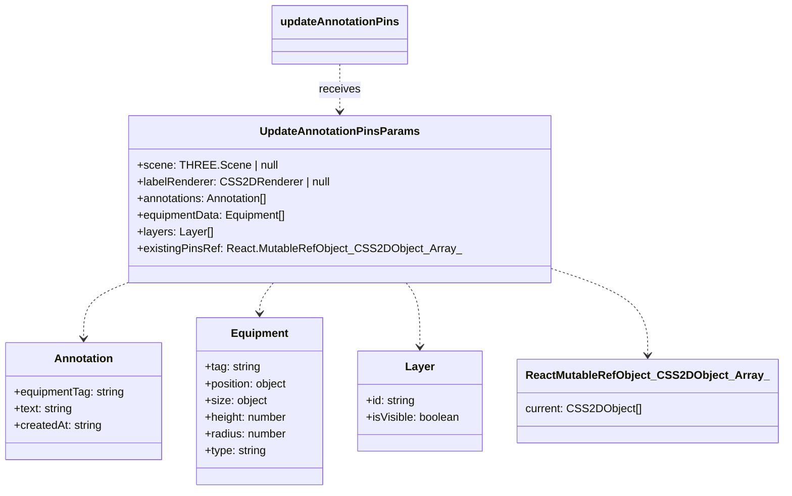

Exporta:
- `updateLabelRendererSize`: Atualiza o tamanho do CSS2DRenderer.
- `updateAnnotationPins`: Gerencia os pins de anotação na cena.
````

## THREE

### Examples

````javascript
Diagrama de Retorno da Função `setupPostProcessing`:
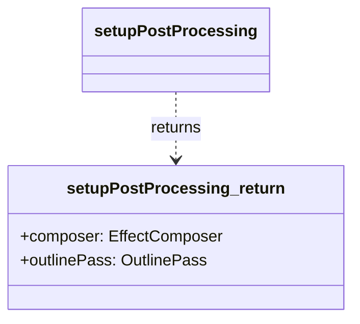

Exporta:
- `setupPostProcessing`: Configura o pipeline inicial de pós-processamento.
- `updatePostProcessingSize`: Atualiza o tamanho do composer e do outline pass.
- `updateOutlineEffect`: Atualiza quais objetos são contornados e com qual estilo.
````

## THREE

### Examples

````javascript
Diagrama de Estrutura e Interdependências:
```mermaid
  graph TD;
    A[setupRenderPipeline] --> B{renderer: WebGLRenderer};
    A --> C{labelRenderer: CSS2DRenderer};
    A --> D{composer: EffectComposer};
    A --> E{outlinePass: OutlinePass};

    F[UpdateEquipmentMeshesParams] --> G[updateEquipmentMeshesInScene];
    class H[Equipment] --> F;
    class I[Layer] --> F;
    class J[ColorMode] --> F;

    classDef params fill:#DCDCDC,stroke:#333,stroke-width:2px,color:black;
    classDef func fill:#ADD8E6,stroke:#333,stroke-width:2px,color:black;
    classDef return fill:#90EE90,stroke:#333,stroke-width:2px,color:black;
    classDef type fill:#FFFFE0,stroke:#333,stroke-width:2px,color:black;

    class A func;
    class B,C,D,E return;
    class F params;
    class G func;
    class H,I,J type;
```

Exporta:
- `setupLighting`: Configura a iluminação da cena.
- `setupGroundPlane`: Configura o plano de chão.
- `setupRenderPipeline`: Inicializa os renderizadores e o pipeline de pós-processamento.
- `updateEquipmentMeshesInScene`: Atualiza dinamicamente os meshes dos equipamentos.
````

## THREE

### Parameters

*   `props`  Propriedades para configurar o loop de animação.

### Examples

````javascript
Diagrama de Fluxo do useAnimationLoop:
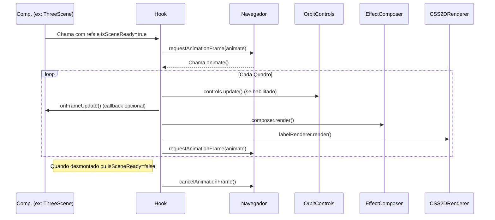
````

## THREE

*   **See**: [/documentation/api/hooks/useThreeCore/README.md][429] Para inicialização da cena e câmera.
*   **See**: [/documentation/api/hooks/useThreeRenderers/README.md][430] Para configuração dos renderizadores e pós-processamento.
*   **See**: [/documentation/api/hooks/useThreeOrbitControls/README.md][431] Para configuração dos controles de órbita.
*   **See**: [/documentation/api/hooks/useThreeSceneElements/README.md][432] Para configuração de iluminação e plano de chão.
*   **See**: [/documentation/api/hooks/useThreeResize/README.md][433] Para manipulação de redimensionamento.

### Examples

````javascript
Diagrama de Composição do useSceneSetup:
```mermaid
graph TD
    useSceneSetup_Orchestrator["useSceneSetup (Orquestrador)"]

    subgraph "Hooks Especializados de Setup"
        direction LR
        H_Core["useThreeCore"]
        H_Renderers["useThreeRenderers"]
        H_Controls["useThreeOrbitControls"]
        H_Elements["useThreeSceneElements"]
        H_Resize["useThreeResize"]
    end

    useSceneSetup_Orchestrator -- compõe --> H_Core
    useSceneSetup_Orchestrator -- compõe --> H_Renderers
    useSceneSetup_Orchestrator -- compõe --> H_Controls
    useSceneSetup_Orchestrator -- compõe --> H_Elements
    useSceneSetup_Orchestrator -- compõe --> H_Resize

    H_Core --> R_Scene["sceneRef"]
    H_Core --> R_Camera["cameraRef"]

    H_Renderers -- usa --> R_Scene
    H_Renderers -- usa --> R_Camera
    H_Renderers --> R_Renderer["rendererRef"]
    H_Renderers --> R_LabelRenderer["labelRendererRef"]
    H_Renderers --> R_Composer["composerRef"]
    H_Renderers --> R_OutlinePass["outlinePassRef"]
    H_Renderers --> F_RenderersReady["areRenderersReady (flag)"]

    H_Controls -- usa --> R_Camera
    H_Controls -- usa --> R_Renderer
    H_Controls --> R_OrbitControls["controlsRef"]
    H_Controls --> F_ControlsReady["isControlsReady (flag)"]

    H_Elements -- usa --> R_Scene
    H_Elements --> R_GroundMesh["groundMeshRef"]

    H_Resize -- usa --> R_Camera
    H_Resize -- usa --> R_Renderer
    H_Resize -- usa --> R_LabelRenderer
    H_Resize -- usa --> R_Composer
    H_Resize -- usa --> R_OutlinePass

    useSceneSetup_Orchestrator -- retorna --> R_Scene
    useSceneSetup_Orchestrator -- retorna --> R_Camera
    useSceneSetup_Orchestrator -- retorna --> R_Renderer
    useSceneSetup_Orchestrator -- retorna --> R_LabelRenderer
    useSceneSetup_Orchestrator -- retorna --> R_OrbitControls
    useSceneSetup_Orchestrator -- retorna --> R_Composer
    useSceneSetup_Orchestrator -- retorna --> R_OutlinePass
    useSceneSetup_Orchestrator -- retorna --> R_GroundMesh
    useSceneSetup_Orchestrator -- retorna --> F_SceneReady["isSceneReady (flag combinada)"]
    useSceneSetup_Orchestrator -- retorna --> F_ControlsReady

    classDef hook fill:#lightblue,stroke:#333,stroke-width:2px;
    classDef ref fill:#lightgoldenrodyellow,stroke:#333,stroke-width:2px;
    classDef flag fill:#lightpink,stroke:#333,stroke-width:2px;

    class useSceneSetup_Orchestrator hook;
    class H_Core,H_Renderers,H_Controls,H_Elements,H_Resize hook;
    class R_Scene,R_Camera,R_Renderer,R_LabelRenderer,R_OrbitControls,R_Composer,R_OutlinePass,R_GroundMesh ref;
    class F_RenderersReady,F_ControlsReady,F_SceneReady flag;
```
````

## getCharNumericValue

Converte um caractere ('0'-'9' ou 'A'-'Z') para um valor numérico (0-35).
'0'-'9' mapeiam para 0-9.
'A'-'Z' (case-insensitive) mapeiam para 10-35.
Caracteres inválidos retornam 0.
Esta função é usada para gerar componentes de cor (R, G, B) a partir de códigos de produto.

### Parameters

*   `char` **[string][414]** O caractere a ser convertido.

Returns **[number][428]** O valor numérico correspondente (0-35), ou 0 para caracteres inválidos.

## getEquipmentColor

Determina a cor final de um equipamento com base no modo de colorização e seus atributos.

### Parameters

*   `item` **[Equipment][32]** O equipamento para o qual a cor será determinada.
*   `colorMode` **[ColorMode][403]** O modo de colorização selecionado ('Equipamento', 'Estado Operacional', 'Produto').

Returns **THREE.Color** A cor calculada para o equipamento, como uma instância de `THREE.Color`.

## EquipmentFilterCriteria

Define os critérios de filtro aplicáveis aos equipamentos.

### Properties

*   `searchTerm` **[string][414]** Termo de busca textual. Múltiplos termos separados por espaço são tratados com lógica "E".
*   `selectedSistema` **[string][414]** Sistema selecionado para filtro (ou "All" para não filtrar por sistema).
*   `selectedArea` **[string][414]** Área selecionada para filtro (ou "All" para não filtrar por área).

## getFilteredEquipment

Filtra uma lista de equipamentos com base nos critérios fornecidos.
A filtragem ocorre na seguinte ordem: Sistema, depois Área, depois Termo de Busca.
A filtragem textual por `searchTerm` considera nome, tipo e tag, com lógica "E" para múltiplos termos.
Os filtros de sistema e área são aplicados se não forem "All".

### Parameters

*   `allEquipment` **[Array][416]<[Equipment][32]>** A lista completa de equipamentos a serem filtrados.
*   `criteria` **[EquipmentFilterCriteria][140]** Os critérios de filtro a serem aplicados.

Returns **[Array][416]<[Equipment][32]>** A lista de equipamentos filtrada.

## equipmentRepository

Objeto repositório para gerenciar dados de `Equipment`.

### getEquipmentByTag

Obtém um equipamento pela sua tag.

#### Parameters

*   `tag` **[string][414]** A tag do equipamento.

Returns **([Equipment][32] | [undefined][417])** O objeto do equipamento (uma cópia), ou undefined se não encontrado.

### getAllEquipment

Obtém todos os equipamentos.

Returns **[Array][416]<[Equipment][32]>** Um array com todos os equipamentos (cópias).

### addEquipment

Adiciona um novo equipamento. Se um equipamento com a mesma tag já existir,
ele será atualizado em vez de adicionar um novo.

#### Parameters

*   `equipment` **[Equipment][32]** O objeto do equipamento a ser adicionado.

Returns **[Equipment][32]** O equipamento adicionado (ou atualizado, uma cópia).

### updateEquipment

Atualiza um equipamento existente.

#### Parameters

*   `tag` **[string][414]** A tag do equipamento a ser atualizado.
*   `updates` **Partial<[Equipment][32]>** Um objeto com as propriedades do equipamento a serem atualizadas.
    A propriedade `tag` não pode ser alterada por este método.

Returns **([Equipment][32] | [undefined][417])** O equipamento atualizado (uma cópia), ou undefined se não encontrado.

### deleteEquipment

Exclui um equipamento pela sua tag.

#### Parameters

*   `tag` **[string][414]** A tag do equipamento a ser excluído.

Returns **[boolean][415]** True se o equipamento foi excluído com sucesso, false caso contrário.

## annotationRepository

Objeto repositório para gerenciar dados de `Annotation`.

### getAnnotationByEquipmentTag

Obtém uma anotação pela tag do equipamento associado.

#### Parameters

*   `equipmentTag` **[string][414]** A tag do equipamento.

Returns **([Annotation][33] | [undefined][417])** A anotação (uma cópia), ou undefined se não encontrada.

### getAllAnnotations

Obtém todas as anotações.

Returns **[Array][416]<[Annotation][33]>** Um array com todas as anotações (cópias).

### addOrUpdateAnnotation

Adiciona uma nova anotação ou atualiza uma existente se já houver uma para a mesma `equipmentTag`.

#### Parameters

*   `annotation` **[Annotation][33]** O objeto da anotação a ser adicionado/atualizado.

Returns **[Annotation][33]** A anotação adicionada/atualizada (uma cópia).

### deleteAnnotation

Exclui uma anotação pela tag do equipamento associado.

#### Parameters

*   `equipmentTag` **[string][414]** A tag do equipamento cuja anotação será excluída.

Returns **[boolean][415]** True se a anotação foi excluída com sucesso, false caso contrário.

### initializeAnnotations

Inicializa explicitamente as anotações no repositório.
Limpa quaisquer anotações existentes e popula com as fornecidas.

#### Parameters

*   `annotations` **[Array][416]<[Annotation][33]>** Um array de anotações para inicializar o repositório.

## calculateViewForMeshes

Calcula múltiplas opções de visualização (padrão, de cima, isométrica) para a câmera
de forma a enquadrar um conjunto de meshes fornecidos.

### Parameters

*   `meshes` **[Array][416]\<THREE.Object3D>** Um array de meshes 3D a serem enquadrados.
*   `camera` **THREE.PerspectiveCamera** A câmera de perspectiva da cena.

Returns **([SystemViewOptions][397] | null)** Um objeto contendo as diferentes visualizações calculadas
ou null se não for possível calcular (e.g., nenhum mesh fornecido).

## createGeometryForItem

Cria e retorna uma `THREE.BufferGeometry` apropriada para o tipo de equipamento.
Seleciona a geometria correta (Box, Cylinder, Sphere) com base no `item.type`
e utiliza as dimensões fornecidas no objeto `item`.

### Parameters

*   `item` **[Equipment][32]** O objeto de equipamento contendo tipo e dimensões.

Returns **THREE.BufferGeometry** A geometria criada para o equipamento.
Retorna um `BoxGeometry(1,1,1)` para tipos desconhecidos.

## updateLabelRendererSize

Atualiza o tamanho do CSS2DRenderer.
Deve ser chamado quando o contêiner de renderização da cena é redimensionado
para garantir que os rótulos sejam dimensionados e posicionados corretamente.

### Parameters

*   `labelRenderer` **(CSS2DRenderer | null)** A instância do CSS2DRenderer a ser atualizada.
*   `width` **[number][428]** A nova largura para o renderizador de rótulos.
*   `height` **[number][428]** A nova altura para o renderizador de rótulos.

Returns **void**&#x20;

## UpdateAnnotationPinsParams

Parâmetros para a função `updateAnnotationPins`.

### Properties

*   `scene` **(THREE.Scene | null)** A cena Three.js onde os pins serão adicionados/removidos.
*   `labelRenderer` **(CSS2DRenderer | null)** O renderizador CSS2D responsável por exibir os pins.
*   `annotations` **[Array][416]<[Annotation][33]>** A lista atual de todas as anotações.
*   `equipmentData` **[Array][416]<[Equipment][32]>** A lista completa de equipamentos, usada para encontrar posições e dimensões dos alvos das anotações.
*   `layers` **[Array][416]<[Layer][393]>** A lista de camadas, usada para verificar a visibilidade da camada de "Annotations".
*   `existingPinsRef` **React.MutableRefObject<[Array][416]\<CSS2DObject>>** Ref para o array de objetos CSS2DObject (pins) atualmente na cena.

## updateAnnotationPins

Atualiza os pins de anotação visíveis na cena 3D.
Remove pins antigos e cria/atualiza novos com base nos dados atuais e na visibilidade da camada de anotações.
Cada pin é um ícone SVG amarelo posicionado acima do equipamento correspondente.
O `labelRenderer.domElement.style.display` é ajustado com base na visibilidade da camada de anotações.

### Parameters

*   `params` **[UpdateAnnotationPinsParams][170]** Parâmetros para atualizar os pins.

    *   `params.scene` &#x20;
    *   `params.labelRenderer` &#x20;
    *   `params.annotations` &#x20;
    *   `params.equipmentData` &#x20;
    *   `params.layers` &#x20;
    *   `params.existingPinsRef` &#x20;

Returns **void**&#x20;

##

Gerencia interações do mouse (clique e movimento) dentro da cena Three.js.

ATENÇÃO: Este arquivo foi esvaziado. A lógica de interação do mouse
foi movida para o hook customizado `src/hooks/use-mouse-interaction.ts`
(renomeado internamente para `useMouseInteractionManager` em termos de funcionalidade)
como parte de uma refatoração para melhorar a modularidade e o Princípio da Responsabilidade Única.

O hook `useMouseInteractionManager` agora encapsula:

*   A lógica de raycasting para detectar interseções.
*   A adição e remoção de ouvintes de eventos do mouse no elemento DOM da cena.
*   A invocação de callbacks para tratar seleção e hover de equipamentos.

Este arquivo é mantido para evitar quebras de importação em locais que ainda
possam referenciá-lo, mas seu conteúdo não é mais utilizado.
Considere remover as importações deste arquivo e usar o hook diretamente.

## setOutlinePassObjects

Define os objetos que devem ser contornados pelo OutlinePass.

### Parameters

*   `outlinePass` **OutlinePass** A instância do OutlinePass.
*   `objectsToOutline` **[Array][416]\<THREE.Object3D>** Um array de objetos 3D a serem contornados.

Returns **void**&#x20;

## applyOutlinePassStyle

Aplica um estilo visual específico ao OutlinePass.
Modifica parâmetros como cor da borda visível, força, espessura e brilho.

### Parameters

*   `outlinePass` **OutlinePass** A instância do OutlinePass.
*   `styleType` **(`"selected"` | `"hover"` | `"none"`)** O tipo de estilo a ser aplicado.

Returns **void**&#x20;

## setupPostProcessing

Configura o pipeline de pós-processamento, incluindo o EffectComposer e o OutlinePass.
Esta função é chamada uma vez durante o setup inicial da cena.

### Parameters

*   `renderer` **THREE.WebGLRenderer** O renderizador WebGL principal.
*   `scene` **THREE.Scene** A cena 3D.
*   `camera` **THREE.PerspectiveCamera** A câmera da cena.
*   `initialWidth` **[number][428]** A largura inicial do canvas de renderização.
*   `initialHeight` **[number][428]** A altura inicial do canvas de renderização.

Returns **{composer: EffectComposer, outlinePass: OutlinePass}** Um objeto contendo o EffectComposer e o OutlinePass configurados.

## updatePostProcessingSize

Atualiza o tamanho do EffectComposer e do OutlinePass.
Deve ser chamado quando o contêiner de renderização é redimensionado.

### Parameters

*   `composer` **(EffectComposer | null)** O EffectComposer a ser atualizado.
*   `outlinePass` **(OutlinePass | null)** O OutlinePass a ser atualizado.
*   `width` **[number][428]** A nova largura.
*   `height` **[number][428]** A nova altura.

Returns **void**&#x20;

## updateOutlineEffect

Atualiza o efeito de contorno (OutlinePass) com base nos equipamentos selecionados e em hover.
Determina quais objetos contornar e qual estilo aplicar.

### Parameters

*   `outlinePass` **(OutlinePass | null)** A instância do OutlinePass.
*   `allMeshes` **[Array][416]\<THREE.Object3D>** A lista de todos os meshes de equipamentos na cena.
*   `selectedTags` **[Array][416]<[string][414]>** As tags dos equipamentos atualmente selecionados.
*   `hoveredTag` **([string][414] | null)** A tag do equipamento atualmente sob o cursor.

Returns **void**&#x20;

## setupLighting

Configura a iluminação padrão para a cena.
Adiciona uma AmbientLight para iluminação geral, uma HemisphereLight para simular luz do céu e do chão,
e uma DirectionalLight para simular luz solar com sombras (atualmente desabilitadas por performance).

### Parameters

*   `scene` **THREE.Scene** A instância da cena Three.js onde as luzes serão adicionadas.

Returns **void**&#x20;

## setupGroundPlane

Configura o plano de chão (terreno) para a cena.
Cria um `THREE.Mesh` com `PlaneGeometry` e `MeshStandardMaterial`.
O plano é posicionado em Y=0 e rotacionado para ficar horizontal.

### Parameters

*   `scene` **THREE.Scene** A instância da cena Three.js onde o plano será adicionado.

Returns **THREE.Mesh** O mesh do plano de chão criado.

## setupRenderPipeline

Configura os renderizadores principais (WebGL, CSS2D) e o pipeline de pós-processamento.
Centraliza a criação do WebGLRenderer, CSS2DRenderer, EffectComposer e OutlinePass.

### Parameters

*   `mountElement` **[HTMLElement][434]** O elemento DOM onde o canvas WebGL e o renderer de labels serão montados.
*   `scene` **THREE.Scene** A cena Three.js.
*   `camera` **THREE.PerspectiveCamera** A câmera da cena.

Returns **({renderer: THREE.WebGLRenderer, labelRenderer: CSS2DRenderer, composer: EffectComposer, outlinePass: OutlinePass} | null)** Um objeto contendo as instâncias configuradas, ou null se mountElement não for válido.

## UpdateEquipmentMeshesParams

Interface para os parâmetros da função `updateEquipmentMeshesInScene`.

### Examples

````javascript
Representação da interface:
```mermaid
classDiagram
    class UpdateEquipmentMeshesParams {
      +scene: THREE.Scene
      +equipmentMeshesRef: React.MutableRefObject_Object3D_Array_
      +newEquipmentData: Equipment[]
      +layers: Layer[]
      +colorMode: ColorMode
      +createSingleEquipmentMesh(item: Equipment): THREE.Object3D
      +groundMeshRef: React.MutableRefObject_Mesh_
    }
    class Equipment {
    }
    class Layer {
    }
    class ColorMode {
    }
    class THREE_Object3D {
    }
    class THREE_Mesh {
    }
    class THREE_Scene {
    }
    class React_MutableRefObject {
    }

    UpdateEquipmentMeshesParams --> THREE_Scene : scene
    UpdateEquipmentMeshesParams --> React_MutableRefObject : equipmentMeshesRef
    UpdateEquipmentMeshesParams --> React_MutableRefObject : groundMeshRef
    React_MutableRefObject --> THREE_Object3D : (array for equipment)
    React_MutableRefObject --> THREE_Mesh : (for ground)
    UpdateEquipmentMeshesParams --> Equipment : newEquipmentData (array)
    UpdateEquipmentMeshesParams --> Layer : layers (array)
    UpdateEquipmentMeshesParams --> ColorMode : colorMode

    style UpdateEquipmentMeshesParams fill:#DCDCDC,stroke:#333,stroke-width:2px,color:black
    style Equipment,Layer,ColorMode,THREE_Object3D,THREE_Mesh,THREE_Scene,React_MutableRefObject fill:#FFFFE0,stroke:#333,stroke-width:2px,color:black
```
````

## updateEquipmentMeshesInScene

Atualiza a lista de meshes de equipamentos na cena com base nos novos dados.
Remove meshes antigos, atualiza existentes (recriando-os para garantir consistência de material/cor)
e adiciona novos, considerando a visibilidade das camadas. Também gerencia a visibilidade do plano de chão.
Esta função é otimizada para recriar meshes apenas quando necessário, mas a lógica atual recria
para simplificar a atualização de cor e outras propriedades visuais baseadas em `colorMode` ou dados do equipamento.

### Parameters

*   `params` **[UpdateEquipmentMeshesParams][191]** Os parâmetros para a função.

    *   `params.scene` &#x20;
    *   `params.equipmentMeshesRef` &#x20;
    *   `params.newEquipmentData` &#x20;
    *   `params.layers` &#x20;
    *   `params.colorMode` &#x20;
    *   `params.createSingleEquipmentMesh` &#x20;
    *   `params.groundMeshRef` &#x20;

Returns **void**&#x20;

## UseAnimationLoopProps

Props para o hook `useAnimationLoop`.

### Properties

*   `isSceneReady` **[boolean][415]** Flag que indica se a cena e todos os seus componentes dependentes
    (câmera, renderizadores, controles) estão prontos para iniciar o loop de animação.
*   `sceneRef` **RefObject<(THREE.Scene | null)>** Ref para o objeto da cena Three.js.
*   `cameraRef` **RefObject<(THREE.PerspectiveCamera | null)>** Ref para o objeto da câmera perspectiva.
*   `controlsRef` **RefObject<(OrbitControls | null)>** Ref para os `OrbitControls`.
*   `composerRef` **RefObject<(EffectComposer | null)>** Ref para o `EffectComposer` (usado para pós-processamento).
*   `labelRendererRef` **RefObject<(CSS2DRenderer | null)>** Ref para o `CSS2DRenderer` (usado para rótulos HTML).

## useAnimationLoop

Hook customizado para gerenciar o loop de animação de uma cena Three.js.
Ele configura e executa o `requestAnimationFrame` para renderizar a cena
e atualizar os controles, o composer e o renderizador de rótulos.
O loop só é iniciado quando `isSceneReady` é verdadeiro e todos os refs necessários estão populados.

### Parameters

*   `props` **[UseAnimationLoopProps][195]** As props necessárias para o loop de animação.

    *   `props.isSceneReady` &#x20;
    *   `props.sceneRef` &#x20;
    *   `props.cameraRef` &#x20;
    *   `props.controlsRef` &#x20;
    *   `props.composerRef` &#x20;
    *   `props.labelRendererRef` &#x20;
    *   `props.onFrameUpdate` &#x20;

Returns **void**&#x20;

##

*   **See**: [../../core/repository/memory-repository/README.md#annotationRepository][435] Para a fonte de dados das anotações.
*   **See**: [../../core/repository/memory-repository/README.md#equipmentRepository][436] Para obter dados de equipamentos (e.g., nome para toasts).
*   **See**: [../../lib/types/README.md#Annotation][437] Para a interface de Anotação.
*   **See**: [../../lib/types/README.md#Equipment][438] Para a interface de Equipamento.

### Parameters

*   `props`  Propriedades de configuração para o hook (atualmente, `initialAnnotations` é opcional e usado para uma potencial inicialização única do repositório, embora o repositório seja auto-inicializável).

### Examples

````javascript
// Diagrama de Interação do useAnnotationManager:
```mermaid
graph TD
    A[Componente UI (ex: InfoPanel)] -- chama --> B(handleOpenAnnotationDialog)
    B -- define estados --> DialogState["isAnnotationDialogOpen, editingAnnotation, annotationTargetEquipment"]

    C[Componente UI (ex: AnnotationDialog)] -- no submit --> D(handleSaveAnnotation)

    subgraph useAnnotationManager [Hook useAnnotationManager]
        direction LR
        D -- chama --> E[annotationRepository.addOrUpdateAnnotation]
        E -- retorna --> D{Anotação Salva}
        D -- chama --> F[refreshAnnotationsFromRepo]
        F -- chama --> G[annotationRepository.getAllAnnotations]
        G -- retorna --> H[setAnnotationsState (Estado React)]
        H -- atualiza --> I[annotations (Estado React)]
        D -- chama --> J[toast]
        DialogState
    end

    I -- usado por --> A
    DialogState -- usado por --> C

   classDef hook fill:#lightblue,stroke:#333,stroke-width:2px;
   classDef state fill:#lightgoldenrodyellow,stroke:#333,stroke-width:2px;
   classDef func fill:#lightgreen,stroke:#333,stroke-width:2px;
   classDef repo fill:#lightcoral,stroke:#333,stroke-width:2px;
   classDef ui fill:#peachpuff,stroke:#333,stroke-width:2px;

   class A,C ui;
   class B,D,F,J func;
   class E,G repo;
   class DialogState,H,I state;
   class useAnnotationManager hook;
```
````

Returns **any** Objeto contendo o estado das anotações, o estado do diálogo e funções para manipular anotações.

## UseAnnotationManagerProps

Props para o hook `useAnnotationManager`.

### Properties

*   `initialAnnotations` **[Array][416]<[Annotation][33]>?** Lista inicial opcional de anotações. Pode ser usada para uma
    inicialização única do repositório se ele estiver vazio e este array contiver dados.
    No entanto, o `annotationRepository` é geralmente auto-inicializável.

## UseAnnotationManagerProps

Props para o hook `useAnnotationManager`.

### Properties

*   `initialAnnotations` **[Array][416]<[Annotation][33]>?** Lista inicial opcional de anotações. Pode ser usada para uma
    inicialização única do repositório se ele estiver vazio e este array contiver dados.
    No entanto, o `annotationRepository` é geralmente auto-inicializável.

## UseAnnotationManagerReturn

Retorno do hook `useAnnotationManager`.

### Properties

*   `annotations` **[Array][416]<[Annotation][33]>** A lista atual de todas as anotações (cópia local do estado do repositório).
*   `isAnnotationDialogOpen` **[boolean][415]** Indica se o diálogo de anotação está aberto.
*   `annotationTargetEquipment` **([Equipment][32] | null)** O equipamento que é o alvo atual para adicionar/editar uma anotação.
*   `editingAnnotation` **([Annotation][33] | null)** A anotação que está atualmente em edição no diálogo (null se for uma nova anotação).
*   `setIsAnnotationDialogOpen` **React.Dispatch\<React.SetStateAction<[boolean][415]>>** Função para definir o estado de abertura/fechamento do diálogo.

## UseAnnotationManagerReturn

Retorno do hook `useAnnotationManager`.

### Properties

*   `annotations` **[Array][416]<[Annotation][33]>** A lista atual de todas as anotações (cópia local do estado do repositório).
*   `isAnnotationDialogOpen` **[boolean][415]** Indica se o diálogo de anotação está aberto.
*   `annotationTargetEquipment` **([Equipment][32] | null)** O equipamento que é o alvo atual para adicionar/editar uma anotação.
*   `editingAnnotation` **([Annotation][33] | null)** A anotação que está atualmente em edição no diálogo (null se for uma nova anotação).
*   `setIsAnnotationDialogOpen` **React.Dispatch\<React.SetStateAction<[boolean][415]>>** Função para definir o estado de abertura/fechamento do diálogo.

## useAnnotationManager

Hook customizado para gerenciar anotações textuais associadas a equipamentos.
Atua como uma fachada para o `annotationRepository`, gerenciando o estado do diálogo de edição
e sincronizando o estado local de anotações com o repositório.

### Parameters

*   `props` **[UseAnnotationManagerProps][202]** Propriedades de configuração para o hook.

    *   `props.initialAnnotations`   (optional, default `[]`)

Returns **[UseAnnotationManagerReturn][206]** Um objeto contendo o estado das anotações e funções para manipulá-las.

## useAnnotationManager

Hook customizado para gerenciar anotações textuais associadas a equipamentos.
Atua como uma fachada para o `annotationRepository`, gerenciando o estado do diálogo de edição
e sincronizando o estado local de anotações com o repositório.

### Parameters

*   `props` **[UseAnnotationManagerProps][202]** Propriedades de configuração para o hook.

    *   `props.initialAnnotations`   (optional, default `[]`)

Returns **[UseAnnotationManagerReturn][206]** Um objeto contendo o estado das anotações e funções para manipulá-las.

## refreshAnnotationsFromRepo

Atualiza o estado local de anotações buscando os dados mais recentes do `annotationRepository`.

## refreshAnnotationsFromRepo

Atualiza o estado local de anotações buscando os dados mais recentes do `annotationRepository`.

## handleOpenAnnotationDialog

Abre o diálogo de anotação para um equipamento específico.
Se o equipamento já possui uma anotação, preenche o diálogo para edição.

### Parameters

*   `equipment` **([Equipment][32] | null)** O equipamento para o qual a anotação será gerenciada.

## handleOpenAnnotationDialog

Abre o diálogo de anotação para um equipamento específico.
Se o equipamento já possui uma anotação, preenche o diálogo para edição.

### Parameters

*   `equipment` **([Equipment][32] | null)** O equipamento para o qual a anotação será gerenciada.

## handleSaveAnnotation

Salva uma anotação (nova ou existente) para o `annotationTargetEquipment`.
Atualiza a data de criação/modificação, persiste no repositório e atualiza o estado local.

### Parameters

*   `text` **[string][414]** O texto da anotação a ser salvo.

## handleSaveAnnotation

Salva uma anotação (nova ou existente) para o `annotationTargetEquipment`.
Atualiza a data de criação/modificação, persiste no repositório e atualiza o estado local.

### Parameters

*   `text` **[string][414]** O texto da anotação a ser salvo.

## handleDeleteAnnotation

Exclui a anotação de um equipamento específico.
Remove do repositório e atualiza o estado local.

### Parameters

*   `equipmentTag` **[string][414]** A tag do equipamento cuja anotação será excluída.

## handleDeleteAnnotation

Exclui a anotação de um equipamento específico.
Remove do repositório e atualiza o estado local.

### Parameters

*   `equipmentTag` **[string][414]** A tag do equipamento cuja anotação será excluída.

## getAnnotationForEquipment

Obtém a anotação para um equipamento específico diretamente do repositório.

### Parameters

*   `equipmentTag` **([string][414] | null)** A tag do equipamento. Se null, retorna null.

Returns **([Annotation][33] | null)** A anotação encontrada (uma cópia), ou null se não existir.

## getAnnotationForEquipment

Obtém a anotação para um equipamento específico diretamente do repositório.

### Parameters

*   `equipmentTag` **([string][414] | null)** A tag do equipamento. Se null, retorna null.

Returns **([Annotation][33] | null)** A anotação encontrada (uma cópia), ou null se não existir.

## UseAnnotationPinRendererProps

Custom hook para gerenciar a renderização de pins de anotação na cena 3D.

Principal Responsabilidade:
Encapsular a lógica de criação, atualização e remoção dos `CSS2DObject` (pins)
que representam as anotações. Observa mudanças nas anotações, dados dos equipamentos
(para posicionamento), e camadas de visibilidade, atualizando os pins conforme necessário.
Utiliza `updateAnnotationPins` de `label-renderer-utils.ts` para a lógica de sincronização.

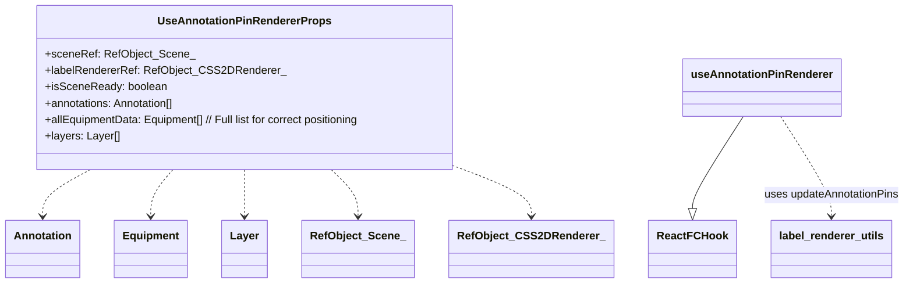

## useAnnotationPinRenderer

Hook customizado para gerenciar a renderização (criação, atualização, remoção)
dos pins de anotação (`CSS2DObject`) na cena.

### Parameters

*   `props` **[UseAnnotationPinRendererProps][232]** As props do hook.

    *   `props.sceneRef` &#x20;
    *   `props.labelRendererRef` &#x20;
    *   `props.isSceneReady` &#x20;
    *   `props.annotations` &#x20;
    *   `props.allEquipmentData` &#x20;
    *   `props.layers` &#x20;

Returns **void**&#x20;

##

*   **See**: [../../lib/types/README.md#CameraState][439] Para a interface do estado da câmera.
*   **See**: [../../lib/types/README.md#Command][440] Para a interface de comando (usada com `executeCommand`).
*   **See**: [../../lib/types/README.md#TargetSystemInfo][441] Para a interface de informações do sistema alvo.

### Parameters

*   `props`  Propriedades para o hook, incluindo `executeCommand` para integração com histórico.

### Examples

````javascript
// Diagrama de Interação e Estado do useCameraManager:
```mermaid
graph LR
    A[Terminal3DPage] -- chama --> B(handleSetCameraViewForSystem)
    B -- atualiza --> C{targetSystemToFrame};
    C -- atualiza --> D{focusedSystemNameUI};
    C -- atualiza --> E{currentViewIndexUI};
    A -- passa targetSystemToFrame --> F[ThreeScene]

    F -- anima câmera e ao final chama --> G(onSystemFramed)
    G -- limpa --> C;
    F -- em interações manuais, chama --> H(handleCameraChangeFromScene)

    H -- cria comando --> I{Comando}
    H -- chama --> J(executeCommand)
    J -- executa e salva --> I

    subgraph useCameraManager [Hook useCameraManager]
        direction LR
        B
        G
        H
        C
        D
        E
        K[currentCameraState (Estado React)]
        L[lastCommittedCameraStateForUndoRef (Ref)]
    end

    I -- no execute/undo --> M{setCurrentCameraState}
    M -- atualiza --> K
    K -- usado por --> F

   classDef hook fill:#lightblue,stroke:#333,stroke-width:2px;
   classDef state fill:#lightgoldenrodyellow,stroke:#333,stroke-width:2px;
   classDef func fill:#lightgreen,stroke:#333,stroke-width:2px;
   classDef comp fill:#lightcoral,stroke:#333,stroke-width:2px;

   class A,F comp;
   class B,G,H,J,M func;
   class C,D,E,K,L,I state;
   class useCameraManager hook;
```
````

Returns **any** Objeto contendo o estado da câmera, informações de foco, e funções para interagir com a câmera.

## defaultInitialCameraPosition

Posição inicial padrão da câmera: { x: 25, y: 20, z: 25 }.

## defaultInitialCameraPosition

Posição inicial padrão da câmera: { x: 25, y: 20, z: 25 }.

## defaultInitialCameraLookAt

Ponto de observação (lookAt) inicial padrão da câmera: { x: 0, y: 2, z: 0 }.

## defaultInitialCameraLookAt

Ponto de observação (lookAt) inicial padrão da câmera: { x: 0, y: 2, z: 0 }.

## UseCameraManagerProps

Props para o hook `useCameraManager`.

## UseCameraManagerProps

Props para o hook `useCameraManager`.

## UseCameraManagerReturn

Retorno do hook `useCameraManager`.

### Properties

*   `currentCameraState` **[CameraState][395]** O estado atual da câmera (posição e ponto de observação).
*   `targetSystemToFrame` **([TargetSystemInfo][399] | null)** O sistema alvo e o índice da visão para a câmera enquadrar. Null se nenhum foco ativo.
*   `focusedSystemNameUI` **([string][414] | null)** O nome do sistema atualmente focado (para UI, pode persistir mesmo após `targetSystemToFrame` ser limpo).
*   `currentViewIndexUI` **[number][428]** O índice da visão atual para o sistema focado (para UI).

## UseCameraManagerReturn

Retorno do hook `useCameraManager`.

### Properties

*   `currentCameraState` **[CameraState][395]** O estado atual da câmera (posição e ponto de observação).
*   `targetSystemToFrame` **([TargetSystemInfo][399] | null)** O sistema alvo e o índice da visão para a câmera enquadrar. Null se nenhum foco ativo.
*   `focusedSystemNameUI` **([string][414] | null)** O nome do sistema atualmente focado (para UI, pode persistir mesmo após `targetSystemToFrame` ser limpo).
*   `currentViewIndexUI` **[number][428]** O índice da visão atual para o sistema focado (para UI).

## useCameraManager

Hook customizado para gerenciar o estado e as interações da câmera 3D.
Responsável pelo estado da câmera, foco em sistemas e integração com o histórico de comandos.

### Parameters

*   `props` **[UseCameraManagerProps][242]** As props do hook, incluindo `executeCommand` para integração com o histórico.

    *   `props.executeCommand` &#x20;

Returns **[UseCameraManagerReturn][244]** Um objeto contendo o estado da câmera e funções para interagir com ela.

## useCameraManager

Hook customizado para gerenciar o estado e as interações da câmera 3D.
Responsável pelo estado da câmera, foco em sistemas e integração com o histórico de comandos.

### Parameters

*   `props` **[UseCameraManagerProps][242]** As props do hook, incluindo `executeCommand` para integração com o histórico.

    *   `props.executeCommand` &#x20;

Returns **[UseCameraManagerReturn][244]** Um objeto contendo o estado da câmera e funções para interagir com ela.

## handleSetCameraViewForSystem

Define o sistema alvo e o índice da visão para a câmera enquadrar.
Se o mesmo sistema é clicado repetidamente, cicla entre as visualizações disponíveis.

### Parameters

*   `systemName` **[string][414]** O nome do sistema para focar.

## handleSetCameraViewForSystem

Define o sistema alvo e o índice da visão para a câmera enquadrar.
Se o mesmo sistema é clicado repetidamente, cicla entre as visualizações disponíveis.

### Parameters

*   `systemName` **[string][414]** O nome do sistema para focar.

## handleCameraChangeFromScene

Manipula mudanças de câmera provenientes da cena 3D (e.g., interações do usuário com OrbitControls)
ou de animações programáticas concluídas. Registra a mudança no histórico de comandos.

### Parameters

*   `newSceneCameraState` **[CameraState][395]** O novo estado da câmera.
*   `actionDescription` **[string][414]?** Descrição opcional da ação para o histórico (e.g., "Foco no sistema X").

## handleCameraChangeFromScene

Manipula mudanças de câmera provenientes da cena 3D (e.g., interações do usuário com OrbitControls)
ou de animações programáticas concluídas. Registra a mudança no histórico de comandos.

### Parameters

*   `newSceneCameraState` **[CameraState][395]** O novo estado da câmera.
*   `actionDescription` **[string][414]?** Descrição opcional da ação para o histórico (e.g., "Foco no sistema X").

## onSystemFramed

Callback para ser chamado pela `ThreeScene` após o enquadramento do sistema ser concluído.
Reseta `targetSystemToFrame`, indicando que o processo de foco foi finalizado.

## onSystemFramed

Callback para ser chamado pela `ThreeScene` após o enquadramento do sistema ser concluído.
Reseta `targetSystemToFrame`, indicando que o processo de foco foi finalizado.

## Command

### Examples

````javascript
Diagrama de Estrutura do Hook e seus Retornos:
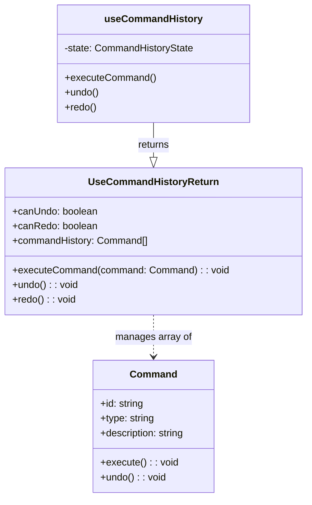
````

## Command

Representa um comando executável e reversível para o sistema de Undo/Redo.
Cada ação do usuário que pode ser desfeita (e.g., mover a câmera, alternar visibilidade de camada,
selecionar equipamento) deve ser encapsulada como um `Command`.

### Properties

*   `id` **[string][414]** Identificador único do comando, geralmente incluindo um timestamp para unicidade.
*   `type` **(`"CAMERA_MOVE"` | `"LAYER_VISIBILITY"` | `"EQUIPMENT_SELECT"`)** Tipo do comando, para categorização.
*   `description` **[string][414]** Descrição textual do comando, usada para logging ou exibição na UI (e.g., em toasts de undo/redo).

## CommandHistoryState

Interface para o estado interno do histórico de comandos.

### Properties

*   `history` **[Array][416]<[Command][262]>** Array de objetos de comando que foram executados.
*   `currentIndex` **[number][428]** Índice do comando atual no array `history`.
    -1 se o histórico estiver vazio ou todos os comandos foram desfeitos.

## UseCommandHistoryReturn

Retorno do hook `useCommandHistory`.

### Properties

*   `canUndo` **[boolean][415]** Verdadeiro se há comandos para desfazer, falso caso contrário.
*   `canRedo` **[boolean][415]** Verdadeiro se há comandos para refazer, falso caso contrário.
*   `commandHistory` **[Array][416]<[Command][262]>** O array completo do histórico de comandos, principalmente para depuração.

## useCommandHistory

Hook customizado para gerenciar um histórico de comandos, permitindo Undo e Redo.
Armazena uma lista de comandos e o índice atual, permitindo navegar para frente e para trás
através das ações do usuário que foram encapsuladas como comandos.

### Parameters

*   `initialState` **[CommandHistoryState][266]?** Estado inicial opcional para o histórico.
    Padrão: histórico vazio (`history: []`) e `currentIndex: -1`.

Returns **[UseCommandHistoryReturn][268]** Um objeto com funções para executar, desfazer, refazer comandos,
e flags indicando se undo/redo são possíveis, além do próprio histórico.

## executeCommand

Executa um comando e o adiciona ao histórico.
Se houver comandos "futuros" (comandos que foram desfeitos e poderiam ser refeitos),
eles são descartados, pois uma nova ação invalida essa linha do tempo de redo.

### Parameters

*   `command` **[Command][262]** O comando a ser executado. A função `command.execute()` é chamada.

## undo

Desfaz o último comando executado (o comando no `currentIndex`).
Se não houver comandos para desfazer (`currentIndex < 0`), não faz nada.
Chama a função `undo()` do comando.

## redo

Refaz o último comando desfeito (o comando após o `currentIndex`).
Se não houver comandos para refazer (`currentIndex` já é o último do histórico), não faz nada.
Chama a função `execute()` do comando a ser refeito.

##

*   **See**: [../../core/repository/memory-repository/README.md#equipmentRepository][436] Para a fonte de dados.
*   **See**: [../../lib/types/README.md#Equipment][438] Para a interface de Equipamento.

### Examples

````javascript
// Diagrama de Interação do useEquipmentDataManager:
```mermaid
graph TD
    A[Componente UI (ex: InfoPanel)] -- chama --> B(handleOperationalStateChange)

    subgraph useEquipmentDataManager [Hook useEquipmentDataManager]
        direction LR
        B -- chama --> C[equipmentRepository.updateEquipment]
        C -- retorna --> B{Equipamento Atualizado}
        B -- chama --> D[equipmentRepository.getAllEquipment]
        D -- retorna --> E[setEquipmentData (Estado React)]
        E -- atualiza --> F[equipmentData (Estado React)]
        B -- chama --> G[toast]
    end

    F -- usado por --> A

   classDef hook fill:#lightblue,stroke:#333,stroke-width:2px;
   classDef state fill:#lightgoldenrodyellow,stroke:#333,stroke-width:2px;
   classDef func fill:#lightgreen,stroke:#333,stroke-width:2px;
   classDef repo fill:#lightcoral,stroke:#333,stroke-width:2px;
   classDef ui fill:#peachpuff,stroke:#333,stroke-width:2px;

   class A ui;
   class B,G func;
   class C,D repo;
   class E,F state;
   class useEquipmentDataManager hook;
```
````

Returns **any** Objeto contendo os dados dos equipamentos e funções para modificá-los e atualizá-los.

## UseEquipmentDataManagerReturn

Retorno do hook `useEquipmentDataManager`.

### Properties

*   `equipmentData` **[Array][416]<[Equipment][32]>** A lista atual de todos os equipamentos (cópia local do estado do repositório).

## UseEquipmentDataManagerReturn

Retorno do hook `useEquipmentDataManager`.

### Properties

*   `equipmentData` **[Array][416]<[Equipment][32]>** A lista atual de todos os equipamentos (cópia local do estado do repositório).

## useEquipmentDataManager

Hook customizado para gerenciar os dados dos equipamentos, atuando como uma fachada para o `equipmentRepository`.
Inicializa os dados do repositório e fornece funções para modificar
propriedades como estado operacional e produto, com feedback via toast.

Returns **[UseEquipmentDataManagerReturn][278]** Um objeto contendo os dados dos equipamentos
e funções para modificá-los.

## useEquipmentDataManager

Hook customizado para gerenciar os dados dos equipamentos, atuando como uma fachada para o `equipmentRepository`.
Inicializa os dados do repositório e fornece funções para modificar
propriedades como estado operacional e produto, com feedback via toast.

Returns **[UseEquipmentDataManagerReturn][278]** Um objeto contendo os dados dos equipamentos
e funções para modificá-los.

## refreshEquipmentData

Recarrega os dados dos equipamentos do repositório para o estado local do hook.

## refreshEquipmentData

Recarrega os dados dos equipamentos do repositório para o estado local do hook.

## handleOperationalStateChange

Manipula a alteração do estado operacional de um equipamento.
Atualiza o repositório e, em seguida, o estado local do hook.

### Parameters

*   `equipmentTag` **[string][414]** A tag do equipamento a ser modificado.
*   `newState` **[string][414]** O novo estado operacional para o equipamento.

## handleOperationalStateChange

Manipula a alteração do estado operacional de um equipamento.
Atualiza o repositório e, em seguida, o estado local do hook.

### Parameters

*   `equipmentTag` **[string][414]** A tag do equipamento a ser modificado.
*   `newState` **[string][414]** O novo estado operacional para o equipamento.

## handleProductChange

Manipula a alteração do produto de um equipamento.
Atualiza o repositório e, em seguida, o estado local do hook.

### Parameters

*   `equipmentTag` **[string][414]** A tag do equipamento a ser modificado.
*   `newProduct` **[string][414]** O novo produto para o equipamento.

## handleProductChange

Manipula a alteração do produto de um equipamento.
Atualiza o repositório e, em seguida, o estado local do hook.

### Parameters

*   `equipmentTag` **[string][414]** A tag do equipamento a ser modificado.
*   `newProduct` **[string][414]** O novo produto para o equipamento.

## UseEquipmentRendererProps

### Examples

````javascript
Diagrama de Composição e Dependências:
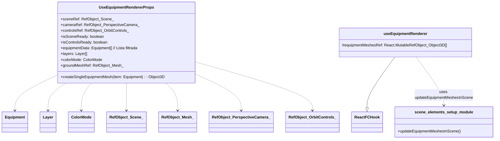
````

## useEquipmentRenderer

Hook customizado para gerenciar a renderização (criação, atualização, remoção)
dos meshes de equipamentos na cena Three.js.

### Parameters

*   `props` **[UseEquipmentRendererProps][294]** As props do hook.

    *   `props.sceneRef` &#x20;
    *   `props.cameraRef` &#x20;
    *   `props.controlsRef` &#x20;
    *   `props.isSceneReady` &#x20;
    *   `props.isControlsReady` &#x20;
    *   `props.equipmentData` &#x20;
    *   `props.layers` &#x20;
    *   `props.colorMode` &#x20;
    *   `props.createSingleEquipmentMesh` &#x20;
    *   `props.groundMeshRef` &#x20;

Returns **React.RefObject<[Array][416]\<THREE.Object3D>>** Ref para a lista de meshes de equipamentos atualmente na cena.
Este ref é gerenciado internamente pelo hook mas retornado para que outros hooks
(e.g., para raycasting) possam acessá-lo.

##

Custom hook para gerenciar o estado e a lógica de seleção e hover de equipamentos na cena 3D.

Principal Responsabilidade:
Manter o estado dos equipamentos selecionados e em hover, e fornecer funções para
manipular essas seleções (clique único, clique múltiplo, seleção em lote).
Integra-se com `useCommandHistory` para registrar ações de seleção e `useToast` para feedback.

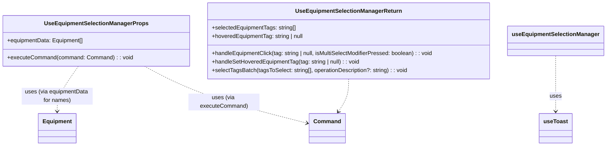

## UseEquipmentSelectionManagerProps

Props para o hook `useEquipmentSelectionManager`.

### Properties

*   `equipmentData` **[Array][416]<[Equipment][32]>** Lista completa de todos os equipamentos. Usada para buscar nomes
    de equipamentos para mensagens de feedback (toasts).

## UseEquipmentSelectionManagerReturn

Retorno do hook `useEquipmentSelectionManager`.

### Properties

*   `selectedEquipmentTags` **[Array][416]<[string][414]>** Array das tags dos equipamentos atualmente selecionados.
*   `hoveredEquipmentTag` **([string][414] | null)** Tag do equipamento atualmente sob o cursor do mouse, ou null.

## useEquipmentSelectionManager

Hook customizado para gerenciar a seleção e o estado de hover dos equipamentos.
Encapsula a lógica de seleção única/múltipla, hover, seleção em lote e integração com o histórico de comandos.

### Parameters

*   `props` **[UseEquipmentSelectionManagerProps][299]** As props do hook.

    *   `props.equipmentData` &#x20;
    *   `props.executeCommand` &#x20;

Returns **[UseEquipmentSelectionManagerReturn][301]** O estado da seleção e as funções para manipulá-la.

## handleEquipmentClick

Manipula o clique em um equipamento na cena 3D para seleção.
Gerencia seleção única, múltipla (com Ctrl/Cmd) e deseleção.
Cria e executa um comando para o histórico de Undo/Redo.

### Parameters

*   `tag` **([string][414] | null)** A tag do equipamento clicado, ou null se o clique foi em espaço vazio.
*   `isMultiSelectModifierPressed` **[boolean][415]** True se Ctrl/Cmd (ou Meta) foi pressionado durante o clique.

## handleSetHoveredEquipmentTag

Define diretamente a tag do equipamento sob o cursor.
Esta função é geralmente chamada em resposta a eventos de mousemove na cena 3D.

### Parameters

*   `tag` **([string][414] | null)** A tag do equipamento, ou null se nenhum estiver sob o cursor.

## selectTagsBatch

Seleciona programaticamente um conjunto de tags de equipamento.
Usado, por exemplo, ao focar em um sistema para selecionar todos os seus equipamentos.
Cria e executa um comando para o histórico de Undo/Redo.

### Parameters

*   `tagsToSelect` **[Array][416]<[string][414]>** Array de tags de equipamento a serem selecionadas.
*   `operationDescription` **[string][414]?** Descrição opcional para o comando no histórico (e para o toast).
    Padrão: "Selecionados X equipamentos em lote."

##

### Examples

````javascript
Diagrama de Estrutura do Hook e suas Dependências:
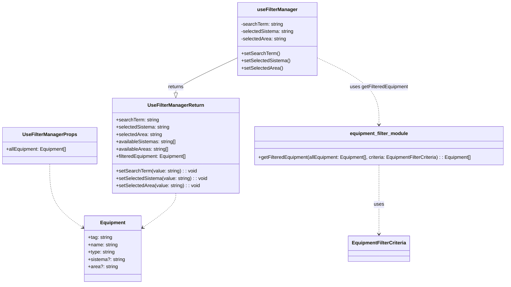
````

## UseFilterManagerProps

Props para o hook `useFilterManager`.

### Properties

*   `allEquipment` **[Array][416]<[Equipment][32]>** A lista completa de todos os equipamentos que podem ser filtrados.

## UseFilterManagerReturn

Retorno do hook `useFilterManager`.

### Properties

*   `searchTerm` **[string][414]** O termo de busca textual atualmente aplicado.
*   `setSearchTerm` **Dispatch\<SetStateAction<[string][414]>>** Função para atualizar o `searchTerm`.
*   `selectedSistema` **[string][414]** O sistema atualmente selecionado para filtro (e.g., "GA", "All").
*   `setSelectedSistema` **Dispatch\<SetStateAction<[string][414]>>** Função para atualizar o `selectedSistema`.
*   `selectedArea` **[string][414]** A área atualmente selecionada para filtro (e.g., "Área 31", "All").
*   `setSelectedArea` **Dispatch\<SetStateAction<[string][414]>>** Função para atualizar o `selectedArea`.
*   `availableSistemas` **[Array][416]<[string][414]>** Lista ordenada de sistemas únicos disponíveis para seleção no filtro, incluindo "All".
*   `availableAreas` **[Array][416]<[string][414]>** Lista ordenada de áreas únicas disponíveis para seleção no filtro, incluindo "All".
*   `filteredEquipment` **[Array][416]<[Equipment][32]>** A lista de equipamentos resultante após a aplicação de todos os filtros ativos.

## useFilterManager

Hook customizado para gerenciar a lógica de filtragem de equipamentos.
Encapsula os estados dos filtros (termo de busca, sistema, área),
deriva as listas de opções de filtro disponíveis a partir dos dados dos equipamentos,
e calcula a lista resultante de equipamentos filtrados.

### Parameters

*   `props` **[UseFilterManagerProps][313]** As propriedades para o hook, incluindo `allEquipment` (a lista completa de equipamentos).

    *   `props.allEquipment` &#x20;

Returns **[UseFilterManagerReturn][315]** Um objeto contendo o estado dos filtros, as funções para atualizá-los,
as listas de opções de filtro disponíveis e a lista de equipamentos filtrados.

## availableSistemas

Lista de sistemas únicos disponíveis, derivada de `allEquipment`.
Inclui "All" como a primeira opção e é ordenada alfabeticamente.
Memoizada para otimizar performance, recalculando apenas se `allEquipment` mudar.

## availableAreas

Lista de áreas únicas disponíveis, derivada de `allEquipment`.
Inclui "All" como a primeira opção e é ordenada alfabeticamente.
Memoizada para otimizar performance.

## filteredEquipment

Lista de equipamentos filtrada com base nos critérios atuais (`searchTerm`, `selectedSistema`, `selectedArea`).
Utiliza a função `getFilteredEquipment` para aplicar a lógica de filtragem combinada.
Memoizada para recalcular apenas quando os critérios de filtro ou `allEquipment` mudarem.

##

### Examples

````javascript
Diagrama de Estrutura do Hook e suas Dependências:
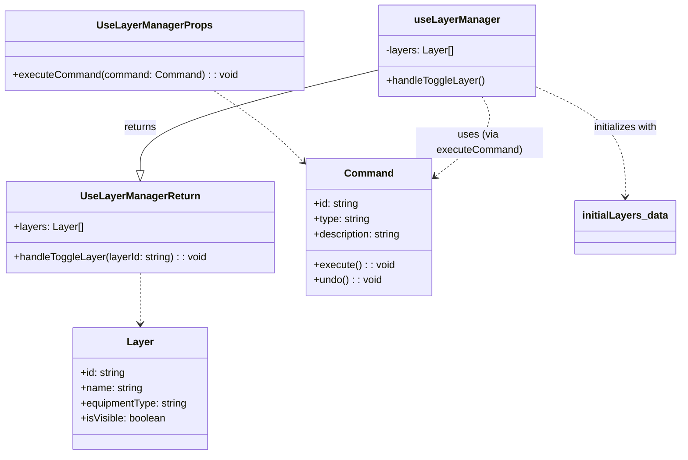
````

## UseLayerManagerProps

Props para o hook `useLayerManager`.

## UseLayerManagerReturn

Retorno do hook `useLayerManager`.

### Properties

*   `layers` **[Array][416]<[Layer][393]>** A lista atual de todas as camadas e seus respectivos estados de visibilidade.

## useLayerManager

Hook customizado para gerenciar o estado das camadas de visibilidade da cena e sua manipulação.
Inicializa as camadas com os dados de `initialLayers` e permite alternar a visibilidade
de cada camada, registrando a ação no histórico de comandos para suportar undo/redo.

### Parameters

*   `props` **[UseLayerManagerProps][324]** As props do hook, principalmente `executeCommand` para
    integração com o sistema de histórico.

    *   `props.executeCommand` &#x20;

Returns **[UseLayerManagerReturn][325]** Um objeto contendo o estado atual das camadas e a função
para alternar sua visibilidade.

## handleToggleLayer

Manipula a alternância de visibilidade de uma camada específica.
Encontra a camada pelo `layerId`, cria um novo estado de camadas com a visibilidade
da camada alvo invertida, e então cria e executa um comando para o histórico de Undo/Redo
que aplicará essa mudança (e permitirá revertê-la).

### Parameters

*   `layerId` **[string][414]** O ID da camada cuja visibilidade deve ser alternada.

## raycaster

### Examples

````javascript
// Diagrama de Composição e Dependências:
```mermaid
  classDiagram
    class UseMouseInteractionManagerProps {
      +mountRef: RefObject_HTMLDivElement_
      +cameraRef: RefObject_PerspectiveCamera_
      +equipmentMeshesRef: RefObject_Object3D_Array_
      +isSceneReady: boolean
      +onSelectEquipment(tag: string | null, isMultiSelect: boolean): void
      +setHoveredEquipmentTag(tag: string | null): void
    }
    class useMouseInteractionManager {

    }
    class ReactFCHook {

    }
    class RefObject_HTMLDivElement_ {
    }
    class RefObject_PerspectiveCamera_ {
    }
    class RefObject_Object3D_Array_ {
    }
    useMouseInteractionManager --|> ReactFCHook
    UseMouseInteractionManagerProps ..> RefObject_HTMLDivElement_
    UseMouseInteractionManagerProps ..> RefObject_PerspectiveCamera_
    UseMouseInteractionManagerProps ..> RefObject_Object3D_Array_
```
````

## useMouseInteractionManager

Hook customizado para gerenciar interações do mouse (clique e movimento)
para seleção e hover de equipamentos em uma cena Three.js.

### Parameters

*   `props` **UseMouseInteractionManagerProps** As props do hook.

    *   `props.mountRef` &#x20;
    *   `props.cameraRef` &#x20;
    *   `props.equipmentMeshesRef` &#x20;
    *   `props.isSceneReady` &#x20;
    *   `props.onSelectEquipment` &#x20;
    *   `props.setHoveredEquipmentTag` &#x20;

Returns **void**&#x20;

## processSceneClickInternal

Processa um evento de clique do mouse na cena para selecionar equipamento.

## processSceneMouseMoveInternal

Processa um evento de movimento do mouse na cena para detectar equipamento em hover.

##

### Examples

````javascript
Diagrama de Composição e Dependências:
```mermaid
  classDiagram
    class UseSceneOutlineProps {
      +outlinePassRef: RefObject_OutlinePass_
      +equipmentMeshesRef: RefObject_Object3D_Array_
      +selectedEquipmentTags: string[] | undefined
      +hoveredEquipmentTag: string | null | undefined
      +isSceneReady: boolean
    }
    class RefObject_OutlinePass_ {
      current: OutlinePass | null
    }
    class RefObject_Object3D_Array_ {
      current: THREE.Object3D[] | null
    }
    class useSceneOutline {

    }
    class postprocessing_utils_module {
      +updateOutlineEffect()
    }
    useSceneOutline ..> postprocessing_utils_module : uses updateOutlineEffect
    UseSceneOutlineProps --> RefObject_OutlinePass_
    UseSceneOutlineProps --> RefObject_Object3D_Array_
```
````

## UseSceneOutlineProps

Props para o hook useSceneOutline.

### Properties

*   `outlinePassRef` **React.RefObject<(OutlinePass | null)>** Ref para a instância do OutlinePass.
*   `equipmentMeshesRef` **React.RefObject<[Array][416]\<THREE.Object3D>>** Ref para o array de meshes de equipamentos na cena.
*   `selectedEquipmentTags` **([Array][416]<[string][414]> | [undefined][417])** Array de tags dos equipamentos selecionados.
*   `hoveredEquipmentTag` **([string][414] | null | [undefined][417])** Tag do equipamento atualmente em hover.
*   `isSceneReady` **[boolean][415]** Flag indicando se a cena 3D está pronta.

## useSceneOutline

Hook customizado para gerenciar e aplicar o efeito de contorno (OutlinePass)
aos equipamentos selecionados ou em hover na cena 3D.

### Parameters

*   `props` **[UseSceneOutlineProps][339]** As props para o hook.

    *   `props.outlinePassRef` &#x20;
    *   `props.equipmentMeshesRef` &#x20;
    *   `props.selectedEquipmentTags` &#x20;
    *   `props.hoveredEquipmentTag` &#x20;
    *   `props.isSceneReady` &#x20;

Returns **void**&#x20;

## UseSceneSetupProps

Props para o hook orquestrador da configuração da cena.

### Properties

*   `mountRef` **React.RefObject<[HTMLDivElement][442]>** Ref para o elemento DOM contêiner da cena.

## UseSceneSetupReturn

Valor de retorno do hook orquestrador da configuração da cena.
Agrega refs e flags de prontidão dos hooks especializados.

### Properties

*   `sceneRef` **React.RefObject<(THREE.Scene | null)>** Ref para a cena Three.js.
*   `cameraRef` **React.RefObject<(THREE.PerspectiveCamera | null)>** Ref para a câmera perspectiva.
*   `rendererRef` **React.RefObject<(THREE.WebGLRenderer | null)>** Ref para o renderizador WebGL.
*   `labelRendererRef` **React.RefObject<(CSS2DRenderer | null)>** Ref para o renderizador CSS2D (para rótulos).
*   `controlsRef` **React.RefObject<(OrbitControlsType | null)>** Ref para os OrbitControls.
*   `composerRef` **React.RefObject<(EffectComposer | null)>** Ref para o EffectComposer (pós-processamento).
*   `outlinePassRef` **React.RefObject<(OutlinePass | null)>** Ref para o OutlinePass (efeito de contorno).
*   `groundMeshRef` **React.RefObject<(THREE.Mesh | null)>** Ref para a malha do plano de chão.
*   `isSceneReady` **[boolean][415]** Flag que indica se os componentes principais da cena (núcleo, renderizadores, elementos) estão prontos.
*   `isControlsReady` **[boolean][415]** Flag que indica se os OrbitControls estão prontos (carregamento dinâmico).

## useSceneSetup

Orquestra a configuração de uma cena Three.js compondo hooks especializados.
Este hook é responsável por inicializar o núcleo da cena, renderizadores, controles,
elementos básicos da cena (iluminação, chão) e manipulação de redimensionamento.
Ele fornece refs para todos os principais componentes Three.js e flags indicando sua prontidão.

### Parameters

*   `props` **[UseSceneSetupProps][343]** Propriedades de configuração para a montagem da cena.

Returns **[UseSceneSetupReturn][345]** Refs para os componentes da cena e flags de prontidão.

##

*   **See**: [/documentation/api/core/repository/memory-repository/README.md#annotationrepository][443] Para a fonte de dados das anotações.
*   **See**: [/documentation/api/core/repository/memory-repository/README.md#equipmentrepository][444] Para obter dados de equipamentos (e.g., nome para toasts).
*   **See**: [/documentation/api/lib/types/README.md#Annotation][427] Para a interface de Anotação.
*   **See**: [/documentation/api/lib/types/README.md#Equipment][426] Para a interface de Equipamento.

### Parameters

*   `props`  Propriedades de configuração para o hook (atualmente, `initialAnnotations` é opcional e usado para uma potencial inicialização única do repositório, embora o repositório seja auto-inicializável).

### Examples

````javascript
Diagrama de Interação do useAnnotationManager:
```mermaid
graph TD
    A[Componente UI (ex: InfoPanel)] -- chama --> B(handleOpenAnnotationDialog)
    B -- define estados --> DialogState["isAnnotationDialogOpen, editingAnnotation, annotationTargetEquipment"]

    C[Componente UI (ex: AnnotationDialog)] -- no submit --> D(handleSaveAnnotation)

    subgraph useAnnotationManager [Hook useAnnotationManager]
        direction LR
        D -- chama --> E[annotationRepository.addOrUpdateAnnotation]
        E -- retorna --> D{Anotação Salva}
        D -- chama --> F[refreshAnnotationsFromRepo]
        F -- chama --> G[annotationRepository.getAllAnnotations]
        G -- retorna --> H[setAnnotationsState (Estado React)]
        H -- atualiza --> I[annotations (Estado React)]
        D -- chama --> J[toast]
        DialogState
    end

    I -- usado por --> A
    DialogState -- usado por --> C

   classDef hook fill:#lightblue,stroke:#333,stroke-width:2px;
   classDef state fill:#lightgoldenrodyellow,stroke:#333,stroke-width:2px;
   classDef func fill:#lightgreen,stroke:#333,stroke-width:2px;
   classDef repo fill:#lightcoral,stroke:#333,stroke-width:2px;
   classDef ui fill:#peachpuff,stroke:#333,stroke-width:2px;

   class A,C ui;
   class B,D,F,J func;
   class E,G repo;
   class DialogState,H,I state;
   class useAnnotationManager hook;
```
````

Returns **any** Objeto contendo o estado das anotações, o estado do diálogo e funções para manipular anotações.

##

*   **See**: [/documentation/api/lib/types/README.md#CameraState][445] Para a interface do estado da câmera.
*   **See**: [/documentation/api/lib/types/README.md#Command][446] Para a interface de comando (usada com `executeCommand`).
*   **See**: [/documentation/api/lib/types/README.md#TargetSystemInfo][447] Para a interface de informações do sistema alvo.

### Parameters

*   `props`  Propriedades para o hook, incluindo `executeCommand` para integração com histórico.

### Examples

````javascript
Diagrama de Interação e Estado do useCameraManager:
```mermaid
graph LR
    A[Terminal3DPage] -- chama --> B(handleSetCameraViewForSystem)
    B -- atualiza --> C{targetSystemToFrame};
    C -- atualiza --> D{focusedSystemNameUI};
    C -- atualiza --> E{currentViewIndexUI};
    A -- passa targetSystemToFrame --> F[ThreeScene]

    F -- anima câmera e ao final chama --> G(onSystemFramed)
    G -- limpa --> C;
    F -- em interações manuais, chama --> H(handleCameraChangeFromScene)

    H -- cria comando --> I{Comando}
    H -- chama --> J(executeCommand)
    J -- executa e salva --> I

    subgraph useCameraManager [Hook useCameraManager]
        direction LR
        B
        G
        H
        C
        D
        E
        K[currentCameraState (Estado React)]
        L[lastCommittedCameraStateForUndoRef (Ref)]
    end

    I -- no execute/undo --> M{setCurrentCameraState}
    M -- atualiza --> K
    K -- usado por --> F

   classDef hook fill:#lightblue,stroke:#333,stroke-width:2px;
   classDef state fill:#lightgoldenrodyellow,stroke:#333,stroke-width:2px;
   classDef func fill:#lightgreen,stroke:#333,stroke-width:2px;
   classDef comp fill:#lightcoral,stroke:#333,stroke-width:2px;

   class A,F comp;
   class B,G,H,J,M func;
   class C,D,E,K,L,I state;
   class useCameraManager hook;
```
````

Returns **any** Objeto contendo o estado da câmera, informações de foco, e funções para interagir com a câmera.

##

*   **See**: [/documentation/api/core/repository/memory-repository/README.md#equipmentrepository][444] Para a fonte de dados.
*   **See**: [/documentation/api/lib/types/README.md#Equipment][426] Para a interface de Equipamento.

### Examples

````javascript
Diagrama de Interação do useEquipmentDataManager:
```mermaid
graph TD
    A[Componente UI (ex: InfoPanel)] -- chama --> B(handleOperationalStateChange)

    subgraph useEquipmentDataManager [Hook useEquipmentDataManager]
        direction LR
        B -- chama --> C[equipmentRepository.updateEquipment]
        C -- retorna --> B{Equipamento Atualizado}
        B -- chama --> D[equipmentRepository.getAllEquipment]
        D -- retorna --> E[setEquipmentData (Estado React)]
        E -- atualiza --> F[equipmentData (Estado React)]
        B -- chama --> G[toast]
    end

    F -- usado por --> A

   classDef hook fill:#lightblue,stroke:#333,stroke-width:2px;
   classDef state fill:#lightgoldenrodyellow,stroke:#333,stroke-width:2px;
   classDef func fill:#lightgreen,stroke:#333,stroke-width:2px;
   classDef repo fill:#lightcoral,stroke:#333,stroke-width:2px;
   classDef ui fill:#peachpuff,stroke:#333,stroke-width:2px;

   class A ui;
   class B,G func;
   class C,D repo;
   class E,F state;
   class useEquipmentDataManager hook;
```
````

Returns **any** Objeto contendo os dados dos equipamentos e funções para modificá-los e atualizá-los.

## useRef

### Examples

````javascript
Diagrama de Responsabilidade do useThreeCore:
```mermaid
graph TD
    useThreeCore["useThreeCore (Hook)"]
    Props["UseThreeCoreProps"]
    Return["UseThreeCoreReturn"]
    Scene["THREE.Scene"]
    Camera["THREE.PerspectiveCamera"]
    MountElement["Elemento DOM (para aspect ratio)"]

    Props --> useThreeCore
    useThreeCore -- cria --> Scene
    useThreeCore -- cria e configura com base em --> MountElement
    useThreeCore -- cria e configura --> Camera
    useThreeCore -- retorna refs para --> Return
    Return -- contém ref para --> Scene
    Return -- contém ref para --> Camera

    Props -- define --> PInitialPos["initialCameraPosition"]
    Props -- define --> PMountRef["mountRef"]

    classDef hook fill:#lightblue,stroke:#333,stroke-width:2px;
    classDef type fill:#lightgoldenrodyellow,stroke:#333,stroke-width:2px;
    classDef obj3d fill:#lightgreen,stroke:#333,stroke-width:2px;
    classDef dom fill:#lightcoral,stroke:#333,stroke-width:2px;

    class useThreeCore hook;
    class Props,Return,PInitialPos,PMountRef type;
    class Scene,Camera obj3d;
    class MountElement dom;
```
````

Returns **any** Refs para os objetos de cena e câmera criados.

## useRef

### Examples

````javascript
Diagrama de Fluxo do useThreeOrbitControls:
```mermaid
sequenceDiagram
    participant Usuário
    participant ThreeScene as Componente React
    participant useThreeOrbitControls as Hook
    participant OrbitControls as Módulo Three.js

    ThreeScene ->>+ useThreeOrbitControls: Chama com cameraRef, rendererRef, etc.
    Note right of useThreeOrbitControls: renderersReady = true?
    useThreeOrbitControls ->>+ OrbitControls: import('OrbitControls.js')
    OrbitControls -->>- useThreeOrbitControls: Módulo carregado
    useThreeOrbitControls -->> OrbitControls: new OrbitControls(camera, renderer.domElement)
    useThreeOrbitControls -->> OrbitControls: Configura (enableDamping, target, mouseButtons)
    useThreeOrbitControls -->> OrbitControls: addEventListener('end', handleEnd)
    useThreeOrbitControls -->> ThreeScene: Retorna controlsRef, isControlsReady = true
    activate Usuário
    Usuário ->> OrbitControls: Interage com a câmera (arrasta mouse)
    OrbitControls -->> OrbitControls: Atualiza posição/rotação da câmera
    Usuário ->> OrbitControls: Solta o botão do mouse
    deactivate Usuário
    OrbitControls -->> useThreeOrbitControls: Dispara evento 'end'
    useThreeOrbitControls ->> ThreeScene: Chama onCameraChange(novoEstado)
    Note right of ThreeScene: Atualiza estado da câmera da aplicação
```
````

Returns **any** Ref para a instância de `OrbitControls` e uma flag indicando sua prontidão.

## useRef

### Examples

````javascript
Diagrama de Componentes Criados por useThreeRenderers:
```mermaid
graph TD
    useThreeRenderers["useThreeRenderers (Hook)"]
    Props["UseThreeRenderersProps"]
    Return["UseThreeRenderersReturn"]

    subgraph "Objetos Three.js Gerenciados"
        WebGLRenderer["THREE.WebGLRenderer"]
        CSS2DRenderer["THREE.CSS2DRenderer"]
        EffectComposer["THREE.EffectComposer"]
        RenderPass["THREE.RenderPass"]
        OutlinePass["THREE.OutlinePass"]
    end

    Props -- define --> PExistingSceneRef["sceneRef (existente)"]
    Props -- define --> PExistingCameraRef["cameraRef (existente)"]
    Props -- define --> PMountRef["mountRef (DOM)"]

    useThreeRenderers -- usa --> PExistingSceneRef
    useThreeRenderers -- usa --> PExistingCameraRef
    useThreeRenderers -- anexa ao --> PMountRef

    useThreeRenderers -- cria e configura --> WebGLRenderer
    useThreeRenderers -- cria e configura --> CSS2DRenderer
    useThreeRenderers -- cria e configura --> EffectComposer
    EffectComposer -- contém --> RenderPass
    EffectComposer -- contém --> OutlinePass

    Return -- contém ref para --> WebGLRenderer
    Return -- contém ref para --> CSS2DRenderer
    Return -- contém ref para --> EffectComposer
    Return -- contém ref para --> OutlinePass
    Return -- contém --> FAreRenderersReady["areRenderersReady (flag)"]

    classDef hook fill:#lightblue,stroke:#333,stroke-width:2px;
    classDef type fill:#lightgoldenrodyellow,stroke:#333,stroke-width:2px;
    classDef obj3d fill:#lightgreen,stroke:#333,stroke-width:2px;
    classDef dom fill:#lightcoral,stroke:#333,stroke-width:2px;
    classDef flag fill:#lightpink,stroke:#333,stroke-width:2px;

    class useThreeRenderers hook;
    class Props,Return,PExistingSceneRef,PExistingCameraRef,PMountRef type;
    class WebGLRenderer,CSS2DRenderer,EffectComposer,RenderPass,OutlinePass obj3d;
    class FAreRenderersReady flag;
```
````

Returns **any** Refs para os renderizadores, composer, outline pass, e uma flag indicando sua prontidão.

## useRef

*   **See**: [/documentation/api/core/three/scene-elements-setup/README.md#setupLighting][448] Para a função de configuração da iluminação.
*   **See**: [/documentation/api/core/three/scene-elements-setup/README.md#setupGroundPlane][449] Para a função de configuração do plano de chão.

### Examples

````javascript
Diagrama de Funcionalidade do useThreeSceneElements:
```mermaid
graph TD
    useThreeSceneElements["useThreeSceneElements (Hook)"]
    Props["UseThreeSceneElementsProps"]
    Return["UseThreeSceneElementsReturn"]
    SceneRef_Prop["sceneRef (da Cena Principal)"]
    CoreReady_Flag["coreReady (flag)"]
    Utils_Module["scene-elements-setup Utilities"]
    Lighting_Elements["Iluminação (Ambient, Hemisphere, Directional)"]
    GroundPlane_Mesh["Plano de Chão (THREE.Mesh)"]

    Props -- define --> SceneRef_Prop
    Props -- define --> CoreReady_Flag
    Props --> useThreeSceneElements

    useThreeSceneElements -- verifica --> CoreReady_Flag
    useThreeSceneElements -- usa --> SceneRef_Prop
    useThreeSceneElements -- chama --> Utils_Module
    Utils_Module -- adiciona à cena --> Lighting_Elements
    Utils_Module -- cria e adiciona à cena --> GroundPlane_Mesh

    useThreeSceneElements -- retorna ref para --> Return
    Return -- contém ref para --> GroundPlane_Mesh

    classDef hook fill:#lightblue,stroke:#333,stroke-width:2px;
    classDef type fill:#lightgoldenrodyellow,stroke:#333,stroke-width:2px;
    classDef obj3d fill:#lightgreen,stroke:#333,stroke-width:2px;
    classDef util fill:#lightcoral,stroke:#333,stroke-width:2px;
    classDef flag fill:#lightpink,stroke:#333,stroke-width:2px;

    class useThreeSceneElements hook;
    class Props,Return,SceneRef_Prop type;
    class CoreReady_Flag flag;
    class Lighting_Elements,GroundPlane_Mesh obj3d;
    class Utils_Module util;
```
````

## UseThreeCoreProps

Props para o hook `useThreeCore`.

### Properties

*   `mountRef` **React.RefObject<([HTMLDivElement][442] | null)>** Ref para o elemento DOM contêiner da cena,
    usado para calcular a razão de aspecto inicial da câmera.

## UseThreeCoreReturn

Valor de retorno do hook `useThreeCore`.

### Properties

*   `sceneRef` **React.RefObject<(THREE.Scene | null)>** Ref para o objeto `THREE.Scene` criado.
*   `cameraRef` **React.RefObject<(THREE.PerspectiveCamera | null)>** Ref para o objeto `THREE.PerspectiveCamera` criado.

## useThreeCore

Inicializa o núcleo da cena Three.js (cena e câmera perspectiva).

### Parameters

*   `props` **[UseThreeCoreProps][365]** Propriedades para a configuração do núcleo.

    *   `props.initialCameraPosition` &#x20;
    *   `props.mountRef` &#x20;

Returns **[UseThreeCoreReturn][367]** Refs para a cena e a câmera.

## UseThreeOrbitControlsProps

Props para o hook `useThreeOrbitControls`.

### Properties

*   `cameraRef` **React.RefObject<(THREE.PerspectiveCamera | null)>** Ref para a câmera perspectiva.
*   `rendererRef` **React.RefObject<(THREE.WebGLRenderer | null)>** Ref para o renderizador WebGL (necessário para o `domElement`).
*   `renderersReady` **[boolean][415]** Flag que indica se os renderizadores (especialmente o `domElement` do WebGLRenderer) estão prontos.

## UseThreeOrbitControlsReturn

Valor de retorno do hook `useThreeOrbitControls`.

### Properties

*   `controlsRef` **React.RefObject<(OrbitControlsType | null)>** Ref para a instância de `OrbitControls`.
*   `isControlsReady` **[boolean][415]** Flag que indica se os `OrbitControls` foram carregados e inicializados com sucesso.

## useThreeOrbitControls

Configura e gerencia os `OrbitControls` do Three.js.
Lida com importação dinâmica, configuração e ouvintes de eventos para mudanças na câmera.

### Parameters

*   `props` **[UseThreeOrbitControlsProps][371]** Propriedades para a configuração dos OrbitControls.

    *   `props.cameraRef` &#x20;
    *   `props.rendererRef` &#x20;
    *   `props.initialCameraLookAt` &#x20;
    *   `props.onCameraChange` &#x20;
    *   `props.renderersReady` &#x20;

Returns **[UseThreeOrbitControlsReturn][373]** Ref para os OrbitControls e flag de prontidão.

## UseThreeRenderersProps

Props para o hook `useThreeRenderers`.

### Properties

*   `mountRef` **React.RefObject<([HTMLDivElement][442] | null)>** Ref para o elemento DOM onde os renderizadores serão montados.
*   `sceneRef` **React.RefObject<(THREE.Scene | null)>** Ref para a cena Three.js existente.
*   `cameraRef` **React.RefObject<(THREE.PerspectiveCamera | null)>** Ref para a câmera perspectiva existente.

## UseThreeRenderersReturn

Valor de retorno do hook `useThreeRenderers`.

### Properties

*   `rendererRef` **React.RefObject<(THREE.WebGLRenderer | null)>** Ref para o `WebGLRenderer`.
*   `labelRendererRef` **React.RefObject<(CSS2DRenderer | null)>** Ref para o `CSS2DRenderer`.
*   `composerRef` **React.RefObject<(EffectComposer | null)>** Ref para o `EffectComposer`.
*   `outlinePassRef` **React.RefObject<(OutlinePass | null)>** Ref para o `OutlinePass`.
*   `areRenderersReady` **[boolean][415]** Flag que indica se todos os renderizadores e o composer foram inicializados com sucesso.

## useThreeRenderers

Configura os renderizadores Three.js (WebGL, CSS2D) e o pipeline de pós-processamento (EffectComposer, OutlinePass).
Gerencia a anexação ao DOM e eventos de contexto WebGL.

### Parameters

*   `props` **[UseThreeRenderersProps][377]** Propriedades para a configuração dos renderizadores.

    *   `props.mountRef` &#x20;
    *   `props.sceneRef` &#x20;
    *   `props.cameraRef` &#x20;

Returns **[UseThreeRenderersReturn][379]** Refs para os renderizadores, composer, outline pass, e flag de prontidão.

## UseThreeResizeProps

Props para o hook `useThreeResize`.

### Properties

*   `mountRef` **React.RefObject<([HTMLDivElement][442] | null)>** Ref para o elemento DOM contêiner da cena.
*   `cameraRef` **React.RefObject<(THREE.PerspectiveCamera | null)>** Ref para a câmera perspectiva.
*   `rendererRef` **React.RefObject<(THREE.WebGLRenderer | null)>** Ref para o renderizador WebGL.
*   `labelRendererRef` **React.RefObject<(CSS2DRenderer | null)>** Ref para o renderizador CSS2D.
*   `composerRef` **React.RefObject<(EffectComposer | null)>** Ref para o EffectComposer.
*   `outlinePassRef` **React.RefObject<(OutlinePass | null)>** Ref para o OutlinePass.
*   `ready` **[boolean][415]** Flag que indica se todos os componentes que precisam ser redimensionados estão prontos.

## useThreeResize

Lida com eventos de redimensionamento para a cena Three.js, atualizando câmera e renderizadores.

### Parameters

*   `props` **[UseThreeResizeProps][383]** Refs para elementos que precisam ser redimensionados e uma flag de prontidão.

    *   `props.mountRef` &#x20;
    *   `props.cameraRef` &#x20;
    *   `props.rendererRef` &#x20;
    *   `props.labelRendererRef` &#x20;
    *   `props.composerRef` &#x20;
    *   `props.outlinePassRef` &#x20;
    *   `props.ready` &#x20;

Returns **void**&#x20;

## UseThreeSceneElementsProps

Props para o hook `useThreeSceneElements`.

### Properties

*   `sceneRef` **React.RefObject<(THREE.Scene | null)>** Ref para o objeto `THREE.Scene` onde os elementos serão adicionados.
*   `coreReady` **[boolean][415]** Flag que indica se o núcleo da cena (incluindo `sceneRef.current`) está pronto.

## UseThreeSceneElementsReturn

Valor de retorno do hook `useThreeSceneElements`.

### Properties

*   `groundMeshRef` **React.RefObject<(THREE.Mesh | null)>** Ref para a malha (mesh) do plano de chão criada.

## useThreeSceneElements

Configura elementos básicos da cena, como iluminação e plano de chão.

### Parameters

*   `props` **[UseThreeSceneElementsProps][387]** Propriedades para a configuração dos elementos da cena.

    *   `props.sceneRef` &#x20;
    *   `props.coreReady` &#x20;

Returns **[UseThreeSceneElementsReturn][389]** Ref para a malha do plano de chão.

## Layer

Representa uma camada de visualização na interface do usuário.
Camadas permitem ao usuário controlar a visibilidade de grupos de equipamentos
ou outros elementos da cena (como anotações ou o terreno).

### Properties

*   `id` **[string][414]** Identificador único da camada (e.g., 'layer-tanks', 'layer-annotations').
*   `name` **[string][414]** Nome legível da camada para exibição na UI (e.g., "Tanques", "Anotações").
*   `isVisible` **[boolean][415]** Indica se a camada (e os elementos que ela controla) está atualmente visível.

## CameraState

Representa o estado da câmera 3D, definido por sua posição e o ponto para o qual está olhando.

## SystemView

Alias para CameraState, usado para clareza ao descrever uma visão específica do sistema.

Type: [CameraState][395]

## SystemViewOptions

Define as diferentes opções de visualização para um sistema focado.

### Properties

*   `default` **[SystemView][396]** A visão padrão calculada.
*   `topDown` **[SystemView][396]?** Uma visão de cima para baixo.
*   `isometric` **[SystemView][396]?** Uma visão isométrica simulada.

## TargetSystemInfo

Informações sobre o sistema alvo para o qual a câmera deve ser enquadrada,
incluindo o índice da visão desejada.

### Properties

*   `systemName` **[string][414]** O nome do sistema a ser focado.
*   `viewIndex` **[number][428]** O índice da visualização desejada (0 para padrão, 1 para top-down, etc.).

## Annotation

Representa uma anotação textual associada a um equipamento específico.
Cada equipamento pode ter no máximo uma anotação.

### Properties

*   `equipmentTag` **[string][414]** A tag do equipamento ao qual esta anotação está vinculada.
    Serve como chave estrangeira para o objeto `Equipment`.
*   `text` **[string][414]** O conteúdo textual da anotação.
*   `createdAt` **[string][414]** Data e hora em formato string ISO 8601 (e.g., "2023-10-27T10:30:00.000Z")
    indicando quando a anotação foi criada ou atualizada pela última vez.

## ColorMode

Define os modos de colorização disponíveis para os equipamentos na cena 3D.
O usuário pode selecionar um desses modos para alterar a forma como os equipamentos são coloridos.

*   **'Produto'**: Colore os equipamentos com base no produto que eles manipulam/contêm.
    A cor é gerada proceduralmente a partir do código do produto.
*   **'Estado Operacional'**: Colore os equipamentos com base em seu estado operacional atual
    (e.g., 'operando', 'manutenção', 'em falha').
*   **'Equipamento'**: Utiliza a cor base definida individualmente para cada equipamento
    em seus dados (`Equipment.color`).

Type: (`"Produto"` | `"Estado Operacional"` | `"Equipamento"`)

[1]: #

[2]: #terminal3dpage

[3]: #handlefocusandselectsystem

[4]: #parameters

[5]: #-1

[6]: #annotationdialogprops

[7]: #properties

[8]: #annotationdialog

[9]: #parameters-1

[10]: #useeffect

[11]: #useeffect-1

[12]: #parameters-2

[13]: #examples

[14]: #handleconfirm

[15]: #-2

[16]: #cameracontrolspanelprops

[17]: #properties-1

[18]: #cameracontrolspanel

[19]: #parameters-3

[20]: #-3

[21]: #colormodeselectorprops

[22]: #properties-2

[23]: #colormodeselector

[24]: #parameters-4

[25]: #-4

[26]: #commandhistorypanelprops

[27]: #properties-3

[28]: #commandhistorypanel

[29]: #parameters-5

[30]: #-5

[31]: #infopanelprops

[32]: #equipment

[33]: #annotation

[34]: #onclose

[35]: #onopenannotationdialog

[36]: #ondeleteannotation

[37]: #onoperationalstatechange

[38]: #availableoperationalstateslist

[39]: #onproductchange

[40]: #availableproductslist

[41]: #infopanel

[42]: #parameters-6

[43]: #handledeleteclick

[44]: #formatteddate

[45]: #-6

[46]: #layermanagerprops

[47]: #properties-4

[48]: #layermanager

[49]: #parameters-7

[50]: #-7

[51]: #mainsceneareaprops

[52]: #properties-5

[53]: #mainscenearea

[54]: #parameters-8

[55]: #-8

[56]: #sidebarcontentlayoutprops

[57]: #properties-6

[58]: #sidebarcontentlayout

[59]: #parameters-9

[60]: #terminal

[61]: #siteheader

[62]: #-9

[63]: #examples-1

[64]: #threesceneprops

[65]: #properties-7

[66]: #threescene

[67]: #parameters-10

[68]: #themes

[69]: #chartconfig

[70]: #examples-2

[71]: #form

[72]: #parameters-11

[73]: #examples-3

[74]: #-10

[75]: #usesidebar

[76]: #sidebarprovider

[77]: #defaultopen

[78]: #open

[79]: #onopenchange

[80]: #sidebar

[81]: #side

[82]: #variant

[83]: #collapsible

[84]: #sidebartrigger

[85]: #sidebarrail

[86]: #sidebarinset

[87]: #sidebarinput

[88]: #sidebarheader

[89]: #sidebarfooter

[90]: #sidebarseparator

[91]: #sidebarcontent

[92]: #sidebargroup

[93]: #sidebargrouplabel

[94]: #sidebargroupaction

[95]: #sidebargroupcontent

[96]: #sidebarmenu

[97]: #sidebarmenuitem

[98]: #sidebarmenubutton

[99]: #isactive

[100]: #tooltip

[101]: #sidebarmenuaction

[102]: #showonhover

[103]: #sidebarmenubadge

[104]: #sidebarmenuskeleton

[105]: #showicon

[106]: #sidebarmenusub

[107]: #sidebarmenusubitem

[108]: #sidebarmenusubbutton

[109]: #size

[110]: #isactive-1

[111]: #equipment-1

[112]: #equipment-2

[113]: #equipment-3

[114]: #examples-4

[115]: #equipment-4

[116]: #equipment-5

[117]: #properties-8

[118]: #initialequipment

[119]: #initiallayers

[120]: #initialannotations

[121]: #three

[122]: #three-1

[123]: #examples-5

[124]: #three-2

[125]: #three-3

[126]: #examples-6

[127]: #three-4

[128]: #examples-7

[129]: #three-5

[130]: #examples-8

[131]: #three-6

[132]: #parameters-12

[133]: #examples-9

[134]: #three-7

[135]: #examples-10

[136]: #getcharnumericvalue

[137]: #parameters-13

[138]: #getequipmentcolor

[139]: #parameters-14

[140]: #equipmentfiltercriteria

[141]: #properties-9

[142]: #getfilteredequipment

[143]: #parameters-15

[144]: #equipmentrepository

[145]: #getequipmentbytag

[146]: #parameters-16

[147]: #getallequipment

[148]: #addequipment

[149]: #parameters-17

[150]: #updateequipment

[151]: #parameters-18

[152]: #deleteequipment

[153]: #parameters-19

[154]: #annotationrepository

[155]: #getannotationbyequipmenttag

[156]: #parameters-20

[157]: #getallannotations

[158]: #addorupdateannotation

[159]: #parameters-21

[160]: #deleteannotation

[161]: #parameters-22

[162]: #initializeannotations

[163]: #parameters-23

[164]: #calculateviewformeshes

[165]: #parameters-24

[166]: #creategeometryforitem

[167]: #parameters-25

[168]: #updatelabelrenderersize

[169]: #parameters-26

[170]: #updateannotationpinsparams

[171]: #properties-10

[172]: #updateannotationpins

[173]: #parameters-27

[174]: #-11

[175]: #setoutlinepassobjects

[176]: #parameters-28

[177]: #applyoutlinepassstyle

[178]: #parameters-29

[179]: #setuppostprocessing

[180]: #parameters-30

[181]: #updatepostprocessingsize

[182]: #parameters-31

[183]: #updateoutlineeffect

[184]: #parameters-32

[185]: #setuplighting

[186]: #parameters-33

[187]: #setupgroundplane

[188]: #parameters-34

[189]: #setuprenderpipeline

[190]: #parameters-35

[191]: #updateequipmentmeshesparams

[192]: #examples-11

[193]: #updateequipmentmeshesinscene

[194]: #parameters-36

[195]: #useanimationloopprops

[196]: #properties-11

[197]: #useanimationloop

[198]: #parameters-37

[199]: #-12

[200]: #parameters-38

[201]: #examples-12

[202]: #useannotationmanagerprops

[203]: #properties-12

[204]: #useannotationmanagerprops-1

[205]: #properties-13

[206]: #useannotationmanagerreturn

[207]: #properties-14

[208]: #useannotationmanagerreturn-1

[209]: #properties-15

[210]: #useannotationmanager

[211]: #parameters-39

[212]: #useannotationmanager-1

[213]: #parameters-40

[214]: #refreshannotationsfromrepo

[215]: #refreshannotationsfromrepo-1

[216]: #handleopenannotationdialog

[217]: #parameters-41

[218]: #handleopenannotationdialog-1

[219]: #parameters-42

[220]: #handlesaveannotation

[221]: #parameters-43

[222]: #handlesaveannotation-1

[223]: #parameters-44

[224]: #handledeleteannotation

[225]: #parameters-45

[226]: #handledeleteannotation-1

[227]: #parameters-46

[228]: #getannotationforequipment

[229]: #parameters-47

[230]: #getannotationforequipment-1

[231]: #parameters-48

[232]: #useannotationpinrendererprops

[233]: #useannotationpinrenderer

[234]: #parameters-49

[235]: #-13

[236]: #parameters-50

[237]: #examples-13

[238]: #defaultinitialcameraposition

[239]: #defaultinitialcameraposition-1

[240]: #defaultinitialcameralookat

[241]: #defaultinitialcameralookat-1

[242]: #usecameramanagerprops

[243]: #usecameramanagerprops-1

[244]: #usecameramanagerreturn

[245]: #properties-16

[246]: #usecameramanagerreturn-1

[247]: #properties-17

[248]: #usecameramanager

[249]: #parameters-51

[250]: #usecameramanager-1

[251]: #parameters-52

[252]: #handlesetcameraviewforsystem

[253]: #parameters-53

[254]: #handlesetcameraviewforsystem-1

[255]: #parameters-54

[256]: #handlecamerachangefromscene

[257]: #parameters-55

[258]: #handlecamerachangefromscene-1

[259]: #parameters-56

[260]: #onsystemframed

[261]: #onsystemframed-1

[262]: #command

[263]: #examples-14

[264]: #command-1

[265]: #properties-18

[266]: #commandhistorystate

[267]: #properties-19

[268]: #usecommandhistoryreturn

[269]: #properties-20

[270]: #usecommandhistory

[271]: #parameters-57

[272]: #executecommand

[273]: #parameters-58

[274]: #undo

[275]: #redo

[276]: #-14

[277]: #examples-15

[278]: #useequipmentdatamanagerreturn

[279]: #properties-21

[280]: #useequipmentdatamanagerreturn-1

[281]: #properties-22

[282]: #useequipmentdatamanager

[283]: #useequipmentdatamanager-1

[284]: #refreshequipmentdata

[285]: #refreshequipmentdata-1

[286]: #handleoperationalstatechange

[287]: #parameters-59

[288]: #handleoperationalstatechange-1

[289]: #parameters-60

[290]: #handleproductchange

[291]: #parameters-61

[292]: #handleproductchange-1

[293]: #parameters-62

[294]: #useequipmentrendererprops

[295]: #examples-16

[296]: #useequipmentrenderer

[297]: #parameters-63

[298]: #-15

[299]: #useequipmentselectionmanagerprops

[300]: #properties-23

[301]: #useequipmentselectionmanagerreturn

[302]: #properties-24

[303]: #useequipmentselectionmanager

[304]: #parameters-64

[305]: #handleequipmentclick

[306]: #parameters-65

[307]: #handlesethoveredequipmenttag

[308]: #parameters-66

[309]: #selecttagsbatch

[310]: #parameters-67

[311]: #-16

[312]: #examples-17

[313]: #usefiltermanagerprops

[314]: #properties-25

[315]: #usefiltermanagerreturn

[316]: #properties-26

[317]: #usefiltermanager

[318]: #parameters-68

[319]: #availablesistemas

[320]: #availableareas

[321]: #filteredequipment

[322]: #-17

[323]: #examples-18

[324]: #uselayermanagerprops

[325]: #uselayermanagerreturn

[326]: #properties-27

[327]: #uselayermanager

[328]: #parameters-69

[329]: #handletogglelayer

[330]: #parameters-70

[331]: #raycaster

[332]: #examples-19

[333]: #usemouseinteractionmanager

[334]: #parameters-71

[335]: #processsceneclickinternal

[336]: #processscenemousemoveinternal

[337]: #-18

[338]: #examples-20

[339]: #usesceneoutlineprops

[340]: #properties-28

[341]: #usesceneoutline

[342]: #parameters-72

[343]: #usescenesetupprops

[344]: #properties-29

[345]: #usescenesetupreturn

[346]: #properties-30

[347]: #usescenesetup

[348]: #parameters-73

[349]: #-19

[350]: #parameters-74

[351]: #examples-21

[352]: #-20

[353]: #parameters-75

[354]: #examples-22

[355]: #-21

[356]: #examples-23

[357]: #useref

[358]: #examples-24

[359]: #useref-1

[360]: #examples-25

[361]: #useref-2

[362]: #examples-26

[363]: #useref-3

[364]: #examples-27

[365]: #usethreecoreprops

[366]: #properties-31

[367]: #usethreecorereturn

[368]: #properties-32

[369]: #usethreecore

[370]: #parameters-76

[371]: #usethreeorbitcontrolsprops

[372]: #properties-33

[373]: #usethreeorbitcontrolsreturn

[374]: #properties-34

[375]: #usethreeorbitcontrols

[376]: #parameters-77

[377]: #usethreerenderersprops

[378]: #properties-35

[379]: #usethreerenderersreturn

[380]: #properties-36

[381]: #usethreerenderers

[382]: #parameters-78

[383]: #usethreeresizeprops

[384]: #properties-37

[385]: #usethreeresize

[386]: #parameters-79

[387]: #usethreesceneelementsprops

[388]: #properties-38

[389]: #usethreesceneelementsreturn

[390]: #properties-39

[391]: #usethreesceneelements

[392]: #parameters-80

[393]: #layer

[394]: #properties-40

[395]: #camerastate

[396]: #systemview

[397]: #systemviewoptions

[398]: #properties-41

[399]: #targetsysteminfo

[400]: #properties-42

[401]: #annotation-1

[402]: #properties-43

[403]: #colormode

[404]: /documentation/api/components/main-scene-area/README.md

[405]: /documentation/api/components/ui/sidebar/README.md

[406]: /documentation/api/components/annotation-dialog/README.md

[407]: /documentation/api/hooks/use-command-history/README.md

[408]: /documentation/api/hooks/use-equipment-data-manager/README.md

[409]: /documentation/api/hooks/use-camera-manager/README.md

[410]: /documentation/api/hooks/use-filter-manager/README.md

[411]: /documentation/api/hooks/use-annotation-manager/README.md

[412]: /documentation/api/hooks/use-equipment-selection-manager/README.md

[413]: /documentation/api/hooks/use-layer-manager/README.md

[414]: https://developer.mozilla.org/docs/Web/JavaScript/Reference/Global_Objects/String

[415]: https://developer.mozilla.org/docs/Web/JavaScript/Reference/Global_Objects/Boolean

[416]: https://developer.mozilla.org/docs/Web/JavaScript/Reference/Global_Objects/Array

[417]: https://developer.mozilla.org/docs/Web/JavaScript/Reference/Global_Objects/undefined

[418]: /documentation/api/hooks/use-scene-setup/README.md

[419]: /documentation/api/hooks/use-equipment-renderer/README.md

[420]: /documentation/api/hooks/use-annotation-pin-renderer/README.md

[421]: /documentation/api/hooks/use-mouse-interaction/README.md

[422]: /documentation/api/hooks/use-scene-outline/README.md

[423]: /documentation/api/hooks/useAnimationLoop/README.md

[424]: https://developer.mozilla.org/docs/Web/JavaScript/Reference/Global_Objects/Error

[425]: /documentation/api/core/data/initial-data/README.md

[426]: /documentation/api/lib/types/README.md#Equipment

[427]: /documentation/api/lib/types/README.md#Annotation

[428]: https://developer.mozilla.org/docs/Web/JavaScript/Reference/Global_Objects/Number

[429]: /documentation/api/hooks/useThreeCore/README.md

[430]: /documentation/api/hooks/useThreeRenderers/README.md

[431]: /documentation/api/hooks/useThreeOrbitControls/README.md

[432]: /documentation/api/hooks/useThreeSceneElements/README.md

[433]: /documentation/api/hooks/useThreeResize/README.md

[434]: https://developer.mozilla.org/docs/Web/HTML/Element

[435]: ../../core/repository/memory-repository/README.md#annotationRepository

[436]: ../../core/repository/memory-repository/README.md#equipmentRepository

[437]: ../../lib/types/README.md#Annotation

[438]: ../../lib/types/README.md#Equipment

[439]: ../../lib/types/README.md#CameraState

[440]: ../../lib/types/README.md#Command

[441]: ../../lib/types/README.md#TargetSystemInfo

[442]: https://developer.mozilla.org/docs/Web/API/HTMLDivElement

[443]: /documentation/api/core/repository/memory-repository/README.md#annotationrepository

[444]: /documentation/api/core/repository/memory-repository/README.md#equipmentrepository

[445]: /documentation/api/lib/types/README.md#CameraState

[446]: /documentation/api/lib/types/README.md#Command

[447]: /documentation/api/lib/types/README.md#TargetSystemInfo

[448]: /documentation/api/core/three/scene-elements-setup/README.md#setupLighting

[449]: /documentation/api/core/three/scene-elements-setup/README.md#setupGroundPlane
