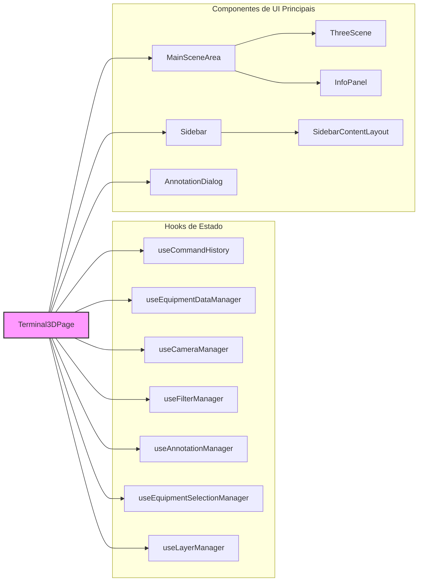
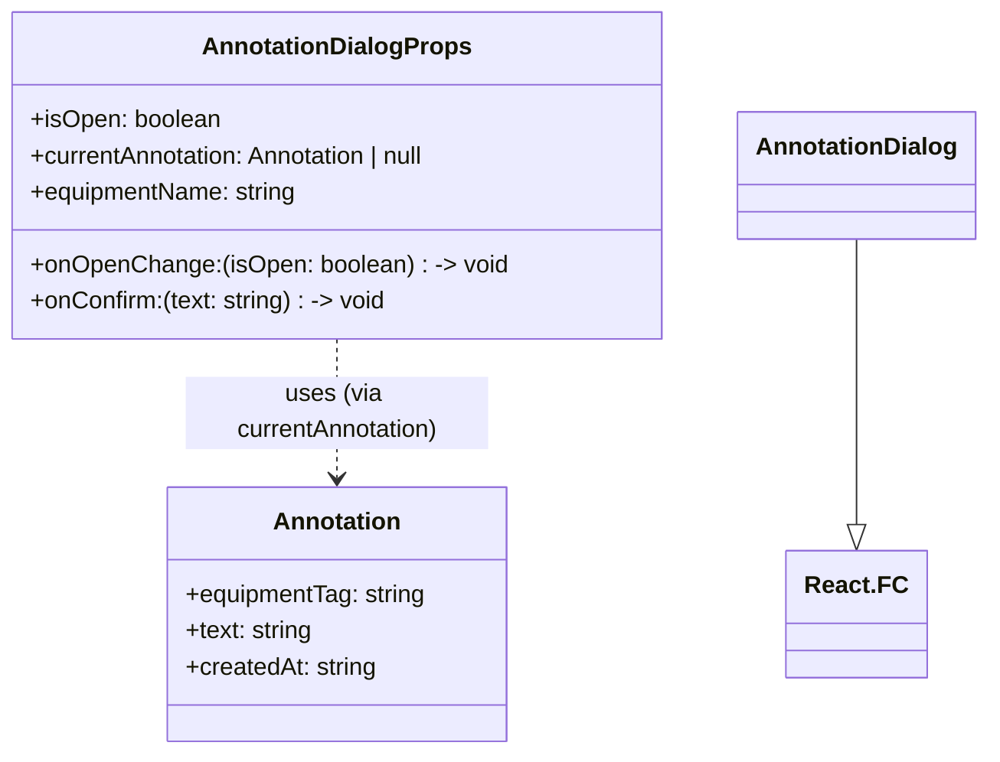
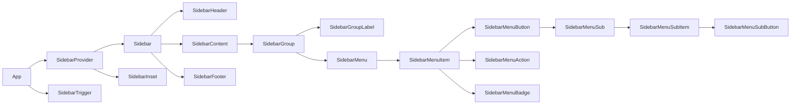

<!-- Generated by documentation.js. Update this documentation by updating the source code. -->

### Table of Contents

*   [][1]
*   [Terminal3DPage][2]
*   [cameraViewSystems][3]
*   [handleFocusAndSelectSystem][4]
    *   [Parameters][5]
*   [selectedEquipmentDetails][6]
*   [equipmentAnnotation][7]
*   [availableOperationalStatesList][8]
*   [availableProductsList][9]
*   [][10]
*   [AnnotationDialogProps][11]
    *   [Properties][12]
*   [AnnotationDialog][13]
    *   [Parameters][14]
*   [useEffect][15]
*   [handleConfirm][16]
*   [][17]
*   [CameraControlsPanelProps][18]
    *   [Properties][19]
*   [CameraControlsPanel][20]
    *   [Parameters][21]
*   [][22]
*   [ColorModeSelectorProps][23]
    *   [Properties][24]
*   [ColorModeSelector][25]
    *   [Parameters][26]
*   [][27]
*   [CommandHistoryPanelProps][28]
    *   [Properties][29]
*   [CommandHistoryPanel][30]
    *   [Parameters][31]
*   [][32]
*   [InfoPanelProps][33]
    *   [equipment][34]
    *   [annotation][35]
    *   [onClose][36]
    *   [onOpenAnnotationDialog][37]
    *   [onDeleteAnnotation][38]
    *   [onOperationalStateChange][39]
    *   [availableOperationalStatesList][40]
    *   [onProductChange][41]
    *   [availableProductsList][42]
*   [InfoPanel][43]
    *   [Parameters][44]
*   [handleDeleteClick][45]
*   [formattedDate][46]
*   [][47]
*   [LayerManagerProps][48]
    *   [Properties][49]
*   [LayerManager][50]
    *   [Parameters][51]
*   [][52]
*   [MainSceneAreaProps][53]
    *   [Properties][54]
*   [MainSceneArea][55]
    *   [Parameters][56]
*   [][57]
*   [SidebarContentLayoutProps][58]
    *   [Properties][59]
*   [SidebarContentLayout][60]
    *   [Parameters][61]
*   [Terminal][62]
*   [SiteHeader][63]
*   [][64]
*   [equipment][65]
*   [allEquipmentData][66]
*   [layers][67]
*   [annotations][68]
*   [selectedEquipmentTags][69]
*   [onSelectEquipment][70]
*   [hoveredEquipmentTag][71]
*   [setHoveredEquipmentTag][72]
*   [cameraState][73]
*   [onCameraChange][74]
*   [initialCameraPosition][75]
*   [initialCameraLookAt][76]
*   [colorMode][77]
*   [targetSystemToFrame][78]
*   [onSystemFramed][79]
*   [ThreeScene][80]
    *   [Parameters][81]
*   [][82]
*   [useSidebar][83]
*   [SidebarProvider][84]
    *   [defaultOpen][85]
    *   [open][86]
    *   [onOpenChange][87]
*   [Sidebar][88]
    *   [side][89]
    *   [variant][90]
    *   [collapsible][91]
*   [SidebarTrigger][92]
*   [SidebarRail][93]
*   [SidebarInset][94]
*   [SidebarInput][95]
*   [SidebarHeader][96]
*   [SidebarFooter][97]
*   [SidebarSeparator][98]
*   [SidebarContent][99]
*   [SidebarGroup][100]
*   [SidebarGroupLabel][101]
*   [SidebarGroupAction][102]
*   [SidebarGroupContent][103]
*   [SidebarMenu][104]
*   [SidebarMenuItem][105]
*   [SidebarMenuButton][106]
    *   [isActive][107]
    *   [tooltip][108]
*   [SidebarMenuAction][109]
    *   [showOnHover][110]
*   [SidebarMenuBadge][111]
*   [SidebarMenuSkeleton][112]
    *   [showIcon][113]
*   [SidebarMenuSub][114]
*   [SidebarMenuSubItem][115]
*   [SidebarMenuSubButton][116]
    *   [size][117]
    *   [isActive][118]

##

Componente principal da página da aplicação Terminal 3D.
Responsável por orquestrar os diversos hooks de gerenciamento de estado da aplicação
e renderizar a interface do usuário principal, que inclui a área da cena 3D (`MainSceneArea`)
e a barra lateral de controles (`Sidebar`). Este componente atua como o ponto central de
integração para as funcionalidades da aplicação.

Principais Responsabilidades:

*   Inicializar e fornecer os hooks de estado para:
    *   Histórico de Comandos (`useCommandHistory`): Para funcionalidades de Undo/Redo.
    *   Dados dos Equipamentos (`useEquipmentDataManager`): Gerencia a "fonte da verdade" dos dados dos equipamentos.
    *   Câmera 3D (`useCameraManager`): Controla o estado da câmera, incluindo presets e foco em sistemas.
    *   Filtros (`useFilterManager`): Gerencia os estados e a lógica de filtragem dos equipamentos.
    *   Anotações (`useAnnotationManager`): Lida com o estado e as operações CRUD para anotações.
    *   Seleção de Equipamentos (`useEquipmentSelectionManager`): Gerencia a seleção e hover de equipamentos.
    *   Camadas de Visibilidade (`useLayerManager`): Controla a visibilidade das camadas de objetos na cena.
*   Gerenciar estados locais da UI, como o modo de colorização (`colorMode`).
*   Calcular dados derivados (e.g., `selectedEquipmentDetails`, listas de opções para filtros) para popular
    os componentes da interface.
*   Renderizar a estrutura principal da UI, incluindo a `Sidebar` e a `MainSceneArea`.
*   Passar os estados e callbacks apropriados dos hooks para os componentes filhos.
*   Definir lógicas de alto nível que coordenam múltiplos hooks (e.g., `handleFocusAndSelectSystem`).



## Terminal3DPage

Componente principal da página Terminal 3D (Terminal3DPage).

Orquestra os diversos hooks de gerenciamento de estado da aplicação e renderiza a UI principal.

Returns **JSX.Element** O componente da página Terminal 3D.

## cameraViewSystems

Lista de sistemas únicos disponíveis para o painel de controle da câmera ("Focus on System").
Exclui "All" se estiver presente em `availableSistemas`.

## handleFocusAndSelectSystem

Manipula a ação de focar a câmera em um sistema e selecionar todos os equipamentos desse sistema.

### Parameters

*   `systemName` **[string][119]** O nome do sistema para focar e selecionar.

## selectedEquipmentDetails

Deriva os detalhes do equipamento selecionado.
Mostra detalhes apenas se um único equipamento estiver selecionado.

## equipmentAnnotation

Obtém a anotação para o equipamento atualmente selecionado (se houver um único selecionado).

## availableOperationalStatesList

Lista de estados operacionais únicos disponíveis, derivada dos dados dos equipamentos.
Usada para popular o dropdown de alteração de estado no InfoPanel.

## availableProductsList

Lista de produtos únicos disponíveis, derivada dos dados dos equipamentos.
Usada para popular o dropdown de alteração de produto no InfoPanel.

##

Componente de diálogo modal para adicionar ou editar anotações textuais
associadas a um equipamento. Utiliza um Textarea para permitir anotações de texto longo.



## AnnotationDialogProps

Props para o componente AnnotationDialog.

### Properties

*   `isOpen` **[boolean][120]** Controla se o diálogo está aberto ou fechado.
*   `currentAnnotation` **(Annotation | null)** A anotação atual sendo editada, ou null se for uma nova anotação.
*   `equipmentName` **[string][119]** O nome do equipamento ao qual a anotação se refere, para exibição no diálogo.

## AnnotationDialog

Renderiza um diálogo modal para o usuário inserir ou editar o texto de uma anotação.
Exibe o nome do equipamento associado e um Textarea para o texto da anotação.
A data de criação/modificação é registrada automaticamente pelo hook `useAnnotationManager`.

### Parameters

*   `props` **[AnnotationDialogProps][11]** As props do componente.

    *   `props.isOpen` &#x20;
    *   `props.onOpenChange` &#x20;
    *   `props.onConfirm` &#x20;
    *   `props.currentAnnotation` &#x20;
    *   `props.equipmentName` &#x20;

Returns **JSX.Element** O componente AnnotationDialog.

## useEffect

Efeito para popular o campo de texto quando o diálogo é aberto ou a anotação atual muda.

## handleConfirm

Manipula a confirmação do diálogo, chamando o callback `onConfirm` com o texto atual
e fechando o diálogo.

##

Componente de painel para controles de câmera, especificamente para focar em sistemas.

Principal Responsabilidade:
Renderizar botões para cada sistema disponível, permitindo ao usuário focar a câmera
e selecionar todos os equipamentos pertencentes àquele sistema ao clicar em um botão.

```mermaid
  classDiagram
    CameraControlsPanelProps {
      +systems: string[]
      +onSetView(systemName: string): void
    }
    CameraControlsPanel --|> React.FC
    CameraControlsPanel ..> Button : uses
    CameraControlsPanel ..> Card : uses
```

## CameraControlsPanelProps

Props para o componente CameraControlsPanel.

### Properties

*   `systems` **[Array][121]<[string][119]>** Lista de nomes dos sistemas disponíveis para foco.

## CameraControlsPanel

Renderiza um painel com botões para focar a câmera em sistemas específicos.
Cada botão representa um sistema; ao clicar, a câmera enquadra os equipamentos desse sistema.

### Parameters

*   `props` **[CameraControlsPanelProps][18]** As props do componente.

    *   `props.systems` &#x20;
    *   `props.onSetView` &#x20;

Returns **JSX.Element** O componente CameraControlsPanel.

##

Componente para selecionar o modo de colorização dos equipamentos na cena 3D.

Principal Responsabilidade:
Permitir ao usuário escolher como os equipamentos serão coloridos (por cor base,
estado operacional ou produto) através de um menu dropdown (Select).

```mermaid
  classDiagram
    ColorModeSelectorProps {
      +colorMode: ColorMode
      +onColorModeChange(mode: ColorMode): void
    }
    ColorModeSelectorProps ..> ColorMode
    ColorModeSelector --|> React.FC
    ColorModeSelector ..> Card : uses
    ColorModeSelector ..> Select : uses
    ColorModeSelector ..> Label : uses
```

## ColorModeSelectorProps

Props para o componente ColorModeSelector.

### Properties

*   `colorMode` **ColorMode** O modo de colorização atualmente selecionado.

## ColorModeSelector

Renderiza um Card com um dropdown para selecionar o modo de colorização dos equipamentos.
As opções são "Equipamento (Cor Base)", "Estado Operacional" e "Produto".

### Parameters

*   `props` **[ColorModeSelectorProps][23]** As props do componente.

    *   `props.colorMode` &#x20;
    *   `props.onColorModeChange` &#x20;

Returns **JSX.Element** O componente do seletor de modo de coloração.

##

Componente de painel para exibir controles de histórico de comandos (Undo/Redo).

Principal Responsabilidade:
Renderizar botões que permitem ao usuário desfazer (Undo) e refazer (Redo)
ações previamente executadas na aplicação, com base no estado fornecido pelo
hook `useCommandHistory`.

```mermaid
  classDiagram
    CommandHistoryPanelProps {
      +canUndo: boolean
      +canRedo: boolean
      +onUndo(): void
      +onRedo(): void
    }
    CommandHistoryPanel --|> React.FC
    CommandHistoryPanel ..> Button : uses
    CommandHistoryPanel ..> Card : uses
    CommandHistoryPanel ..> Undo2Icon : uses
    CommandHistoryPanel ..> Redo2Icon : uses
```

## CommandHistoryPanelProps

Props para o componente CommandHistoryPanel.

### Properties

*   `canUndo` **[boolean][120]** Indica se a ação de desfazer está disponível.
*   `canRedo` **[boolean][120]** Indica se a ação de refazer está disponível.

## CommandHistoryPanel

Renderiza um painel com botões de Undo e Redo.
A habilitação dos botões é controlada pelas props `canUndo` e `canRedo`.

### Parameters

*   `props` **[CommandHistoryPanelProps][28]** As props do componente.

    *   `props.canUndo` &#x20;
    *   `props.canRedo` &#x20;
    *   `props.onUndo` &#x20;
    *   `props.onRedo` &#x20;

Returns **JSX.Element** O componente CommandHistoryPanel.

##

Componente para exibir o painel de informações detalhadas de um equipamento selecionado.
Renderiza apenas se um único equipamento estiver selecionado na cena 3D.

Responsabilidades:

*   Exibir os atributos do equipamento (nome, TAG, tipo, sistema, área, detalhes).
*   Permitir a alteração do estado operacional do equipamento através de um dropdown.
*   Permitir a alteração do produto associado ao equipamento através de um dropdown.
*   Gerenciar a exibição e interação com anotações:
    *   Exibir o texto e a data da anotação existente.
    *   Fornecer botões para adicionar, editar ou excluir a anotação.
*   Fornecer um botão para fechar o painel de informações (desselecionando o equipamento).

```mermaid
  classDiagram
    InfoPanelProps {
      +equipment: Equipment | null
      +annotation: Annotation | null
      +onClose: () -> void
      +onOpenAnnotationDialog: () -> void
      +onDeleteAnnotation: (equipmentTag: string) -> void
      +onOperationalStateChange: (equipmentTag: string, newState: string) -> void
      +availableOperationalStatesList: string[]
      +onProductChange: (equipmentTag: string, newProduct: string) -> void
      +availableProductsList: string[]
    }
    InfoPanel --|> React.FC
    InfoPanelProps ..> Equipment : uses
    InfoPanelProps ..> Annotation : uses
```

## InfoPanelProps

Props para o componente InfoPanel.

### equipment

O equipamento selecionado para exibir detalhes. Null se nenhum equipamento único estiver selecionado.

Type: (Equipment | null)

### annotation

A anotação associada ao equipamento selecionado. Null se não houver anotação.

Type: (Annotation | null)

### onClose

Callback para fechar o painel de informações (geralmente deseleciona o equipamento).

Type: function (): void

### onOpenAnnotationDialog

Callback para abrir o diálogo de adição/edição de anotação.

Type: function (): void

### onDeleteAnnotation

Callback para excluir a anotação do equipamento especificado.

Type: function (equipmentTag: [string][119]): void

### onOperationalStateChange

Callback para alterar o estado operacional de um equipamento.

Type: function (equipmentTag: [string][119], newState: [string][119]): void

### availableOperationalStatesList

Lista de estados operacionais disponíveis para seleção no dropdown.

Type: [Array][121]<[string][119]>

### onProductChange

Callback para alterar o produto de um equipamento.

Type: function (equipmentTag: [string][119], newProduct: [string][119]): void

### availableProductsList

Lista de produtos disponíveis para seleção no dropdown.

Type: [Array][121]<[string][119]>

## InfoPanel

Renderiza um painel flutuante com informações detalhadas sobre o equipamento selecionado.
Mostra detalhes apenas se um único equipamento estiver selecionado. Permite interações
como alterar estado operacional, produto e gerenciar anotações.

### Parameters

*   `props` **[InfoPanelProps][33]** As props do componente.

    *   `props.equipment` &#x20;
    *   `props.annotation` &#x20;
    *   `props.onClose` &#x20;
    *   `props.onOpenAnnotationDialog` &#x20;
    *   `props.onDeleteAnnotation` &#x20;
    *   `props.onOperationalStateChange` &#x20;
    *   `props.availableOperationalStatesList` &#x20;
    *   `props.onProductChange` &#x20;
    *   `props.availableProductsList` &#x20;

Returns **(JSX.Element | null)** O componente InfoPanel ou null se nenhum equipamento único estiver selecionado.

## handleDeleteClick

Manipula o clique no botão de excluir anotação.

## formattedDate

Formata a data de criação/modificação da anotação para exibição.

Type: ([string][119] | null)

##

Componente para gerenciar a visibilidade das camadas de equipamentos e anotações.

Principal Responsabilidade:
Renderizar um card com checkboxes para cada camada definida, permitindo ao usuário controlar
o que é exibido na cena 3D, como prédios, tanques, anotações, etc.

```mermaid
  classDiagram
    LayerManagerProps {
      +layers: Layer[]
      +onToggleLayer(layerId: string): void
    }
    LayerManagerProps ..> Layer
    LayerManager --|> React.FC
    LayerManager ..> Card : uses
    LayerManager ..> Checkbox : uses
    LayerManager ..> Label : uses
```

## LayerManagerProps

Props para o componente LayerManager.

### Properties

*   `layers` **[Array][121]\<Layer>** A lista de camadas disponíveis e seus estados de visibilidade.

## LayerManager

Renderiza um Card com checkboxes para controlar a visibilidade de cada camada.
Cada checkbox corresponde a uma camada (e.g., Prédios, Tanques, Anotações).

### Parameters

*   `props` **[LayerManagerProps][48]** As props do componente.

    *   `props.layers` &#x20;
    *   `props.onToggleLayer` &#x20;

Returns **JSX.Element** O componente gerenciador de camadas.

##

Componente responsável por renderizar a área principal da cena 3D.

Principal Responsabilidade:
Atuar como um contêiner de layout para os elementos visuais centrais da aplicação:

*   O componente `ThreeScene` (a própria cena 3D).
*   O `InfoPanel` (painel de detalhes do equipamento selecionado).
    Este componente não possui lógica complexa própria, mas sim delega a renderização
    e o comportamento para seus filhos, passando as props necessárias, incluindo a lista
    completa de equipamentos (`allEquipmentData`) para contexto de renderização de anotações.

```mermaid
  classDiagram
    MainSceneAreaProps {
      +equipment: Equipment[]
      +allEquipmentData: Equipment[]
      +layers: Layer[]
      +annotations: Annotation[]
      +selectedEquipmentTags: string[]
      +onSelectEquipment(tag: string | null, isMultiSelect: boolean): void
      +hoveredEquipmentTag: string | null
      +setHoveredEquipmentTag(tag: string | null): void
      +cameraState: CameraState | undefined
      +onCameraChange(cameraState: CameraState): void
      +initialCameraPosition: Point3D
      +initialCameraLookAt: Point3D
      +colorMode: ColorMode
      +targetSystemToFrame: string | null
      +onSystemFramed(): void
      +selectedEquipmentDetails: Equipment | null
      +equipmentAnnotation: Annotation | null
      +onOpenAnnotationDialog(): void
      +onDeleteAnnotation(equipmentTag: string): void
      +onOperationalStateChange(equipmentTag: string, newState: string): void
      +availableOperationalStatesList: string[]
      +onProductChange(equipmentTag: string, newProduct: string): void
      +availableProductsList: string[]
    }
    Point3D {
      +x: number
      +y: number
      +z: number
    }
    MainSceneAreaProps ..> Equipment
    MainSceneAreaProps ..> Layer
    MainSceneAreaProps ..> Annotation
    MainSceneAreaProps ..> CameraState
    MainSceneAreaProps ..> ColorMode
    MainSceneAreaProps ..> Point3D
    MainSceneArea --|> React.FC
    MainSceneArea ..> ThreeScene : uses
    MainSceneArea ..> InfoPanel : uses
```

## MainSceneAreaProps

Props para o componente MainSceneArea.
Estas props são, em grande parte, repassadas para `ThreeScene` e `InfoPanel`.

### Properties

*   `equipment` **[Array][121]\<Equipment>** Lista de equipamentos filtrados a serem renderizados na cena.
*   `allEquipmentData` **[Array][121]\<Equipment>** Lista completa de todos os equipamentos, para contexto (e.g., anotações no `ThreeScene`).
*   `layers` **[Array][121]\<Layer>** Configuração das camadas de visibilidade.
*   `annotations` **[Array][121]\<Annotation>** Lista de anotações a serem exibidas.
*   `selectedEquipmentTags` **[Array][121]<[string][119]>** Tags dos equipamentos atualmente selecionados.
*   `hoveredEquipmentTag` **([string][119] | null)** Tag do equipamento atualmente sob o cursor.
*   `cameraState` **(CameraState | [undefined][122])** O estado atual da câmera (posição, lookAt).
*   `colorMode` **ColorMode** O modo de colorização atual para os equipamentos.
*   `targetSystemToFrame` **([string][119] | null)** O sistema que deve ser enquadrado pela câmera (se houver).
*   `selectedEquipmentDetails` **(Equipment | null)** Detalhes do equipamento único selecionado (para InfoPanel).
*   `equipmentAnnotation` **(Annotation | null)** Anotação do equipamento único selecionado (para InfoPanel).
*   `availableOperationalStatesList` **[Array][121]<[string][119]>** Lista de estados operacionais disponíveis.
*   `availableProductsList` **[Array][121]<[string][119]>** Lista de produtos disponíveis.

## MainSceneArea

Renderiza a área principal da cena 3D e o InfoPanel sobreposto.
Passa todas as props necessárias para os componentes filhos `ThreeScene` e `InfoPanel`.

### Parameters

*   `props` **[MainSceneAreaProps][53]** As props do componente.

    *   `props.equipment` &#x20;
    *   `props.allEquipmentData` &#x20;
    *   `props.layers` &#x20;
    *   `props.annotations` &#x20;
    *   `props.selectedEquipmentTags` &#x20;
    *   `props.onSelectEquipment` &#x20;
    *   `props.hoveredEquipmentTag` &#x20;
    *   `props.setHoveredEquipmentTag` &#x20;
    *   `props.cameraState` &#x20;
    *   `props.onCameraChange` &#x20;
    *   `props.initialCameraPosition` &#x20;
    *   `props.initialCameraLookAt` &#x20;
    *   `props.colorMode` &#x20;
    *   `props.targetSystemToFrame` &#x20;
    *   `props.onSystemFramed` &#x20;
    *   `props.selectedEquipmentDetails` &#x20;
    *   `props.equipmentAnnotation` &#x20;
    *   `props.onOpenAnnotationDialog` &#x20;
    *   `props.onDeleteAnnotation` &#x20;
    *   `props.onOperationalStateChange` &#x20;
    *   `props.availableOperationalStatesList` &#x20;
    *   `props.onProductChange` &#x20;
    *   `props.availableProductsList` &#x20;

Returns **JSX.Element** O componente MainSceneArea.

##

Componente para renderizar o conteúdo principal da sidebar.

Principal Responsabilidade:
Exibir os diversos painéis de controle e filtros dentro da área de conteúdo da sidebar.
Utiliza uma ScrollArea para permitir a rolagem do conteúdo.

Inclui:

*   Controles de câmera ("Focus on System").
*   Filtros de busca textual e seleção por Sistema/Área.
*   Seletor de modo de colorização.
*   Gerenciador de camadas de visibilidade.
*   Link para a documentação externa do projeto.

```mermaid
  classDiagram
    SidebarContentLayoutProps {
      +searchTerm: string
      +setSearchTerm(value: string): void
      +selectedSistema: string
      +setSelectedSistema(value: string): void
      +availableSistemas: string[]
      +selectedArea: string
      +setSelectedArea(value: string): void
      +availableAreas: string[]
      +colorMode: ColorMode
      +onColorModeChange(mode: ColorMode): void
      +layers: Layer[]
      +onToggleLayer(layerId: string): void
      +cameraViewSystems: string[]
      +onFocusAndSelectSystem(systemName: string): void
    }
    SidebarContentLayoutProps ..> ColorMode
    SidebarContentLayoutProps ..> Layer
    SidebarContentLayout --|> React.FC
    SidebarContentLayout ..> CameraControlsPanel : uses
    SidebarContentLayout ..> ColorModeSelector : uses
    SidebarContentLayout ..> LayerManager : uses
    SidebarContentLayout ..> Input : uses
    SidebarContentLayout ..> Select : uses
    SidebarContentLayout ..> Button : uses
    SidebarContentLayout ..> ScrollArea : uses
```

## SidebarContentLayoutProps

Props para o componente SidebarContentLayout.

### Properties

*   `searchTerm` **[string][119]** O termo de busca textual atual.
*   `selectedSistema` **[string][119]** O sistema selecionado para filtro.
*   `availableSistemas` **[Array][121]<[string][119]>** Lista de sistemas disponíveis para filtro.
*   `selectedArea` **[string][119]** A área selecionada para filtro.
*   `availableAreas` **[Array][121]<[string][119]>** Lista de áreas disponíveis para filtro.
*   `colorMode` **ColorMode** O modo de colorização atual.
*   `layers` **[Array][121]\<Layer>** Lista de camadas para o LayerManager.
*   `cameraViewSystems` **[Array][121]<[string][119]>** Lista de nomes de sistemas para o CameraControlsPanel.

## SidebarContentLayout

Renderiza o layout do conteúdo da sidebar, incluindo filtros, painéis de controle e link para documentação.
Utiliza uma ScrollArea para permitir a rolagem do conteúdo se ele exceder a altura da sidebar.

### Parameters

*   `props` **[SidebarContentLayoutProps][58]** As props do componente.

    *   `props.searchTerm` &#x20;
    *   `props.setSearchTerm` &#x20;
    *   `props.selectedSistema` &#x20;
    *   `props.setSelectedSistema` &#x20;
    *   `props.availableSistemas` &#x20;
    *   `props.selectedArea` &#x20;
    *   `props.setSelectedArea` &#x20;
    *   `props.availableAreas` &#x20;
    *   `props.colorMode` &#x20;
    *   `props.onColorModeChange` &#x20;
    *   `props.layers` &#x20;
    *   `props.onToggleLayer` &#x20;
    *   `props.cameraViewSystems` &#x20;
    *   `props.onFocusAndSelectSystem` &#x20;

Returns **JSX.Element** O componente SidebarContentLayout.

## Terminal

Componente simples para renderizar o cabeçalho do site.

Principal Responsabilidade:
Exibir o título principal da aplicação ("Terminal 3D") e um ícone associado.
Atua como um elemento de branding e navegação de topo fixo.

## SiteHeader

Renderiza o cabeçalho fixo do site.
Exibe o ícone `Terminal` e o nome da aplicação.

Returns **JSX.Element** O componente SiteHeader.

##

Componente React principal para renderizar e interagir com a cena 3D usando Three.js.
ATUALIZADO: Este componente foi refatorado para atuar como um "condutor", delegando a maior
parte de suas responsabilidades anteriores para hooks customizados especializados.
Ele agora foca em:

*   Utilizar `useSceneSetup` para a infraestrutura básica da cena (cena, câmera, renderizadores, etc.).
*   Utilizar `useEquipmentRenderer` para gerenciar os meshes dos equipamentos.
*   Utilizar `useAnnotationPinRenderer` para gerenciar os pins de anotação.
*   Utilizar `useMouseInteractionManager` para processar interações do mouse.
*   Utilizar `useSceneOutline` para aplicar efeitos de contorno.
*   Utilizar `useAnimationLoop` para o loop de renderização.
*   Aplicar estados de câmera programáticos e lidar com o enquadramento de sistemas.
*   Renderizar o elemento de montagem (`div`) para a cena.

Principal Responsabilidade (Pós-Refatoração):
Orquestrar os diversos hooks que gerenciam aspectos específicos da cena 3D,
passar props e refs entre eles, e fornecer o ponto de montagem no DOM.

```mermaid
classDiagram
  ThreeScene --|> React.FC
  ThreeScene ..> ThreeSceneProps : uses
  ThreeSceneProps {
    +equipment: Equipment[]
    +allEquipmentData: Equipment[]
    +layers: Layer[]
    +annotations: Annotation[]
    +selectedEquipmentTags: string[] | undefined
    +onSelectEquipment(tag: string | null, isMultiSelect: boolean): void
    +hoveredEquipmentTag: string | null | undefined
    +setHoveredEquipmentTag(tag: string | null): void
    +cameraState: CameraState | undefined
    +onCameraChange(cameraState: CameraState): void
    +initialCameraPosition: Point3D
    +initialCameraLookAt: Point3D
    +colorMode: ColorMode
    +targetSystemToFrame: string | null
    +onSystemFramed(): void
  }
  Point3D {
    +x: number
    +y: number
    +z: number
  }
  ThreeSceneProps ..> Equipment
  ThreeSceneProps ..> Layer
  ThreeSceneProps ..> Annotation
  ThreeSceneProps ..> CameraState
  ThreeSceneProps ..> ColorMode
  ThreeSceneProps ..> Point3D
  ThreeScene ..> useSceneSetup : uses
  ThreeScene ..> useEquipmentRenderer : uses
  ThreeScene ..> useAnnotationPinRenderer : uses
  ThreeScene ..> useMouseInteractionManager : uses
  ThreeScene ..> useSceneOutline : uses
  ThreeScene ..> useAnimationLoop : uses
```

## equipment

Lista de equipamentos filtrados a serem renderizados na cena.

Type: [Array][121]\<Equipment>

## allEquipmentData

Lista completa de todos os equipamentos, para contexto (e.g., anotações no `ThreeScene`).

Type: [Array][121]\<Equipment>

## layers

Configuração das camadas de visibilidade.

Type: [Array][121]\<Layer>

## annotations

Lista de anotações a serem exibidas.

Type: [Array][121]\<Annotation>

## selectedEquipmentTags

Tags dos equipamentos atualmente selecionados.

Type: ([Array][121]<[string][119]> | [undefined][122])

## onSelectEquipment

Callback para quando um equipamento é selecionado/deselecionado.

Type: function (tag: ([string][119] | null), isMultiSelectModifierPressed: [boolean][120]): void

## hoveredEquipmentTag

Tag do equipamento atualmente sob o cursor.

Type: ([string][119] | null | [undefined][122])

## setHoveredEquipmentTag

Callback para definir o equipamento em hover.

Type: function (tag: ([string][119] | null)): void

## cameraState

O estado atual da câmera (posição, lookAt).

Type: (CameraState | [undefined][122])

## onCameraChange

Callback para quando o estado da câmera muda devido à interação do usuário na cena.

Type: function (cameraState: CameraState): void

## initialCameraPosition

Posição inicial da câmera.

Type: {x: [number][123], y: [number][123], z: [number][123]}

## initialCameraLookAt

Ponto de observação (lookAt) inicial da câmera.

Type: {x: [number][123], y: [number][123], z: [number][123]}

## colorMode

O modo de colorização atual para os equipamentos.

Type: ColorMode

## targetSystemToFrame

O sistema que deve ser enquadrado pela câmera (se houver).

Type: ([string][119] | null)

## onSystemFramed

Callback chamado após a câmera terminar de enquadrar um sistema.

Type: function (): void

## ThreeScene

Componente React principal para renderizar e interagir com a cena 3D usando Three.js.
Atua como um orquestrador de hooks especializados que gerenciam diferentes aspectos da cena.

Type: React.FC\<ThreeSceneProps>

### Parameters

*   `props` **ThreeSceneProps** As props do componente.

Returns **JSX.Element** O elemento div que serve como contêiner para a cena 3D.

##

Componente de Sidebar reutilizável e altamente configurável.

Principal Responsabilidade:
Fornecer uma estrutura de sidebar flexível que pode ser usada de várias maneiras:

*   Como uma sidebar tradicional fixa ou flutuante.
*   Em modo "icon" (colapsada, mostrando apenas ícones).
*   Como um "offcanvas" (desliza para fora da tela).
*   Adaptável para dispositivos móveis (geralmente usando o modo offcanvas).

Subcomponentes:

*   `SidebarProvider`: Contexto para gerenciar o estado da sidebar (aberta/fechada, modo).
*   `Sidebar`: O contêiner principal da sidebar.
*   `SidebarTrigger`: Botão para alternar o estado da sidebar.
*   `SidebarRail`: Barra lateral fina para alternar a sidebar quando colapsada.
*   `SidebarInset`: Contêiner para o conteúdo principal da página, que se ajusta à sidebar.
*   `SidebarHeader`, `SidebarFooter`, `SidebarContent`: Seções estruturais dentro da sidebar.
*   `SidebarGroup`, `SidebarGroupLabel`, `SidebarGroupAction`, `SidebarGroupContent`: Para agrupar itens.
*   `SidebarMenu`, `SidebarMenuItem`, `SidebarMenuButton`, `SidebarMenuAction`, `SidebarMenuBadge`, `SidebarMenuSkeleton`, `SidebarMenuSub`, `SidebarMenuSubItem`, `SidebarMenuSubButton`: Para criar menus de navegação dentro da sidebar.
*   `SidebarInput`, `SidebarSeparator`: Elementos de UI utilitários para a sidebar.

Utiliza cookies para persistir o estado da sidebar entre as sessões (desktop) e atalhos de teclado.



## useSidebar

Hook para acessar o contexto da Sidebar.
Deve ser usado dentro de um `SidebarProvider`.

*   Throws **[Error][124]** Se usado fora de um `SidebarProvider`.

Returns **SidebarContext** O contexto da sidebar.

## SidebarProvider

Provedor de contexto para o estado da sidebar.
Gerencia se a sidebar está aberta/fechada, tanto no desktop quanto no mobile,
e o estado colapsado/expandido.

### defaultOpen

Estado de abertura padrão da sidebar no desktop. Padrão: `true`.

Type: [boolean][120]

### open

Controla o estado de abertura da sidebar no desktop externamente.

Type: [boolean][120]

### onOpenChange

Callback para quando o estado de abertura da sidebar no desktop muda.

Type: function (open: [boolean][120]): void

## Sidebar

Componente principal da Sidebar.
Renderiza a sidebar com base no estado do `SidebarProvider` e nas props de configuração.

### side

Lado em que a sidebar aparecerá. Padrão: `"left"`.

Type: (`"left"` | `"right"`)

### variant

Variante visual da sidebar. Padrão: `"sidebar"`.

*   `"sidebar"`: Sidebar tradicional.
*   `"floating"`: Sidebar flutuante com sombra e bordas.
*   `"inset"`: Sidebar que se encaixa dentro de um layout principal (`SidebarInset`).

Type: (`"sidebar"` | `"floating"` | `"inset"`)

### collapsible

Comportamento de colapso da sidebar. Padrão: `"offcanvas"`.

*   `"offcanvas"`: A sidebar desliza para fora da tela quando colapsada.
*   `"icon"`: A sidebar encolhe para mostrar apenas ícones quando colapsada.
*   `"none"`: A sidebar não é colapsável.

Type: (`"offcanvas"` | `"icon"` | `"none"`)

## SidebarTrigger

Botão para alternar o estado de visibilidade da sidebar.
Em modo mobile, abre/fecha a sidebar offcanvas.
Em modo desktop, colapsa/expande a sidebar.

## SidebarRail

Barra lateral fina ("rail") que aparece quando a sidebar está colapsada em modo "icon".
Permite ao usuário clicar para expandir a sidebar.

## SidebarInset

Componente para envolver o conteúdo principal da página.
Ajusta sua margem e aparência com base no estado e variante da sidebar,
especialmente útil com a variante "inset".

## SidebarInput

Componente de Input estilizado para uso dentro da Sidebar.

## SidebarHeader

Contêiner para o cabeçalho da Sidebar.

## SidebarFooter

Contêiner para o rodapé da Sidebar.

## SidebarSeparator

Componente Separator estilizado para uso dentro da Sidebar.

## SidebarContent

Contêiner para a área de conteúdo principal da Sidebar (geralmente rolável).

## SidebarGroup

Contêiner para agrupar logicamente itens dentro da Sidebar.

## SidebarGroupLabel

Rótulo para um `SidebarGroup`. Fica oculto quando a sidebar está em modo "icon".

## SidebarGroupAction

Botão de ação opcional para um `SidebarGroup` (e.g., um botão "+").
Fica oculto quando a sidebar está em modo "icon".

## SidebarGroupContent

Contêiner para o conteúdo de um `SidebarGroup`.

## SidebarMenu

Lista `<ul>` para um menu dentro da Sidebar.

## SidebarMenuItem

Item `<li>` de um `SidebarMenu`.

## SidebarMenuButton

Botão clicável dentro de um `SidebarMenuItem`.
Pode conter um ícone e texto. O texto é truncado quando a sidebar está em modo "icon".
Suporta um tooltip opcional que aparece quando a sidebar está em modo "icon".

### isActive

Indica se o item de menu está ativo.

Type: [boolean][120]

### tooltip

Conteúdo do tooltip a ser exibido no modo "icon", ou um objeto de props para `TooltipContent`.

Type: ([string][119] | React.ComponentProps\<any>)

## SidebarMenuAction

Botão de ação opcional para um `SidebarMenuItem` (e.g., um ícone de "mais opções").
Fica oculto quando a sidebar está em modo "icon".
Pode ser configurado para aparecer apenas no hover.

### showOnHover

Se true, a ação só aparece quando o mouse está sobre o item de menu.

Type: [boolean][120]

## SidebarMenuBadge

Badge opcional para um `SidebarMenuItem` (e.g., para contagens de notificações).
Fica oculto quando a sidebar está em modo "icon".

## SidebarMenuSkeleton

Componente de esqueleto de carregamento para itens de menu.
Útil para indicar que o conteúdo do menu está sendo carregado.

### showIcon

Se true, mostra um esqueleto de ícone.

Type: [boolean][120]

## SidebarMenuSub

Lista `<ul>` para um submenu dentro de um `SidebarMenuButton` (geralmente usado com dropdowns ou accordions).
Fica oculto quando a sidebar está em modo "icon".

## SidebarMenuSubItem

Item `<li>` de um `SidebarMenuSub`.

## SidebarMenuSubButton

Botão clicável (ou link) dentro de um `SidebarMenuSubItem`.

### size

Tamanho do botão do submenu.

Type: (`"sm"` | `"md"`)

### isActive

Indica se o item de submenu está ativo.

Type: [boolean][120]

[1]: #

[2]: #terminal3dpage

[3]: #cameraviewsystems

[4]: #handlefocusandselectsystem

[5]: #parameters

[6]: #selectedequipmentdetails

[7]: #equipmentannotation

[8]: #availableoperationalstateslist

[9]: #availableproductslist

[10]: #-1

[11]: #annotationdialogprops

[12]: #properties

[13]: #annotationdialog

[14]: #parameters-1

[15]: #useeffect

[16]: #handleconfirm

[17]: #-2

[18]: #cameracontrolspanelprops

[19]: #properties-1

[20]: #cameracontrolspanel

[21]: #parameters-2

[22]: #-3

[23]: #colormodeselectorprops

[24]: #properties-2

[25]: #colormodeselector

[26]: #parameters-3

[27]: #-4

[28]: #commandhistorypanelprops

[29]: #properties-3

[30]: #commandhistorypanel

[31]: #parameters-4

[32]: #-5

[33]: #infopanelprops

[34]: #equipment

[35]: #annotation

[36]: #onclose

[37]: #onopenannotationdialog

[38]: #ondeleteannotation

[39]: #onoperationalstatechange

[40]: #availableoperationalstateslist-1

[41]: #onproductchange

[42]: #availableproductslist-1

[43]: #infopanel

[44]: #parameters-5

[45]: #handledeleteclick

[46]: #formatteddate

[47]: #-6

[48]: #layermanagerprops

[49]: #properties-4

[50]: #layermanager

[51]: #parameters-6

[52]: #-7

[53]: #mainsceneareaprops

[54]: #properties-5

[55]: #mainscenearea

[56]: #parameters-7

[57]: #-8

[58]: #sidebarcontentlayoutprops

[59]: #properties-6

[60]: #sidebarcontentlayout

[61]: #parameters-8

[62]: #terminal

[63]: #siteheader

[64]: #-9

[65]: #equipment-1

[66]: #allequipmentdata

[67]: #layers

[68]: #annotations

[69]: #selectedequipmenttags

[70]: #onselectequipment

[71]: #hoveredequipmenttag

[72]: #sethoveredequipmenttag

[73]: #camerastate

[74]: #oncamerachange

[75]: #initialcameraposition

[76]: #initialcameralookat

[77]: #colormode

[78]: #targetsystemtoframe

[79]: #onsystemframed

[80]: #threescene

[81]: #parameters-9

[82]: #-10

[83]: #usesidebar

[84]: #sidebarprovider

[85]: #defaultopen

[86]: #open

[87]: #onopenchange

[88]: #sidebar

[89]: #side

[90]: #variant

[91]: #collapsible

[92]: #sidebartrigger

[93]: #sidebarrail

[94]: #sidebarinset

[95]: #sidebarinput

[96]: #sidebarheader

[97]: #sidebarfooter

[98]: #sidebarseparator

[99]: #sidebarcontent

[100]: #sidebargroup

[101]: #sidebargrouplabel

[102]: #sidebargroupaction

[103]: #sidebargroupcontent

[104]: #sidebarmenu

[105]: #sidebarmenuitem

[106]: #sidebarmenubutton

[107]: #isactive

[108]: #tooltip

[109]: #sidebarmenuaction

[110]: #showonhover

[111]: #sidebarmenubadge

[112]: #sidebarmenuskeleton

[113]: #showicon

[114]: #sidebarmenusub

[115]: #sidebarmenusubitem

[116]: #sidebarmenusubbutton

[117]: #size

[118]: #isactive-1

[119]: https://developer.mozilla.org/docs/Web/JavaScript/Reference/Global_Objects/String

[120]: https://developer.mozilla.org/docs/Web/JavaScript/Reference/Global_Objects/Boolean

[121]: https://developer.mozilla.org/docs/Web/JavaScript/Reference/Global_Objects/Array

[122]: https://developer.mozilla.org/docs/Web/JavaScript/Reference/Global_Objects/undefined

[123]: https://developer.mozilla.org/docs/Web/JavaScript/Reference/Global_Objects/Number

[124]: https://developer.mozilla.org/docs/Web/JavaScript/Reference/Global_Objects/Error
