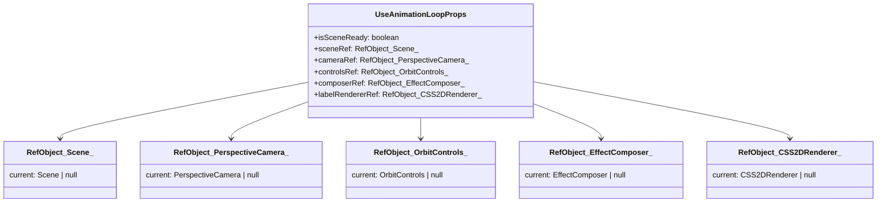

<!-- Generated by documentation.js. Update this documentation by updating the source code. -->

### Table of Contents

*   [][1]
*   [Terminal3DPage][2]
*   [cameraViewSystems][3]
*   [handleFocusAndSelectSystem][4]
    *   [Parameters][5]
*   [selectedEquipmentDetails][6]
*   [equipmentAnnotation][7]
*   [availableOperationalStatesList][8]
*   [availableProductsList][9]
*   [][10]
*   [AnnotationDialogProps][11]
    *   [Properties][12]
*   [AnnotationDialog][13]
    *   [Parameters][14]
*   [useEffect][15]
*   [useEffect][16]
*   [handleConfirm][17]
*   [][18]
*   [CameraControlsPanelProps][19]
    *   [Properties][20]
*   [CameraControlsPanel][21]
    *   [Parameters][22]
*   [][23]
*   [ColorModeSelectorProps][24]
    *   [Properties][25]
*   [ColorModeSelector][26]
    *   [Parameters][27]
*   [][28]
*   [CommandHistoryPanelProps][29]
    *   [Properties][30]
*   [CommandHistoryPanel][31]
    *   [Parameters][32]
*   [][33]
*   [InfoPanelProps][34]
    *   [equipment][35]
    *   [annotation][36]
    *   [onClose][37]
    *   [onOpenAnnotationDialog][38]
    *   [onDeleteAnnotation][39]
    *   [onOperationalStateChange][40]
    *   [availableOperationalStatesList][41]
    *   [onProductChange][42]
    *   [availableProductsList][43]
*   [InfoPanel][44]
    *   [Parameters][45]
*   [handleDeleteClick][46]
*   [formattedDate][47]
*   [][48]
*   [LayerManagerProps][49]
    *   [Properties][50]
*   [LayerManager][51]
    *   [Parameters][52]
*   [][53]
*   [MainSceneAreaProps][54]
    *   [Properties][55]
*   [MainSceneArea][56]
    *   [Parameters][57]
*   [][58]
*   [SidebarContentLayoutProps][59]
    *   [Properties][60]
*   [SidebarContentLayout][61]
    *   [Parameters][62]
*   [Terminal][63]
*   [SiteHeader][64]
*   [][65]
*   [equipment][66]
*   [allEquipmentData][67]
*   [layers][68]
*   [annotations][69]
*   [selectedEquipmentTags][70]
*   [onSelectEquipment][71]
*   [hoveredEquipmentTag][72]
*   [setHoveredEquipmentTag][73]
*   [cameraState][74]
*   [onCameraChange][75]
*   [initialCameraPosition][76]
*   [initialCameraLookAt][77]
*   [colorMode][78]
*   [targetSystemToFrame][79]
*   [onSystemFramed][80]
*   [ThreeScene][81]
    *   [Parameters][82]
*   [][83]
*   [useSidebar][84]
*   [SidebarProvider][85]
    *   [defaultOpen][86]
    *   [open][87]
    *   [onOpenChange][88]
*   [Sidebar][89]
    *   [side][90]
    *   [variant][91]
    *   [collapsible][92]
*   [SidebarTrigger][93]
*   [SidebarRail][94]
*   [SidebarInset][95]
*   [SidebarInput][96]
*   [SidebarHeader][97]
*   [SidebarFooter][98]
*   [SidebarSeparator][99]
*   [SidebarContent][100]
*   [SidebarGroup][101]
*   [SidebarGroupLabel][102]
*   [SidebarGroupAction][103]
*   [SidebarGroupContent][104]
*   [SidebarMenu][105]
*   [SidebarMenuItem][106]
*   [SidebarMenuButton][107]
    *   [isActive][108]
    *   [tooltip][109]
*   [SidebarMenuAction][110]
    *   [showOnHover][111]
*   [SidebarMenuBadge][112]
*   [SidebarMenuSkeleton][113]
    *   [showIcon][114]
*   [SidebarMenuSub][115]
*   [SidebarMenuSubItem][116]
*   [SidebarMenuSubButton][117]
    *   [size][118]
    *   [isActive][119]
*   [Equipment][120]
*   [Equipment][121]
*   [Equipment][122]
*   [Equipment][123]
    *   [Properties][124]
*   [initialEquipment][125]
*   [initialLayers][126]
*   [THREE][127]
*   [THREE][128]
*   [THREE][129]
*   [THREE][130]
*   [THREE][131]
*   [THREE][132]
*   [THREE][133]
*   [getCharNumericValue][134]
    *   [Parameters][135]
*   [getEquipmentColor][136]
    *   [Parameters][137]
*   [EquipmentFilterCriteria][138]
    *   [Properties][139]
*   [getFilteredEquipment][140]
    *   [Parameters][141]
*   [calculateViewForMeshes][142]
    *   [Parameters][143]
*   [createGeometryForItem][144]
    *   [Parameters][145]
*   [updateLabelRendererSize][146]
    *   [Parameters][147]
*   [UpdateAnnotationPinsParams][148]
    *   [Properties][149]
*   [updateAnnotationPins][150]
    *   [Parameters][151]
*   [][152]
*   [setOutlinePassObjects][153]
    *   [Parameters][154]
*   [applyOutlinePassStyle][155]
    *   [Parameters][156]
*   [setupPostProcessing][157]
    *   [Parameters][158]
*   [updatePostProcessingSize][159]
    *   [Parameters][160]
*   [updateOutlineEffect][161]
    *   [Parameters][162]
*   [setupLighting][163]
    *   [Parameters][164]
*   [setupGroundPlane][165]
    *   [Parameters][166]
*   [setupRenderPipeline][167]
    *   [Parameters][168]
*   [UpdateEquipmentMeshesParams][169]
    *   [Properties][170]
*   [updateEquipmentMeshesInScene][171]
    *   [Parameters][172]
*   [UseAnimationLoopProps][173]
    *   [Properties][174]
*   [useAnimationLoop][175]
    *   [Parameters][176]
*   [animate][177]
*   [][178]
*   [UseAnnotationManagerProps][179]
    *   [Properties][180]
*   [UseAnnotationManagerReturn][181]
    *   [Properties][182]
*   [useAnnotationManager][183]
    *   [Parameters][184]
*   [handleOpenAnnotationDialog][185]
    *   [Parameters][186]
*   [handleSaveAnnotation][187]
    *   [Parameters][188]
*   [handleDeleteAnnotation][189]
    *   [Parameters][190]
*   [getAnnotationForEquipment][191]
    *   [Parameters][192]
*   [UseAnnotationPinRendererProps][193]
*   [useAnnotationPinRenderer][194]
    *   [Parameters][195]
*   [][196]
*   [defaultInitialCameraPosition][197]
*   [defaultInitialCameraLookAt][198]
*   [UseCameraManagerProps][199]
*   [UseCameraManagerReturn][200]
    *   [Properties][201]
*   [useCameraManager][202]
    *   [Parameters][203]
*   [handleSetCameraViewForSystem][204]
    *   [Parameters][205]
*   [handleCameraChangeFromScene][206]
    *   [Parameters][207]
*   [onSystemFramed][208]
*   [Command][209]
*   [Command][210]
    *   [Properties][211]
*   [CommandHistoryState][212]
    *   [Properties][213]
*   [UseCommandHistoryReturn][214]
    *   [Properties][215]
*   [useCommandHistory][216]
    *   [Parameters][217]
*   [executeCommand][218]
    *   [Parameters][219]
*   [undo][220]
*   [redo][221]
*   [useState][222]
*   [UseEquipmentDataManagerReturn][223]
    *   [Properties][224]
*   [useEquipmentDataManager][225]
*   [handleOperationalStateChange][226]
    *   [Parameters][227]
*   [handleProductChange][228]
    *   [Parameters][229]
*   [UseEquipmentRendererProps][230]
*   [useEquipmentRenderer][231]
    *   [Parameters][232]
*   [][233]
*   [UseEquipmentSelectionManagerProps][234]
    *   [Properties][235]
*   [UseEquipmentSelectionManagerReturn][236]
    *   [Properties][237]
*   [useEquipmentSelectionManager][238]
    *   [Parameters][239]
*   [handleEquipmentClick][240]
    *   [Parameters][241]
*   [handleSetHoveredEquipmentTag][242]
    *   [Parameters][243]
*   [selectTagsBatch][244]
    *   [Parameters][245]
*   [][246]
*   [UseFilterManagerProps][247]
    *   [Properties][248]
*   [UseFilterManagerReturn][249]
    *   [Properties][250]
*   [useFilterManager][251]
    *   [Parameters][252]
*   [availableSistemas][253]
*   [availableAreas][254]
*   [filteredEquipment][255]
*   [][256]
*   [UseLayerManagerProps][257]
*   [UseLayerManagerReturn][258]
    *   [Properties][259]
*   [useLayerManager][260]
    *   [Parameters][261]
*   [handleToggleLayer][262]
    *   [Parameters][263]
*   [raycaster][264]
*   [useMouseInteractionManager][265]
    *   [Parameters][266]
*   [processSceneClickInternal][267]
*   [processSceneMouseMoveInternal][268]
*   [][269]
*   [UseSceneOutlineProps][270]
    *   [Properties][271]
*   [useSceneOutline][272]
    *   [Parameters][273]
*   [useRef][274]
*   [UseSceneSetupProps][275]
    *   [Properties][276]
*   [UseSceneSetupReturn][277]
    *   [Properties][278]
*   [useSceneSetup][279]
    *   [Parameters][280]
*   [handleResize][281]
*   [clearTimeout][282]
*   [Layer][283]
    *   [Properties][284]
*   [CameraState][285]
*   [Annotation][286]
    *   [Properties][287]
*   [ColorMode][288]

##

Componente principal da página da aplicação Terminal 3D.
Responsável por orquestrar os diversos hooks de gerenciamento de estado da aplicação
e renderizar a interface do usuário principal, que inclui a área da cena 3D (`MainSceneArea`)
e a barra lateral de controles (`Sidebar`). Este componente atua como o ponto central de
integração para as funcionalidades da aplicação.

Principais Responsabilidades:

*   Inicializar e fornecer os hooks de estado para:
    *   Histórico de Comandos (`useCommandHistory`): Para funcionalidades de Undo/Redo.
    *   Dados dos Equipamentos (`useEquipmentDataManager`): Gerencia a "fonte da verdade" dos dados dos equipamentos.
    *   Câmera 3D (`useCameraManager`): Controla o estado da câmera, incluindo presets e foco em sistemas.
    *   Filtros (`useFilterManager`): Gerencia os estados e a lógica de filtragem dos equipamentos.
    *   Anotações (`useAnnotationManager`): Lida com o estado e as operações CRUD para anotações.
    *   Seleção de Equipamentos (`useEquipmentSelectionManager`): Gerencia a seleção e hover de equipamentos.
    *   Camadas de Visibilidade (`useLayerManager`): Controla a visibilidade das camadas de objetos na cena.
*   Gerenciar estados locais da UI, como o modo de colorização (`colorMode`).
*   Calcular dados derivados (e.g., `selectedEquipmentDetails`, listas de opções para filtros) para popular
    os componentes da interface.
*   Renderizar a estrutura principal da UI, incluindo a `Sidebar` e a `MainSceneArea`.
*   Passar os estados e callbacks apropriados dos hooks para os componentes filhos.
*   Definir lógicas de alto nível que coordenam múltiplos hooks (e.g., `handleFocusAndSelectSystem`).


## Terminal3DPage

Componente principal da página Terminal 3D (Terminal3DPage).

Orquestra os diversos hooks de gerenciamento de estado da aplicação e renderiza a UI principal.

Returns **JSX.Element** O componente da página Terminal 3D.

## cameraViewSystems

Lista de sistemas únicos disponíveis para o painel de controle da câmera ("Focus on System").
Exclui "All" se estiver presente em `availableSistemas`.

## handleFocusAndSelectSystem

Manipula a ação de focar a câmera em um sistema e selecionar todos os equipamentos desse sistema.

### Parameters

*   `systemName` **[string][289]** O nome do sistema para focar e selecionar.

## selectedEquipmentDetails

Deriva os detalhes do equipamento selecionado.
Mostra detalhes apenas se um único equipamento estiver selecionado.

## equipmentAnnotation

Obtém a anotação para o equipamento atualmente selecionado (se houver um único selecionado).

## availableOperationalStatesList

Lista de estados operacionais únicos disponíveis, derivada dos dados dos equipamentos.
Usada para popular o dropdown de alteração de estado no InfoPanel.

## availableProductsList

Lista de produtos únicos disponíveis, derivada dos dados dos equipamentos.
Usada para popular o dropdown de alteração de produto no InfoPanel.

##

Componente de diálogo modal para adicionar ou editar anotações textuais
associadas a um equipamento. Utiliza um Textarea para permitir anotações de texto longo.


## AnnotationDialogProps

Props para o componente AnnotationDialog.

### Properties

*   `isOpen` **[boolean][290]** Controla se o diálogo está aberto ou fechado.
*   `currentAnnotation` **([Annotation][36] | null)** A anotação atual sendo editada, ou null se for uma nova anotação.
*   `equipmentName` **[string][289]** O nome do equipamento ao qual a anotação se refere, para exibição no diálogo.

## AnnotationDialog

Renderiza um diálogo modal para o usuário inserir ou editar o texto de uma anotação.
Exibe o nome do equipamento associado e um Textarea para o texto da anotação.
A data de criação/modificação é registrada automaticamente pelo hook `useAnnotationManager`.

### Parameters

*   `props` **[AnnotationDialogProps][11]** As props do componente.

    *   `props.isOpen` &#x20;
    *   `props.onOpenChange` &#x20;
    *   `props.onConfirm` &#x20;
    *   `props.currentAnnotation` &#x20;
    *   `props.equipmentName` &#x20;

Returns **JSX.Element** O componente AnnotationDialog.

## useEffect

Efeito para popular o campo de texto quando o diálogo é aberto ou a anotação atual muda.

## useEffect

Effect hook for the initial setup of the Three.js scene.
Runs only once on component mount.

## handleConfirm

Manipula a confirmação do diálogo, chamando o callback `onConfirm` com o texto atual
e fechando o diálogo.

##

Componente de painel para controles de câmera, especificamente para focar em sistemas.

Principal Responsabilidade:
Renderizar botões para cada sistema disponível, permitindo ao usuário focar a câmera
e selecionar todos os equipamentos pertencentes àquele sistema ao clicar em um botão.


## CameraControlsPanelProps

Props para o componente CameraControlsPanel.

### Properties

*   `systems` **[Array][291]<[string][289]>** Lista de nomes dos sistemas disponíveis para foco.

## CameraControlsPanel

Renderiza um painel com botões para focar a câmera em sistemas específicos.
Cada botão representa um sistema; ao clicar, a câmera enquadra os equipamentos desse sistema.

### Parameters

*   `props` **[CameraControlsPanelProps][19]** As props do componente.

    *   `props.systems` &#x20;
    *   `props.onSetView` &#x20;

Returns **JSX.Element** O componente CameraControlsPanel.

##

Componente para selecionar o modo de colorização dos equipamentos na cena 3D.

Principal Responsabilidade:
Permitir ao usuário escolher como os equipamentos serão coloridos (por cor base,
estado operacional ou produto) através de um menu dropdown (Select).


## ColorModeSelectorProps

Props para o componente ColorModeSelector.

### Properties

*   `colorMode` **[ColorMode][78]** O modo de colorização atualmente selecionado.

## ColorModeSelector

Renderiza um Card com um dropdown para selecionar o modo de colorização dos equipamentos.
As opções são "Equipamento (Cor Base)", "Estado Operacional" e "Produto".

### Parameters

*   `props` **[ColorModeSelectorProps][24]** As props do componente.

    *   `props.colorMode` &#x20;
    *   `props.onColorModeChange` &#x20;

Returns **JSX.Element** O componente do seletor de modo de coloração.

##

Componente de painel para exibir controles de histórico de comandos (Undo/Redo).

Principal Responsabilidade:
Renderizar botões que permitem ao usuário desfazer (Undo) e refazer (Redo)
ações previamente executadas na aplicação, com base no estado fornecido pelo
hook `useCommandHistory`.


## CommandHistoryPanelProps

Props para o componente CommandHistoryPanel.

### Properties

*   `canUndo` **[boolean][290]** Indica se a ação de desfazer está disponível.
*   `canRedo` **[boolean][290]** Indica se a ação de refazer está disponível.

## CommandHistoryPanel

Renderiza um painel com botões de Undo e Redo.
A habilitação dos botões é controlada pelas props `canUndo` e `canRedo`.

### Parameters

*   `props` **[CommandHistoryPanelProps][29]** As props do componente.

    *   `props.canUndo` &#x20;
    *   `props.canRedo` &#x20;
    *   `props.onUndo` &#x20;
    *   `props.onRedo` &#x20;

Returns **JSX.Element** O componente CommandHistoryPanel.

##

Componente para exibir o painel de informações detalhadas de um equipamento selecionado.
Renderiza apenas se um único equipamento estiver selecionado na cena 3D.

Responsabilidades:

*   Exibir os atributos do equipamento (nome, TAG, tipo, sistema, área, detalhes).
*   Permitir a alteração do estado operacional do equipamento através de um dropdown.
*   Permitir a alteração do produto associado ao equipamento através de um dropdown.
*   Gerenciar a exibição e interação com anotações:
    *   Exibir o texto e a data da anotação existente.
    *   Fornecer botões para adicionar, editar ou excluir a anotação.
*   Fornecer um botão para fechar o painel de informações (desselecionando o equipamento).


## InfoPanelProps

Props para o componente InfoPanel.

### equipment

O equipamento selecionado para exibir detalhes. Null se nenhum equipamento único estiver selecionado.

Type: ([Equipment][35] | null)

### annotation

A anotação associada ao equipamento selecionado. Null se não houver anotação.

Type: ([Annotation][36] | null)

### onClose

Callback para fechar o painel de informações (geralmente deseleciona o equipamento).

Type: function (): void

### onOpenAnnotationDialog

Callback para abrir o diálogo de adição/edição de anotação.

Type: function (): void

### onDeleteAnnotation

Callback para excluir a anotação do equipamento especificado.

Type: function (equipmentTag: [string][289]): void

### onOperationalStateChange

Callback para alterar o estado operacional de um equipamento.

Type: function (equipmentTag: [string][289], newState: [string][289]): void

### availableOperationalStatesList

Lista de estados operacionais disponíveis para seleção no dropdown.

Type: [Array][291]<[string][289]>

### onProductChange

Callback para alterar o produto de um equipamento.

Type: function (equipmentTag: [string][289], newProduct: [string][289]): void

### availableProductsList

Lista de produtos disponíveis para seleção no dropdown.

Type: [Array][291]<[string][289]>

## InfoPanel

Renderiza um painel flutuante com informações detalhadas sobre o equipamento selecionado.
Mostra detalhes apenas se um único equipamento estiver selecionado. Permite interações
como alterar estado operacional, produto e gerenciar anotações.

### Parameters

*   `props` **[InfoPanelProps][34]** As props do componente.

    *   `props.equipment` &#x20;
    *   `props.annotation` &#x20;
    *   `props.onClose` &#x20;
    *   `props.onOpenAnnotationDialog` &#x20;
    *   `props.onDeleteAnnotation` &#x20;
    *   `props.onOperationalStateChange` &#x20;
    *   `props.availableOperationalStatesList` &#x20;
    *   `props.onProductChange` &#x20;
    *   `props.availableProductsList` &#x20;

Returns **(JSX.Element | null)** O componente InfoPanel ou null se nenhum equipamento único estiver selecionado.

## handleDeleteClick

Manipula o clique no botão de excluir anotação.

## formattedDate

Formata a data de criação/modificação da anotação para exibição.

Type: ([string][289] | null)

##

Componente para gerenciar a visibilidade das camadas de equipamentos e anotações.

Principal Responsabilidade:
Renderizar um card com checkboxes para cada camada definida, permitindo ao usuário controlar
o que é exibido na cena 3D, como prédios, tanques, anotações, etc.


## LayerManagerProps

Props para o componente LayerManager.

### Properties

*   `layers` **[Array][291]<[Layer][283]>** A lista de camadas disponíveis e seus estados de visibilidade.

## LayerManager

Renderiza um Card com checkboxes para controlar a visibilidade de cada camada.
Cada checkbox corresponde a uma camada (e.g., Prédios, Tanques, Anotações).

### Parameters

*   `props` **[LayerManagerProps][49]** As props do componente.

    *   `props.layers` &#x20;
    *   `props.onToggleLayer` &#x20;

Returns **JSX.Element** O componente gerenciador de camadas.

##

Componente responsável por renderizar a área principal da cena 3D.

Principal Responsabilidade:
Atuar como um contêiner de layout para os elementos visuais centrais da aplicação:

*   O componente `ThreeScene` (a própria cena 3D).
*   O `InfoPanel` (painel de detalhes do equipamento selecionado).
    Este componente não possui lógica complexa própria, mas sim delega a renderização
    e o comportamento para seus filhos, passando as props necessárias, incluindo a lista
    completa de equipamentos (`allEquipmentData`) para contexto de renderização de anotações.


## MainSceneAreaProps

Props para o componente MainSceneArea.
Estas props são, em grande parte, repassadas para `ThreeScene` e `InfoPanel`.

### Properties

*   `equipment` **[Array][291]<[Equipment][35]>** Lista de equipamentos filtrados a serem renderizados na cena.
*   `allEquipmentData` **[Array][291]<[Equipment][35]>** Lista completa de todos os equipamentos, para contexto (e.g., anotações no `ThreeScene`).
*   `layers` **[Array][291]<[Layer][283]>** Configuração das camadas de visibilidade.
*   `annotations` **[Array][291]<[Annotation][36]>** Lista de anotações a serem exibidas.
*   `selectedEquipmentTags` **[Array][291]<[string][289]>** Tags dos equipamentos atualmente selecionados.
*   `hoveredEquipmentTag` **([string][289] | null)** Tag do equipamento atualmente sob o cursor.
*   `cameraState` **([CameraState][74] | [undefined][292])** O estado atual da câmera (posição, lookAt).
*   `colorMode` **[ColorMode][78]** O modo de colorização atual para os equipamentos.
*   `targetSystemToFrame` **([string][289] | null)** O sistema que deve ser enquadrado pela câmera (se houver).
*   `selectedEquipmentDetails` **([Equipment][35] | null)** Detalhes do equipamento único selecionado (para InfoPanel).
*   `equipmentAnnotation` **([Annotation][36] | null)** Anotação do equipamento único selecionado (para InfoPanel).
*   `availableOperationalStatesList` **[Array][291]<[string][289]>** Lista de estados operacionais disponíveis.
*   `availableProductsList` **[Array][291]<[string][289]>** Lista de produtos disponíveis.

## MainSceneArea

Renderiza a área principal da cena 3D e o InfoPanel sobreposto.
Passa todas as props necessárias para os componentes filhos `ThreeScene` e `InfoPanel`.

### Parameters

*   `props` **[MainSceneAreaProps][54]** As props do componente.

    *   `props.equipment` &#x20;
    *   `props.allEquipmentData` &#x20;
    *   `props.layers` &#x20;
    *   `props.annotations` &#x20;
    *   `props.selectedEquipmentTags` &#x20;
    *   `props.onSelectEquipment` &#x20;
    *   `props.hoveredEquipmentTag` &#x20;
    *   `props.setHoveredEquipmentTag` &#x20;
    *   `props.cameraState` &#x20;
    *   `props.onCameraChange` &#x20;
    *   `props.initialCameraPosition` &#x20;
    *   `props.initialCameraLookAt` &#x20;
    *   `props.colorMode` &#x20;
    *   `props.targetSystemToFrame` &#x20;
    *   `props.onSystemFramed` &#x20;
    *   `props.selectedEquipmentDetails` &#x20;
    *   `props.equipmentAnnotation` &#x20;
    *   `props.onOpenAnnotationDialog` &#x20;
    *   `props.onDeleteAnnotation` &#x20;
    *   `props.onOperationalStateChange` &#x20;
    *   `props.availableOperationalStatesList` &#x20;
    *   `props.onProductChange` &#x20;
    *   `props.availableProductsList` &#x20;

Returns **JSX.Element** O componente MainSceneArea.

##

Componente para renderizar o conteúdo principal da sidebar.

Principal Responsabilidade:
Exibir os diversos painéis de controle e filtros dentro da área de conteúdo da sidebar.
Utiliza uma ScrollArea para permitir a rolagem do conteúdo.

Inclui:

*   Controles de câmera ("Focus on System").
*   Filtros de busca textual e seleção por Sistema/Área.
*   Seletor de modo de colorização.
*   Gerenciador de camadas de visibilidade.
*   Link para a documentação externa do projeto.


## SidebarContentLayoutProps

Props para o componente SidebarContentLayout.

### Properties

*   `searchTerm` **[string][289]** O termo de busca textual atual.
*   `selectedSistema` **[string][289]** O sistema selecionado para filtro.
*   `availableSistemas` **[Array][291]<[string][289]>** Lista de sistemas disponíveis para filtro.
*   `selectedArea` **[string][289]** A área selecionada para filtro.
*   `availableAreas` **[Array][291]<[string][289]>** Lista de áreas disponíveis para filtro.
*   `colorMode` **[ColorMode][78]** O modo de colorização atual.
*   `layers` **[Array][291]<[Layer][283]>** Lista de camadas para o LayerManager.
*   `cameraViewSystems` **[Array][291]<[string][289]>** Lista de nomes de sistemas para o CameraControlsPanel.

## SidebarContentLayout

Renderiza o layout do conteúdo da sidebar, incluindo filtros, painéis de controle e link para documentação.
Utiliza uma ScrollArea para permitir a rolagem do conteúdo se ele exceder a altura da sidebar.

### Parameters

*   `props` **[SidebarContentLayoutProps][59]** As props do componente.

    *   `props.searchTerm` &#x20;
    *   `props.setSearchTerm` &#x20;
    *   `props.selectedSistema` &#x20;
    *   `props.setSelectedSistema` &#x20;
    *   `props.availableSistemas` &#x20;
    *   `props.selectedArea` &#x20;
    *   `props.setSelectedArea` &#x20;
    *   `props.availableAreas` &#x20;
    *   `props.colorMode` &#x20;
    *   `props.onColorModeChange` &#x20;
    *   `props.layers` &#x20;
    *   `props.onToggleLayer` &#x20;
    *   `props.cameraViewSystems` &#x20;
    *   `props.onFocusAndSelectSystem` &#x20;

Returns **JSX.Element** O componente SidebarContentLayout.

## Terminal

Componente simples para renderizar o cabeçalho do site.

Principal Responsabilidade:
Exibir o título principal da aplicação ("Terminal 3D") e um ícone associado.
Atua como um elemento de branding e navegação de topo fixo.

## SiteHeader

Renderiza o cabeçalho fixo do site.
Exibe o ícone `Terminal` e o nome da aplicação.

Returns **JSX.Element** O componente SiteHeader.

##

Componente React principal para renderizar e interagir com a cena 3D usando Three.js.
ATUALIZADO: Este componente foi refatorado para atuar como um "condutor", delegando a maior
parte de suas responsabilidades anteriores para hooks customizados especializados.
Ele agora foca em:

*   Utilizar `useSceneSetup` para a infraestrutura básica da cena (cena, câmera, renderizadores, etc.).
*   Utilizar `useEquipmentRenderer` para gerenciar os meshes dos equipamentos.
*   Utilizar `useAnnotationPinRenderer` para gerenciar os pins de anotação.
*   Utilizar `useMouseInteractionManager` para processar interações do mouse.
*   Utilizar `useSceneOutline` para aplicar efeitos de contorno.
*   Utilizar `useAnimationLoop` para o loop de renderização.
*   Aplicar estados de câmera programáticos e lidar com o enquadramento de sistemas.
*   Renderizar o elemento de montagem (`div`) para a cena.

Principal Responsabilidade (Pós-Refatoração):
Orquestrar os diversos hooks que gerenciam aspectos específicos da cena 3D,
passar props e refs entre eles, e fornecer o ponto de montagem no DOM.


## equipment

Lista de equipamentos filtrados a serem renderizados na cena.

Type: [Array][291]<[Equipment][35]>

## allEquipmentData

Lista completa de todos os equipamentos, para contexto (e.g., anotações no `ThreeScene`).

Type: [Array][291]<[Equipment][35]>

## layers

Configuração das camadas de visibilidade.

Type: [Array][291]<[Layer][283]>

## annotations

Lista de anotações a serem exibidas.

Type: [Array][291]<[Annotation][36]>

## selectedEquipmentTags

Tags dos equipamentos atualmente selecionados.

Type: ([Array][291]<[string][289]> | [undefined][292])

## onSelectEquipment

Callback para quando um equipamento é selecionado/deselecionado.

Type: function (tag: ([string][289] | null), isMultiSelectModifierPressed: [boolean][290]): void

## hoveredEquipmentTag

Tag do equipamento atualmente sob o cursor.

Type: ([string][289] | null | [undefined][292])

## setHoveredEquipmentTag

Callback para definir o equipamento em hover.

Type: function (tag: ([string][289] | null)): void

## cameraState

O estado atual da câmera (posição, lookAt).

Type: ([CameraState][74] | [undefined][292])

## onCameraChange

Callback para quando o estado da câmera muda devido à interação do usuário na cena.

Type: function (cameraState: [CameraState][74]): void

## initialCameraPosition

Posição inicial da câmera.

Type: {x: [number][293], y: [number][293], z: [number][293]}

## initialCameraLookAt

Ponto de observação (lookAt) inicial da câmera.

Type: {x: [number][293], y: [number][293], z: [number][293]}

## colorMode

O modo de colorização atual para os equipamentos.

Type: [ColorMode][78]

## targetSystemToFrame

O sistema que deve ser enquadrado pela câmera (se houver).

Type: ([string][289] | null)

## onSystemFramed

Callback chamado após a câmera terminar de enquadrar um sistema.

Type: function (): void

## ThreeScene

Componente React principal para renderizar e interagir com a cena 3D usando Three.js.
Atua como um orquestrador de hooks especializados que gerenciam diferentes aspectos da cena.

Type: React.FC\<ThreeSceneProps>

### Parameters

*   `props` **ThreeSceneProps** As props do componente.

Returns **JSX.Element** O elemento div que serve como contêiner para a cena 3D.

##

Componente de Sidebar reutilizável e altamente configurável.

Principal Responsabilidade:
Fornecer uma estrutura de sidebar flexível que pode ser usada de várias maneiras:

*   Como uma sidebar tradicional fixa ou flutuante.
*   Em modo "icon" (colapsada, mostrando apenas ícones).
*   Como um "offcanvas" (desliza para fora da tela).
*   Adaptável para dispositivos móveis (geralmente usando o modo offcanvas).

Subcomponentes:

*   `SidebarProvider`: Contexto para gerenciar o estado da sidebar (aberta/fechada, modo).
*   `Sidebar`: O contêiner principal da sidebar.
*   `SidebarTrigger`: Botão para alternar o estado da sidebar.
*   `SidebarRail`: Barra lateral fina para alternar a sidebar quando colapsada.
*   `SidebarInset`: Contêiner para o conteúdo principal da página, que se ajusta à sidebar.
*   `SidebarHeader`, `SidebarFooter`, `SidebarContent`: Seções estruturais dentro da sidebar.
*   `SidebarGroup`, `SidebarGroupLabel`, `SidebarGroupAction`, `SidebarGroupContent`: Para agrupar itens.
*   `SidebarMenu`, `SidebarMenuItem`, `SidebarMenuButton`, `SidebarMenuAction`, `SidebarMenuBadge`, `SidebarMenuSkeleton`, `SidebarMenuSub`, `SidebarMenuSubItem`, `SidebarMenuSubButton`: Para criar menus de navegação dentro da sidebar.
*   `SidebarInput`, `SidebarSeparator`: Elementos de UI utilitários para a sidebar.

Utiliza cookies para persistir o estado da sidebar entre as sessões (desktop) e atalhos de teclado.


## useSidebar

Hook para acessar o contexto da Sidebar.
Deve ser usado dentro de um `SidebarProvider`.

*   Throws **[Error][294]** Se usado fora de um `SidebarProvider`.

Returns **SidebarContext** O contexto da sidebar.

## SidebarProvider

Provedor de contexto para o estado da sidebar.
Gerencia se a sidebar está aberta/fechada, tanto no desktop quanto no mobile,
e o estado colapsado/expandido.

### defaultOpen

Estado de abertura padrão da sidebar no desktop. Padrão: `true`.

Type: [boolean][290]

### open

Controla o estado de abertura da sidebar no desktop externamente.

Type: [boolean][290]

### onOpenChange

Callback para quando o estado de abertura da sidebar no desktop muda.

Type: function (open: [boolean][290]): void

## Sidebar

Componente principal da Sidebar.
Renderiza a sidebar com base no estado do `SidebarProvider` e nas props de configuração.

### side

Lado em que a sidebar aparecerá. Padrão: `"left"`.

Type: (`"left"` | `"right"`)

### variant

Variante visual da sidebar. Padrão: `"sidebar"`.

*   `"sidebar"`: Sidebar tradicional.
*   `"floating"`: Sidebar flutuante com sombra e bordas.
*   `"inset"`: Sidebar que se encaixa dentro de um layout principal (`SidebarInset`).

Type: (`"sidebar"` | `"floating"` | `"inset"`)

### collapsible

Comportamento de colapso da sidebar. Padrão: `"offcanvas"`.

*   `"offcanvas"`: A sidebar desliza para fora da tela quando colapsada.
*   `"icon"`: A sidebar encolhe para mostrar apenas ícones quando colapsada.
*   `"none"`: A sidebar não é colapsável.

Type: (`"offcanvas"` | `"icon"` | `"none"`)

## SidebarTrigger

Botão para alternar o estado de visibilidade da sidebar.
Em modo mobile, abre/fecha a sidebar offcanvas.
Em modo desktop, colapsa/expande a sidebar.

## SidebarRail

Barra lateral fina ("rail") que aparece quando a sidebar está colapsada em modo "icon".
Permite ao usuário clicar para expandir a sidebar.

## SidebarInset

Componente para envolver o conteúdo principal da página.
Ajusta sua margem e aparência com base no estado e variante da sidebar,
especialmente útil com a variante "inset".

## SidebarInput

Componente de Input estilizado para uso dentro da Sidebar.

## SidebarHeader

Contêiner para o cabeçalho da Sidebar.

## SidebarFooter

Contêiner para o rodapé da Sidebar.

## SidebarSeparator

Componente Separator estilizado para uso dentro da Sidebar.

## SidebarContent

Contêiner para a área de conteúdo principal da Sidebar (geralmente rolável).

## SidebarGroup

Contêiner para agrupar logicamente itens dentro da Sidebar.

## SidebarGroupLabel

Rótulo para um `SidebarGroup`. Fica oculto quando a sidebar está em modo "icon".

## SidebarGroupAction

Botão de ação opcional para um `SidebarGroup` (e.g., um botão "+").
Fica oculto quando a sidebar está em modo "icon".

## SidebarGroupContent

Contêiner para o conteúdo de um `SidebarGroup`.

## SidebarMenu

Lista `<ul>` para um menu dentro da Sidebar.

## SidebarMenuItem

Item `<li>` de um `SidebarMenu`.

## SidebarMenuButton

Botão clicável dentro de um `SidebarMenuItem`.
Pode conter um ícone e texto. O texto é truncado quando a sidebar está em modo "icon".
Suporta um tooltip opcional que aparece quando a sidebar está em modo "icon".

### isActive

Indica se o item de menu está ativo.

Type: [boolean][290]

### tooltip

Conteúdo do tooltip a ser exibido no modo "icon", ou um objeto de props para `TooltipContent`.

Type: ([string][289] | React.ComponentProps\<any>)

## SidebarMenuAction

Botão de ação opcional para um `SidebarMenuItem` (e.g., um ícone de "mais opções").
Fica oculto quando a sidebar está em modo "icon".
Pode ser configurado para aparecer apenas no hover.

### showOnHover

Se true, a ação só aparece quando o mouse está sobre o item de menu.

Type: [boolean][290]

## SidebarMenuBadge

Badge opcional para um `SidebarMenuItem` (e.g., para contagens de notificações).
Fica oculto quando a sidebar está em modo "icon".

## SidebarMenuSkeleton

Componente de esqueleto de carregamento para itens de menu.
Útil para indicar que o conteúdo do menu está sendo carregado.

### showIcon

Se true, mostra um esqueleto de ícone.

Type: [boolean][290]

## SidebarMenuSub

Lista `<ul>` para um submenu dentro de um `SidebarMenuButton` (geralmente usado com dropdowns ou accordions).
Fica oculto quando a sidebar está em modo "icon".

## SidebarMenuSubItem

Item `<li>` de um `SidebarMenuSub`.

## SidebarMenuSubButton

Botão clicável (ou link) dentro de um `SidebarMenuSubItem`.

### size

Tamanho do botão do submenu.

Type: (`"sm"` | `"md"`)

### isActive

Indica se o item de submenu está ativo.

Type: [boolean][290]

## Equipment

Fornece os dados iniciais para equipamentos e camadas da aplicação.
Estes dados são usados para popular o estado inicial da aplicação quando ela é carregada.
Define a estrutura de cada equipamento e as camadas de visibilidade padrão.

Exporta:

*   `initialEquipment`: Array de objetos `Equipment` representando os itens 3D na cena.
*   `initialLayers`: Array de objetos `Layer` especificando as camadas de visibilidade.

## Equipment

Utilitário para filtrar a lista de equipamentos com base em múltiplos critérios.

Principal Responsabilidade:
Aplicar filtros de Sistema, Área e um termo de busca textual (nome, tipo, tag)
a uma lista de equipamentos, retornando a lista filtrada.


Exporta:

*   `EquipmentFilterCriteria`: Interface para os critérios de filtro.
*   `getFilteredEquipment`: Função principal para filtrar equipamentos.

## Equipment

Define as principais interfaces de tipo usadas em toda a aplicação Terminal 3D.
Estas estruturas de dados são cruciais para a consistência e tipagem do projeto,
descrevendo entidades como Equipamentos, Camadas, Estado da Câmera, Comandos e Anotações.
A clareza e precisão destas interfaces facilitam o desenvolvimento, a manutenção e
a compreensão do fluxo de dados através dos componentes e hooks.

## Equipment

Representa um equipamento na cena 3D. Contém todas as propriedades
necessárias para sua renderização, identificação e manipulação de estado.

### Properties

*   `tag` **[string][289]** Identificador único e imutável do equipamento (e.g., "bldg-01", "tank-alpha"). Usado como chave.
*   `name` **[string][289]** Nome legível do equipamento para exibição na UI (e.g., "Main Office", "Storage Tank Alpha").
*   `type` **(`"Building"` | `"Crane"` | `"Tank"` | `"Terrain"` | `"Pipe"` | `"Valve"`)** Categoria do equipamento, influencia sua geometria e interações.
    'Terrain' é um tipo especial para o plano de chão.
*   `sistema` **[string][289]?** O sistema operacional ou funcional ao qual o equipamento pertence (e.g., "GA", "ODB"). Opcional.
*   `area` **[string][289]?** A área física ou lógica onde o equipamento está localizado (e.g., "Área 31", "Área de Processo"). Opcional.
*   `operationalState` **[string][289]?** Estado operacional atual do equipamento (e.g., 'operando', 'manutenção', 'em falha', 'não operando', 'Não aplicável').
    Usado para colorização e informação. Opcional.
*   `product` **[string][289]?** Produto atualmente associado ou processado pelo equipamento (e.g., "70H", "660", "Não aplicável").
    Usado para colorização e informação. Opcional.
*   `radius` **[number][293]?** Raio para equipamentos com geometria cilíndrica (e.g., 'Tank', 'Pipe') ou esférica (e.g., 'Valve'). Opcional se `size` for usado.
*   `height` **[number][293]?** Altura para equipamentos com geometria cilíndrica (e.g., 'Tank', 'Crane'). Para 'Pipe', representa o comprimento. Opcional se `size` for usado.
*   `color` **[string][289]** Cor base do equipamento em formato hexadecimal (e.g., '#78909C'). Usada no modo de colorização 'Equipamento'.
*   `details` **[string][289]?** Detalhes textuais adicionais sobre o equipamento. Exibido no `InfoPanel`. Opcional.

## initialEquipment

Lista inicial de equipamentos para a cena 3D.
Cada equipamento possui propriedades como tag, nome, tipo, sistema, área, estado operacional,
produto, posição, dimensões (ou raio/altura), cor, detalhes e categoria.

Type: [Array][291]<[Equipment][35]>

## initialLayers

Lista inicial de camadas para controle de visibilidade na interface.
Cada camada define um nome, o tipo de equipamento que ela controla (ou 'Annotations' para pins de anotação, 'Terrain' para o chão),
e seu estado de visibilidade inicial.

Type: [Array][291]<[Layer][283]>

## THREE

Utilitários para determinar a cor dos equipamentos na cena 3D.

Principal Responsabilidade:
Fornecer a lógica para calcular a cor de um equipamento com base no modo de
colorização selecionado (Equipamento, Estado Operacional, Produto) e nos
atributos do próprio equipamento.

Exporta:

*   `getEquipmentColor`: Função principal que retorna a cor calculada como `THREE.Color`.

## THREE

Utilitários para cálculos e manipulações relacionados à câmera em cenas Three.js.

Principal Responsabilidade:
Calcular a posição e o ponto de observação ideais da câmera para enquadrar um conjunto
de objetos 3D (meshes) de forma clara e centralizada na viewport.


Exporta:

*   `calculateViewForMeshes`: Função para calcular a visão da câmera para um conjunto de meshes.

## THREE

Fábrica para criar geometrias de equipamentos para a cena Three.js.

Principal Responsabilidade:
Encapsular a lógica de criação de diferentes tipos de `THREE.BufferGeometry`
com base no tipo de equipamento (`item.type`) e suas dimensões (`item.size`, `item.radius`, `item.height`).
Isso promove o Single Responsibility Principle, isolando a lógica de criação
de geometrias do componente `ThreeScene` ou outras partes do sistema.
Fornece uma geometria padrão (BoxGeometry) caso um tipo de equipamento desconhecido seja fornecido.

Exporta:

*   `createGeometryForItem`: Função para criar a geometria apropriada para um equipamento.

## THREE

Utilitários para gerenciar a exibição de rótulos HTML (pins de anotação)
sobrepostos à cena Three.js.

Principal Responsabilidade:
Gerenciar a criação, atualização, posicionamento e remoção dos pins de anotação (`CSS2DObject`)
na cena, utilizando `CSS2DRenderer`. Isso inclui lidar com a visibilidade dos pins
com base na camada de anotações e fornecer uma função para atualizar o tamanho do
`CSS2DRenderer` em caso de redimensionamento da viewport.


Exporta:

*   `updateLabelRendererSize`: Atualiza o tamanho do CSS2DRenderer.
*   `updateAnnotationPins`: Gerencia os pins de anotação na cena.

## THREE

Utilitários para configurar e gerenciar o pipeline de pós-processamento
para a cena Three.js.

Principal Responsabilidade:
Lidar com a configuração inicial do `EffectComposer` e `OutlinePass`, e fornecer
funções para atualizar dinamicamente o efeito de contorno (quais objetos destacar
e com qual estilo) e para redimensionar os passes de pós-processamento.


Exporta:

*   `setupPostProcessing`: Configura o pipeline inicial de pós-processamento.
*   `updatePostProcessingSize`: Atualiza o tamanho do composer e do outline pass.
*   `updateOutlineEffect`: Atualiza quais objetos são contornados e com qual estilo.

## THREE

Utilitários para configurar elementos básicos e gerenciar meshes de equipamentos em uma cena Three.js.

Principal Responsabilidade:
Encapsular a lógica de baixo nível para a criação, configuração e atualização de
componentes fundamentais da cena 3D, como iluminação, plano de chão, renderizadores
(WebGL e CSS2D), pipeline de pós-processamento (EffectComposer, OutlinePass), e a
sincronização dinâmica dos meshes de equipamentos com os dados da aplicação.


Exporta:

*   `setupLighting`: Configura a iluminação da cena.
*   `setupGroundPlane`: Configura o plano de chão.
*   `setupRenderPipeline`: Inicializa os renderizadores e o pipeline de pós-processamento.
*   `updateEquipmentMeshesInScene`: Atualiza dinamicamente os meshes dos equipamentos.

## THREE

Custom hook para gerenciar o loop de animação de uma cena Three.js.

Principal Responsabilidade:
Encapsular a lógica de `requestAnimationFrame` para renderizar a cena Three.js continuamente.
Isso inclui atualizar controles de órbita, renderizar o `EffectComposer` (para pós-processamento)
e o `CSS2DRenderer` (para rótulos HTML), garantindo que a animação só comece quando a cena
e todos os seus componentes necessários estiverem prontos.



## getCharNumericValue

Converte um caractere ('0'-'9' ou 'A'-'Z') para um valor numérico (0-35).
'0'-'9' mapeiam para 0-9.
'A'-'Z' (case-insensitive) mapeiam para 10-35.
Caracteres inválidos retornam 0.
Esta função é usada para gerar componentes de cor (R, G, B) a partir de códigos de produto.

### Parameters

*   `char` **[string][289]** O caractere a ser convertido.

Returns **[number][293]** O valor numérico correspondente (0-35), ou 0 para caracteres inválidos.

## getEquipmentColor

Determina a cor final de um equipamento com base no modo de colorização e seus atributos.

### Parameters

*   `item` **[Equipment][35]** O equipamento para o qual a cor será determinada.
*   `colorMode` **[ColorMode][78]** O modo de colorização selecionado ('Equipamento', 'Estado Operacional', 'Produto').

Returns **THREE.Color** A cor calculada para o equipamento, como uma instância de `THREE.Color`.

## EquipmentFilterCriteria

Define os critérios de filtro aplicáveis aos equipamentos.

### Properties

*   `searchTerm` **[string][289]** Termo de busca textual. Múltiplos termos separados por espaço são tratados com lógica "E".
*   `selectedSistema` **[string][289]** Sistema selecionado para filtro (ou "All" para não filtrar por sistema).
*   `selectedArea` **[string][289]** Área selecionada para filtro (ou "All" para não filtrar por área).

## getFilteredEquipment

Filtra uma lista de equipamentos com base nos critérios fornecidos.
A filtragem ocorre na seguinte ordem: Sistema, depois Área, depois Termo de Busca.
A filtragem textual por `searchTerm` considera nome, tipo e tag, com lógica "E" para múltiplos termos.
Os filtros de sistema e área são aplicados se não forem "All".

### Parameters

*   `allEquipment` **[Array][291]<[Equipment][35]>** A lista completa de equipamentos a serem filtrados.
*   `criteria` **[EquipmentFilterCriteria][138]** Os critérios de filtro a serem aplicados.

Returns **[Array][291]<[Equipment][35]>** A lista de equipamentos filtrada.

## calculateViewForMeshes

Calcula uma posição e um ponto de observação (lookAt) para a câmera
de forma a enquadrar um conjunto de meshes fornecidos.
Tenta encontrar uma posição que mostre todos os meshes de forma clara.

### Parameters

*   `meshes` **[Array][291]\<THREE.Object3D>** Um array de meshes 3D a serem enquadrados.
*   `camera` **THREE.PerspectiveCamera** A câmera de perspectiva da cena.

Returns **({position: THREE.Vector3, lookAt: THREE.Vector3} | null)** Um objeto contendo a nova posição
e o ponto de observação da câmera, ou null se não for possível calcular
(e.g., nenhum mesh fornecido ou meshes sem geometria).

## createGeometryForItem

Cria e retorna uma `THREE.BufferGeometry` apropriada para o tipo de equipamento.
Seleciona a geometria correta (Box, Cylinder, Sphere) com base no `item.type`
e utiliza as dimensões fornecidas no objeto `item`.

### Parameters

*   `item` **[Equipment][35]** O objeto de equipamento contendo tipo e dimensões.

Returns **THREE.BufferGeometry** A geometria criada para o equipamento.
Retorna um `BoxGeometry(1,1,1)` para tipos desconhecidos.

## updateLabelRendererSize

Atualiza o tamanho do CSS2DRenderer.
Deve ser chamado quando o contêiner de renderização da cena é redimensionado
para garantir que os rótulos sejam dimensionados e posicionados corretamente.

### Parameters

*   `labelRenderer` **(CSS2DRenderer | null)** A instância do CSS2DRenderer a ser atualizada.
*   `width` **[number][293]** A nova largura para o renderizador de rótulos.
*   `height` **[number][293]** A nova altura para o renderizador de rótulos.

Returns **void**&#x20;

## UpdateAnnotationPinsParams

Parâmetros para a função `updateAnnotationPins`.

### Properties

*   `scene` **(THREE.Scene | null)** A cena Three.js onde os pins serão adicionados/removidos.
*   `labelRenderer` **(CSS2DRenderer | null)** O renderizador CSS2D responsável por exibir os pins.
*   `annotations` **[Array][291]<[Annotation][36]>** A lista atual de todas as anotações.
*   `equipmentData` **[Array][291]<[Equipment][35]>** A lista completa de equipamentos, usada para encontrar posições e dimensões dos alvos das anotações.
*   `layers` **[Array][291]<[Layer][283]>** A lista de camadas, usada para verificar a visibilidade da camada de "Annotations".
*   `existingPinsRef` **React.MutableRefObject<[Array][291]\<CSS2DObject>>** Ref para o array de objetos CSS2DObject (pins) atualmente na cena.

## updateAnnotationPins

Atualiza os pins de anotação visíveis na cena 3D.
Remove pins antigos e cria/atualiza novos com base nos dados atuais e na visibilidade da camada de anotações.
Cada pin é um ícone SVG amarelo posicionado acima do equipamento correspondente.
O `labelRenderer.domElement.style.display` é ajustado com base na visibilidade da camada de anotações.

### Parameters

*   `params` **[UpdateAnnotationPinsParams][148]** Parâmetros para atualizar os pins.

    *   `params.scene` &#x20;
    *   `params.labelRenderer` &#x20;
    *   `params.annotations` &#x20;
    *   `params.equipmentData` &#x20;
    *   `params.layers` &#x20;
    *   `params.existingPinsRef` &#x20;

Returns **void**&#x20;

##

Gerencia interações do mouse (clique e movimento) dentro da cena Three.js.

ATENÇÃO: Este arquivo foi esvaziado. A lógica de interação do mouse
foi movida para o hook customizado `src/hooks/use-mouse-interaction.ts`
(renomeado internamente para `useMouseInteractionManager` em termos de funcionalidade)
como parte de uma refatoração para melhorar a modularidade e o Princípio da Responsabilidade Única.

O hook `useMouseInteractionManager` agora encapsula:

*   A lógica de raycasting para detectar interseções.
*   A adição e remoção de ouvintes de eventos do mouse no elemento DOM da cena.
*   A invocação de callbacks para tratar seleção e hover de equipamentos.

Este arquivo é mantido para evitar quebras de importação em locais que ainda
possam referenciá-lo, mas seu conteúdo não é mais utilizado.
Considere remover as importações deste arquivo e usar o hook diretamente.

## setOutlinePassObjects

Define os objetos que devem ser contornados pelo OutlinePass.

### Parameters

*   `outlinePass` **OutlinePass** A instância do OutlinePass.
*   `objectsToOutline` **[Array][291]\<THREE.Object3D>** Um array de objetos 3D a serem contornados.

Returns **void**&#x20;

## applyOutlinePassStyle

Aplica um estilo visual específico ao OutlinePass.
Modifica parâmetros como cor da borda visível, força, espessura e brilho.

### Parameters

*   `outlinePass` **OutlinePass** A instância do OutlinePass.
*   `styleType` **(`"selected"` | `"hover"` | `"none"`)** O tipo de estilo a ser aplicado.

Returns **void**&#x20;

## setupPostProcessing

Configura o pipeline de pós-processamento, incluindo o EffectComposer e o OutlinePass.
Esta função é chamada uma vez durante o setup inicial da cena.

### Parameters

*   `renderer` **THREE.WebGLRenderer** O renderizador WebGL principal.
*   `scene` **THREE.Scene** A cena 3D.
*   `camera` **THREE.PerspectiveCamera** A câmera da cena.
*   `initialWidth` **[number][293]** A largura inicial do canvas de renderização.
*   `initialHeight` **[number][293]** A altura inicial do canvas de renderização.

Returns **{composer: EffectComposer, outlinePass: OutlinePass}** Um objeto contendo o EffectComposer e o OutlinePass configurados.

## updatePostProcessingSize

Atualiza o tamanho do EffectComposer e do OutlinePass.
Deve ser chamado quando o contêiner de renderização é redimensionado.

### Parameters

*   `composer` **(EffectComposer | null)** O EffectComposer a ser atualizado.
*   `outlinePass` **(OutlinePass | null)** O OutlinePass a ser atualizado.
*   `width` **[number][293]** A nova largura.
*   `height` **[number][293]** A nova altura.

Returns **void**&#x20;

## updateOutlineEffect

Atualiza o efeito de contorno (OutlinePass) com base nos equipamentos selecionados e em hover.
Determina quais objetos contornar e qual estilo aplicar.

### Parameters

*   `outlinePass` **(OutlinePass | null)** A instância do OutlinePass.
*   `allMeshes` **[Array][291]\<THREE.Object3D>** A lista de todos os meshes de equipamentos na cena.
*   `selectedTags` **[Array][291]<[string][289]>** As tags dos equipamentos atualmente selecionados.
*   `hoveredTag` **([string][289] | null)** A tag do equipamento atualmente sob o cursor.

Returns **void**&#x20;

## setupLighting

Configura a iluminação padrão para a cena.
Adiciona uma AmbientLight para iluminação geral, uma HemisphereLight para simular luz do céu e do chão,
e uma DirectionalLight para simular luz solar com sombras (atualmente desabilitadas por performance).

### Parameters

*   `scene` **THREE.Scene** A instância da cena Three.js onde as luzes serão adicionadas.

Returns **void**&#x20;

## setupGroundPlane

Configura o plano de chão (terreno) para a cena.
Cria um `THREE.Mesh` com `PlaneGeometry` e `MeshStandardMaterial`.
O plano é posicionado em Y=0 e rotacionado para ficar horizontal.

### Parameters

*   `scene` **THREE.Scene** A instância da cena Three.js onde o plano será adicionado.

Returns **THREE.Mesh** O mesh do plano de chão criado.

## setupRenderPipeline

Configura os renderizadores principais (WebGL, CSS2D) e o pipeline de pós-processamento.
Centraliza a criação do WebGLRenderer, CSS2DRenderer, EffectComposer e OutlinePass.

### Parameters

*   `mountElement` **[HTMLElement][295]** O elemento DOM onde o canvas WebGL e o renderer de labels serão montados.
*   `scene` **THREE.Scene** A cena Three.js.
*   `camera` **THREE.PerspectiveCamera** A câmera da cena.

Returns **({renderer: THREE.WebGLRenderer, labelRenderer: CSS2DRenderer, composer: EffectComposer, outlinePass: OutlinePass} | null)**&#x20;

## UpdateEquipmentMeshesParams

Interface para os parâmetros da função `updateEquipmentMeshesInScene`.

### Properties

*   `scene` **THREE.Scene** A cena Three.js.
*   `equipmentMeshesRef` **React.MutableRefObject<[Array][291]\<THREE.Object3D>>** Ref para o array de meshes de equipamentos existentes na cena.
*   `newEquipmentData` **[Array][291]<[Equipment][35]>** A nova lista de equipamentos a serem renderizados (já filtrada).
*   `layers` **[Array][291]<[Layer][283]>** A lista de camadas para determinar a visibilidade por tipo de equipamento e do terreno.
*   `colorMode` **[ColorMode][78]** O modo de colorização atual para os equipamentos.
*   `groundMeshRef` **React.MutableRefObject<(THREE.Mesh | null)>** Ref para o mesh do plano de chão, para controle de visibilidade.

## updateEquipmentMeshesInScene

Atualiza a lista de meshes de equipamentos na cena com base nos novos dados.
Remove meshes antigos, atualiza existentes (recriando-os para garantir consistência de material/cor)
e adiciona novos, considerando a visibilidade das camadas. Também gerencia a visibilidade do plano de chão.
Esta função é otimizada para recriar meshes apenas quando necessário, mas a lógica atual recria
para simplificar a atualização de cor e outras propriedades visuais baseadas em `colorMode` ou dados do equipamento.

### Parameters

*   `params` **[UpdateEquipmentMeshesParams][169]** Os parâmetros para a função.

    *   `params.scene` &#x20;
    *   `params.equipmentMeshesRef` &#x20;
    *   `params.newEquipmentData` &#x20;
    *   `params.layers` &#x20;
    *   `params.colorMode` &#x20;
    *   `params.createSingleEquipmentMesh` &#x20;
    *   `params.groundMeshRef` &#x20;

Returns **void**&#x20;

## UseAnimationLoopProps

Props para o hook useAnimationLoop.

### Properties

*   `isSceneReady` **[boolean][290]** Indica se a cena está pronta para iniciar o loop.
*   `sceneRef` **RefObject<(THREE.Scene | null)>** Ref para a cena Three.js.
*   `cameraRef` **RefObject<(THREE.PerspectiveCamera | null)>** Ref para a câmera da cena.
*   `controlsRef` **RefObject<(OrbitControls | null)>** Ref para os OrbitControls.
*   `composerRef` **RefObject<(EffectComposer | null)>** Ref para o EffectComposer (pós-processamento).
*   `labelRendererRef` **RefObject<(CSS2DRenderer | null)>** Ref para o CSS2DRenderer (rótulos HTML).

## useAnimationLoop

Hook customizado para gerenciar o loop de animação de uma cena Three.js.
Ele configura e executa o `requestAnimationFrame` para renderizar a cena
e atualizar os controles, o composer e o renderizador de rótulos.
O loop só é iniciado quando `isSceneReady` é verdadeiro e todos os refs necessários estão populados.

### Parameters

*   `props` **[UseAnimationLoopProps][173]** As props necessárias para o loop de animação.

    *   `props.isSceneReady` &#x20;
    *   `props.sceneRef` &#x20;
    *   `props.cameraRef` &#x20;
    *   `props.controlsRef` &#x20;
    *   `props.composerRef` &#x20;
    *   `props.labelRendererRef` &#x20;

Returns **void**&#x20;

## animate

Função de animação chamada recursivamente via requestAnimationFrame.
Atualiza controles e renderiza a cena.

##

Custom hook para gerenciar o estado e a lógica das anotações textuais dos equipamentos.

Principal Responsabilidade:
Encapsular o estado das anotações (lista de anotações, estado do diálogo de edição)
e fornecer uma API (funções) para criar, ler, atualizar e excluir anotações
associadas a equipamentos específicos. Cada equipamento pode ter no máximo uma anotação.
Utiliza `useToast` para feedback ao usuário.


## UseAnnotationManagerProps

Props para o hook `useAnnotationManager`.

### Properties

*   `initialAnnotations` **[Array][291]<[Annotation][36]>?** Lista inicial opcional de anotações para popular o estado.
*   `equipmentData` **[Array][291]<[Equipment][35]>** Lista completa de todos os equipamentos. Usada para buscar nomes de
    equipamentos para mensagens de feedback (toasts) e para validar alvos.

## UseAnnotationManagerReturn

Retorno do hook `useAnnotationManager`.

### Properties

*   `annotations` **[Array][291]<[Annotation][36]>** A lista atual de todas as anotações.
*   `setAnnotations` **React.Dispatch\<React.SetStateAction<[Array][291]<[Annotation][36]>>>** Função para definir diretamente a lista de anotações (geralmente usada internamente ou para inicialização).
*   `isAnnotationDialogOpen` **[boolean][290]** Indica se o diálogo de anotação está aberto.
*   `setIsAnnotationDialogOpen` **React.Dispatch\<React.SetStateAction<[boolean][290]>>** Função para definir o estado de abertura/fechamento do diálogo.
*   `annotationTargetEquipment` **([Equipment][35] | null)** O equipamento que é o alvo atual para adicionar/editar uma anotação.
*   `editingAnnotation` **([Annotation][36] | null)** A anotação que está atualmente em edição no diálogo (null se for uma nova anotação).

## useAnnotationManager

Hook customizado para gerenciar anotações textuais associadas a equipamentos.
Permite adicionar, editar e excluir uma anotação por equipamento.

### Parameters

*   `props` **[UseAnnotationManagerProps][179]** As props do hook.

    *   `props.initialAnnotations`   (optional, default `[]`)
    *   `props.equipmentData` &#x20;

Returns **[UseAnnotationManagerReturn][181]** Um objeto contendo o estado das anotações e funções para manipulá-las.

## handleOpenAnnotationDialog

Abre o diálogo de anotação para um equipamento específico.
Se o equipamento já possui uma anotação, preenche o diálogo para edição.
Se nenhum equipamento for fornecido ou o equipamento não for encontrado, exibe um toast de erro.

### Parameters

*   `equipment` **([Equipment][35] | null)** O equipamento para o qual a anotação será gerenciada.

## handleSaveAnnotation

Salva uma anotação (nova ou existente) para o `annotationTargetEquipment`.
Atualiza a data de criação/modificação (`createdAt`) da anotação.
Fecha o diálogo e limpa os estados de edição após salvar.
Exibe um toast de confirmação.

### Parameters

*   `text` **[string][289]** O texto da anotação a ser salvo.

## handleDeleteAnnotation

Exclui a anotação de um equipamento específico.
Exibe um toast de confirmação ou de erro se nenhuma anotação for encontrada.
Se o diálogo de anotação estava aberto para o equipamento excluído, ele é fechado.

### Parameters

*   `equipmentTag` **[string][289]** A tag do equipamento cuja anotação será excluída.

## getAnnotationForEquipment

Obtém a anotação para um equipamento específico.

### Parameters

*   `equipmentTag` **([string][289] | null)** A tag do equipamento. Se null, retorna null.

Returns **([Annotation][36] | null)** A anotação encontrada, ou null se não existir nenhuma para a tag fornecida.

## UseAnnotationPinRendererProps

Custom hook para gerenciar a renderização de pins de anotação na cena 3D.

Principal Responsabilidade:
Encapsular a lógica de criação, atualização e remoção dos `CSS2DObject` (pins)
que representam as anotações. Observa mudanças nas anotações, dados dos equipamentos
(para posicionamento), e camadas de visibilidade, atualizando os pins conforme necessário.
Utiliza `updateAnnotationPins` de `label-renderer-utils.ts` para a lógica de sincronização.


## useAnnotationPinRenderer

Hook customizado para gerenciar a renderização (criação, atualização, remoção)
dos pins de anotação (`CSS2DObject`) na cena.

### Parameters

*   `props` **[UseAnnotationPinRendererProps][193]** As props do hook.

    *   `props.sceneRef` &#x20;
    *   `props.labelRendererRef` &#x20;
    *   `props.isSceneReady` &#x20;
    *   `props.annotations` &#x20;
    *   `props.allEquipmentData` &#x20;
    *   `props.layers` &#x20;

Returns **void**&#x20;

##

Custom hook para gerenciar o estado e as interações da câmera 3D.

Principal Responsabilidade:
Manter o estado da câmera (posição e ponto de observação), controlar o enquadramento
de sistemas de equipamentos e integrar movimentos de câmera com o sistema de histórico
de comandos para permitir undo/redo.


## defaultInitialCameraPosition

Posição inicial padrão da câmera: { x: 25, y: 20, z: 25 }.

## defaultInitialCameraLookAt

Ponto de observação (lookAt) inicial padrão da câmera: { x: 0, y: 2, z: 0 }.

## UseCameraManagerProps

Props para o hook `useCameraManager`.

## UseCameraManagerReturn

Retorno do hook `useCameraManager`.

### Properties

*   `currentCameraState` **([CameraState][74] | [undefined][292])** O estado atual da câmera (posição e ponto de observação).
    Pode ser `undefined` antes da inicialização completa.
*   `targetSystemToFrame` **([string][289] | null)** O nome do sistema alvo para a câmera enquadrar.
    Null se nenhum sistema estiver sendo focado.

## useCameraManager

Hook customizado para gerenciar o estado e as interações da câmera 3D.
Responsável pelo estado da câmera, foco em sistemas e integração com o histórico de comandos.

### Parameters

*   `props` **[UseCameraManagerProps][199]** As props do hook, incluindo `executeCommand` para integração com o histórico.

    *   `props.executeCommand` &#x20;

Returns **[UseCameraManagerReturn][200]** Um objeto contendo o estado da câmera e funções para interagir com ela.

## handleSetCameraViewForSystem

Define o sistema alvo para a câmera enquadrar.
Esta função apenas define o estado `targetSystemToFrame`. A lógica de cálculo
da visão e atualização da câmera é realizada pelo componente `ThreeScene`
que observa este estado.

### Parameters

*   `systemName` **[string][289]** O nome do sistema para focar.

## handleCameraChangeFromScene

Manipula as mudanças de câmera provenientes da cena 3D (e.g., órbita do usuário).
Registra a mudança no histórico de comandos se o novo estado for significativamente
diferente do estado atual, evitando registros duplicados para movimentos triviais.

### Parameters

*   `newSceneCameraState` **[CameraState][74]** O novo estado da câmera da cena.

## onSystemFramed

Callback para ser chamado pela ThreeScene após o enquadramento do sistema ser concluído.
Reseta o `targetSystemToFrame` para `null`, indicando que o enquadramento foi finalizado.

## Command

Custom hook que fornece funcionalidade para gerenciar um histórico de comandos,
permitindo operações de desfazer (undo) e refazer (redo).

Principal Responsabilidade:
Manter uma pilha de comandos executados, permitir a execução de novos comandos,
e fornecer a capacidade de navegar para frente (redo) e para trás (undo)
nesse histórico, chamando as funções `execute()` e `undo()` dos respectivos comandos.

```mermaid
  classDiagram
    class UseCommandHistoryReturn {
      +executeCommand(command: Command): void
      +undo(): void
      +redo(): void
      +canUndo: boolean
      +canRedo: boolean
      +commandHistory: Command[]
    }
    class Command {

    }
    UseCommandHistoryReturn ..> Command
```

## Command

Representa um comando executável e reversível para o sistema de Undo/Redo.
Cada ação do usuário que pode ser desfeita (e.g., mover a câmera, alternar visibilidade de camada,
selecionar equipamento) deve ser encapsulada como um `Command`.

### Properties

*   `id` **[string][289]** Identificador único do comando, geralmente incluindo um timestamp para unicidade.
*   `type` **(`"CAMERA_MOVE"` | `"LAYER_VISIBILITY"` | `"EQUIPMENT_SELECT"`)** Tipo do comando, para categorização.
*   `description` **[string][289]** Descrição textual do comando, usada para logging ou exibição na UI (e.g., em toasts de undo/redo).

## CommandHistoryState

Interface para o estado interno do histórico de comandos.

### Properties

*   `history` **[Array][291]<[Command][209]>** Array de objetos de comando que foram executados.
*   `currentIndex` **[number][293]** Índice do comando atual no array `history`.
    -1 se o histórico estiver vazio ou todos os comandos foram desfeitos.

## UseCommandHistoryReturn

Retorno do hook `useCommandHistory`.

### Properties

*   `canUndo` **[boolean][290]** Verdadeiro se há comandos para desfazer, falso caso contrário.
*   `canRedo` **[boolean][290]** Verdadeiro se há comandos para refazer, falso caso contrário.
*   `commandHistory` **[Array][291]<[Command][209]>** O array completo do histórico de comandos, principalmente para depuração.

## useCommandHistory

Hook customizado para gerenciar um histórico de comandos, permitindo Undo e Redo.
Armazena uma lista de comandos e o índice atual, permitindo navegar para frente e para trás
através das ações do usuário que foram encapsuladas como comandos.

### Parameters

*   `initialState` **[CommandHistoryState][212]?** Estado inicial opcional para o histórico.
    Padrão: histórico vazio (`history: []`) e `currentIndex: -1`.

Returns **[UseCommandHistoryReturn][214]** Um objeto com funções para executar, desfazer, refazer comandos,
e flags indicando se undo/redo são possíveis, além do próprio histórico.

## executeCommand

Executa um comando e o adiciona ao histórico.
Se houver comandos "futuros" (comandos que foram desfeitos e poderiam ser refeitos),
eles são descartados, pois uma nova ação invalida essa linha do tempo de redo.

### Parameters

*   `command` **[Command][209]** O comando a ser executado. A função `command.execute()` é chamada.

## undo

Desfaz o último comando executado (o comando no `currentIndex`).
Se não houver comandos para desfazer (`currentIndex < 0`), não faz nada.
Chama a função `undo()` do comando.

## redo

Refaz o último comando desfeito (o comando após o `currentIndex`).
Se não houver comandos para refazer (`currentIndex` já é o último do histórico), não faz nada.
Chama a função `execute()` do comando a ser refeito.

## useState

Custom hook responsável por buscar, armazenar e gerenciar os dados dos equipamentos
utilizados na aplicação.

Principal Responsabilidade:
Atuar como a "fonte da verdade" para os dados brutos dos equipamentos.
Inicializa os dados a partir de `initialEquipment` e fornece funções para
modificar propriedades específicas dos equipamentos (estado operacional, produto),
usando `useToast` para feedback.

```mermaid
  classDiagram
    class UseEquipmentDataManagerReturn {
      +equipmentData: Equipment[]
      +handleOperationalStateChange(equipmentTag: string, newState: string): void
      +handleProductChange(equipmentTag: string, newProduct: string): void
    }
    class Equipment {

    }
    UseEquipmentDataManagerReturn ..> Equipment
    class useEquipmentDataManager {

    }
    useEquipmentDataManager ..> useToast : uses
```

## UseEquipmentDataManagerReturn

Retorno do hook `useEquipmentDataManager`.

### Properties

*   `equipmentData` **[Array][291]<[Equipment][35]>** A lista atual de todos os equipamentos. Esta é a "fonte da verdade".

## useEquipmentDataManager

Hook customizado para gerenciar os dados dos equipamentos (a "fonte da verdade" dos equipamentos).
Inicializa os dados com `initialEquipment` e fornece funções para modificar
propriedades como estado operacional e produto.

Returns **[UseEquipmentDataManagerReturn][223]** Um objeto contendo os dados dos equipamentos
e funções para modificá-los.

## handleOperationalStateChange

Manipula a alteração do estado operacional de um equipamento.
Encontra o equipamento pela `equipmentTag`, atualiza seu `operationalState`
no estado `equipmentData`, e exibe um toast de confirmação.

### Parameters

*   `equipmentTag` **[string][289]** A tag do equipamento a ser modificado.
*   `newState` **[string][289]** O novo estado operacional para o equipamento.

## handleProductChange

Manipula a alteração do produto de um equipamento.
Encontra o equipamento pela `equipmentTag`, atualiza seu `product`
no estado `equipmentData`, e exibe um toast de confirmação.

### Parameters

*   `equipmentTag` **[string][289]** A tag do equipamento a ser modificado.
*   `newProduct` **[string][289]** O novo produto para o equipamento.

## UseEquipmentRendererProps

Custom hook to manage the rendering of equipment meshes in the 3D scene.

Principal Responsabilidade:
Encapsular a lógica de criação, atualização e remoção dos meshes 3D que representam
os equipamentos. Observa mudanças nos dados dos equipamentos (filtrados), camadas de visibilidade
e modo de colorização, e atualiza a cena Three.js de acordo.
Utiliza `updateEquipmentMeshesInScene` de `scene-elements-setup.ts` para a lógica de sincronização
dos meshes e do plano de chão com base na visibilidade das camadas.

```mermaid
  classDiagram
    class UseEquipmentRendererProps {
      +sceneRef: RefObject_Scene_
      +isSceneReady: boolean
      +equipmentData: Equipment[]  // Filtered list
      +layers: Layer[]
      +colorMode: ColorMode
      +createSingleEquipmentMesh(item: Equipment): Object3D
      +groundMeshRef: RefObject_Mesh_
    }
    class useEquipmentRenderer {

    }
    class ReactFCHook {

    }
    class scene_elements_setup {

    }
    class Equipment {

    }
    class Layer {

    }
    class ColorMode {

    }
    class RefObject_Scene_ {

    }
    class RefObject_Mesh_ {

    }
    useEquipmentRenderer --|> ReactFCHook
    useEquipmentRenderer ..> scene_elements_setup : uses updateEquipmentMeshesInScene
    UseEquipmentRendererProps ..> Equipment
    UseEquipmentRendererProps ..> Layer
    UseEquipmentRendererProps ..> ColorMode
    UseEquipmentRendererProps ..> RefObject_Scene_
    UseEquipmentRendererProps ..> RefObject_Mesh_
```

## useEquipmentRenderer

Hook customizado para gerenciar a renderização (criação, atualização, remoção)
dos meshes de equipamentos na cena Three.js.

### Parameters

*   `props` **[UseEquipmentRendererProps][230]** As props do hook.

    *   `props.sceneRef` &#x20;
    *   `props.isSceneReady` &#x20;
    *   `props.equipmentData` &#x20;
    *   `props.layers` &#x20;
    *   `props.colorMode` &#x20;
    *   `props.createSingleEquipmentMesh` &#x20;
    *   `props.groundMeshRef` &#x20;

Returns **React.RefObject<[Array][291]\<THREE.Object3D>>** Ref para a lista de meshes de equipamentos atualmente na cena.
Este ref é gerenciado internamente pelo hook mas retornado para que outros hooks
(e.g., para raycasting) possam acessá-lo.

##

Custom hook para gerenciar o estado e a lógica de seleção e hover de equipamentos na cena 3D.

Principal Responsabilidade:
Manter o estado dos equipamentos selecionados e em hover, e fornecer funções para
manipular essas seleções (clique único, clique múltiplo, seleção em lote).
Integra-se com `useCommandHistory` para registrar ações de seleção e `useToast` para feedback.

```mermaid
  classDiagram
    class UseEquipmentSelectionManagerProps {
      +equipmentData: Equipment[]
      +executeCommand(command: Command): void
    }
    class UseEquipmentSelectionManagerReturn {
      +selectedEquipmentTags: string[]
      +hoveredEquipmentTag: string | null
      +handleEquipmentClick(tag: string | null, isMultiSelectModifierPressed: boolean): void
      +handleSetHoveredEquipmentTag(tag: string | null): void
      +selectTagsBatch(tagsToSelect: string[], operationDescription?: string): void
    }
    class Equipment {

    }
    class Command {

    }
    UseEquipmentSelectionManagerProps ..> Equipment : uses (via equipmentData for names)
    UseEquipmentSelectionManagerProps ..> Command : uses (via executeCommand)
    UseEquipmentSelectionManagerReturn ..> Command
    class useEquipmentSelectionManager {

    }
    useEquipmentSelectionManager ..> useToast : uses
```

## UseEquipmentSelectionManagerProps

Props para o hook `useEquipmentSelectionManager`.

### Properties

*   `equipmentData` **[Array][291]<[Equipment][35]>** Lista completa de todos os equipamentos. Usada para buscar nomes
    de equipamentos para mensagens de feedback (toasts).

## UseEquipmentSelectionManagerReturn

Retorno do hook `useEquipmentSelectionManager`.

### Properties

*   `selectedEquipmentTags` **[Array][291]<[string][289]>** Array das tags dos equipamentos atualmente selecionados.
*   `hoveredEquipmentTag` **([string][289] | null)** Tag do equipamento atualmente sob o cursor do mouse, ou null.

## useEquipmentSelectionManager

Hook customizado para gerenciar a seleção e o estado de hover dos equipamentos.
Encapsula a lógica de seleção única/múltipla, hover, seleção em lote e integração com o histórico de comandos.

### Parameters

*   `props` **[UseEquipmentSelectionManagerProps][234]** As props do hook.

    *   `props.equipmentData` &#x20;
    *   `props.executeCommand` &#x20;

Returns **[UseEquipmentSelectionManagerReturn][236]** O estado da seleção e as funções para manipulá-la.

## handleEquipmentClick

Manipula o clique em um equipamento na cena 3D para seleção.
Gerencia seleção única, múltipla (com Ctrl/Cmd) e deseleção.
Cria e executa um comando para o histórico de Undo/Redo.

### Parameters

*   `tag` **([string][289] | null)** A tag do equipamento clicado, ou null se o clique foi em espaço vazio.
*   `isMultiSelectModifierPressed` **[boolean][290]** True se Ctrl/Cmd (ou Meta) foi pressionado durante o clique.

## handleSetHoveredEquipmentTag

Define diretamente a tag do equipamento sob o cursor.
Esta função é geralmente chamada em resposta a eventos de mousemove na cena 3D.

### Parameters

*   `tag` **([string][289] | null)** A tag do equipamento, ou null se nenhum estiver sob o cursor.

## selectTagsBatch

Seleciona programaticamente um conjunto de tags de equipamento.
Usado, por exemplo, ao focar em um sistema para selecionar todos os seus equipamentos.
Cria e executa um comando para o histórico de Undo/Redo.

### Parameters

*   `tagsToSelect` **[Array][291]<[string][289]>** Array de tags de equipamento a serem selecionadas.
*   `operationDescription` **[string][289]?** Descrição opcional para o comando no histórico (e para o toast).
    Padrão: "Selecionados X equipamentos em lote."

##

Custom hook para gerenciar os estados de filtragem e a lógica de filtragem de equipamentos.

Principal Responsabilidade:
Manter os critérios de filtro (termo de busca, sistema, área), derivar listas
de opções de filtro disponíveis (sistemas, áreas) e calcular a lista de
equipamentos que correspondem aos filtros atuais, utilizando `getFilteredEquipment`.

```mermaid
  classDiagram
    class UseFilterManagerProps {
      +allEquipment: Equipment[]
    }
    class UseFilterManagerReturn {
      +searchTerm: string
      +setSearchTerm(value: string): void
      +selectedSistema: string
      +setSelectedSistema(value: string): void
      +selectedArea: string
      +setSelectedArea(value: string): void
      +availableSistemas: string[]
      +availableAreas: string[]
      +filteredEquipment: Equipment[]
    }
    class Equipment {

    }
    class equipment_filter {

    }
    UseFilterManagerProps ..> Equipment
    UseFilterManagerReturn ..> Equipment
    class useFilterManager {

    }
    useFilterManager ..> equipment_filter : uses getFilteredEquipment
```

## UseFilterManagerProps

Props para o hook `useFilterManager`.

### Properties

*   `allEquipment` **[Array][291]<[Equipment][35]>** A lista completa de todos os equipamentos que podem ser filtrados.

## UseFilterManagerReturn

Retorno do hook `useFilterManager`.

### Properties

*   `searchTerm` **[string][289]** O termo de busca textual atualmente aplicado.
*   `setSearchTerm` **Dispatch\<SetStateAction<[string][289]>>** Função para atualizar o `searchTerm`.
*   `selectedSistema` **[string][289]** O sistema atualmente selecionado para filtro (e.g., "GA", "All").
*   `setSelectedSistema` **Dispatch\<SetStateAction<[string][289]>>** Função para atualizar o `selectedSistema`.
*   `selectedArea` **[string][289]** A área atualmente selecionada para filtro (e.g., "Área 31", "All").
*   `setSelectedArea` **Dispatch\<SetStateAction<[string][289]>>** Função para atualizar o `selectedArea`.
*   `availableSistemas` **[Array][291]<[string][289]>** Lista ordenada de sistemas únicos disponíveis para seleção no filtro, incluindo "All".
*   `availableAreas` **[Array][291]<[string][289]>** Lista ordenada de áreas únicas disponíveis para seleção no filtro, incluindo "All".
*   `filteredEquipment` **[Array][291]<[Equipment][35]>** A lista de equipamentos resultante após a aplicação de todos os filtros ativos.

## useFilterManager

Hook customizado para gerenciar a lógica de filtragem de equipamentos.
Encapsula os estados dos filtros (termo de busca, sistema, área),
deriva as listas de opções de filtro disponíveis a partir dos dados dos equipamentos,
e calcula a lista resultante de equipamentos filtrados.

### Parameters

*   `props` **[UseFilterManagerProps][247]** As propriedades para o hook, incluindo `allEquipment` (a lista completa de equipamentos).

    *   `props.allEquipment` &#x20;

Returns **[UseFilterManagerReturn][249]** Um objeto contendo o estado dos filtros, as funções para atualizá-los,
as listas de opções de filtro disponíveis e a lista de equipamentos filtrados.

## availableSistemas

Lista de sistemas únicos disponíveis, derivada de `allEquipment`.
Inclui "All" como a primeira opção e é ordenada alfabeticamente.
Memoizada para otimizar performance, recalculando apenas se `allEquipment` mudar.

## availableAreas

Lista de áreas únicas disponíveis, derivada de `allEquipment`.
Inclui "All" como a primeira opção e é ordenada alfabeticamente.
Memoizada para otimizar performance.

## filteredEquipment

Lista de equipamentos filtrada com base nos critérios atuais (`searchTerm`, `selectedSistema`, `selectedArea`).
Utiliza a função `getFilteredEquipment` para aplicar a lógica de filtragem combinada.
Memoizada para recalcular apenas quando os critérios de filtro ou `allEquipment` mudarem.

##

Custom hook para gerenciar o estado das camadas (layers) de visibilidade na cena 3D
e a lógica para alternar sua visibilidade.

Principal Responsabilidade:
Manter o estado da lista de camadas (com seu ID, nome, tipo de equipamento que controla e visibilidade)
e fornecer uma função para alternar a visibilidade de uma camada específica.
Esta ação de alternância é integrada com o sistema de histórico de comandos (`useCommandHistory`)
para permitir undo/redo.

```mermaid
  classDiagram
    class UseLayerManagerProps {
      +executeCommand(command: Command): void
    }
    class UseLayerManagerReturn {
      +layers: Layer[]
      +handleToggleLayer(layerId: string): void
    }
    class Command {

    }
    class Layer {

    }
    UseLayerManagerProps ..> Command
    UseLayerManagerReturn ..> Layer
    class useLayerManager {

    }
    useLayerManager ..> Command : uses (via executeCommand)
```

## UseLayerManagerProps

Props para o hook `useLayerManager`.

## UseLayerManagerReturn

Retorno do hook `useLayerManager`.

### Properties

*   `layers` **[Array][291]<[Layer][283]>** A lista atual de todas as camadas e seus respectivos estados de visibilidade.

## useLayerManager

Hook customizado para gerenciar o estado das camadas de visibilidade da cena e sua manipulação.
Inicializa as camadas com os dados de `initialLayers` e permite alternar a visibilidade
de cada camada, registrando a ação no histórico de comandos para suportar undo/redo.

### Parameters

*   `props` **[UseLayerManagerProps][257]** As props do hook, principalmente `executeCommand` para
    integração com o sistema de histórico.

    *   `props.executeCommand` &#x20;

Returns **[UseLayerManagerReturn][258]** Um objeto contendo o estado atual das camadas e a função
para alternar sua visibilidade.

## handleToggleLayer

Manipula a alternância de visibilidade de uma camada específica.
Encontra a camada pelo `layerId`, cria um novo estado de camadas com a visibilidade
da camada alvo invertida, e então cria e executa um comando para o histórico de Undo/Redo
que aplicará essa mudança (e permitirá revertê-la).

### Parameters

*   `layerId` **[string][289]** O ID da camada cuja visibilidade deve ser alternada.

## raycaster

Custom hook para gerenciar interações do mouse (clique e movimento)
com objetos 3D em uma cena Three.js, especificamente para seleção e hover de equipamentos.
Anteriormente parte de `core/three/mouse-interaction-manager.ts`, agora encapsulado como hook.

Principal Responsabilidade:
Encapsular a lógica de raycasting para detectar interseções do mouse com meshes de
equipamentos. Dispara callbacks fornecidos (`onSelectEquipment`, `setHoveredEquipmentTag`)
com base nessas interações. Adiciona e remove os ouvintes de eventos de mouse
do elemento de montagem da cena.

```mermaid
  classDiagram
    class UseMouseInteractionManagerProps {
      +mountRef: RefObject_HTMLDivElement_
      +cameraRef: RefObject_PerspectiveCamera_
      +equipmentMeshesRef: RefObject_Object3D_Array_
      +isSceneReady: boolean
      +onSelectEquipment(tag: string | null, isMultiSelect: boolean): void
      +setHoveredEquipmentTag(tag: string | null): void
    }
    class useMouseInteractionManager {

    }
    class ReactFCHook {

    }
    class RefObject_HTMLDivElement_ {

    }
    class RefObject_PerspectiveCamera_ {

    }
    class RefObject_Object3D_Array_ {

    }
    useMouseInteractionManager --|> ReactFCHook
    UseMouseInteractionManagerProps ..> RefObject_HTMLDivElement_
    UseMouseInteractionManagerProps ..> RefObject_PerspectiveCamera_
    UseMouseInteractionManagerProps ..> RefObject_Object3D_Array_
```

## useMouseInteractionManager

Hook customizado para gerenciar interações do mouse (clique e movimento)
para seleção e hover de equipamentos em uma cena Three.js.

### Parameters

*   `props` **UseMouseInteractionManagerProps** As props do hook.

    *   `props.mountRef` &#x20;
    *   `props.cameraRef` &#x20;
    *   `props.equipmentMeshesRef` &#x20;
    *   `props.isSceneReady` &#x20;
    *   `props.onSelectEquipment` &#x20;
    *   `props.setHoveredEquipmentTag` &#x20;

Returns **void**&#x20;

## processSceneClickInternal

Processa um evento de clique do mouse na cena para selecionar equipamento.

## processSceneMouseMoveInternal

Processa um evento de movimento do mouse na cena para detectar equipamento em hover.

##

Custom hook para gerenciar o efeito de contorno (OutlinePass) na cena 3D.

Principal Responsabilidade:
Observar mudanças nos equipamentos selecionados (`selectedEquipmentTags`) e no equipamento
em hover (`hoveredEquipmentTag`), e atualizar o `OutlinePass` para destacar visualmente
os objetos 3D correspondentes na cena. Utiliza `updateOutlineEffect` de
`postprocessing-utils.ts` para aplicar os estilos de contorno corretos.
O efeito só é aplicado quando a cena (`isSceneReady`) e os refs necessários estão prontos.

```mermaid
  classDiagram
    class UseSceneOutlineProps {
      +outlinePassRef: RefObject_OutlinePass_
      +equipmentMeshesRef: RefObject_Object3D_Array_
      +selectedEquipmentTags: string[] | undefined
      +hoveredEquipmentTag: string | null | undefined
      +isSceneReady: boolean
    }
    class RefObject_OutlinePass_ {
      current: OutlinePass | null
    }
    class RefObject_Object3D_Array_ {
      current: THREE.Object3D[] | null
    }
    class useSceneOutline {

    }
    class postprocessing_utils {

    }
    useSceneOutline ..> postprocessing_utils : uses updateOutlineEffect
    UseSceneOutlineProps --> RefObject_OutlinePass_
    UseSceneOutlineProps --> RefObject_Object3D_Array_
```

## UseSceneOutlineProps

Props para o hook useSceneOutline.

### Properties

*   `outlinePassRef` **React.RefObject<(OutlinePass | null)>** Ref para a instância do OutlinePass.
*   `equipmentMeshesRef` **React.RefObject<[Array][291]\<THREE.Object3D>>** Ref para o array de meshes de equipamentos na cena.
*   `selectedEquipmentTags` **([Array][291]<[string][289]> | [undefined][292])** Array de tags dos equipamentos selecionados.
*   `hoveredEquipmentTag` **([string][289] | null | [undefined][292])** Tag do equipamento atualmente em hover.
*   `isSceneReady` **[boolean][290]** Flag indicando se a cena 3D está pronta.

## useSceneOutline

Hook customizado para gerenciar e aplicar o efeito de contorno (OutlinePass)
aos equipamentos selecionados ou em hover na cena 3D.

### Parameters

*   `props` **[UseSceneOutlineProps][270]** As props para o hook.

    *   `props.outlinePassRef` &#x20;
    *   `props.equipmentMeshesRef` &#x20;
    *   `props.selectedEquipmentTags` &#x20;
    *   `props.hoveredEquipmentTag` &#x20;
    *   `props.isSceneReady` &#x20;

Returns **void**&#x20;

## useRef

Hook customizado para a configuração inicial de uma cena Three.js.

Principal Responsabilidade:
Encapsular a criação e inicialização dos principais componentes de uma cena Three.js,
incluindo a cena em si, câmera, renderizadores (WebGL e CSS2D para labels),
controles de órbita, pipeline de pós-processamento (EffectComposer, OutlinePass),
iluminação básica e um plano de chão. Gerencia também o estado de "prontidão" da cena
e o tratamento de redimensionamento da janela/contêiner.

```mermaid
  classDiagram
    class UseSceneSetupProps {
      +mountRef: RefObject_HTMLDivElement_
      +initialCameraPosition: Point3D
      +initialCameraLookAt: Point3D
      +onCameraChange(cameraState: CameraState): void
    }
    class UseSceneSetupReturn {
      +sceneRef: RefObject_Scene_
      +cameraRef: RefObject_PerspectiveCamera_
      +rendererRef: RefObject_WebGLRenderer_
      +labelRendererRef: RefObject_CSS2DRenderer_
      +controlsRef: RefObject_OrbitControls_
      +composerRef: RefObject_EffectComposer_
      +outlinePassRef: RefObject_OutlinePass_
      +groundMeshRef: RefObject_Mesh_
      +isSceneReady: boolean
    }
    class Point3D {
      +x: number
      +y: number
      +z: number
    }
    class RefObject_HTMLDivElement_ {
    }
    class RefObject_Scene_ {
    }
    class RefObject_PerspectiveCamera_ {
    }
    class RefObject_WebGLRenderer_ {
    }
    class RefObject_CSS2DRenderer_ {
    }
    class RefObject_OrbitControls_ {
    }
    class RefObject_EffectComposer_ {
    }
    class RefObject_OutlinePass_ {
    }
    class RefObject_Mesh_ {
    }
    class CameraState {
    }

    UseSceneSetupProps ..> Point3D
    UseSceneSetupProps ..> CameraState
    UseSceneSetupReturn ..> Point3D
    UseSceneSetupReturn ..> CameraState
    class useSceneSetup {
    }
    class scene_elements_setup {
    }
    useSceneSetup ..> scene_elements_setup : uses setupRenderPipeline, setupLighting, setupGroundPlane
    UseSceneSetupProps --> RefObject_HTMLDivElement_
    UseSceneSetupReturn --> RefObject_Scene_
    UseSceneSetupReturn --> RefObject_PerspectiveCamera_
    UseSceneSetupReturn --> RefObject_WebGLRenderer_
    UseSceneSetupReturn --> RefObject_CSS2DRenderer_
    UseSceneSetupReturn --> RefObject_OrbitControls_
    UseSceneSetupReturn --> RefObject_EffectComposer_
    UseSceneSetupReturn --> RefObject_OutlinePass_
    UseSceneSetupReturn --> RefObject_Mesh_
```

## UseSceneSetupProps

Props for the useSceneSetup hook.

### Properties

*   `mountRef` **React.RefObject<[HTMLDivElement][296]>** Ref to the container element for the scene.

## UseSceneSetupReturn

Return value of the useSceneSetup hook.

### Properties

*   `sceneRef` **React.RefObject<(THREE.Scene | null)>** Ref to the Three.js Scene.
*   `cameraRef` **React.RefObject<(THREE.PerspectiveCamera | null)>** Ref to the Three.js Camera.
*   `rendererRef` **React.RefObject<(THREE.WebGLRenderer | null)>** Ref to the WebGLRenderer.
*   `labelRendererRef` **React.RefObject<(CSS2DRenderer | null)>** Ref to the CSS2DRenderer.
*   `controlsRef` **React.RefObject<(OrbitControlsType | null)>** Ref to the OrbitControls.
    Configured for Left and Middle mouse buttons to rotate, and Right mouse button to pan.
*   `composerRef` **React.RefObject<(EffectComposer | null)>** Ref to the EffectComposer.
*   `outlinePassRef` **React.RefObject<(OutlinePass | null)>** Ref to the OutlinePass.
*   `groundMeshRef` **React.RefObject<(THREE.Mesh | null)>** Ref to the ground plane mesh.
*   `isSceneReady` **[boolean][290]** State indicating if the scene setup is complete.

## useSceneSetup

A custom hook for handling the initial setup of a Three.js scene.
Encapsulates the creation of the scene, camera, renderers, controls, lighting, and ground plane.
Also manages the scene's readiness state and handles window resizing.
OrbitControls are configured by default for Left and Middle mouse buttons to rotate, and Right mouse button to pan.

### Parameters

*   `props` **[UseSceneSetupProps][275]** The properties for the hook.

Returns **[UseSceneSetupReturn][277]** An object containing refs to the core scene elements and the readiness state.

## handleResize

Handles the resizing of the container and updates the camera and renderers.

## clearTimeout

Cleanup function for the effect. Disposes of Three.js objects and removes event listeners.

## Layer

Representa uma camada de visualização na interface do usuário.
Camadas permitem ao usuário controlar a visibilidade de grupos de equipamentos
ou outros elementos da cena (como anotações ou o terreno).

### Properties

*   `id` **[string][289]** Identificador único da camada (e.g., 'layer-tanks', 'layer-annotations').
*   `name` **[string][289]** Nome legível da camada para exibição na UI (e.g., "Tanques", "Anotações").
*   `isVisible` **[boolean][290]** Indica se a camada (e os elementos que ela controla) está atualmente visível.

## CameraState

Representa o estado da câmera 3D, definido por sua posição e o ponto para o qual está olhando.

## Annotation

Representa uma anotação textual associada a um equipamento específico.
Cada equipamento pode ter no máximo uma anotação.

### Properties

*   `equipmentTag` **[string][289]** A tag do equipamento ao qual esta anotação está vinculada.
    Serve como chave estrangeira para o objeto `Equipment`.
*   `text` **[string][289]** O conteúdo textual da anotação.
*   `createdAt` **[string][289]** Data e hora em formato string ISO 8601 (e.g., "2023-10-27T10:30:00.000Z")
    indicando quando a anotação foi criada ou atualizada pela última vez.

## ColorMode

Define os modos de colorização disponíveis para os equipamentos na cena 3D.
O usuário pode selecionar um desses modos para alterar a forma como os equipamentos são coloridos.

*   **'Produto'**: Colore os equipamentos com base no produto que eles manipulam/contêm.
    A cor é gerada proceduralmente a partir do código do produto.
*   **'Estado Operacional'**: Colore os equipamentos com base em seu estado operacional atual
    (e.g., 'operando', 'manutenção', 'em falha').
*   **'Equipamento'**: Utiliza a cor base definida individualmente para cada equipamento
    em seus dados (`Equipment.color`).

Type: (`"Produto"` | `"Estado Operacional"` | `"Equipamento"`)

[1]: #

[2]: #terminal3dpage

[3]: #cameraviewsystems

[4]: #handlefocusandselectsystem

[5]: #parameters

[6]: #selectedequipmentdetails

[7]: #equipmentannotation

[8]: #availableoperationalstateslist

[9]: #availableproductslist

[10]: #-1

[11]: #annotationdialogprops

[12]: #properties

[13]: #annotationdialog

[14]: #parameters-1

[15]: #useeffect

[16]: #useeffect-1

[17]: #handleconfirm

[18]: #-2

[19]: #cameracontrolspanelprops

[20]: #properties-1

[21]: #cameracontrolspanel

[22]: #parameters-2

[23]: #-3

[24]: #colormodeselectorprops

[25]: #properties-2

[26]: #colormodeselector

[27]: #parameters-3

[28]: #-4

[29]: #commandhistorypanelprops

[30]: #properties-3

[31]: #commandhistorypanel

[32]: #parameters-4

[33]: #-5

[34]: #infopanelprops

[35]: #equipment

[36]: #annotation

[37]: #onclose

[38]: #onopenannotationdialog

[39]: #ondeleteannotation

[40]: #onoperationalstatechange

[41]: #availableoperationalstateslist-1

[42]: #onproductchange

[43]: #availableproductslist-1

[44]: #infopanel

[45]: #parameters-5

[46]: #handledeleteclick

[47]: #formatteddate

[48]: #-6

[49]: #layermanagerprops

[50]: #properties-4

[51]: #layermanager

[52]: #parameters-6

[53]: #-7

[54]: #mainsceneareaprops

[55]: #properties-5

[56]: #mainscenearea

[57]: #parameters-7

[58]: #-8

[59]: #sidebarcontentlayoutprops

[60]: #properties-6

[61]: #sidebarcontentlayout

[62]: #parameters-8

[63]: #terminal

[64]: #siteheader

[65]: #-9

[66]: #equipment-1

[67]: #allequipmentdata

[68]: #layers

[69]: #annotations

[70]: #selectedequipmenttags

[71]: #onselectequipment

[72]: #hoveredequipmenttag

[73]: #sethoveredequipmenttag

[74]: #camerastate

[75]: #oncamerachange

[76]: #initialcameraposition

[77]: #initialcameralookat

[78]: #colormode

[79]: #targetsystemtoframe

[80]: #onsystemframed

[81]: #threescene

[82]: #parameters-9

[83]: #-10

[84]: #usesidebar

[85]: #sidebarprovider

[86]: #defaultopen

[87]: #open

[88]: #onopenchange

[89]: #sidebar

[90]: #side

[91]: #variant

[92]: #collapsible

[93]: #sidebartrigger

[94]: #sidebarrail

[95]: #sidebarinset

[96]: #sidebarinput

[97]: #sidebarheader

[98]: #sidebarfooter

[99]: #sidebarseparator

[100]: #sidebarcontent

[101]: #sidebargroup

[102]: #sidebargrouplabel

[103]: #sidebargroupaction

[104]: #sidebargroupcontent

[105]: #sidebarmenu

[106]: #sidebarmenuitem

[107]: #sidebarmenubutton

[108]: #isactive

[109]: #tooltip

[110]: #sidebarmenuaction

[111]: #showonhover

[112]: #sidebarmenubadge

[113]: #sidebarmenuskeleton

[114]: #showicon

[115]: #sidebarmenusub

[116]: #sidebarmenusubitem

[117]: #sidebarmenusubbutton

[118]: #size

[119]: #isactive-1

[120]: #equipment-2

[121]: #equipment-3

[122]: #equipment-4

[123]: #equipment-5

[124]: #properties-7

[125]: #initialequipment

[126]: #initiallayers

[127]: #three

[128]: #three-1

[129]: #three-2

[130]: #three-3

[131]: #three-4

[132]: #three-5

[133]: #three-6

[134]: #getcharnumericvalue

[135]: #parameters-10

[136]: #getequipmentcolor

[137]: #parameters-11

[138]: #equipmentfiltercriteria

[139]: #properties-8

[140]: #getfilteredequipment

[141]: #parameters-12

[142]: #calculateviewformeshes

[143]: #parameters-13

[144]: #creategeometryforitem

[145]: #parameters-14

[146]: #updatelabelrenderersize

[147]: #parameters-15

[148]: #updateannotationpinsparams

[149]: #properties-9

[150]: #updateannotationpins

[151]: #parameters-16

[152]: #-11

[153]: #setoutlinepassobjects

[154]: #parameters-17

[155]: #applyoutlinepassstyle

[156]: #parameters-18

[157]: #setuppostprocessing

[158]: #parameters-19

[159]: #updatepostprocessingsize

[160]: #parameters-20

[161]: #updateoutlineeffect

[162]: #parameters-21

[163]: #setuplighting

[164]: #parameters-22

[165]: #setupgroundplane

[166]: #parameters-23

[167]: #setuprenderpipeline

[168]: #parameters-24

[169]: #updateequipmentmeshesparams

[170]: #properties-10

[171]: #updateequipmentmeshesinscene

[172]: #parameters-25

[173]: #useanimationloopprops

[174]: #properties-11

[175]: #useanimationloop

[176]: #parameters-26

[177]: #animate

[178]: #-12

[179]: #useannotationmanagerprops

[180]: #properties-12

[181]: #useannotationmanagerreturn

[182]: #properties-13

[183]: #useannotationmanager

[184]: #parameters-27

[185]: #handleopenannotationdialog

[186]: #parameters-28

[187]: #handlesaveannotation

[188]: #parameters-29

[189]: #handledeleteannotation

[190]: #parameters-30

[191]: #getannotationforequipment

[192]: #parameters-31

[193]: #useannotationpinrendererprops

[194]: #useannotationpinrenderer

[195]: #parameters-32

[196]: #-13

[197]: #defaultinitialcameraposition

[198]: #defaultinitialcameralookat

[199]: #usecameramanagerprops

[200]: #usecameramanagerreturn

[201]: #properties-14

[202]: #usecameramanager

[203]: #parameters-33

[204]: #handlesetcameraviewforsystem

[205]: #parameters-34

[206]: #handlecamerachangefromscene

[207]: #parameters-35

[208]: #onsystemframed-1

[209]: #command

[210]: #command-1

[211]: #properties-15

[212]: #commandhistorystate

[213]: #properties-16

[214]: #usecommandhistoryreturn

[215]: #properties-17

[216]: #usecommandhistory

[217]: #parameters-36

[218]: #executecommand

[219]: #parameters-37

[220]: #undo

[221]: #redo

[222]: #usestate

[223]: #useequipmentdatamanagerreturn

[224]: #properties-18

[225]: #useequipmentdatamanager

[226]: #handleoperationalstatechange

[227]: #parameters-38

[228]: #handleproductchange

[229]: #parameters-39

[230]: #useequipmentrendererprops

[231]: #useequipmentrenderer

[232]: #parameters-40

[233]: #-14

[234]: #useequipmentselectionmanagerprops

[235]: #properties-19

[236]: #useequipmentselectionmanagerreturn

[237]: #properties-20

[238]: #useequipmentselectionmanager

[239]: #parameters-41

[240]: #handleequipmentclick

[241]: #parameters-42

[242]: #handlesethoveredequipmenttag

[243]: #parameters-43

[244]: #selecttagsbatch

[245]: #parameters-44

[246]: #-15

[247]: #usefiltermanagerprops

[248]: #properties-21

[249]: #usefiltermanagerreturn

[250]: #properties-22

[251]: #usefiltermanager

[252]: #parameters-45

[253]: #availablesistemas

[254]: #availableareas

[255]: #filteredequipment

[256]: #-16

[257]: #uselayermanagerprops

[258]: #uselayermanagerreturn

[259]: #properties-23

[260]: #uselayermanager

[261]: #parameters-46

[262]: #handletogglelayer

[263]: #parameters-47

[264]: #raycaster

[265]: #usemouseinteractionmanager

[266]: #parameters-48

[267]: #processsceneclickinternal

[268]: #processscenemousemoveinternal

[269]: #-17

[270]: #usesceneoutlineprops

[271]: #properties-24

[272]: #usesceneoutline

[273]: #parameters-49

[274]: #useref

[275]: #usescenesetupprops

[276]: #properties-25

[277]: #usescenesetupreturn

[278]: #properties-26

[279]: #usescenesetup

[280]: #parameters-50

[281]: #handleresize

[282]: #cleartimeout

[283]: #layer

[284]: #properties-27

[285]: #camerastate-1

[286]: #annotation-1

[287]: #properties-28

[288]: #colormode-1

[289]: https://developer.mozilla.org/docs/Web/JavaScript/Reference/Global_Objects/String

[290]: https://developer.mozilla.org/docs/Web/JavaScript/Reference/Global_Objects/Boolean

[291]: https://developer.mozilla.org/docs/Web/JavaScript/Reference/Global_Objects/Array

[292]: https://developer.mozilla.org/docs/Web/JavaScript/Reference/Global_Objects/undefined

[293]: https://developer.mozilla.org/docs/Web/JavaScript/Reference/Global_Objects/Number

[294]: https://developer.mozilla.org/docs/Web/JavaScript/Reference/Global_Objects/Error

[295]: https://developer.mozilla.org/docs/Web/HTML/Element

[296]: https://developer.mozilla.org/docs/Web/API/HTMLDivElement
