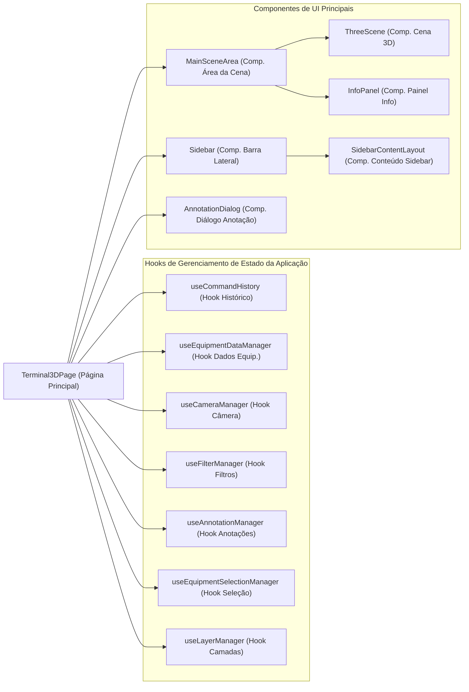

[**3D Terminal System API Documentation**](../../README.md)

***

[3D Terminal System API Documentation](../../README.md) / app/page

# app/page

## File Overview

Componente principal da página da aplicação Terminal 3D.

Responsabilidades:
1.  **Orquestração de Hooks de Estado:** Inicializa e coordena os principais hooks customizados
    que gerenciam diferentes aspectos do estado da aplicação (e.g., `useCommandHistory`,
    `useEquipmentDataManager`, `useCameraManager`, `useFilterManager`, `useAnnotationManager`,
    `useEquipmentSelectionManager`, `useLayerManager`).
2.  **Gerenciamento de Estado da UI:** Controla estados locais específicos da UI que não pertencem
    a um hook dedicado (e.g., `colorMode`).
3.  **Derivação de Dados para UI:** Calcula ou formata dados derivados dos estados dos hooks para
    serem passados como props para componentes da UI (e.g., `cameraViewSystems`,
    `selectedEquipmentDetails`, `equipmentAnnotation`, `availableOperationalStatesList`,
    `availableProductsList`).
4.  **Manipulação de Interações Complexas:** Implementa lógicas de callback que podem envolver
    múltiplos hooks ou estados (e.g., `handleFocusAndSelectSystem` que afeta a câmera e a seleção).
5.  **Renderização do Layout Principal:** Define a estrutura da página, renderizando componentes
    de alto nível como `MainSceneArea` (contendo a cena 3D e o painel de informações),
    a `Sidebar` (com seus controles) e o `AnnotationDialog`.
6.  **Passagem de Props e Callbacks:** Conecta os hooks de estado aos componentes da UI,
    fornecendo os dados necessários e as funções de callback para manipulação de eventos.

## See

 - ../../components/main-scene-area/README.md Para a área principal da cena.
 - ../../components/ui/sidebar/README.md Para a barra lateral de controles.
 - ../../components/annotation-dialog/README.md Para o diálogo de anotações.
 - ../../hooks/use-command-history/README.md Para o gerenciamento de histórico de comandos.
 - ../../hooks/use-equipment-data-manager/README.md Para o gerenciamento de dados de equipamentos.
 - ../../hooks/use-camera-manager/README.md Para o gerenciamento da câmera.
 - ../../hooks/use-filter-manager/README.md Para o gerenciamento de filtros.
 - ../../hooks/use-annotation-manager/README.md Para o gerenciamento de anotações.
 - ../../hooks/use-equipment-selection-manager/README.md Para o gerenciamento de seleção de equipamentos.
 - ../../hooks/use-layer-manager/README.md Para o gerenciamento de camadas.

## Example

// Diagrama de Interação de Alto Nível da Terminal3DPage:

## Functions

- [default](functions/default.md)
